# 流程图生成器

## 目标

帮助用户将业务流程、算法逻辑、系统交互等转换为清晰的可视化流程图。输出标准的 Mermaid 格式，可直接嵌入 Markdown 文档或导出为图片。

## 适用场景

- **业务流程**：用户注册、订单处理、支付流程、审批流程、退款流程
- **算法逻辑**：排序算法、搜索算法、数据处理流程
- **系统交互**：前后端交互、微服务调用、第三方 API 集成
- **状态机**：订单状态流转、任务状态变更、用户状态管理
- **错误处理**：异常捕获、重试机制、降级策略

## 输出规范

### 图表类型选择

根据场景自动选择最合适的图表类型：

1. **Flowchart（流程图）** - 默认选择
   - 适用：业务流程、算法逻辑、决策树
   - 特点：支持条件分支、循环、并行

2. **Sequence Diagram（时序图）**
   - 适用：多个系统/角色之间的交互
   - 特点：强调时间顺序和消息传递

3. **State Diagram（状态图）**
   - 适用：状态机、生命周期管理
   - 特点：强调状态转换和触发条件

### Mermaid 语法速查

#### Flowchart 基础语法

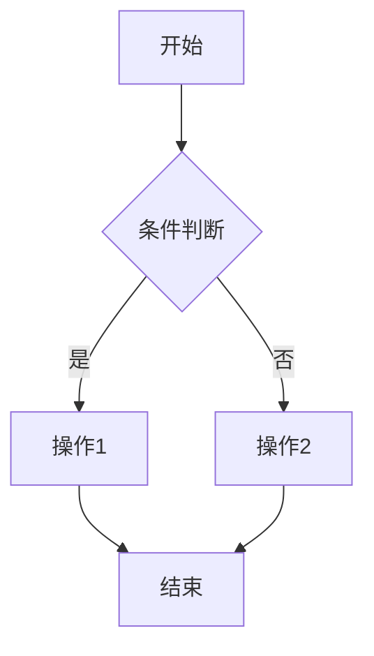

**节点形状**：
- `[矩形]` - 普通步骤
- `([圆角矩形])` - 开始/结束
- `{菱形}` - 判断/分支
- `[(数据库)]` - 数据库操作
- `[[子流程]]` - 子流程/模块
- `((圆形))` - 连接点

**箭头类型**：
- `-->` 实线箭头
- `-.->` 虚线箭头（异步/可选）
- `==>` 粗箭头（主流程）
- `-->|文字|` 带标签的箭头

**方向**：
- `TD` / `TB` - 从上到下（推荐）
- `LR` - 从左到右
- `RL` - 从右到左
- `BT` - 从下到上

#### Sequence Diagram 基础语法

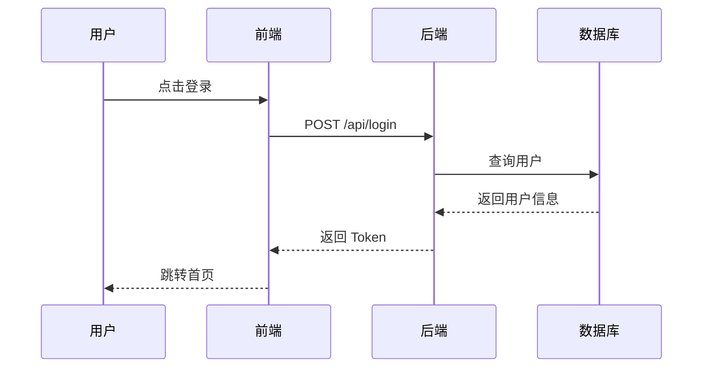

**交互类型**：
- `->>` 实线箭头（同步调用）
- `-->>` 虚线箭头（返回响应）
- `--)` 异步消息
- `-x` 失败/错误

#### State Diagram 基础语法

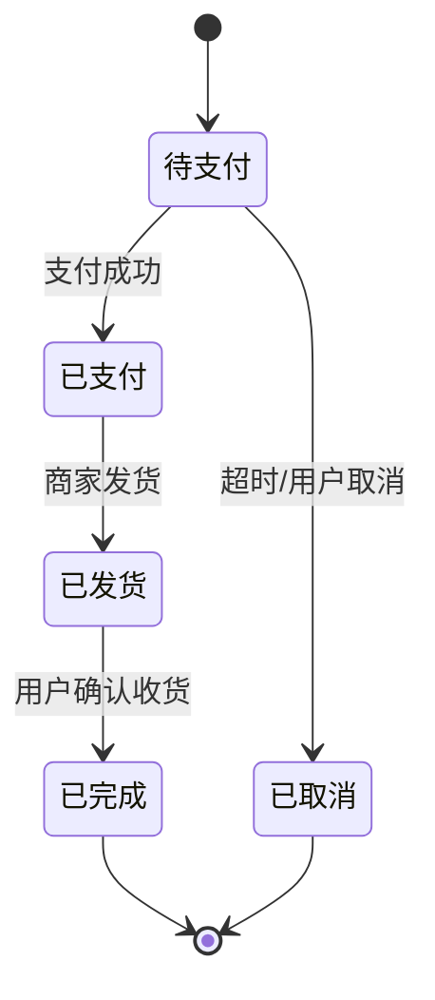

## 分析步骤

### 1. 信息收集

从用户的描述或代码中提取：
- **核心实体**：用户、订单、商品、系统等
- **关键操作**：创建、查询、更新、删除、通知等
- **判断条件**：if/else、switch、状态检查
- **异常情况**：错误处理、超时、重试

### 2. 结构化处理

- **确定主流程**：正常情况下的完整路径
- **识别分支**：条件判断、多种可能性
- **标注异常**：错误处理、边界情况
- **区分同步/异步**：实线表示同步，虚线表示异步

### 3. 优化输出

- **合并相似步骤**：避免重复节点
- **控制层级**：不超过 3 层嵌套
- **突出重点**：用粗箭头标注主流程
- **添加注释**：关键决策点添加说明

## 最佳实践

### 命名规范

- **动词开头**：「创建订单」而非「订单创建」
- **简洁明确**：不超过 8 个字
- **统一术语**：同一概念使用相同名称
- **避免技术术语**：优先使用业务语言

### 布局建议

- **从上到下**：符合阅读习惯
- **左对齐**：保持视觉整洁
- **分组相关节点**：用子图（subgraph）组织
- **避免交叉**：调整节点顺序减少连线交叉

### 复杂度控制

- **单图不超过 15 个节点**：超过则拆分为多个子图
- **分支不超过 3 层**：过深则提取为独立流程
- **一图一主题**：不要在一个图里混合多个流程

## 常见模式

### 模式 1：CRUD 操作流程

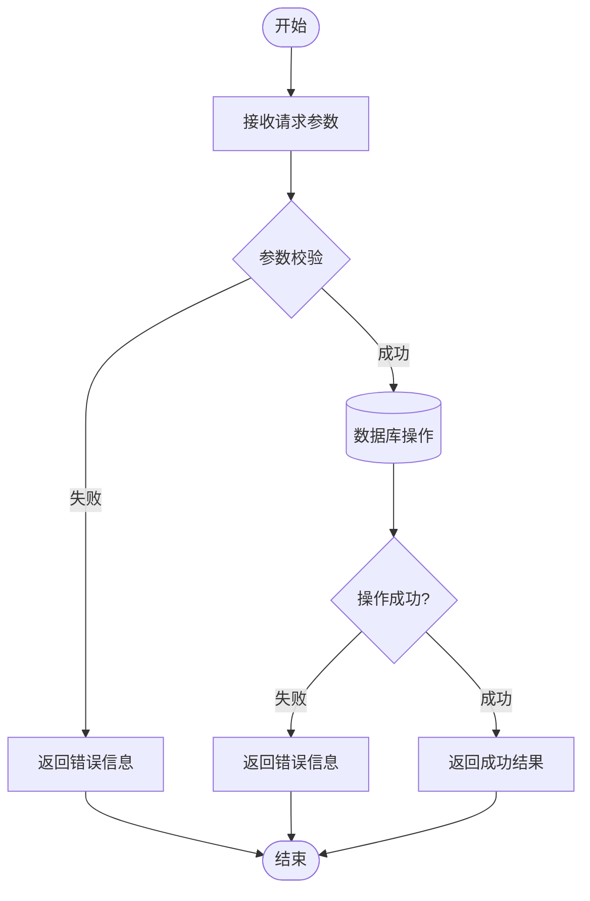

### 模式 2：支付流程

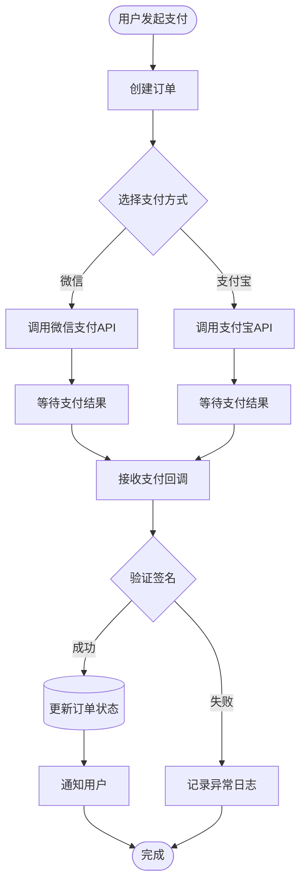

### 模式 3：异步任务处理

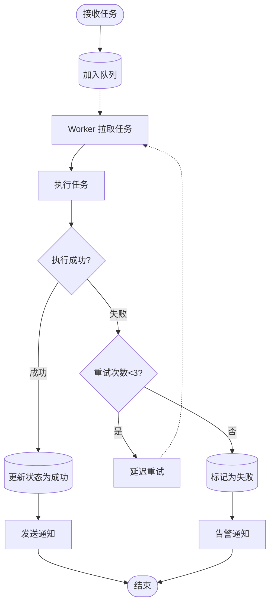

### 模式 4：多系统交互（时序图）

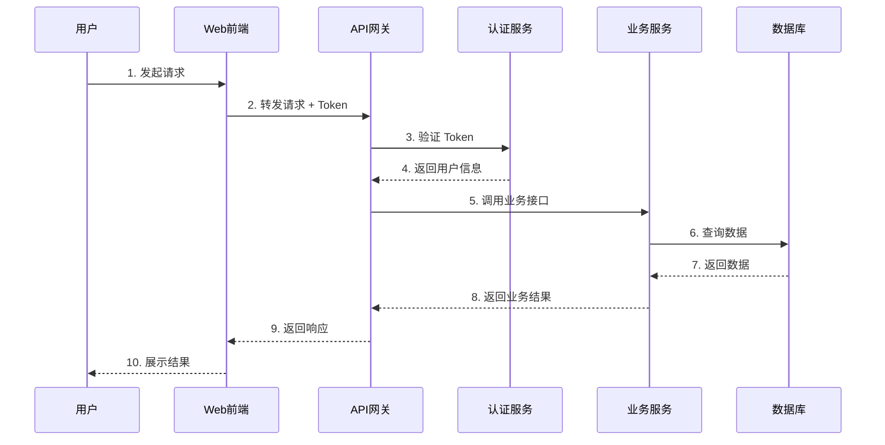

### 模式 5：状态机

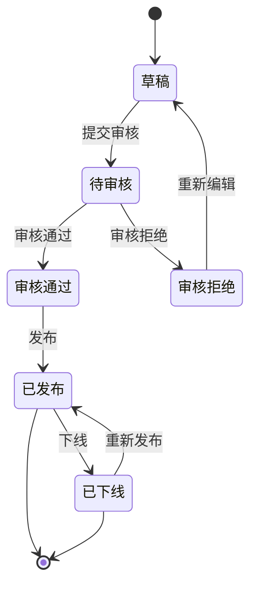

## 输出格式

每次生成流程图时，按以下格式输出：

### 1. 流程概述
用 1-2 句话描述这个流程的核心目标。

### 2. 关键节点说明
列出 3-5 个最重要的节点，简要说明其作用。

### 3. Mermaid 代码
```mermaid
[完整的 Mermaid 代码]
```

### 4. 文字版流程（可选）
如果流程复杂，提供纯文字版本作为补充。

### 5. 注意事项
列出该流程中需要特别关注的点（如异常处理、性能瓶颈、安全风险等）。

## 示例

### 示例 1：用户注册流程

#### 流程概述
用户通过手机号 + 验证码完成注册，系统自动创建账户并发送欢迎消息。

#### 关键节点说明
1. **手机号校验**：检查格式和是否已注册
2. **验证码验证**：防止恶意注册
3. **创建用户**：写入数据库并生成 Token
4. **异步通知**：发送欢迎短信（不阻塞主流程）

#### Mermaid 代码

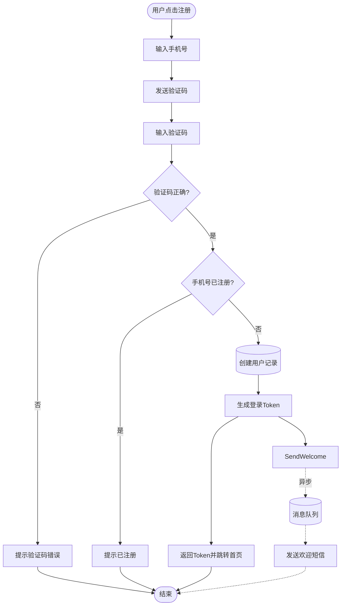

#### 注意事项
- 验证码需要设置过期时间（通常 5 分钟）
- 发送验证码需要限流（同一手机号 1 分钟内只能发送 1 次）
- 欢迎短信使用异步队列，避免阻塞注册流程
- Token 需要设置合理的过期时间（如 7 天）

---

### 示例 2：订单退款流程（时序图）

#### 流程概述
用户申请退款后，系统调用支付平台退款接口，并根据结果更新订单状态。

#### Mermaid 代码

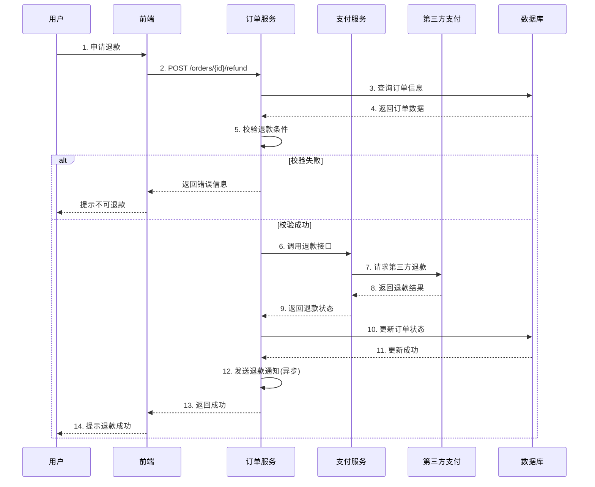

#### 注意事项
- 退款需要校验订单状态（已支付、未发货等）
- 第三方退款可能失败，需要重试机制
- 退款成功后需要通知用户（短信/推送）
- 需要记录完整的退款日志用于对账

## 使用指南

### 如何请求生成流程图

**方式 1：描述业务场景**
```
"帮我画一个用户登录的流程图，包括账号密码登录和第三方登录"
```

**方式 2：提供代码片段**
```
"根据这段代码生成流程图：[粘贴代码]"
```

**方式 3：指定图表类型**
```
"用时序图展示前后端的登录交互流程"
```

### 如何优化已有流程图

```
"这个流程图太复杂了，帮我简化一下"
"增加异常处理的分支"
"把数据库操作部分展开"
```

## 注意事项

1. **保持简洁**：一个图表只表达一个主题，不要试图在一张图里展示所有细节
2. **突出重点**：用粗箭头、颜色、注释等方式突出关键路径
3. **考虑受众**：给技术人员看的图可以更详细，给业务人员看的图要更抽象
4. **及时更新**：流程变更时同步更新图表，避免文档与实际不符
5. **版本管理**：将 Mermaid 代码纳入 Git 管理，方便追踪变更历史

## Mermaid 渲染工具

生成的 Mermaid 代码可以在以下平台查看：
- GitHub/GitLab Markdown（原生支持）
- VS Code（安装 Mermaid 插件）
- 在线编辑器：https://mermaid.live
- 文档工具：VitePress、Docusaurus、MkDocs 等

## 进阶技巧

### 使用子图分组

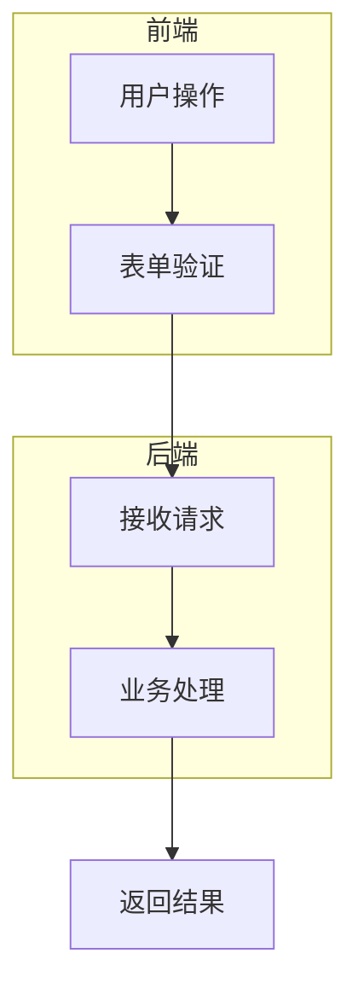

### 添加样式

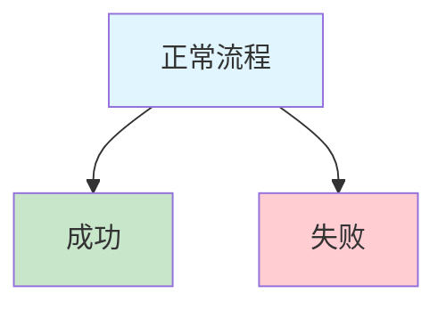

### 添加注释

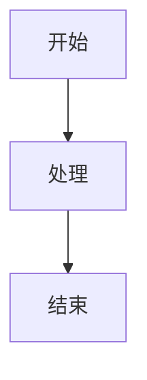
