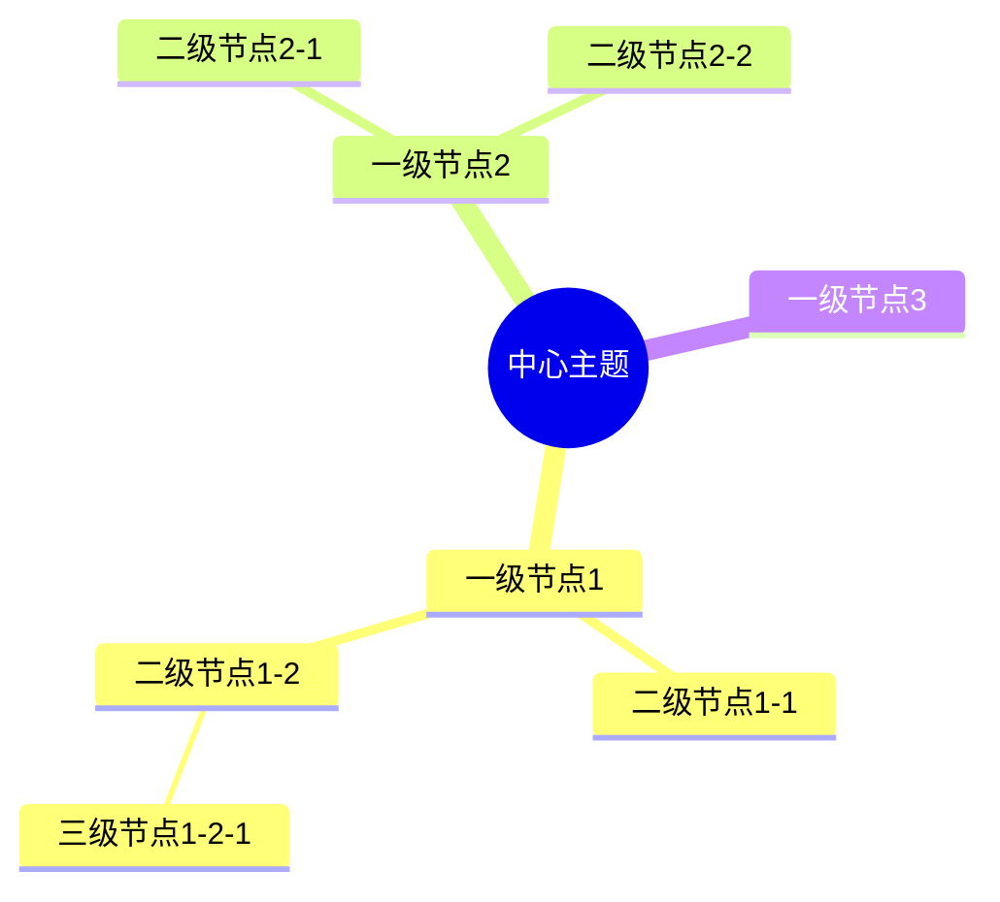
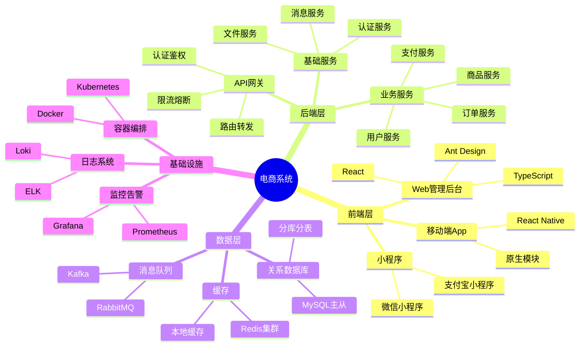
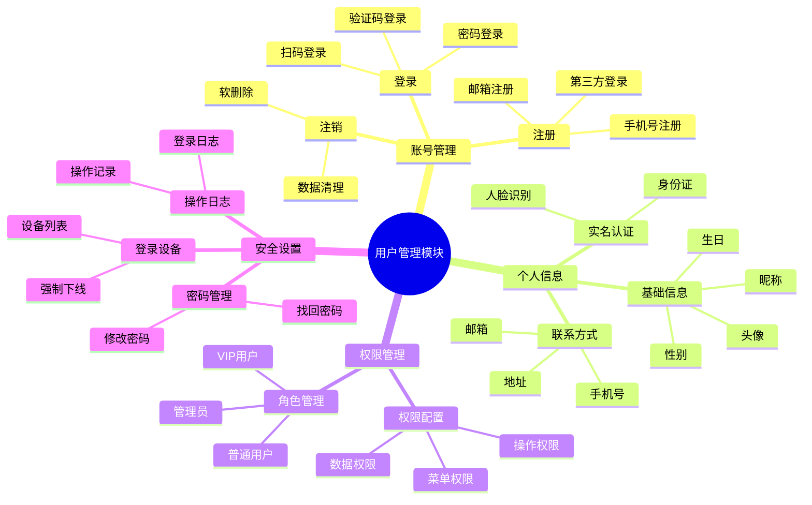
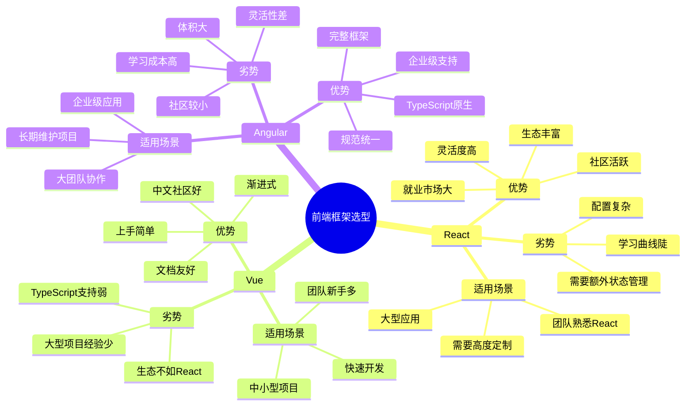
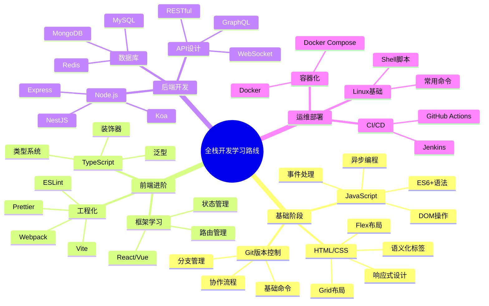
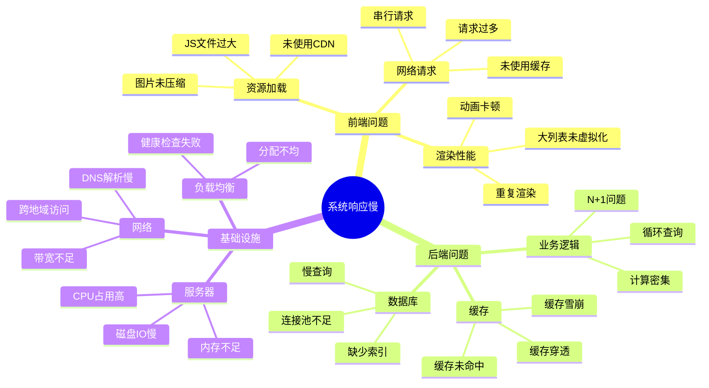
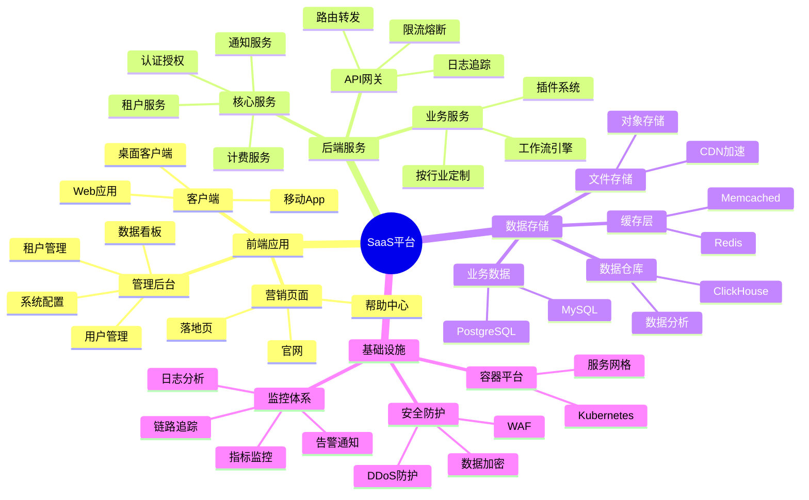
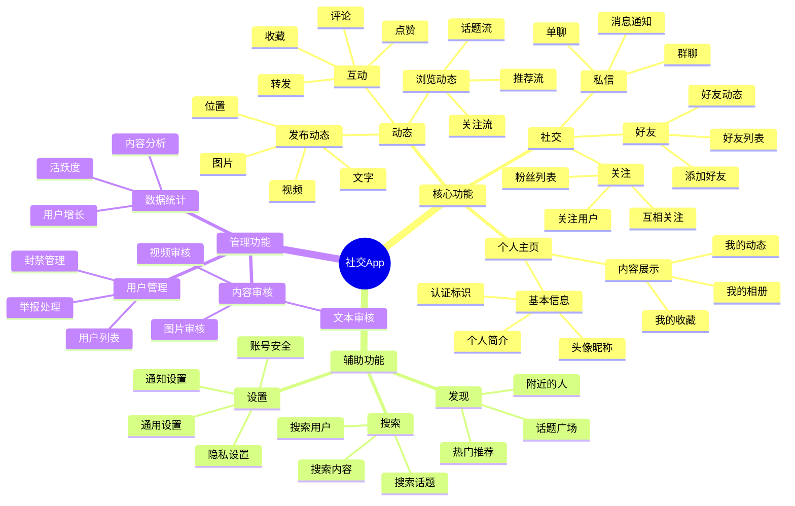
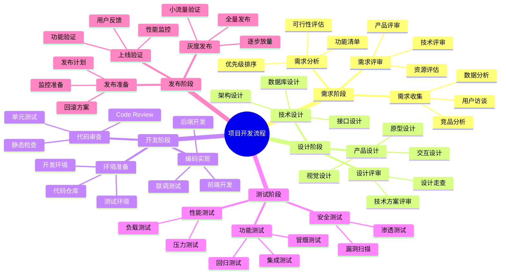
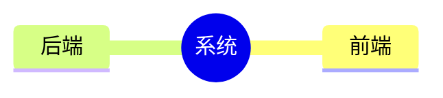

# 思维导图生成器

## 目标

帮助用户将复杂的系统架构、功能模块、知识体系等转换为层次清晰的思维导图。输出标准的 Mermaid Mindmap 格式，便于快速理解整体结构和关系。

## 适用场景

- **系统架构梳理**：微服务架构、前后端分层、技术栈组成
- **功能模块拆解**：产品功能树、业务模块划分、API 接口分类
- **技术选型对比**：框架对比、方案评估、优缺点分析
- **知识体系整理**：学习路线、技能树、文档目录
- **项目规划**：任务分解、里程碑规划、团队分工
- **问题分析**：根因分析、影响范围、解决方案

## 输出规范

### Mermaid Mindmap 基础语法



### 节点形状说明

- `((圆形))` - 根节点（中心主题）
- `(圆角矩形)` - 一级节点
- `[方形]` - 强调节点
- 普通文本 - 默认节点

### 层级规范

- **根节点**：整个系统/主题的名称
- **一级节点**：主要模块/分类（3-7 个为宜）
- **二级节点**：子模块/功能点（每个一级节点下 3-10 个）
- **三级节点**：具体实现/细节（按需添加，不超过 4 层）

## 分析步骤

### 1. 确定中心主题

从用户描述中提取核心主题：
- 系统名称（如「电商平台」）
- 功能模块（如「用户管理」）
- 技术领域（如「前端技术栈」）
- 问题描述（如「性能优化方案」）

### 2. 识别主要分类

按照合适的维度进行分类：
- **按功能**：用户模块、订单模块、支付模块
- **按层次**：前端、后端、数据库、基础设施
- **按角色**：管理员、普通用户、访客
- **按阶段**：需求分析、设计、开发、测试、部署
- **按优先级**：P0、P1、P2

### 3. 展开子节点

为每个分类添加具体内容：
- 功能点、技术组件、实现方式
- 保持同级节点的粒度一致
- 控制每层的节点数量（3-10 个）

### 4. 优化结构

- **平衡性**：各分支的深度和广度尽量均衡
- **完整性**：确保没有遗漏重要内容
- **简洁性**：合并相似节点，删除冗余信息
- **可读性**：节点命名简洁明确

## 最佳实践

### 命名规范

- **简洁明确**：每个节点 2-6 个字
- **统一格式**：同级节点使用相同的命名风格
- **避免重复**：不同节点不要使用相同名称
- **使用名词**：优先使用名词或名词短语

### 层级控制

- **不超过 4 层**：过深会影响可读性
- **一级节点 3-7 个**：太少不够全面，太多难以记忆
- **二级节点 3-10 个**：根据实际情况调整
- **三级节点按需**：只在必要时添加

### 分类原则

- **MECE 原则**：相互独立，完全穷尽
- **同一维度**：同级节点使用相同的分类标准
- **重要性排序**：将重要的节点放在前面
- **逻辑顺序**：按照时间、流程、依赖等逻辑排序

## 常见模式

### 模式 1：系统架构图



### 模式 2：功能模块树



### 模式 3：技术选型对比



### 模式 4：学习路线图



### 模式 5：问题分析图



## 输出格式

每次生成思维导图时，按以下格式输出：

### 1. 导图概述
用 1-2 句话说明这个思维导图的主题和用途。

### 2. 结构说明
简要说明分类维度和层级设计思路。

### 3. Mermaid 代码
```mermaid
[完整的 Mermaid Mindmap 代码]
```

### 4. 关键节点解释
对 3-5 个重要节点进行补充说明。

### 5. 扩展建议（可选）
如果某些分支可以进一步展开，给出建议。

## 示例

### 示例 1：SaaS 平台架构

#### 导图概述
展示一个典型的多租户 SaaS 平台的整体架构，包括前端、后端、数据层和基础设施。

#### 结构说明
按照技术分层维度组织，从用户接触的前端到底层基础设施，每层展开 2-3 级细节。

#### Mermaid 代码



#### 关键节点解释

1. **租户服务**：多租户架构的核心，负责租户隔离、数据隔离、资源配额管理
2. **计费服务**：处理订阅、计量、账单、支付等，是 SaaS 商业模式的关键
3. **插件系统**：支持第三方扩展，提升平台灵活性和生态价值
4. **服务网格**：在 Kubernetes 之上提供服务间通信、安全、可观测性

#### 扩展建议
- 「业务服务」可以根据具体行业展开（如 CRM、ERP、项目管理等）
- 「监控体系」可以详细列出具体的工具选型（Prometheus、Grafana、Jaeger 等）

---

### 示例 2：移动应用功能树

#### 导图概述
一个社交类移动应用的完整功能模块划分，覆盖用户端和管理端。

#### 结构说明
按照功能模块维度组织，分为核心功能、辅助功能、管理功能三大类。

#### Mermaid 代码



#### 关键节点解释

1. **推荐流**：基于算法的个性化内容推荐，是提升用户活跃度的关键
2. **内容审核**：合规要求，需要机器审核 + 人工审核结合
3. **数据统计**：运营决策依据，需要实时和离线分析结合

---

### 示例 3：项目开发流程

#### 导图概述
软件项目从需求到上线的完整开发流程，包括各阶段的关键活动。

#### Mermaid 代码



## 使用指南

### 如何请求生成思维导图

**方式 1：描述主题**
```
"帮我梳理一下微服务架构的组成部分"
```

**方式 2：提供大纲**
```
"根据这个功能列表生成思维导图：[粘贴列表]"
```

**方式 3：指定维度**
```
"按照技术栈、业务模块、部署架构三个维度展示系统架构"
```

### 如何优化已有思维导图

```
"这个思维导图太简单了，帮我展开二级节点"
"合并相似的节点，简化结构"
"按照重要性重新排序"
```

## 注意事项

1. **避免过度展开**：不是所有节点都需要展开到最细，保持合适的抽象层次
2. **保持平衡**：各分支的深度和广度尽量均衡，避免头重脚轻
3. **定期更新**：系统演进时及时更新思维导图，保持文档与实际一致
4. **配合其他图表**：思维导图适合展示结构，流程细节用流程图补充
5. **考虑受众**：给不同角色看的图，详细程度和侧重点应该不同

## Mermaid 渲染工具

生成的 Mermaid 代码可以在以下平台查看：
- GitHub/GitLab Markdown（原生支持）
- VS Code（安装 Mermaid 插件）
- 在线编辑器：https://mermaid.live
- 文档工具：VitePress、Docusaurus、MkDocs 等

## 进阶技巧

### 使用图标（需要工具支持）



### 控制节点样式

某些 Mermaid 渲染器支持自定义样式，但为了兼容性，建议使用默认样式。

### 导出为其他格式

- 使用 Mermaid CLI 导出为 PNG/SVG
- 使用在线工具导出为 PDF
- 集成到文档系统中自动渲染
