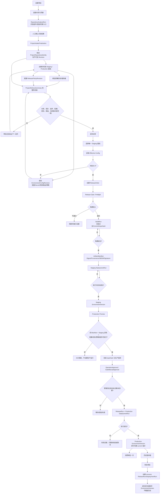
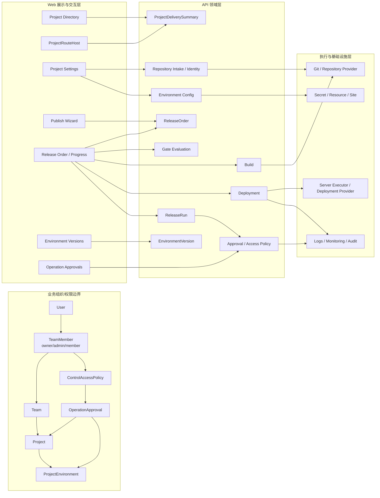
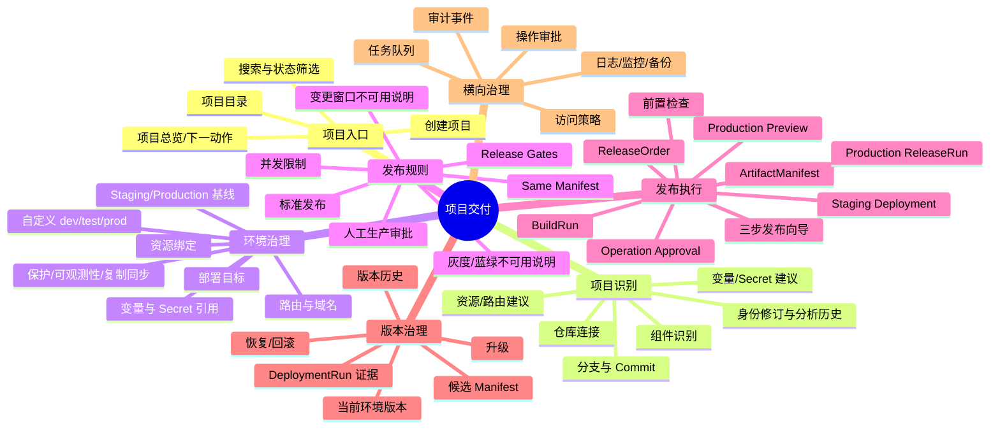
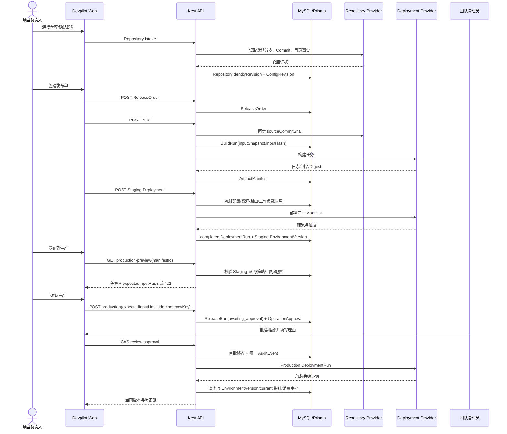
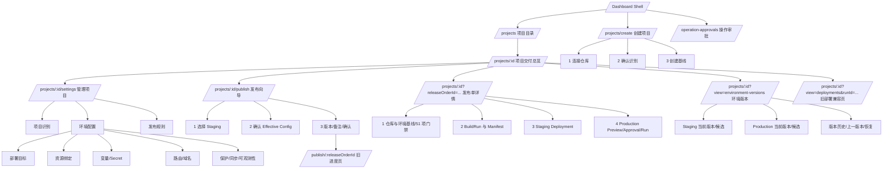

# Devpilot 项目管理 → 发布 → 版本更新全流程审计

审计日期：2026-08-19（Asia/Shanghai）

审计对象：当前本地运行的 Devpilot Web `localhost:3120`、API 容器、当前源码与只读数据库记录

审计角色：产品、交互/视觉、技术架构

## 0. 结论

当前产品已经具备一套技术上相当完整、且以不可变证据为核心的交付骨架：仓库身份修订、环境配置修订、发布单、构建运行、不可变 Manifest、预发/生产运行、操作审批、环境版本链和恢复运行都是真实模型；生产确认还使用服务端预览哈希、同一 Manifest、预发证明和一次性审批，后端总体采取 fail-closed。

但当前页面不能被判定为“可放心交付给普通项目负责人使用”。核心原因不是功能缺失，而是**同一发布在 4 套页面判定模型里得出互相冲突的状态**：

1. 项目总览显示 Staging/Production 各有 5 个问题，组件结构不一致；
2. 发布向导却显示“配置检查通过”；
3. 旧发布进度页把发布前检查、构建、预发部署都显示为成功，并开放“发布到生产”；
4. 新发布单详情显示 51 项前置检查未通过，生产页又显示前置条件未满足；实际生产预览 API 返回 `422 Production 没有可启动的活动服务`。

后端拦住了危险动作，但用户会在多个页面之间反复试错。按“可理解、可预测、可恢复、可审计”四个维度判断：

| 维度 | 结论 | 当前证据 |
|---|---|---|
| 可理解 | 不通过 | 相同发布的前检状态、生产可执行性互相冲突 |
| 可预测 | 不通过 | 向导写“自动执行生产发布”，真实提交只到预发 |
| 可恢复 | 基本通过 | 版本链、上一成功版本、恢复预览/确认与新运行均已建模 |
| 可审计 | 基本通过 | 不可变修订、Manifest、运行、审批、AuditEvent 均有模型；旧部署数据存在证据缺口 |
| 技术安全边界 | 基本通过 | 生产预览哈希、同 Manifest、审批消费、环境版本事务落库均为 fail-closed |
| 页面可用性 | 不通过 | 项目列表出现团队上下文竞态；关键 CTA 与真实准入不一致 |

**综合可用性：主链技术完成度高，产品语义和跨页面一致性未达可用门槛。建议先统一“发布准入真相源”，再扩展灰度、蓝绿、自动发布等能力。**

## 1. 审计边界与证据

### 1.1 当前运行证据

- 浏览器逐页实测：项目列表、项目总览、项目创建、仓库设置、环境目标、资源、变量/密钥、路由、保护、发布策略、发布向导三步、发布单四阶段、旧发布进度、环境版本、部署运行、操作审批。
- 当前项目：`Picshare`，项目 ID `cmrwxl1ks000k6enjiclutd5a`。
- 当前发布单：`0.0.1`，发布单 ID `cmsmzs63q00ek1700clhiytmj`。
- 当前数据：3 个项目、0 个在线、3 个待配置；发布单有 10 个 BuildRun、2 个 Manifest、1 个已完成 Staging DeploymentRun；Staging 有当前 EnvironmentVersion，Production 无当前版本。
- API 日志：项目目录先后出现 `401`、`403 缺少团队 ID`，随后同端点 `200`；生产预览真实返回 `422 Production 没有可启动的活动服务`。

### 1.2 当前代码证据

主要代码入口：

- 项目目录：`apps/devpilot-web/src/app/(dashboard)/projects`、`apps/devpilot-api/src/project-directory`
- 项目交付总览：`apps/devpilot-api/src/release-delivery/project-delivery-*`
- 项目管理与环境设置：`apps/devpilot-web/src/app/(dashboard)/projects/[id]/components/settings`
- 发布向导与旧进度页：`apps/devpilot-web/src/app/(dashboard)/projects/[id]/publish`
- 发布单与生产确认：`apps/devpilot-api/src/release-delivery/release-order-*`
- 环境版本与恢复：`apps/devpilot-api/src/environment-version`
- 操作审批：`apps/devpilot-api/src/operation-approval`
- 数据模型：`apps/devpilot-api/prisma/schema.prisma`

### 1.3 未纳入“已验证”的范围

- 没有点击会创建项目、重新构建、部署、批准或拒绝的写操作；本次为只读审计。
- 当前样本没有成功 Production EnvironmentVersion，因此生产成功后的最终页面仅由当前代码与数据模型验证，未冒充当前浏览器成功证据。
- 没有完成完整 WCAG 自动化与全键盘遍历；文中的无障碍结论仅限当前 DOM 语义和截图可见问题。
- `localhost:4131` 的旧 parity 容器存在跨端口会话/旧镜像问题；正式页面判断统一以当前 `3120` 运行实例为准。

## 2. 五类结构图

### 2.1 完整业务逻辑图



### 2.2 业务组织与系统模块架构图



架构判断：层次和领域边界总体清楚；当前问题不是循环依赖，而是 Web 层分别拼装了 `ProjectDeliverySummary`、`ReleaseOrderDetail.preflight`、Gate Catalog、Effective Config 和 legacy Deployment 五套状态投影，没有共享同一发布准入结果。

### 2.3 功能地图



### 2.4 数据流向图



关键不可变数据流：`RepositoryIdentityRevision → BuildRun.inputHash → ArtifactManifest.digest → DeploymentRun → EnvironmentVersion`。生产确认额外绑定 `production-preview.expectedInputHash` 与一次性审批。

### 2.5 页面结构图



## 3. 页面与业务全流程逐步核对

### 3.1 登录、团队上下文与项目目录 — 不健康

实测：登录后项目目录顶部统计正确显示“3 个项目、0 个在线、3 个需要继续配置”，目录本体却显示“项目列表加载失败”。API 日志记录了目录请求先 `401`，再 `403 缺少团队 ID`，随后同端点成功 `200`。

代码路径：

- SSR 从 cookie 注入 token 与 `X-Team-Id`；客户端拦截器也从 cookie 读取。
- `useProjects` 以 `userId + currentTeam.id + query` 作为 SWR key，意图在团队解析前不请求。
- `TeamService.fetchTeams()` 成功后才调用 `setCurrentTeam()` 同步 team cookie。
- 页面把 `directory.error` 置于已有 `visibleDirectory` 之上；一次后台重验证失败会隐藏已成功加载的卡片，只保留摘要与错误。

判断：数据端点本身可以成功，当前失败是登录/团队上下文建立期间的请求竞态与错误呈现策略共同造成。目录作为全流程入口，不应因一次重验证失败隐藏已有数据。

建议：将“认证完成、团队 cookie 已同步”建成单一 ready barrier；有缓存数据时用非阻断 banner，不替换项目卡片；401 与 403 分别提示“会话失效”和“团队上下文未就绪”。

### 3.2 创建项目与仓库识别 — 基本健康

页面是明确的三步：连接仓库 → 确认识别 → 创建基线。第一步支持公开/私有仓库、项目名、分支、可见性和凭据；仓库或凭据条件不满足时“下一步”禁用。代码中第二步保存确认，第三步 finalize 并进入项目。

优点：

- 仓库接入、自动分析和人工确认被拆开，避免自动识别直接成为生产事实。
- RepositoryIdentity 与 Revision 独立，后续构建可绑定具体修订。
- 凭据重连与高风险分支修订分开。

问题：仓库设置页把大段分析 JSON、证据和内部 ID 原样铺在长页面中，缺少“业务摘要 / 技术证据”两级信息层次；普通负责人难以确认最重要的组件、入口和风险。

### 3.3 项目总览与下一动作 — 信息正确，入口组织有缺口

当前总览明确给出下一动作“确认两套环境的组件结构”，并显示 Staging、Production 各 5 个问题。服务端 `ProjectDeliverySummary` 的实际判定包括：

- 仓库身份是否 finalize、Revision 是否对齐；
- 恰好一个 active Staging 和 Production 基线；
- 两个基线的组件 key 集合非空、唯一且完全一致；
- 每个环境的配置修订、Secret/资源引用、部署目标和路由是否有效；
- 当前 EnvironmentVersion 是否与项目、环境、发布单、Manifest、DeploymentRun、ReleaseRun 完整同源。

优点：总览是真正跨域的“项目可交付性”读模型，且下一动作来自第一个未通过检查，产品方向正确。

问题：面包屑仍显示截断项目 ID，而标题才显示 Picshare；项目总览、发布单详情、旧进度页没有统一使用这套 read model。

### 3.4 项目设置：仓库、环境、资源、变量、路由、保护 — 能力完整，信息架构偏技术

#### 仓库身份

展示 canonical URL、默认分支、最新 Commit、修订和分析历史。身份锁定符合“构建必须指向确定来源”的安全要求。

#### 环境基线

当前启用 5/5 环境：Staging、Production 加自定义 dev/test/prod。页面默认选中自定义 `dev`，而项目总览要求处理的是 Staging/Production。这会把用户从关键阻塞项带到非关键环境。

建议：进入环境配置时默认选择“当前下一动作”关联的基线；自定义环境折叠到“其他环境”。

#### 部署目标与资源

页面明确区分全局资源中心与项目环境绑定，当前统计 1 台服务器、2 个资源实例、2 个密钥、2 个申请、45 次部署；但当前 revision 没有绑定资源实例，Staging/Production 也没有可用部署目标。责任边界合理，缺少的是面向发布任务的完成度导航。

#### 变量与 Secret

建议表为每一行渲染“普通变量”与“密钥引用”。当前代码默认：

```ts
const choice = secretChoice[suggestion.key] ?? props.secrets[0]?.id ?? '';
```

因此 API_BASE_URL、NODE_ENV 等普通变量行视觉上也默认显示第一个 Secret `JWT_SECRET`。点击前不会保存错误映射，但界面已经制造了错误关联；分析结果里的敏感性没有用于约束控件。

建议：默认不选 Secret，显示“请选择”；仅对 sensitive 建议首推 Secret；普通值隐藏 Secret 下拉到二级动作；提交前明确显示 `目标键 ← 来源 Secret`。

#### 路由、保护与可观测性

当前无路由草稿、未绑定站点、未配置可观测性或策略引用。复制/同步环境与归档操作存在。功能覆盖完整，但“保护”同时承载可观测性、策略、复制同步和生命周期，概念过宽，建议拆为“发布保护”和“环境维护”。

### 3.5 发布策略 — 真实且诚实，健康

默认策略清楚表达：构建 → Staging 验证 → 人工审批 → Production；同一 Manifest；Production 需要审批；每环境最多 1 个并发；配置、预发验证、人工审批、发布后验证等门禁均有展示。

灰度、蓝绿、自动发布被明确标为不可用，并列出缺少的流量、候选/稳定版本、指标、暂停/终止和自动回滚 provider。变更窗口/冻结 provider 也没有伪装成可用。这部分产品表达值得保留。

### 3.6 发布向导：选择环境 — 基本健康

向导只允许恰好一个 Staging 基线。当前 Staging 显示版本 0.0.1 并可选；dev/test/prod/Production 明确显示“不可作为发布基线”。这个约束与服务端基线角色一致。

问题：第一步只检查 Staging 基线唯一和已选中，没有同步项目总览的组件一致性、目标、路由等准入状态。

### 3.7 发布向导：确认配置 — 不健康

当前页面显示“配置检查通过，可以继续发布”“该环境暂无变量配置”。代码放行条件只有：Effective Config 已返回，且 `conflicts.length === 0`。

它没有读取或复用以下项目交付检查：仓库身份、Staging/Production 组件一致性、部署目标、路由、资源引用、Release Gate、当前证据有效期。因此“确认配置”实际只是在确认变量合并无冲突，却被页面表达成完整发布配置已通过。

这是项目总览“各 5 个问题”与向导“检查通过”的直接代码原因。

建议：更名为“确认变量合并”，并在进入第三步前调用统一的 `release-admission-preview`；任何阻断项都用同一 gate id、原因、修复链接展示。

### 3.8 发布向导：确认发布 — 不健康

页面“确认后自动执行”列出：发布前检查、构建、预发部署、生产发布。实际 `usePublishSubmit` 的单一职责和实现都是：创建 ReleaseOrder → 构建 → 等待成功 → 自动部署 Staging；Production 必须在独立进度页经过预览和人工确认。

这不是措辞轻微偏差，而是对操作影响范围的错误描述。应改成：

- 本次立即执行：创建发布单、前检、构建、部署 Staging；
- 后续人工步骤：验证 Staging、查看 Production 差异、提交审批、管理员批准、执行 Production。

版本号默认使用时间串 `v202608191233`，而当前已有发布单是 `0.0.1`。产品没有统一 SemVer/日期版本策略，也未显示与 Git tag 的关系。

### 3.9 旧发布进度页 — 严重不一致

同一发布单 `0.0.1` 的旧进度页显示：发布前检查成功、构建成功、预发部署成功、Production 未开始，并显示可点击“发布到生产”。

代码原因：

- 前检只读取 `detail.preflight.repository/staging/production.ready` 三个粗粒度布尔值；
- Production CTA 只判断“最新 Staging run 成功、无活跃或已成功 Production run”；
- 不读取当前 51 项 Gate Catalog，也不检查 Production 是否存在可启动服务、目标和路由。

点击该按钮会先调用真实 production-preview；当前 API 日志证明其返回 `422 Production 没有可启动的活动服务`。后端安全边界有效，但页面把必然失败的动作呈现为可执行。

建议：旧进度页停止自行推导，改为消费统一服务端 capability：`canStartProduction`、`blockingGateIds`、`previewAvailable`；无法满足时按钮禁用并就地显示首要修复动作。

### 3.10 新发布单详情：前检、构建、预发、生产 — 证据完整，但四阶段内部仍矛盾

#### 前检

当前页面显示“前置检查尚未通过”、51 项检查和“目录事实不完整，暂不可进入构建”。缺少精确 Commit/default HEAD/baseline/merge tree；变更证据、依赖与静态分析证据过期；Secret/漏洞 provider 不可用但按策略非阻断。它比旧进度页更接近真实门禁。

#### 构建

共有 10 个 BuildRun、2 个 Manifest；历史失败覆盖 Secret 内容、文件大小、命令、环境文件、符号链接等。最新构建按钮因缺 Git 证据禁用。BuildRun 冻结分支、Commit、inputSnapshot、inputHash，Manifest 独立且不可变，技术设计正确。

#### Staging

有一个 `local-filesystem-v1` 的 completed 部署，业务验证 pending，技术证据 unavailable；页面仍把 Production prerequisite 显示为 satisfied。与此同时，新建 Staging 部署因没有目标而禁用。

这说明“历史完成运行”和“当前环境是否仍可部署”被混在同一成功状态中。应分别展示：历史运行结果、证据可信度、当前准入状态。

#### Production

页面显示当前在线为空、交付候选 0.0.1、0 个审批，生产操作禁用，且出现通用“生产操作失败，请查看证据或重试”。这是比旧进度页安全的展示，但错误没有直接告诉用户“没有可启动的活动服务”。

### 3.11 操作审批 — 并发安全，生命周期不完整

当前页面有 2 个 pending 审批，其中 1 个高风险；申请时间为 7 月 29/30 日，均没有 expiresAt。页面提示“超过 24 小时，请先确认目标状态和变更仍然有效”，但批准/拒绝仍可操作，且没有代码差异摘要。

代码确认：

- 只有 team admin/owner 且访问策略允许时才返回 `capabilities.review=true`；
- review 使用 `id + teamId + status=pending` 的 CAS，在同一事务写唯一 decision audit；并发审批不会互相覆盖；
- review 阶段不检查 `expiresAt`，pending 可以长期保持可审批；
- 执行/消费阶段会拒绝未 approved、已消费、显式 expiresAt 已过期、输入不匹配的审批；但未配置 expiresAt 的老审批不会自动失效。

判断：并发一致性好，时效性治理不足。建议高风险审批必须有 TTL；超过 TTL 自动取消或要求基于最新 preview/inputHash 重新申请；没有 diff/证据摘要时不允许批准。

### 3.12 环境版本、升级与恢复 — 技术模型健康，交互状态较弱

当前 Staging 有版本 0.0.1，能追溯到发布单、BuildRun #10、Manifest 和部署时间；Production 无可追溯版本，只显示来自 Staging 的候选 0.0.1。Production 需要发布单生产审批且必须使用同一 Manifest。

服务端实际保证：

- 只有 completed、非 dry-run 的 DeploymentRun 才能生成 EnvironmentVersion；
- EnvironmentVersion 绑定项目、环境、发布单、Manifest、DeploymentRun、可选 ReleaseRun；
- `previousVersionId` 形成历史链，环境上只有一个 current 指针；
- Production 还要求 Staging artifactVerified 证明、同 Manifest/Digest 的 approved ReleaseRun、未消费未过期且 inputHash 相同的审批；
- 成功后在事务内创建/更新版本、切换 current 指针，并只消费一次审批；
- 恢复会创建新的 ReleaseRun、DeploymentRun 和 EnvironmentVersion，不覆盖历史。

页面问题：Deploy/回退按钮在不可用时仍保持接近主按钮的蓝色视觉，只靠 disabled 属性与说明文字；Production 的“前往部署目标设置”是文字链接，优先级低于不可用按钮。建议禁用态使用中性色并把修复入口提升为主动作。

### 3.13 旧部署运行详情 — 只读兼容合理，项目健康语义错误

页面明确标识 legacy 只读兼容，当前运行没有审批、执行任务、命令计划，变量注入跳过；74 条旧数据不可验证。这个诚实边界合理。

但页面顶部把项目显示为“健康”，而项目总览显示 0 在线和 10 个环境问题。legacy 页面不应再输出项目级健康结论，只能描述“该历史运行的记录状态”。

## 4. 问题清单与优先级

| ID | 优先级 | 问题 | 证据 | 影响 | 修复方向 |
|---|---|---|---|---|---|
| F-01 | P1 | 4 套发布准入状态互相冲突 | 总览 5+5 问题；向导通过；旧进度前检成功；新详情 51 项失败；API 422 | 用户无法判断是否可发布 | 建立唯一 `ReleaseAdmissionPreview` 服务端读模型，所有页面只消费同一结果 |
| F-02 | P1 | 确认页声称自动执行 Production，代码只到 Staging | `publish-confirm-step.tsx` vs `use-publish-submit.ts` | 错误告知操作影响范围 | 拆成“本次自动执行”和“后续人工步骤” |
| F-03 | P1 | 旧进度页开放必然失败的 Production CTA | CTA 条件只看 Staging run；preview 422 | 高成本试错、削弱信任 | CTA 由服务端 capability 控制；阻断原因就地展示 |
| F-04 | P1 | 项目目录认证/团队竞态并隐藏已有数据 | API 401→403→200；页面错误态覆盖卡片 | 主入口不可用 | ready barrier；stale-while-error；区分错误类型 |
| F-05 | P1 | 高风险审批可长期 pending 且无证据摘要 | 两条 20 天旧审批、无 expiresAt、按钮可用 | 审批依据陈旧 | 强制 TTL、重新预览、diff/证据摘要、过期自动取消 |
| F-06 | P2 | 向导“配置检查”只校验变量冲突 | `config.summary.conflicts.length===0` | 误把局部检查当完整准入 | 更名并接入统一准入预览 |
| F-07 | P2 | 默认选中 dev 而非当前阻塞的基线 | 设置页实测 | 增加查找与切换成本 | 根据 nextAction 自动定位环境 |
| F-08 | P2 | 普通变量行默认显示第一个 Secret | `props.secrets[0]?.id` | 形成错误映射暗示 | 默认空值，按敏感性分流 |
| F-09 | P2 | 历史 Staging 成功与当前目标缺失混为一体 | completed 历史部署 + 当前部署禁用 | 成功语义不可信 | 分离历史结果、证据质量、当前准入 |
| F-10 | P2 | legacy 页面给出错误项目健康 | “健康” vs 项目总览 0 在线/10 问题 | 状态语义冲突 | legacy 只显示运行记录状态 |
| F-11 | P2 | Production 错误过于通用 | 页面通用失败；API 有明确 422 | 用户不知道修什么 | 透传结构化 reasonCode 与修复链接 |
| F-12 | P3 | 面包屑使用截断 ID | 多页实测 | 定位成本高 | 使用项目名/版本号，ID 放复制入口 |
| F-13 | P3 | 禁用 Deploy/回退按钮视觉过强 | 环境版本截图 | 易误判可点击 | 中性色、锁图标、就地原因 |
| F-14 | P3 | 分析 JSON 与内部 ID 信息密度过高 | 仓库设置长页 | 认知负担 | 业务摘要默认展开，技术证据折叠/下载 |

没有把当前问题列为 P0：因为生产 preview、同 Manifest、审批匹配和服务端准入实际阻断了不安全执行；当前风险是严重误导与流程不可用，而不是已验证的越权生产写入。

## 5. 产品能力判断

### 5.1 已经真实存在

- 团队/项目/环境作用域与角色、访问策略；
- 仓库 intake、人工确认、身份锁定与不可变修订；
- Staging/Production 唯一基线和组件拓扑一致性检查；
- 环境变量、Secret 引用、资源、路由、策略、可观测性快照；
- ReleaseOrder、BuildRun、ArtifactManifest、DeploymentRun、ReleaseRun；
- Release Gate、证据有效期、warning/failed/unavailable/needs_human；
- 生产 preview hash、同 Manifest、Staging 证明、人工审批和一次性消费；
- EnvironmentVersion 当前指针、历史链、升级和恢复；
- 审批 CAS、审计事件、幂等键。

### 5.2 明确不可用或未完成

- 灰度、蓝绿、自动发布；
- 真实流量切换、候选/稳定版本编排、指标驱动暂停/终止、自动回滚 provider；
- 变更窗口/冻结 provider；
- 当前样本 Production 部署目标、活动服务、路由和可观测性；
- 旧 DeploymentRun 的完整技术证据。

这些能力在 UI 中被明确标为不可用，没有被伪装成已上线能力。

## 6. 技术架构审查

### 6.1 正确的架构基础

1. **不可变边界清楚**：身份、配置、策略、构建输入、Manifest 和环境版本都有独立快照或修订。
2. **生产确认抗竞态**：preview 返回 input hash，confirm 必须回传；执行还使用 idempotency key。
3. **同制品晋级**：Production 不能重新选择任意 Build，必须使用成功发布到 Staging 的同一 Manifest。
4. **事务化版本落库**：只有 completed run 才创建 EnvironmentVersion，current 指针与审批消费在事务中完成。
5. **审批并发安全**：pending→终态使用 CAS，决策审计与状态同事务。
6. **恢复不篡改历史**：回退本质是 recovery 新运行和新版本。

### 6.2 主要架构缺陷：多个真相源

当前存在以下状态投影：

| 状态投影 | 实际回答的问题 | 当前误用 |
|---|---|---|
| `ProjectDeliverySummary` | 项目整体是否具备可交付基础 | 只用于总览 |
| Effective Config summary | 变量/Secret 合并是否冲突 | 被写成“配置检查通过” |
| `ReleaseOrderDetail.preflight` | 三域粗粒度基线是否 ready | 旧进度页把它当完整前检 |
| Gate Catalog / GateEvaluation | 当前证据与门禁是否准入 | 新详情使用，旧进度未使用 |
| Production Preview | 当前 Manifest 是否可进入生产 | 只在点击 CTA 后才发现失败 |
| legacy Deployment status | 历史运行记录状态 | 被提升成项目“健康” |

目标架构应是服务端提供一个带版本和输入哈希的统一读模型：

```ts
type ReleaseAdmissionPreview = {
  scope: { teamId: string; projectId: string; releaseOrderId?: string; manifestId?: string };
  inputHash: string;
  checkedAt: string;
  stage: 'project' | 'build' | 'staging' | 'production';
  allowed: boolean;
  blocking: Array<{
    gateId: string;
    reasonCode: string;
    message: string;
    evidenceStatus: string;
    fixHref?: string;
  }>;
  warnings: Array<{ gateId: string; reasonCode: string; message: string }>;
  capabilities: {
    createRelease: boolean;
    startBuild: boolean;
    deployStaging: boolean;
    requestProductionApproval: boolean;
    deployProduction: boolean;
    recover: boolean;
  };
};
```

项目总览、发布向导、旧进度页、新发布详情、环境版本都只展示它，不再在前端根据不同数据集合自行推导。

## 7. 建议的目标流程

1. 项目总览先给出唯一“当前下一动作”，点击后直接定位到对应环境和设置子页。
2. 设置页顶部固定显示交付完成度：仓库、拓扑、配置、目标、路由、保护；每项共享同一 gate id。
3. 发布向导第一步只选择基线；第二步明确叫“确认变量与 Secret”；第三步加载统一发布准入预览。
4. 不满足准入时不展示“发布”主按钮，改为“解决 5 个阻断项”，逐项深链到设置位置。
5. 创建 ReleaseOrder 后自动执行前检、构建和 Staging；进度页明确在 Staging 处停下等待业务验证。
6. “发布到生产”先显示服务端差异预览：版本、Commit、Manifest、配置修订、资源、路由、风险、证据新鲜度。
7. 审批必须绑定 preview inputHash 和 TTL；过期或输入变化自动失效并重新申请。
8. Production 成功后生成 EnvironmentVersion 并显示当前版本、上一版本、证据与恢复入口。
9. 恢复仍走预览、审批和新运行，完成后追加新版本，不改写历史。

## 8. 截图索引

| 编号 | 页面/状态 | 文件 |
|---|---|---|
| 03 | 项目目录失败 | `screenshots/03-project-list.png` |
| 04 | 项目总览 5+5 问题 | `screenshots/04-project-overview.png` |
| 05-11 | 仓库、环境、资源、变量、路由、保护、策略 | `screenshots/05-settings-repository.png` 至 `11-settings-release-policy.png` |
| 12 | 创建项目第一步 | `screenshots/12-project-create-intake.png` |
| 13-15 | 发布向导三步 | `screenshots/13-publish-create.png` 至 `15-publish-confirm.png` |
| 16-19 | 发布单总览、前检、构建、生产 | `screenshots/16-release-order-overview.png` 至 `19-release-production.png` |
| 20-21 | 环境当前版本与历史 | `screenshots/20-environment-versions.png`、`21-environment-version-history.png` |
| 22 | legacy 部署运行详情 | `screenshots/22-deployment-run-detail.png` |
| 23 | 操作审批 | `screenshots/23-operation-approvals.png` |
| 24 | 旧发布进度页 | `screenshots/24-publish-progress.png` |

## 9. 验收标准

完成 F-01 至 F-05 后，至少满足：

- 同一 releaseOrder/manifest 在项目总览、向导、进度、详情、版本页的 `allowed` 与阻断原因完全一致；
- 页面显示“检查通过”时，真实 server preview 必须成功，不能在下一点击才返回结构性 422；
- “确认后自动执行”与网络请求和后台状态机逐项一致；
- 项目目录在团队上下文建立和后台重验证失败期间仍能展示已有项目；
- 高风险审批没有 expiresAt 或缺少证据摘要时，服务端 capability 必须是不可审批；
- Production 成功只能生成同 Manifest 的 EnvironmentVersion，恢复必须追加新版本；
- 所有禁用 CTA 同时给出结构化原因和直接修复入口。

## 10. 当前代码验证

本次只读审计没有修改产品代码。为确认所引用的当前状态归并、发布提交、项目目录、审批并发和生产准入代码仍通过既有契约，执行了两组定向测试：

- Web：`use-projects.spec.ts`、`release-progress.model.spec.ts`、`use-publish-submit.spec.tsx`，通过；完整日志：`/tmp/codex-tool-runs/svton/audit-web-release-flow-20260819-124437.log`。
- API：`project-directory.service.spec.ts`、`operation-approval-review.service.spec.ts`、`environment-version-execution-policy.integration.spec.ts`、`release-production-preflight.controller.spec.ts`，通过；完整日志：`/tmp/codex-tool-runs/svton/audit-api-release-flow-20260819-124437.log`。

这些测试证明当前代码按现有契约工作；它们也说明本报告指出的是**契约和跨页面语义本身不一致**，不是一次偶发的单元测试失败。
