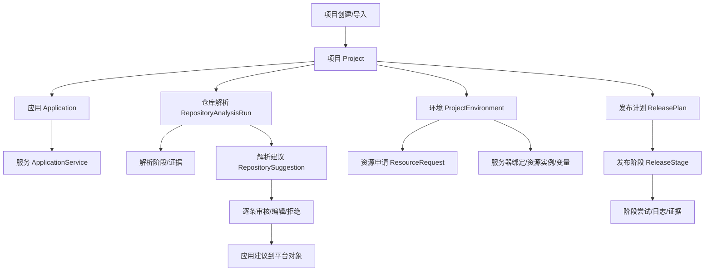
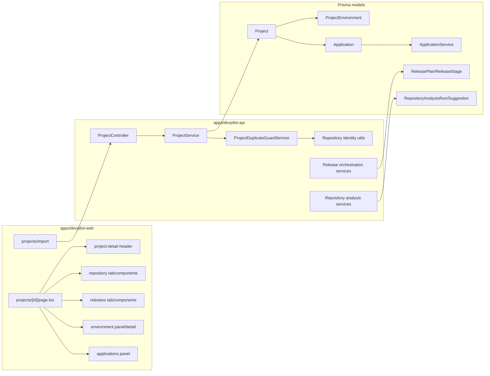
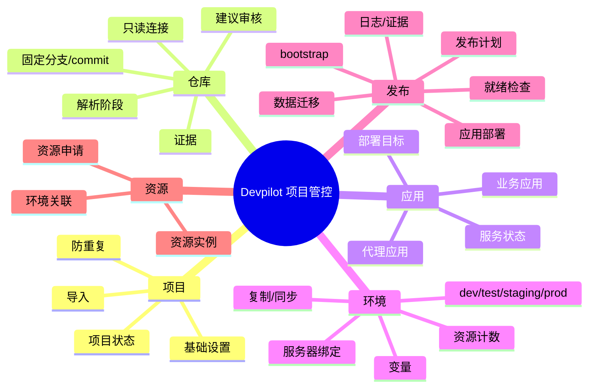
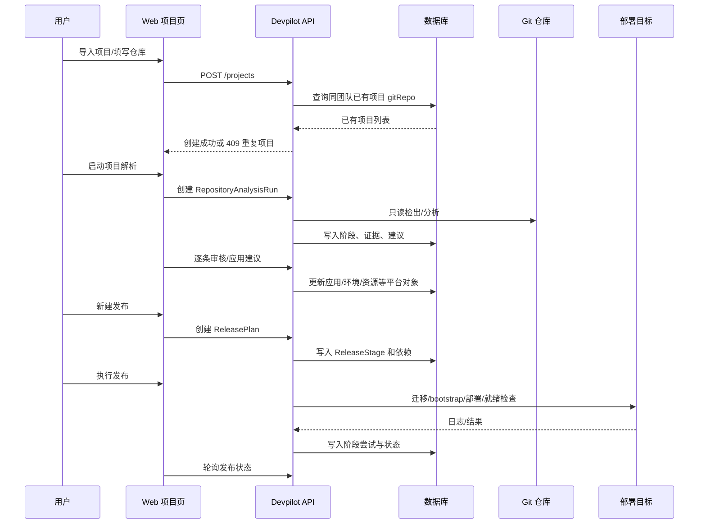
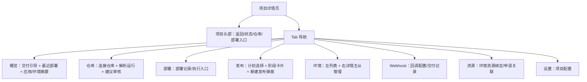

# Devpilot 项目管控/解析/发布/环境交互修复报告

- 时间：2026-07-30 16:35（Asia/Shanghai）
- 模型：Codex / GPT-5
- 工具：本地源码审查、CodeGraph CLI、Browser 本地页面检查、Docker 运行态检查、Jest、TypeScript、Prettier
- 范围：项目列表/项目详情/仓库解析/解析建议审核/应用服务/发布编排/环境管理/项目创建重复保护
- 边界：本报告基于当前工作区源码与本机 Docker 运行态。`localhost:3120` 当前由 `devpilot-app-web:local` 预构建镜像提供，源码改动需要重建镜像后才会在该端口显示。

## 结论

这次问题不是单一 UI 瑕疵，而是“研发部署平台新手”进入项目后缺少可解释链路造成的：项目、应用、环境、解析建议、发布计划、资源申请之间都有真实数据和能力，但页面把这些能力分散成按钮、下拉、抽屉和历史记录，导致用户不知道下一步该做什么。

本次已完成优先级最高的修复：

1. 项目详情页同层级按钮统一到 devpilot 本地 Button，避免 `@svton/ui` 与本地按钮高度/间距混用。
2. 明确导航语义：能直接跳转的操作改为链接，例如“返回项目列表”“为当前项目环境申请资源”“查看审计事件”。
3. 新建发布从页面底部内联卡片改为弹窗式创建入口。
4. 环境 tab 从“列表点开抽屉”改为“左侧环境列表 + 右侧环境详情”的主从管理布局；概览页仍保留轻量抽屉。
5. 项目创建增加同团队仓库身份重复保护，避免同一个仓库反复导入成多个项目。
6. 仓库解析与逐条审核建议增加新手可理解的解释：解析只是读代码产出建议；审核/应用才会写入平台对象。
7. 应用列表补充 `picshare-proxy` 与业务应用分组的解释。
8. 产出本报告和 TODO 验证记录。

## 真实证据

### 页面证据

- 页面截图目录：`/tmp/codex-tool-runs/svton/devpilot-ui-audit-20260730T0810`
- 项目详情页：`/projects/cmrwxl1ks000k6enjiclutd5a`
- 本机运行态：`docker ps` 显示 `devpilot-app-web` 端口 `3120` 已运行 22 小时，`devpilot-app-api` 端口 `3121` 已运行 49 分钟。

### API 证据

运行态读取到的 Picshare 项目核心数据：

- 项目 ID：`cmrwxl1ks000k6enjiclutd5a`
- 仓库：`https://github.com/751848178/picshare.git`
- 应用：
  - `picshare-proxy`：服务 `picshare-proxy`
  - `Picshare App`：服务 `admin`、`backend`
- 最近发布计划：
  - `F383 final closure 2026-07-29T04:59`
  - 6 个阶段：数据库结构迁移、生产 bootstrap、backend 部署、backend 就绪检查、admin 部署、admin 就绪检查

这些都来自真实 API/数据库数据，不是前端假数据或硬编码渲染。

## 业务逻辑图

关键判断：

- 项目是平台管控根对象。
- 环境是项目下的运行边界。
- 应用/服务是部署目标。
- 仓库解析负责发现和建议。
- 建议审核负责把建议变为平台配置。
- 发布计划负责编排数据变更、bootstrap、应用部署和就绪检查。

## 组织架构图

## 功能地图

## 数据流向图

## 页面结构图

## 8 个问题逐项处理

### 1. 应该大小一致但实际不一致

定位：项目详情页组件混用了两套 Button：

- `@svton/ui` 的 Button：历史通用组件，默认高度/颜色不同。
- `@/components/ui` 的 Button：devpilot 本地 token 驱动按钮，`min-h-11`/`min-h-9` 规则一致。

已修复：

- 项目详情链路内的操作按钮统一改为 `@/components/ui`。
- 涉及环境复制/同步/绑定/写操作、仓库解析运行、资源绑定预览、发布创建等组件。

预期效果：

- 同层级主按钮/次按钮高度、圆角、hover、loading 状态一致。
- 用户不会因为视觉尺寸差异误判按钮层级。

### 2. 应该是链接但用了按钮样式

定位：

- `project-detail-header.tsx` 的“返回项目列表”是确定跳转。
- `project-delivery-guide.component.tsx` 的“为当前项目环境申请资源”是确定跳转到资源申请。
- `repository-tab.tsx` 的“查看审计事件”是确定跳转。

已修复：

- 这些入口改为 Link/LinkButton 语义。
- 保留按钮外观，但 DOM 语义变为链接，浏览器可预期地支持打开新标签、复制链接和可访问性导航。

预期效果：

- “执行动作”才是 button。
- “去某处查看/创建”是 link。

### 3. 同一个项目创建三个，是否要限制只能创建一个

真实数据：

- 页面/API 读取到三个 Picshare 项目，其中两个是 `https://github.com/example/picshare.git`，一个是 `https://github.com/751848178/picshare.git`。
- 这不是前端重复渲染，而是数据库里真实存在多条 Project。

产品判断：

- 不应该按项目名强行限制唯一，因为同名项目可能来自不同团队或不同仓库。
- 应按“团队 + 规范化仓库地址”限制重复导入。
- 允许无仓库的手动项目或生成项目继续创建。

已修复：

- 新增仓库身份规范化工具，处理 `https://...git`、`git@host:org/repo.git`、大小写、尾部斜杠。
- 新增 `ProjectDuplicateGuardService`。
- `ProjectService.create` 创建前先检查同团队是否已有相同仓库。
- 前端导入页收到 409 后显示可操作错误，并提供“查看已有项目”链接。

### 4. 项目解析和逐条审核解析建议分别是什么

真实链路：

- 项目解析：只读连接仓库，固定分支/commit，执行阶段化分析，产出证据和建议。
- 逐条审核解析建议：对解析结果逐条接受、编辑或拒绝；只有应用建议时才真正更新平台对象。

已修复：

- 仓库连接卡片文案改为“项目解析：连接只读代码仓库”。
- 建议审核区增加“解析不会直接改平台配置；逐条审核后才写入”的解释。

预期效果：

- 新用户能理解“解析 = 读代码生成建议”，“审核 = 选择哪些建议纳管”。

### 5. 为什么 Picshare 有 `picshare-proxy` 和 `Picshare App`

真实数据：

- `picshare-proxy` 只有 `picshare-proxy` 服务，属于流量入口/反向代理配置。
- `Picshare App` 包含 `admin`、`backend` 服务，属于业务应用分组。

已修复：

- 应用列表增加说明文案：
  - proxy：接入/反向代理服务，用于承载流量入口和转发配置。
  - business：业务应用分组，包含可部署的前端、后端或后台服务。

预期效果：

- 用户不会误以为是重复应用。
- 后续更好的产品形态是把“入口代理”和“业务应用”分成明确分组或类型标签。

### 6. 新建发布不是弹窗而是在页面最下面新增卡片

定位：

- `releases-tab.tsx` 原来通过 `showCreate && <ReleaseCreateWizard />` 把创建表单渲染在 tab 底部。
- 搜索项目详情相关创建入口，优先级路径内只有发布创建是这种“不滚动、不弹窗”的底部卡片形态；环境创建、Webhook 创建、绑定/确认类操作已经是 modal/dialog；项目导入是独立页面流程。

已修复：

- 新增 `release-create-dialog.component.tsx`。
- `ReleaseCreateWizard` 变成纯表单内容组件，不再自带 Card。
- `ReleasesTab` 点击“新建发布”打开弹窗。

运行态注意：

- 当前 `localhost:3120` 是旧 Docker 镜像，浏览器仍看到旧底部表单；源码修复需要重建 `devpilot-app-web` 后才会显示。

### 7. 为什么发布页面有这些记录和阶段

真实数据：

- `F383 final closure 2026-07-29T04:59` 是真实 ReleasePlan。
- 阶段来自 ReleaseStage：
  - `数据库结构迁移 - backend`
  - `生产 bootstrap - backend`
  - `应用部署 - backend`
  - `就绪检查 - backend`
  - `应用部署 - admin`
  - `就绪检查 - admin`

产品解释：

- 这些阶段是在把数据变更和应用发布编排到一起：先数据库结构迁移，再 bootstrap，再部署服务并做就绪检查。
- backend/admin 分开，是因为它们是 `Picshare App` 下的两个可部署服务。

当前问题：

- 下拉直接暴露多条 F383 历史，且混有失败/成功记录，新手无法判断应该看哪条。
- 阶段卡片没有先解释“为什么会有这些阶段”。

本次修复：

- 先修正发布创建弹窗，避免新动作继续产生混乱。
- 保留真实历史，不隐藏数据，避免伪造“干净页面”。

建议后续：

- 发布页顶部增加“当前推荐发布/最近成功/失败待处理”分组。
- 发布阶段按“数据准备 / 应用部署 / 验证收尾”折叠展示。

### 8. 开发环境列表管理弹抽屉是否不合理

定位：

- `EnvironmentPanel` 原来点击环境行只打开 `EnvironmentDetailDrawer`。
- 对“环境管理”这种高频查看/编辑/同步操作，抽屉会让用户误以为只是查看详情，而不是当前 tab 的主工作区。

已修复：

- 抽取 `EnvironmentDetailContent`，把详情内容从抽屉容器解耦。
- 环境 tab 使用 `detailPresentation="inline"`：
  - 左侧环境列表。
  - 右侧默认选中第一个环境并展示详情。
  - 点击环境行切换右侧详情。
- 概览页仍保留抽屉，避免概览变重。

预期效果：

- 环境 tab 一眼能看出“我在管理某个环境”。
- 环境行点击结果不再令人意外。

## 已修改源码

### 后端

- `apps/devpilot-api/src/project/project-repository-identity.utils.ts`
- `apps/devpilot-api/src/project/project-duplicate-guard.service.ts`
- `apps/devpilot-api/src/project/project.module.ts`
- `apps/devpilot-api/src/project/project.service.ts`
- `apps/devpilot-api/src/project/project.service.spec.ts`
- `apps/devpilot-api/src/project/project-repository-identity.utils.spec.ts`
- `apps/devpilot-api/src/project/project-duplicate-guard.service.spec.ts`

### 前端

- `apps/devpilot-web/src/components/ui/error-banner.tsx`
- `apps/devpilot-web/src/app/(dashboard)/projects/import/page.tsx`
- `apps/devpilot-web/src/app/(dashboard)/projects/import/hooks/use-import-project.ts`
- `apps/devpilot-web/src/app/(dashboard)/projects/[id]/components/project-detail-header.tsx`
- `apps/devpilot-web/src/app/(dashboard)/projects/[id]/components/project-delivery-guide.component.tsx`
- `apps/devpilot-web/src/app/(dashboard)/projects/[id]/components/applications-panel.tsx`
- `apps/devpilot-web/src/app/(dashboard)/projects/[id]/components/release-create-dialog.component.tsx`
- `apps/devpilot-web/src/app/(dashboard)/projects/[id]/components/release-create-wizard.component.tsx`
- `apps/devpilot-web/src/app/(dashboard)/projects/[id]/components/tabs/releases-tab.tsx`
- `apps/devpilot-web/src/app/(dashboard)/projects/[id]/components/tabs/repository-tab.tsx`
- `apps/devpilot-web/src/app/(dashboard)/projects/[id]/components/repository-connect-card.tsx`
- `apps/devpilot-web/src/app/(dashboard)/projects/[id]/components/repository-suggestion-review.tsx`
- `apps/devpilot-web/src/app/(dashboard)/projects/[id]/components/repository-run-panel.tsx`
- `apps/devpilot-web/src/app/(dashboard)/projects/[id]/components/environment-panel.tsx`
- `apps/devpilot-web/src/app/(dashboard)/projects/[id]/components/environment-detail-drawer.tsx`
- `apps/devpilot-web/src/app/(dashboard)/projects/[id]/components/environment-detail-content.tsx`
- `apps/devpilot-web/src/app/(dashboard)/projects/[id]/components/tabs/environments-tab.tsx`
- `apps/devpilot-web/src/app/(dashboard)/projects/[id]/components/environment-create-modal.tsx`
- `apps/devpilot-web/src/app/(dashboard)/projects/[id]/components/environment-copy-panel.tsx`
- `apps/devpilot-web/src/app/(dashboard)/projects/[id]/components/environment-sync-panel.tsx`
- `apps/devpilot-web/src/app/(dashboard)/projects/[id]/components/environment-write-actions.tsx`
- `apps/devpilot-web/src/app/(dashboard)/projects/[id]/components/environment-bind-server-block.tsx`
- `apps/devpilot-web/src/app/(dashboard)/projects/[id]/components/environment-bind-server-modal.tsx`
- `apps/devpilot-web/src/app/(dashboard)/projects/[id]/components/tabs/resource-bind-preview.component.tsx`
- `apps/devpilot-web/messages/zh.json`
- `apps/devpilot-web/messages/en.json`

### 文档

- `docs-internal/todos/2026-07-30-devpilot-project-flow-ux-fixes.md`
- `docs-internal/devpilot/project-flow-ux-code-audit-2026-07-30.md`

## 验证结果

- API 项目相关 Jest：通过，3 个 suite / 9 个测试。
  - 日志：`/tmp/codex-tool-runs/svton/devpilot-ux-fixes-20260730/api-project-tests-final2.log`
- Web 类型检查：通过。
  - 日志：`/tmp/codex-tool-runs/svton/devpilot-ux-fixes-20260730/web-type-check-final2.log`
- API 类型检查：通过。
  - 日志：`/tmp/codex-tool-runs/svton/devpilot-ux-fixes-20260730/api-type-check-final2.log`
- 格式化：通过。
  - 日志：`/tmp/codex-tool-runs/svton/devpilot-ux-fixes-20260730/prettier.log`

## 剩余风险与下一步

1. 运行态需要重建：
   - 当前 `localhost:3120` 不是源码热更新。
   - 需要重建/重启 `devpilot-app-web`，重复项目保护也需要重建/重启 `devpilot-app-api`。
2. 发布页历史信息仍然偏运维视角：
   - 本次没有删除真实历史，也没有重构 ReleasePlan 信息架构。
   - 下一步建议做“推荐发布 / 最近成功 / 失败待处理”的分组和阶段解释。
3. `ProjectService` 是既有超长文件：
   - 本次把重复判断逻辑放进独立 guard，仅在 service 注入和调用。
   - 后续可以单独做 ProjectService 拆分，不应混入本次 UI/产品修复。
