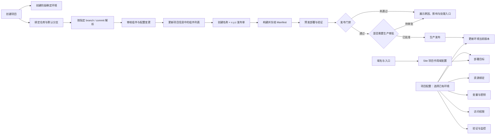
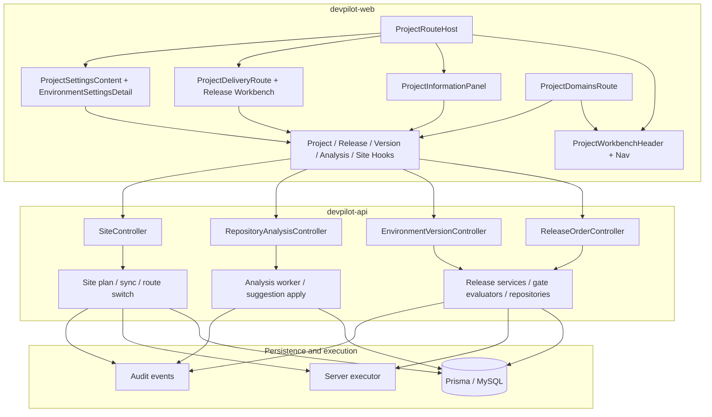
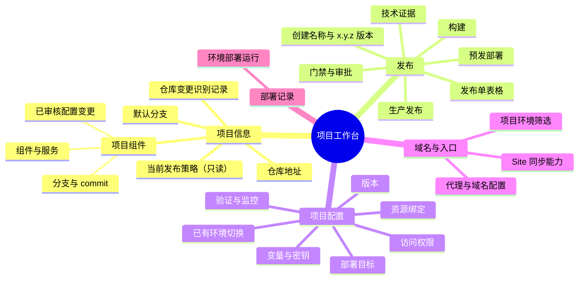
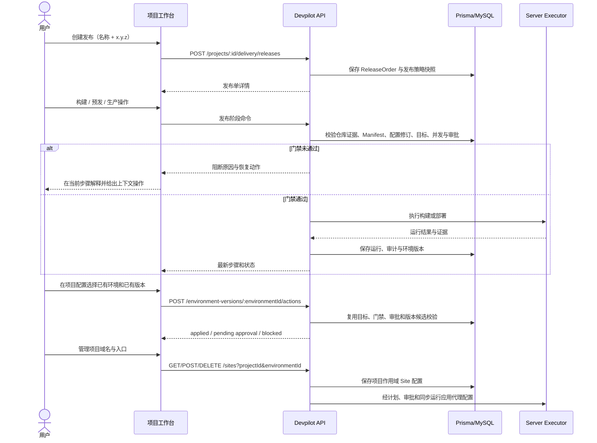
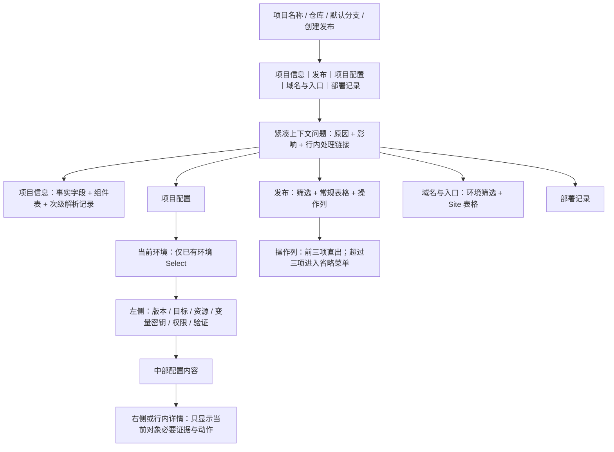

# Devpilot 项目工作台：代码依据与结构图

本文档只描述当前 `master` 已存在或本次已接入的代码路径，不把设计意图写成已实现能力。

## 1. 业务逻辑图

代码依据：

- 发布单入口与阶段 API：`release-order.controller.ts`。
- 版本切换、审批、门禁、目标就绪和路由激活：`environment-version.service.ts`。
- 仓库解析启动参数和审核应用：`repository-analysis.controller.ts`、`repository-suggestion-apply.repository.ts`。
- 项目域名查询与操作：`site.controller.ts`、`use-sites.ts`。

## 2. 组织架构图

## 3. 功能地图

## 4. 数据流向图

## 5. 页面结构图

## 代码所有权索引

- 页面壳与导航：`apps/devpilot-web/src/app/(dashboard)/projects/[id]/components/project-workbench-*.tsx`
- 项目信息：`project-information-panel.tsx`、`use-repository-analysis.hooks.ts`
- 发布列表与流程：`project-delivery-route.tsx`、`release-orders-panel.tsx`、`release-workbench/`
- 项目配置：`project-settings-content.tsx`、`settings/environment-settings-*.tsx`
- 版本切换：`settings/environment-version-config.tsx`、`use-environment-versions.ts`
- 域名与入口：`project-domains-route.tsx`、`project-domains-table.tsx`、`sites/hooks/use-sites.ts`
- API 发布边界：`apps/devpilot-api/src/release-delivery/`
- API 仓库解析边界：`apps/devpilot-api/src/repository-analysis/`
- API Site 边界：`apps/devpilot-api/src/site/`
