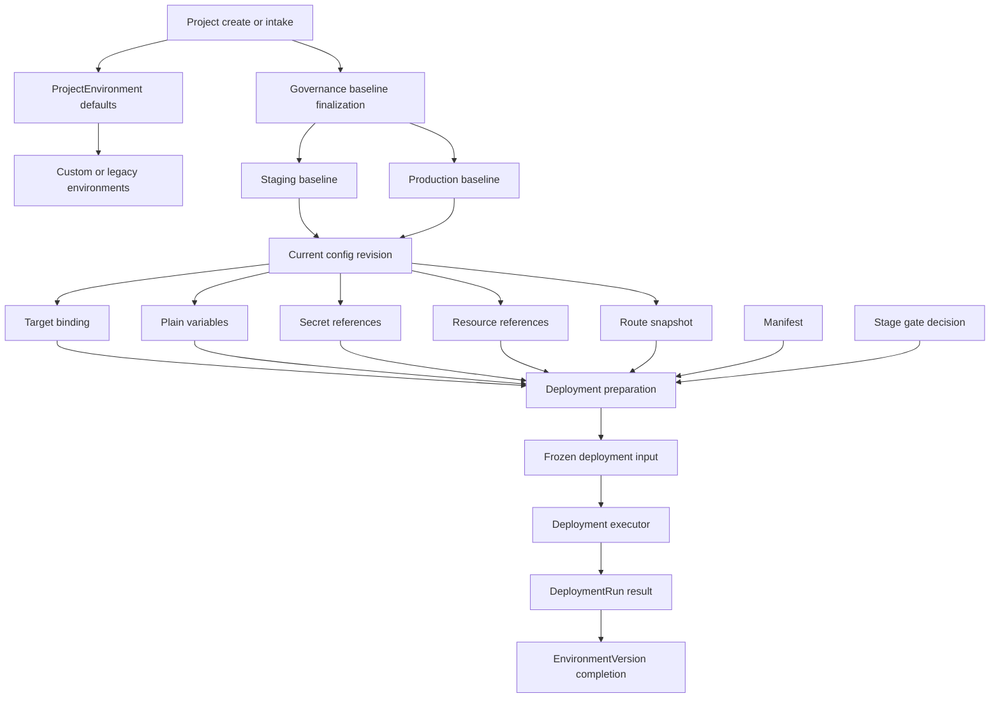
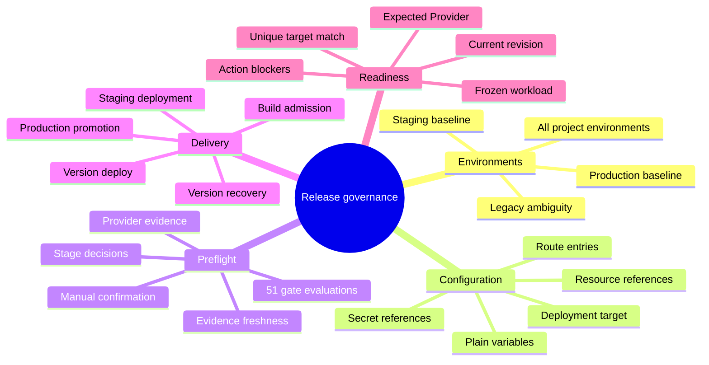
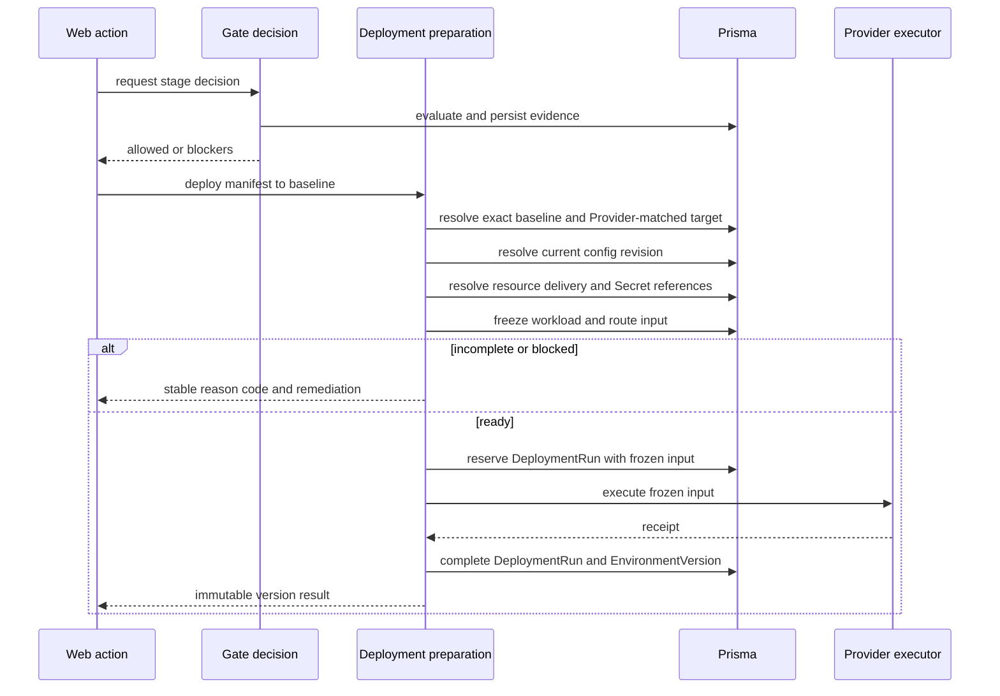
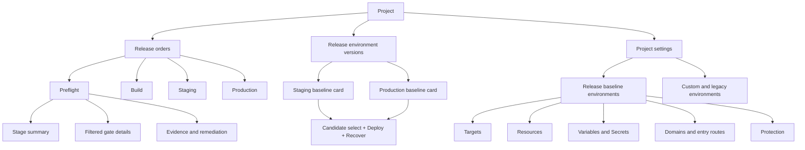

# Release Environment Governance Architecture

## Evidence Boundary

本图谱只记录 2026-08-10 已由当前源码、测试和本地运行实例确认的行为。运行证据来自当前 checkout 的 `devpilot-app-web:3120` 与 `devpilot-app-api:3121`；旧 parity worktree 不作为结论依据。

## Canonical Vocabulary

| Term | Code truth | Product wording |
|---|---|---|
| Project environment | 所有未归档 `ProjectEnvironment`，可为自定义环境 | 项目环境 |
| Release baseline | `baselineRole=staging|production` 的项目环境 | 发布基线环境 |
| Environment version | 只属于发布基线的不可变版本指针 | 发布环境版本 |
| Active environment | `status=active`，只表示未停用 | 已启用，不等于就绪 |
| Deployment ready | 唯一 Provider 匹配目标、当前配置修订、变量/资源/工作负载快照和阶段门禁均可用 | 可部署 |

`dev/test/staging/prod` 来自旧默认环境 seed；`staging/production` 来自治理基线 upsert。`prod` 与 `production` 在迁移代码中被明确视为歧义并保留，系统不得自动猜测合并。

## Business Logic Diagram

Confirmed invariant: every release deployment must produce `Frozen deployment input` before reserving a run. The current EnvironmentVersion Staging branch violates this invariant by skipping preparation and falling back to the process-global Provider target.

## Organization And Layer Ownership

```mermaid
flowchart LR
  subgraph Web["Web interaction layer"]
    W1["Release order steps"]
    W2["Environment versions"]
    W3["Environment settings"]
    W4["Gate catalog and summary"]
  end
  subgraph API["API orchestration layer"]
    A1["Release commands"]
    A2["Environment version commands"]
    A3["Config revision commands"]
    A4["Gate catalog/readiness"]
  end
  subgraph Domain["Domain policy and preparation"]
    D1["Gate decision"]
    D2["Deployment target match"]
    D3["Deployment input freeze"]
    D4["Resource and Secret resolution"]
    D5["Workload snapshot"]
  end
  subgraph Infra["Infrastructure adapters"]
    I1["Prisma repositories"]
    I2["Configured Provider"]
    I3["Server or cluster executor"]
    I4["Repository analysis"]
  end
  Web --> API
  API --> Domain
  Domain --> Infra
```

Layer rules derived from the existing architecture:

- Web consumes server-owned readiness and reason codes; it must not recreate Provider matching.
- Command services orchestrate gate, preparation, reservation and execution in that order.
- Target/config/resource/Secret/workload resolution belongs to one preparation boundary.
- Provider adapters execute only a complete frozen input; global target fallback is not a project deployment contract.
- Read models may aggregate facts, but must not invent a second definition of preflight readiness.

## Function Map

## Data Flow Diagram

Current configuration precedence is `resource envTemplate < plain variable < Secret`. The code applies this silently. The product must expose collisions before a revision becomes current; it must not rely on hidden overwrite order.

## Page Structure Diagram

## Root Cause And Acceptance Matrix

| ID | Confirmed root cause | Required behavior | Negative acceptance |
|---|---|---|---|
| ENV-01 | Settings renders every active environment; versions queries only release baselines | Group and label baseline/custom/legacy; call active “enabled” | `prod` can never be silently treated as Production baseline |
| DEPLOY-01 | EnvironmentVersion Staging skips `inputs.prepare` and falls back to global Provider target | All deployment actions use the same prepare/freeze pipeline | Missing/mismatched target creates no DeploymentRun or EnvironmentVersion |
| DEPLOY-02 | Settings infers Provider from bindings while executor Provider is process configured | Return server-owned expected Provider and reason-coded readiness | Missing, duplicate, mismatch and invalid SSH root are distinguishable |
| PREFLIGHT-01 | Stepper preflight checks only repository/baselines; catalog evaluates 51 gates | One stage decision drives stepper, summary and action admission | A blocked required gate cannot issue build/deploy POST |
| GATE-01 | Build/Staging hard-code Provider-missing deferrals for every runtime | Default fail closed; explicit policy waiver is versioned, scoped and audited | `unavailable` is never silently equivalent to `checked` |
| RESOURCE-01 | Resource provisioning stops at `ResourceInstance`; revision reference is manual and has no variable binding | Show binding proposal, target component/key and collision preview | Provisioned but unbound resource is not injected |
| ENVVAR-01 | Analysis detects safe variable schema, but config UI only accepts pasted `.env` | Import requirement keys/evidence; never read real `.env` values silently | Sensitive values never enter plain-variable storage |
| ROUTE-01 | UI hard-codes `web:3000/api:8080`; structured entries do not drive activation | Candidates and validation use real service IDs and ports; entries become execution truth | Unknown service/port cannot be saved as an inferred route |
| UX-01 | Version select, deploy and recovery have different size/rows; copy says upgrade | One 44px action toolbar; primary label is Deploy | Desktop recovery does not wrap to an unrelated row |

## Implementation Boundaries

1. Seal server-side deployment and gate bypasses before enabling any UI affordance.
2. Introduce one deployment-readiness/preparation contract; do not duplicate target rules in React.
3. Separate baseline role from environment key; historical ambiguity requires an explicit migration decision.
4. Treat repository analysis as suggestions with provenance, never as permission to import secrets.
5. Append versioned configuration revisions; never mutate historical snapshots in place.
6. Keep legacy route and environment reads only for migration compatibility, not as new-write defaults.

## Runtime Evidence Index

- Environment versions: `/tmp/codex-tool-runs/svton/f665-f669/browser/02-environment-versions.png`
- Five environment settings: `/tmp/codex-tool-runs/svton/f665-f669/browser/03-environment-settings.png`
- Empty Staging targets/resources/variables/routes: screenshots `04` through `07` in the same directory.
- Hard-coded route candidates: `08-route-entry-modal.png`.
- Conflicting preflight states: `09-preflight-summary.png` and `10-preflight-catalog.png`.
- Late target error after enabled Staging action: `11-staging-target-error.png`.
