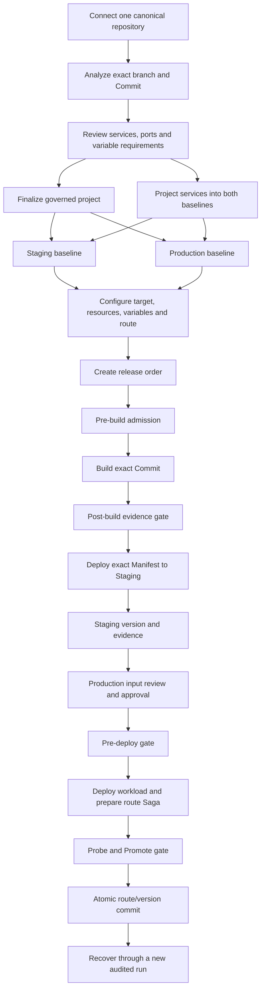
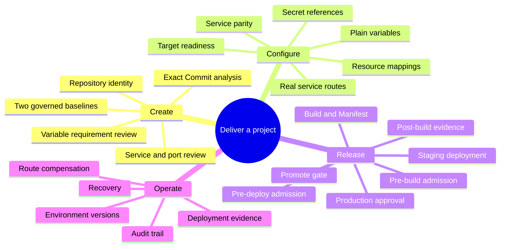
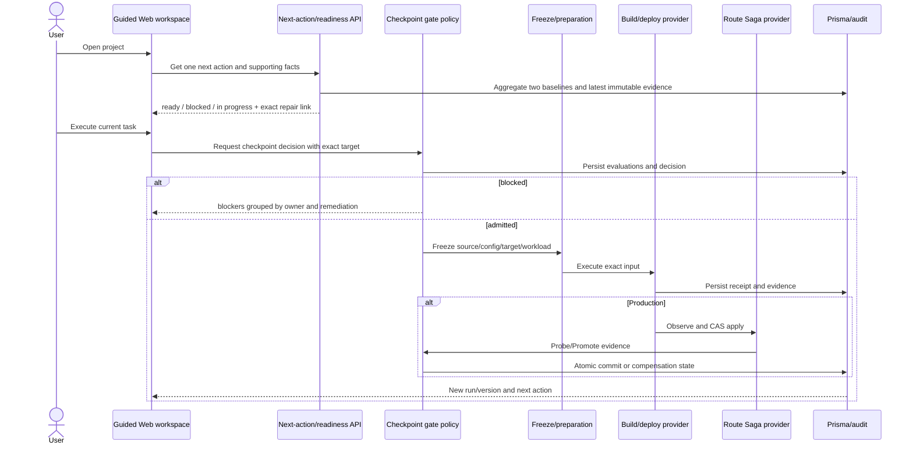
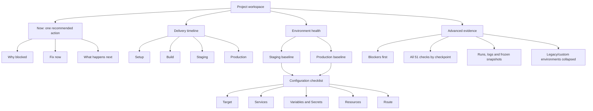

# Release Experience Zero-learning Architecture

## Evidence Boundary

- Source: original audit at `master@3e5cc991`; current CR implementation baseline is `6df52a8e` in the isolated `codex/f674-release-ux-redesign` worktree.
- Runtime: rebuilt `devpilot-app` API/Web images from that commit; authenticated current-run Browser evidence is stored in `/tmp/codex-tool-runs/svton/f674-current-audit/`.
- Data: current MySQL project/environment/run inventory was read without mutation. The primary Picshare predates governance finalization and remains a legacy fixture.
- Status words in this document are limited to `verified_fixed`, `partially_fixed`, `not_fixed`, and `not_applicable`.

## Original Issue Verification Matrix

| Original issue | Status | Current fact | Required closure |
| --- | --- | --- | --- |
| Project settings show dev/test/staging/production/prod while versions show two environments | `partially_fixed` | Environment Versions correctly reads only baseline roles. Settings groups Staging/Production separately, but legacy dev/test/prod remain equally prominent and the overview mixes historical-version readiness with current target readiness. | Collapse legacy/custom environments by default; use one server-owned baseline readiness model everywhere. |
| Environment Version can deploy without a target | `verified_fixed` | Staging/Production deploy and recovery are disabled with exact repair links; API target selection rejects missing/duplicate/provider/SSH-invalid targets before reservation. | Mark historical versions whose frozen target is no longer resolvable as historical/unverifiable, not currently ready. |
| Resource binding cannot map supplied resource values to variables | `partially_fixed` | New references require a real component and explicit source-key to env-key mappings; cross-source conflicts fail closed. The current empty state does not explain the three-step supply -> bind -> map journey. | Guided mapping preview, source ownership, conflict remediation and configuration checklist. |
| `.env` is not recognized/imported | `not_fixed` | The UI only offers paste-based `.env` parsing. Repository analysis records required/sensitive keys in ApplicationService metadata, but finalization creates empty environment revisions and does not project suggestions. | Reviewable detected-key import into both baseline drafts, never importing secret values. |
| Domain target component/port is not recognized | `not_fixed` | The editor only proposes active services and persisted ports in the selected environment. Fresh intake creates services in one environment, so Staging falls back to custom input even when analysis detected components. | Project detected services into both baselines and require a real `serviceId`/port for new governed routes. |
| Preflight state/process/result is unclear | `partially_fixed` | Stage summaries, reasons, evidence time and a 51-item catalog exist. Catalog stage decisions reuse incomplete source-only input, later checkpoints are mislabeled, and the 51-item modal exposes technical inventory before user tasks. | Checkpoint-correct decisions plus blocker-first summaries, one-click remediation and advanced evidence disclosure. |
| Source/CI, impact, Secret/vulnerability, config/resource baseline are unavailable | `not_fixed` | The UI is now truthful and fail-closed, but several required checks have no Provider or require a BuildRun/ProductionRun before that run can exist. | Explicit applicability policy and pre/post execution checkpoints; unavailable required providers remain blocking. |
| Failed preflight can still build or deploy Staging | `verified_fixed` | UI actions disable and server commands reject without downstream run/version side effects. | Add a real first-run E2E so safety is proved without making the happy path unreachable. |
| Staging deployment reports missing/duplicate/provider mismatch only after click | `verified_fixed` | Server-owned per-environment readiness disables actions before click and deep-links to the exact environment target. | Reuse the same readiness summary on project home and production approval preview. |
| Environment Version actions/copy/size are inconsistent | `partially_fixed` | “Deploy”/“Recover” share a responsive toolbar with consistent controls. The page still repeats technical hashes and stale readiness facts ahead of the next action. | Task-first card, compact version identity, progressive technical details and explicit historical state. |

## Business Logic Diagram

## Organization Architecture

```mermaid
flowchart LR
  subgraph Experience["Task experience"]
    X1["Project setup guide"]
    X2["Release workspace"]
    X3["Environment/version workspace"]
    X4["Advanced evidence explorer"]
  end
  subgraph ReadModel["Server-owned read models"]
    R1["Project next action"]
    R2["Baseline readiness"]
    R3["Checkpoint gate decision"]
    R4["Immutable execution evidence"]
  end
  subgraph Commands["Command orchestration"]
    C1["Intake/finalize"]
    C2["Build"]
    C3["Staging"]
    C4["Production/Recovery"]
  end
  subgraph Domain["Policies"]
    D1["Gate applicability/checkpoints"]
    D2["Target/config/workload freeze"]
    D3["Component variable ownership"]
    D4["Route Saga and compensation"]
  end
  subgraph Infra["Evidence providers"]
    I1["Repository/CI/security"]
    I2["Build runtime"]
    I3["Server/resources"]
    I4["DNS/TLS/route/probe"]
    I5["Prisma/audit"]
  end
  Experience --> ReadModel --> Commands --> Domain --> Infra
```

## Function Map

## Data Flow

## Page Structure

## Data Retention And Revalidation Decision

- Keep the primary Picshare: it is a migration and negative fail-closed fixture with immutable historical evidence.
- Do not hard-delete to obtain a green test. Archive only empty task-owned shells after evidence/ownership confirmation.
- Validate the clean path with a uniquely mounted canonical repository identity and task-owned project, targets, domains and resources.
- Archive the task-owned acceptance project only after screenshots, API/DB assertions and recovery evidence are retained.

## Current P0 Closure Order

1. Split pre-build, post-build, pre-deploy and promote applicability so first actions do not require their own future evidence.
2. Project accepted service/port/variable requirements into both governed baselines.
3. Replace competing UI readiness calculations with one baseline/next-action read model.
4. Implement the selected progressive-disclosure interaction direction.
5. Run one real fresh-project E2E plus the negative fail-closed matrix.

## Implementation Status (2026-08-11)

- Implemented S1-S6 in the F674 worktree. The server owns checkpoint-required gate sets and readiness v2; Build and Production commit pointers only after exact post-action decisions are allowed.
- Fresh governance finalization materializes stable component topology into Staging and Production without copying target/resource/Secret ownership. Legacy services retain the explicit ID fallback.
- Web direction A now uses one server-owned next action, blocker-first preflight with the complete 51-check catalog behind advanced disclosure, five environment setup steps, task-oriented environment version actions, and 44px primary interaction targets.
- Standard single-host/stateless applicability is generated only from exact frozen facts. Unknown Provider, migration surface, missing business validation, route drift, and target drift remain explicit blockers.
- Final Docker/browser/API/DB acceptance, Draft MR and independent CR remain F678 work; this implementation status is not runtime signoff.

## CR Reconciliation Status (2026-08-11)

- Legacy component backfill updates only unambiguous null identities. Ambiguous rows stay null and surface `legacy_component_identity_unresolved`; historical manifests, runs and versions are never rewritten.
- Fresh intake now freezes one service identity across both baselines, projects the unique declared port into its health URL, and distinguishes managed processes from lifecycle commands. Build, manifest and workload identity use the stable component key.
- `controlled-local-acceptance-v2` records exact source-policy, commit, independent approval, package command and scanner evidence. Missing tools, policy receipts or actor identity stay `unavailable`/`needs_human`; the ordinary controlled-local profile remains unavailable.
- Production now stops at `awaiting_validation` before route or version-pointer mutation. Resume is bound to the exact release run, deployment run and candidate hash; only post-route observation success completes the command and current version atomically.
- Manual confirmations resolve gate, checkpoint and candidate scope on the server before checking stage-specific permission. Candidate observation gaps, including D18 without a real observability Provider, remain explicit blockers.
- The Web uses the server-owned `nextAction` as the only primary task, repository-first progressive intake, blocker-first preflight, five environment setup steps, exact awaiting-validation continuation and task-oriented version actions. Desktop and 390px DOM checks cover progressive disclosure, wrapping and 44px targets.
- The isolated acceptance image target pins scanner versions, rules, database metadata and artifact hashes. This is build-supply evidence only; browser/API/DB release signoff still requires a fresh task-owned runtime and the negative no-side-effect matrix.

## Second Architecture Review Closure (2026-08-11)

- Manual gate approval is additive and action-bound. Canonical SourcePolicy v2 snapshots include stable schema/versioned input, reviewer threshold and requester identity; final reservation revalidates the exact action hash and never converts legacy waivers into approvals.
- Exact-commit source scanning happens before repository scripts. The API emits a `git archive` tree plus canonical path/mode/size/digest manifest; a separate non-root, networkless filesystem worker verifies signed request/result envelopes and writes private, no-follow evidence through atomic/CAS exchange directories.
- Production promotion uses owner/token leases, heartbeat, expiry reclaim and independent recovery. Final completion revalidates lease, exact candidate, required decisions, manual approval counts and append-only P09 observation inside the completion transaction.
- Directory and detail now project the same `PROJECT_DELIVERY_SUMMARY_SELECT` and call the same readiness policy. Directory loading stays two bulk operations: one project relation query and one windowed recent-activity query, with no per-project readiness reads.
- The parity seed provisions three independent login subjects for requester, source reviewer and Production confirmer. The API/Web Node base and acceptance Debian base are pinned to registry-verified OCI multiarch index digests recorded in `/tmp/codex-tool-runs/svton/f674-q4-base-digests.log`.
- Web action ownership is singular: directory cards follow the server deep link, the current-checkpoint card alone opens a release, and `awaiting_validation` resumes the exact release/deployment/candidate without redirecting to a generic environment action. Private repository credentials remain progressive, Production disabled actions expose a reason, design-system modals label their title and use 44px close/actions, and upgrade/recovery remain aligned at 390px.
- These items are source/focused-test/typecheck closure only. No Docker, database migration application or shared runtime mutation occurred in this review round; runtime acceptance remains a separate signoff boundary.
