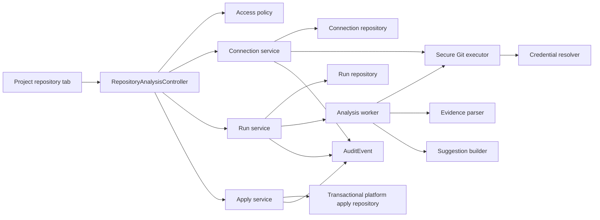

# F384 Repository Connection And Analysis Architecture

## 1. Product Truth Boundary

F384 separates three kinds of repository data instead of allowing one JSON blob
to imply more certainty than it has:

| Source | Meaning | May complete repository readiness |
| --- | --- | --- |
| `Project.gitRepo` / `Project.config` | Manual declaration | No |
| `RepositoryConnection` | A read-only Git check resolved a real default branch, selected branch, and commit | No |
| Applied succeeded `RepositoryAnalysisRun` | Code evidence was reviewed and confirmed into platform objects | Yes |

Connecting or analyzing never mutates `Project`, `Application`,
`ApplicationService`, `ProjectEnvironment`, or deployment configuration. Only
an explicit apply request can do that. Project repository readiness becomes
complete only while the active connection still points at the commit of the
latest successfully applied run.

## 2. Data Model

### `RepositoryConnection`

One active connection belongs to one project and records:

- team/project/actor scope;
- provider, repository URL, visibility, optional provider repository identity;
- credential source and an optional encrypted `GitConnection` or
  `TeamCredential` reference;
- real default branch, selected branch, available branch names, and exact SHA;
- connected/failed status, verification timestamp, safe error code/message;
- latest applied analysis run and timestamp.

Public repositories use no credential. Existing user Git provider connections
remain reusable. A new HTTPS token or SSH private key is encrypted through the
existing `CryptoService` into team credential storage; API views return only
the credential ID, type, and label.

### `RepositoryAnalysisRun`

Every analysis is an immutable repository/branch/commit snapshot with:

- queued/running/succeeded/failed/cancelled status and current stage;
- trigger actor, parser/rule version, timestamps, duration, warnings, summary,
  structured result, safe error code/message/action;
- a project-scoped idempotency key;
- an `activeKey` uniqueness lease so duplicate/concurrent starts cannot create
  two active project runs;
- cancellation request time and retry lineage.

A retry creates a new run and resolves a fresh exact commit. A terminal run is
never rewritten into a different commit.

### `RepositoryAnalysisStage`

Stages persist independently with ordinal, state, start/end/duration, redacted
logs, safe errors, and file/symbol evidence:

1. `resolve`
2. `checkout`
3. `inventory`
4. `detect`
5. `suggest`
6. `cleanup`

### `RepositoryAnalysisSuggestion`

Each proposal is versioned against one run and stores:

- stable key and kind;
- detector/rule source and file evidence;
- current manual/platform value and detected proposed value;
- confidence, conflicts, impact, and “needs confirmation” warnings;
- pending/accepted/edited/rejected/applied state;
- reviewed value and applied object references.

Environment, application service, resource requirement, release-stage, and
health-check decisions stay independently reviewable. A compound service
proposal may create or match an `Application`, then create/update the
environment-specific `ApplicationService`.

## 3. Module Boundaries

- Controllers own transport and access checks only.
- Services own connection, lifecycle, parser orchestration, and apply rules.
- Repositories own Prisma reads/writes and the cross-object apply transaction.
- Detectors are pure or filesystem-bounded and never access transport/Prisma.
- UI hooks own API state/polling; focused components own display/interaction.

`RepositoryAnalysisModule` is imported by `ProjectModule`; it does not enlarge
the already oversized root `AppModule` or existing project controller.

## 4. Secure Repository Acquisition

Git runs through `execFile`/`spawn` argument arrays, never a shell command.
Repository URLs containing control characters, embedded HTTP userinfo, or
leading options are rejected. Branches must be valid heads and cannot become
arguments.

Credential material exists only in memory or a mode-`0600` temporary file:

- HTTPS uses `GIT_ASKPASS` with secret values passed through child environment.
- SSH uses an isolated identity file and isolated known-hosts file.
- child arguments, logs, audit metadata, responses, and persisted results never
  contain the token/key/password.

Local repository paths are default-off and require an explicit development
allow-list. This permits controlled Picshare acceptance without turning the API
into an arbitrary local filesystem reader.

Every checkout uses a unique `mkdtemp` workspace, a bounded timeout, shallow
read-only clone/checkout of the exact SHA, file-count/byte/read limits, symlink
skipping, realpath containment, and cleanup in `finally`. A startup recovery
pass requeues persisted queued/running runs after a process interruption.

## 5. Evidence Detection

The parser reads only allowlisted manifests and source-contract files within the
checked-out root. It records relative file paths and evidence details, never
source secret values.

The first detector set covers:

- monorepo/workspaces and deployable versus artifact/shared packages;
- framework/runtime/version clues and package manager/lockfile;
- build/start/test and target-specific commands;
- Dockerfiles, build contexts, Compose candidates/services/dependencies;
- environment variable names, requiredness, scope, and secret classification;
- internal/external ports, liveness/readiness checks, databases and dependencies;
- migration, bootstrap/seed, backfill, and deployable artifact entry points.

Ambiguity is data: multiple Compose files, conflicting health checks, absent
versions, and inferred roles are returned as warnings requiring confirmation.

## 6. Review And Transactional Apply

The client submits one decision per suggestion: accept, edit, or reject. The
server verifies project admin access, succeeded run status, current commit,
suggestion membership, and edited-value schema before opening one transaction.

Apply order is:

1. create/match the target environment when explicitly accepted;
2. update `Project.gitRepo/config.source` with verified source metadata;
3. create/match `Application`;
4. create/update `ApplicationService` with allowlisted non-secret fields;
5. merge detected resource requirements and repository evidence metadata;
6. record applied references on suggestions and connection;
7. write a safe audit event.

Existing non-empty manual values are conflicts. They are not overwritten unless
the corresponding suggestion is explicitly accepted or edited, and the UI
shows current versus proposed values and impact first.

## 7. API And UI Shape

Project-scoped APIs expose:

- current connection and safe credential options;
- connect/verify, start, list, detail, retry, cancel;
- suggestion decisions/apply;
- readiness summary.

Run lookup always includes team and project scope. A forged or cross-project ID
returns 404 and never falls back to a general list.

The project page adds a URL-restorable repository tab and one primary action:
“连接并解析仓库”. It shows the verified repository/branch/commit, honest run
state and stages, redacted logs/evidence, warnings/errors/fix actions, history,
review controls, and exact links to applied project/environment/application/
service/deployment surfaces.

## 8. Picshare Acceptance Contract

The reference snapshot is
`master@8e7c465d56e68dafcef0dfbc480fe721044b0fb3`.
Expected evidence includes:

- pnpm 8.12/Turbo monorepo;
- deployable Nest/Prisma backend and Next standalone admin;
- artifact-only Taro mobile and shared-only `packages/types`;
- repository-root Docker contexts with ports 3000/3001;
- external MySQL, Redis, and object storage;
- migrations, production bootstrap, development-only seed, default-dry-run
  backfill, liveness `/api`, and readiness `/api/health/readiness`;
- environment variable names only.

The parser must preserve the conflict between
`docker-compose.devpilot.yml` liveness and the source/primary Compose readiness
probe, and rank rather than silently select multiple Compose candidates.

## 9. Comparator Decisions

The interaction follows current official patterns without adding provider SDK
scope to F384:

- [GitHub installation access](https://docs.github.com/en/rest/apps/installations):
  provider authorization and repository selection are distinct.
- [GitLab Projects API](https://docs.gitlab.com/api/projects/): preserve stable
  provider identity, namespace, visibility, and default branch when available.
- [Vercel Git import](https://vercel.com/docs/git): detected root/framework/build
  defaults remain editable before apply.
- [Render deploys](https://render.com/docs/deploys): pre-deploy migration is
  distinct from build and start.
- [Railway monorepos](https://docs.railway.com/deployments/monorepo): deployable
  workspaces are separated from shared/artifact-only packages.
- [Railway Compose mapping](https://docs.railway.com/guides/docker-compose):
  services and dependency evidence remain independently reviewable.

## 10. Explicit Non-Goals

F384 does not install provider apps, write repositories, add webhook
auto-deploy, modify F383 release behavior, provision cloud resources, reclaim
provider assets, or claim production private-repository proof without external
credentials.

## 11. Verified Implementation Result

The implemented closed loop was exercised against clean Picshare
`master@8e7c465d56e68dafcef0dfbc480fe721044b0fb3` in the disposable Devpilot
Docker runtime. Run `cms5xb3o2000aazxpaut9boes` completed all six stages,
persisted five reviewable suggestions, and applied two edited, two accepted, and
one rejected decision. The original F383 admin/backend application-service IDs
and deployment configuration hashes remained stable; the accepted proxy became
one new application service.

The Project overview reports 6/6 only after the connection, succeeded analysis,
and applied run all agree on the exact commit. Browser checks restored the run
from URL state and followed exact application, service, environment, and
project-scoped audit links. The audit view now keeps `projectId` and
`repository_analysis` filters in its server request and client cache key.

The runtime did not have an externally reusable GitHub/private-repository
credential. Acceptance therefore used an explicit Docker read-only mount of the
same clean Picshare checkout. This proves the parser, persistence, review,
application, audit, and UI contract without claiming provider-credential or
production-environment signoff.
