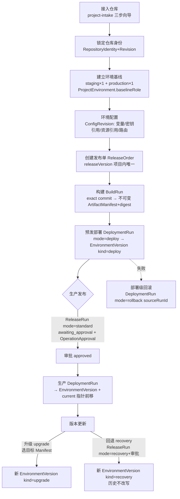
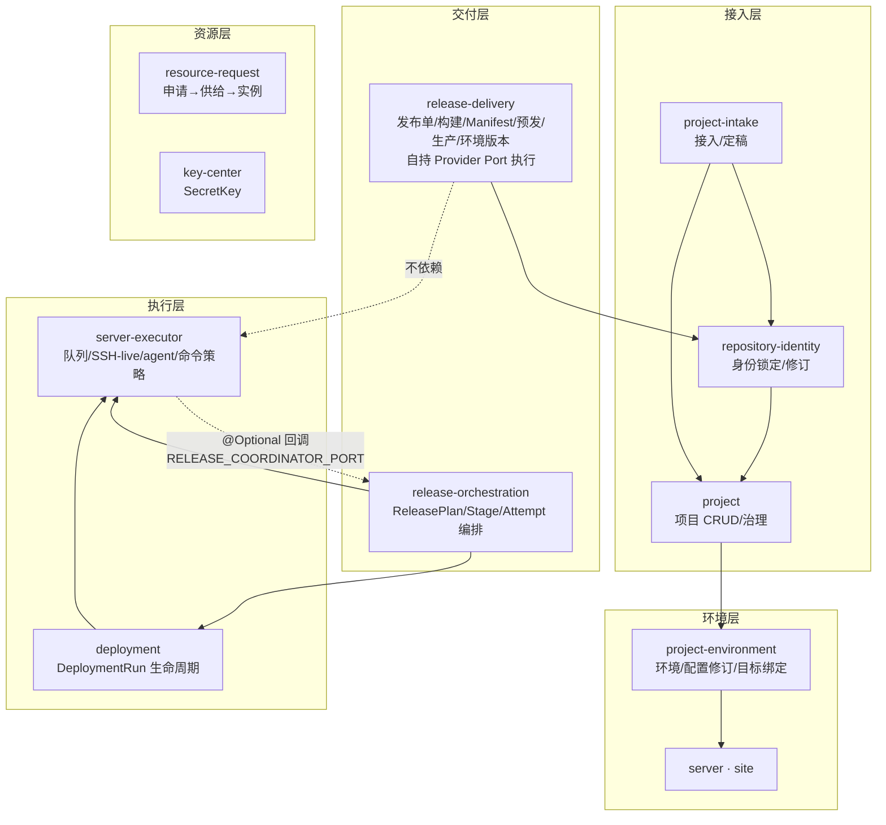

# Devpilot 项目管理→发布→版本更新 全流程审计（2026-08-19）

方法：浏览器实测（8 个页面/视图，含数据真值）+ 两轮代码调研（后端数据模型/编排链/模块组织；前端路由/旧交互），全部结论锚定 file:line 或实测快照，无假设。
实测环境：docker devpilot-app 栈（api=master f451df22 fresh dist、web=同提交镜像内构建），账号 admin@devpilot.local，项目 Picshare(cmrwxl1ks000k6enjiclutd5a)。

## 图 1 · 业务逻辑图（一次发布的生命周期）



关键状态机（实测+schema）：
- ReleaseOrder: draft→active→succeeded|failed|canceled（schema.prisma:3019）
- BuildRun: queued→running→succeeded|failed|canceled（单 L，:3052）
- DeploymentRun: queued→running→blocked(=待审批)→completed|failed|cancelled（双 L，deployment-run-status.ts:11-18）
- ReleaseRun: pending→awaiting_approval→running→awaiting_validation→succeeded|failed|canceled（:3185）
- EnvironmentVersion: 追加式版本链，previousVersionId 串联，currentEnvironmentVersionId 单指针（:3353）

## 图 2 · 组织架构图（后端模块分层与依赖）



实测分层事实（agent 调研）：release-delivery 与 release-orchestration 互不 import；release-delivery 经自身 Port（ReleaseStagingExecutorPort / ReleaseDeploymentProviderPort，release-delivery.module.ts:185-188）执行，不触碰 ServerExecutionJob；server-executor 与 release-orchestration 形成受控回环（release-orchestration.module.ts:63-64）。跨模块具体类注入两处：server-command.adapter.ts:12、deployment-run.adapter.ts:12（合法但非 port 抽象）。

## 图 3 · 功能地图（用户功能 → 承载页面/模块）

| 功能域 | 用户动作 | 页面（实测） | 后端模块 |
|---|---|---|---|
| 项目接入 | 连仓库→审查→定基线 | /projects/create 三步 | project-intake + repository-analysis |
| 项目总览 | 看待办/环境状态/发布史 | /projects/[id] 默认视图（"现在要做什么"+服务端核验 2/10） | release-delivery summary |
| 发布（新） | 选环境→确认配置→发布→看进度→发布到生产 | /projects/[id]/publish(+/[roid]) | release-delivery |
| 发布（旧） | 建 4 步 stepper、手选 Manifest、审批卡、日志抽屉 | ?view=releases&releaseOrderId= | release-delivery |
| 版本管理 | 升级/回退/晋级恢复、变更记录 | ?view=environment-versions | release-delivery(recovery/promotion) |
| 环境配置 | 变量/密钥/资源绑定/目标/路由 | settings?section=environments(5 子页签) | project-environment+key-center+resource-request |
| 审批 | 批准/驳回（含发布审批） | /operation-approvals + 发布单内审批卡 | operation-approval |
| 密钥 | 增改轮换 | /keys | key-center |

## 图 4 · 数据流向图（发布主链一次执行）

```mermaid
flowchart LR
  UI[publish 向导/进度页] -->|POST releases| API1[ReleaseOrder]
  API1 -->|POST builds| BR[BuildRun] -->|succeeded| AM[ArtifactManifest<br/>digest/provenance]
  AM -->|POST staging-deployments| DR1[DeploymentRun staging]
  DR1 -->|completed| EV1[EnvironmentVersion deploy]
  EV1 -->|production-preview→confirm| RR[ReleaseRun standard<br/>awaiting_approval]
  RR --> OA[OperationApproval] -->|review approved + consumedAt| DR2[DeploymentRun production]
  DR2 --> EV2[EnvironmentVersion + current 指针]
  EV2 -->|promotion await→resume| EV3[job 升级/恢复版本]
  DR1 & DR2 --> SEJ[ServerExecutionJob<br/>队列/租约/审计] --> SSH[ssh-live / agent / script-plan adapter] --> TGT[目标服务器]
```



编排锚点（agent 调研实测行号）：构建事务 release-build.repository.ts:149 + manifest writer release-build-manifest.writer.ts:28；预发 release-staging.service.ts:38-174（恰好 1 个 staging 基线 :50）；生产确认事务 release-production.repository.ts:99-198（审批创建 :172）；版本执行 environment-version-execution.ts:44 + 完成写 current 指针 environment-version-write.utils.ts:93-138（审批消费 :131）；恢复 environment-version-recovery.repository.ts:49-139。

## 图 5 · 页面结构图（路由树，全部实测存在）

```mermaid
flowchart TD
  L[/login] --> DASH[/dashboard<br/>待办/最近部署/资源申请·实测/]
  DASH --> PL[/projects 项目目录·实测 3 项目/]
  PL --> PC[/projects/create 接入向导/]
  PL --> PD[/projects/:id 默认=delivery 视图/]
  PD --> V1[?view=releases 发布单列表→详情/]
  PD --> V2[?view=environment-versions 版本链·实测/]
  PD --> V3[?view=deployments 部署列表/]
  PD --> PUB[/projects/:id/publish 三步向导·实测/]
  PUB --> PROG[/publish/:releaseOrderId 进度页·实测/]
  PD --> SET[/projects/:id/settings<br/>repository/environments(5 子页签)/resources/webhooks/release-policy/general/]
  APP[/applications 应用+部署向导/] -.并行发布入口.-> PD
  APR[/operation-approvals 审批/] -.发布审批.-> V1
```

## 三视角审计发现（全部有证据）

### 产品（功能与能力）

| # | 发现 | 证据 | 严重度 |
|---|---|---|---|
| P1 | 新旧发布双入口并存：弱摘要区同时有"发布"(新, project-delivery-summary.tsx:69-77)与"创建发布单"(旧, :55-58)；加上 /applications 部署向导共三条并行链 | 实测页面+代码 | 高 |
| P2 | 部署目标未绑定的硬约束发现过晚：向导第 1 步可选环境不查 targets 就绪；实测环境版本视图与旧发布单步骤 03 才提示"尚未绑定部署目标"（向导后端 checkpoints 里有 targets 检查但向导未消费） | 实测两处提示+readiness presenter environmentTarget | 高 |
| P3 | 生产升级/回退与旧发布单审批跨页耦合：环境版本页原文"生产升级或回退需要先在发布单生产步骤取得同一 Manifest 的有效审批"——用户需在两个视图间携带同一 Manifest 概念跳转 | 实测 environment-versions 视图 | 高 |
| P4 | "升级到指定版本"只存在于旧交互（目标 Manifest 下拉）；新流程只覆盖新发布+回滚上一版，版本运营场景缺失 | 实测对比 | 中 |
| P5 | 发布历史三处割裂（发布单 tab / 环境变更记录 / dashboard 最近部署），无项目级统一时间线 | 实测 | 中 |
| P6 | 审批体验脱节：dashboard 显示"待我审批 2"（实测），但发布中审批卡只在旧详情页；新进度页仅链接跳走 | 实测 | 中 |

### 设计/交互

| # | 发现 | 证据 | 严重度 |
|---|---|---|---|
| D1 | 内部名词裸露（旧页面）："Artifact Manifest"、"BuildRun #10 · Manifest sha256:…"、"缺少精确 Commit、默认 HEAD、基线与合并树的真实 Git 证据"、表列"DeploymentRun cmsn5pyqs… local-filesystem-v1" | 实测快照（环境版本视图+旧发布单详情） | 高（M4 治理范围） |
| D2 | 新进度页面包屑英文残留"Publish"（应为"发布"） | 实测快照 | 低（P0 快修） |
| D3 | 请求挂起无超时兜底：后端容器重启窗口期后，标签页永久"加载中"，整页重新导航不恢复，仅新标签页恢复（tab 级挂起状态，机理待定位）——网络抖动即可让用户卡死 | 实测复现（含对照实验：dashboard 数据正常、同 URL 新标签页正常） | **P0（最高）** |
| D4 | 首次进 dashboard"加载失败：缺少团队 ID"随后自愈——团队上下文初始化竞态无过渡态 | 实测两次（首次报错/复查自愈） | 中 |
| D5 | 升降/回退按钮语义由"目标 Manifest 选择"隐式驱动：选当前版本→"无需重复部署"，选旧版本→含义变回退；因果不可见 | 实测环境版本视图交互态 | 中 |
| D6 | 新旧两套步骤名词：旧"仓库与环境基线/构建制品/预发发布/生产发布" vs 新"发布前检查/构建/预发部署/生产发布"——同物异名 | 实测两页对照 | 中 |
| D7 | 正向样本：新向导空态/禁用态/引导文案质量高（"配置检查通过，可以继续发布""不可作为发布基线"），旧页面部分禁用原因无修复链接（旧发布单"构建最新代码"禁用只给术语原因） | 实测 | 低 |

### 技术（代码与架构）

| # | 发现 | 证据 | 严重度 |
|---|---|---|---|
| T1 | 编排三体系（release-delivery 自持 Port / release-orchestration Plan-Stage-Attempt / deployment 通用 Run）边界靠约定，两处 adapter 直接 import 具体类非 port | server-command.adapter.ts:12、deployment-run.adapter.ts:12 | 中 |
| T2 | 状态枚举四套并存且拼写不一（BuildRun canceled 单 L / DeploymentRun cancelled 双 L / blocked=待审批 / ReleaseRun awaiting_approval）——新页面已映射收敛，旧页面与后端未共享常量 | deployment-run-status.ts:11-18 vs schema:3052/3185；实测旧页与新页状态词不同 | 中 |
| T3 | SSR 取数永远失败（服务端无团队上下文 403"缺少团队 ID"）→ console.error 噪音+首屏依赖客户端兜底 | web 容器日志实测 + page.tsx serverRequest | 中 |
| T4 | api-client 挂起请求无超时/取消（D3 的技术根因面） | 实测行为 | **P0** |
| T5 | api 镜像依赖宿主 dist（Dockerfile:41 注释）——已实际踩坑一次（旧 dist 导致页面崩溃），建议改镜像内构建（web 已是） | 本次故障复盘 | 中 |
| T6 | 前后端无共享契约包：summary(version2/checkpoints) 与 environment-versions(dict) 两套响应风格，类型各自手写（monorepo packages/api-client 是现成落点） | 两端类型文件对比 | 中 |

## 流程合理性与可用性结论

**合理性（后端语义）：高。** 不可变 Manifest 贯穿、审批创建-消费闭环（consumedAt 防重放）、环境版本追加式链（回退=新 recovery 版本，历史不改写）、幂等键、行锁串行化——核心交付语义严谨且已真机验证（F383）。

**可用性（用户视角）：分层。**
- 新发布主链（向导+进度页）：**可用，8/10**——实测六步全通、零内部名词、失败有人话路径。
- 版本管理（环境版本视图）：**4/10**——Manifest 下拉/术语裸露/按钮语义隐式，仅适合专家。
- 异常恢复与审批：**3/10**——跨页耦合（P3）、审批入口分裂（P6）、挂起无兜底（D3）会让用户在异常场景卡死。

**结论**：第 0 步目标（发布主链简单可用）已达成；"版本更新"与"异常路径"两环节尚未简化，且存在一个影响所有页面的稳定性缺陷（D3/T4）。

## 修复优先级建议

- **P0（本周）**：D3/T4 请求超时+错误兜底（api-client 层统一）；D2 面包屑 i18n；P2 前移——向导第 1 步环境卡消费 checkpoints 的 targets 就绪状态。
- **P1（下一里程碑）**：收敛发布入口（旧"创建发布单"降级为"高级"或隐藏）；T2 状态常量共享包；T3 团队上下文服务端化；T5 api 镜像内构建。
- **P2（M4+ 规划）**：版本升级/回退并入新流交互；审批嵌入发布进度页；项目级统一发布时间线；D1 旧页面词汇治理。
