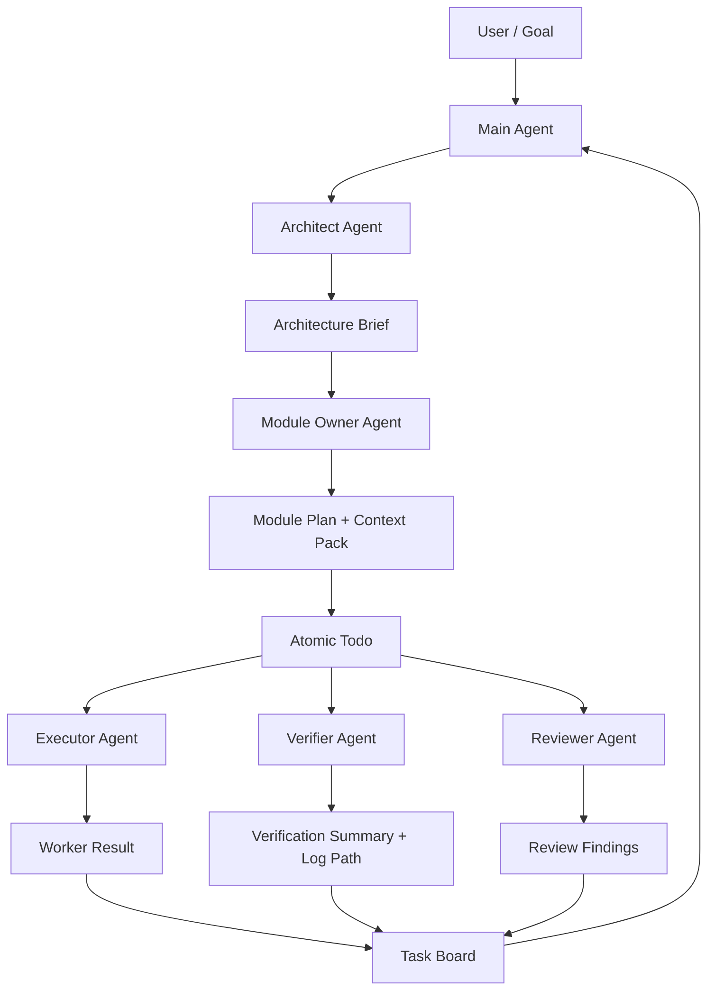

# 多 Agent 开发架构

> 用分层 Agent、结构化任务板和上下文包，把长期开发工作拆成可验证的小任务，同时让主 Agent 的上下文保持干净。

## 设计目标

多 Agent 架构的目标不是增加角色数量，而是减少长期上下文污染并提高产出质量。每个 Agent 只获取完成自己职责所需的最小真实上下文，大输出和完整证据落盘，主 Agent 只保留决策摘要、路径引用和当前状态。

这套架构优先解决四类问题：

- 长期开发线程反复携带历史上下文，导致 token 成本持续上升。
- 架构、模块拆分、开发、验证、Review 混在同一上下文里，判断互相干扰。
- Worker 缺少稳定的任务状态和证据引用，换线程后难以恢复。
- 测试、构建、宽搜索、长 diff 等高噪声输出进入主线程。

## 总体结构



主 Agent 是唯一长期上下文拥有者。它负责目标、优先级、调度、验收和最终汇总，但不长期持有完整源码窗口、完整日志或完整搜索结果。

## Agent 层级

| Agent | 主要职责 | 可读上下文 | 不应该做 |
| --- | --- | --- | --- |
| Main Agent | 目标管理、调度、状态归档、最终决策 | `board.json`、当前 slice、结果摘要 | 直接吞完整日志、长 diff、全仓库搜索结果 |
| Architect Agent | 架构设计、模块边界、依赖方向、迁移顺序 | 关键架构文档、模块地图、有限调用链 | 写业务代码、生成原子实现 |
| Module Owner Agent | 模块上下文包、模块内 todo 拆分、局部验收 | 本模块文件、模块测试、公开契约 | 读取无关模块实现、扩大任务范围 |
| Executor Agent | 完成一个 atomic todo | todo 白名单文件、只读契约、相关测试 | 重新做架构判断、读路线图、扩张到其他模块 |
| Verifier Agent | 运行测试、构建、lint、type-check、日志隔离 | 验证命令和目标路径 | 把完整日志回传到主线程 |
| Reviewer Agent | 审查 diff、风险和测试缺口 | diff、相关契约、相关测试 | 重写实现或扩大需求 |
| Integrator Agent | 汇总多个模块结果、检查跨模块影响 | 多个 result/review 摘要和必要接口 | 替代模块级实现 |

## 触发矩阵

多 Agent 应该按需触发，不能固定跑完整流水线。

| 场景 | 触发 |
| --- | --- |
| 修改范围明确，1 个文件或很小配置变更 | Main Agent 直接处理 |
| 不知道代码入口、调用链或影响面 | Scout/Architect Agent |
| 涉及 2 个以上模块、共享接口、数据流或依赖方向 | Architect Agent |
| 单模块任务超过 3 个 atomic todo | Module Owner Agent |
| 已有清晰 atomic todo | Executor Agent |
| `type-check`、`lint`、`test`、`build`、`docker logs`、宽 `rg/find/grep`、长 diff | Verifier Agent |
| 改 DTO/API/schema/权限/状态机/共享 hook | Reviewer Agent |
| 多个模块结果需要合并 | Integrator Agent |

判断原则：只有当上下文隔离收益大于协调成本时，才触发新 Agent。

## 上下文包

下层 Agent 不应自由探索整个项目。上层必须给它一个 context pack。

```json
{
  "todo_id": "DEP-001",
  "allowed_files": [
    "src/deployment/config.service.ts",
    "src/deployment/config-validator.ts"
  ],
  "read_only_files": [
    "src/deployment/config.types.ts",
    "src/deployment/config.service.spec.ts"
  ],
  "forbidden_scope": [
    "do not edit monitoring",
    "do not change public API response shape"
  ],
  "acceptance": [
    "existing deployment config tests pass",
    "no behavior change"
  ],
  "evidence_refs": [
    {
      "path": ".agent-board/modules/deployment/contracts.json",
      "reason": "public module contract"
    }
  ]
}
```

如果 Executor 发现上下文不足，它不能自行扩大到全仓库搜索，而应该返回：

```json
{
  "status": "needs_context",
  "question": "DeploymentConfigDto 是否被外部 API 消费？",
  "requested_evidence": [
    "DeploymentConfigDto usage",
    "public API response contract"
  ]
}
```

由 Module Owner 或 Scout 补证据后再继续。

## 文件任务系统

第一版任务系统应是持久化的轻量文件协议，而不是数据库。

```text
.agent-board/
  board.json
  board.md
  events.jsonl
  goals/
    G001.json
  slices/
    S001.json
  modules/
    deployment/
      module-plan.json
      context-pack.json
      decisions.md
      diagrams/
        architecture.mmd
  todos/
    DEP-001.json
  results/
    DEP-001-result.json
  reviews/
    DEP-001-review.json
  verification/
    DEP-001-verification.json
```

大日志不放进 `.agent-board/`。测试、构建、docker logs、长搜索结果应保存到 `/tmp/codex-tool-runs/{project}/...`，任务板只保存日志路径和摘要。

核心状态保持少而稳定：

```text
draft -> ready -> in_progress -> needs_context -> needs_review
needs_verification -> verified -> done
blocked
handoff_required
```

写入规则：

- Worker 写自己的 `result`、`review` 或 `verification` 文件。
- Main Agent 或 Orchestrator 合并更新 `board.json`。
- `events.jsonl` 只追加，不改历史。
- 同一 checkout 默认只有一个 active write worker。
- 只读 Scout、Verifier、Reviewer 可以并行。

## 图表策略

图是结构化证据，不是固定仪式。只有出现流程、状态、权限、依赖、并发、数据流、跨模块边界时才要求画图。

| Agent | 推荐图 | 触发条件 |
| --- | --- | --- |
| Product Agent | 用户旅程、业务流程、泳道图 | 多角色、多步骤、多状态 |
| Architect Agent | 模块边界图、依赖图、数据流图、时序图 | 跨模块、服务拆分、接口设计 |
| Module Owner Agent | 模块调用图、状态机、todo 依赖图 | 模块内任务超过 3 个或顺序复杂 |
| Executor Agent | 局部时序图、异常路径图 | 单个 todo 有复杂逻辑 |
| Reviewer Agent | 风险路径图、回归影响图 | 共享接口、权限、状态机改动 |
| Verifier Agent | 测试覆盖矩阵、场景流图 | 验证路径多或覆盖盲区需要说明 |

图源应优先使用 Mermaid、PlantUML 或 JSON graph，避免不可 diff 的图片。主 Agent 长期只保留图路径和一句摘要。

## 与 svton 现有能力的关系

这套架构应优先复用 svton 已有 Agent 能力：

- `SubagentManager` 提供隔离上下文、受限工具集和摘要返回。
- `PlanningManager` 提供轻量计划状态模型。
- `SkillManager` 用于按需激活多 Agent 工作流规则。
- `codex-long-goal-orchestrator` 已覆盖长目标的 board/worker/handoff 形态。
- `isolate-tool-output` 已覆盖高噪声命令的日志隔离和摘要返回。

因此第一阶段先落地为 skill 和文件协议；只有当并发、查询和 UI 需求明显增长时，再升级为 MCP、SQLite 或 Web UI。

## 升级条件

保持文件任务系统，直到出现以下信号：

- 同时超过 3 个活跃 Worker。
- 单项目 todo 超过 50 个。
- 需要跨项目统计 token、失败率、验证耗时。
- 经常发生任务状态冲突。
- 需要人类通过 UI 筛选、认领、暂停或重排任务。

达到这些条件后，再考虑实现 orchestrator 工具或任务管理 UI。
