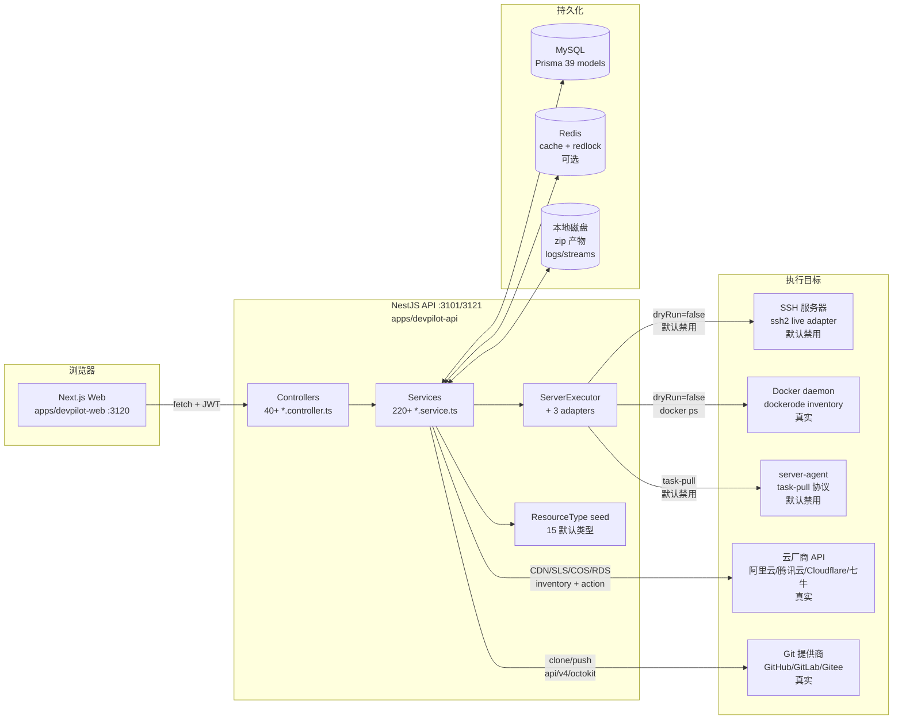
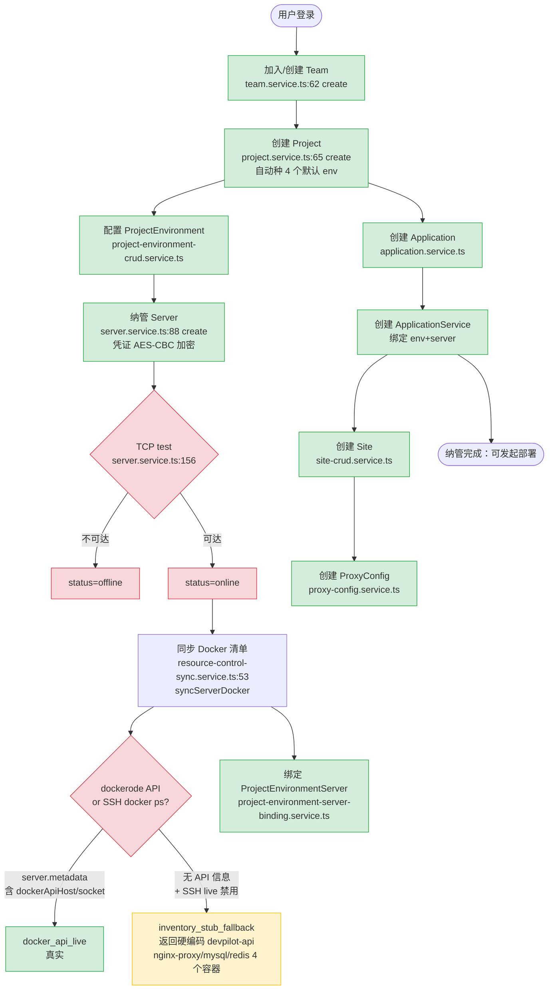
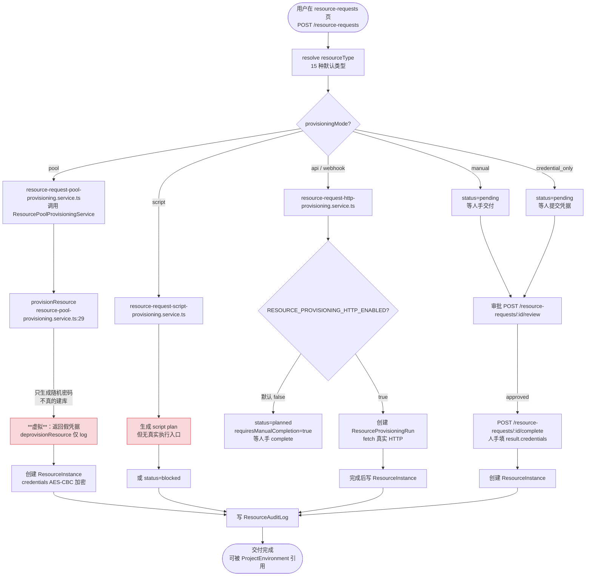
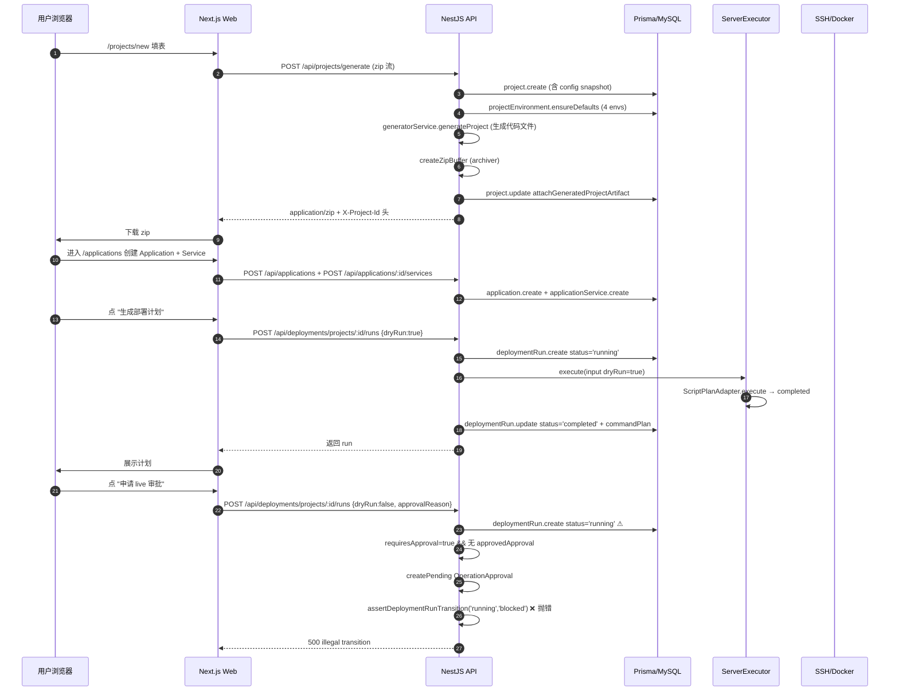
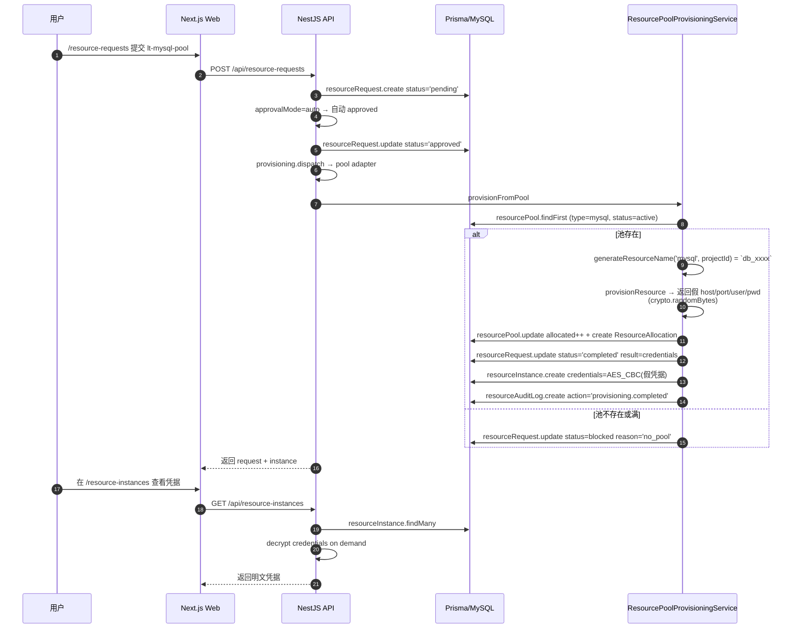
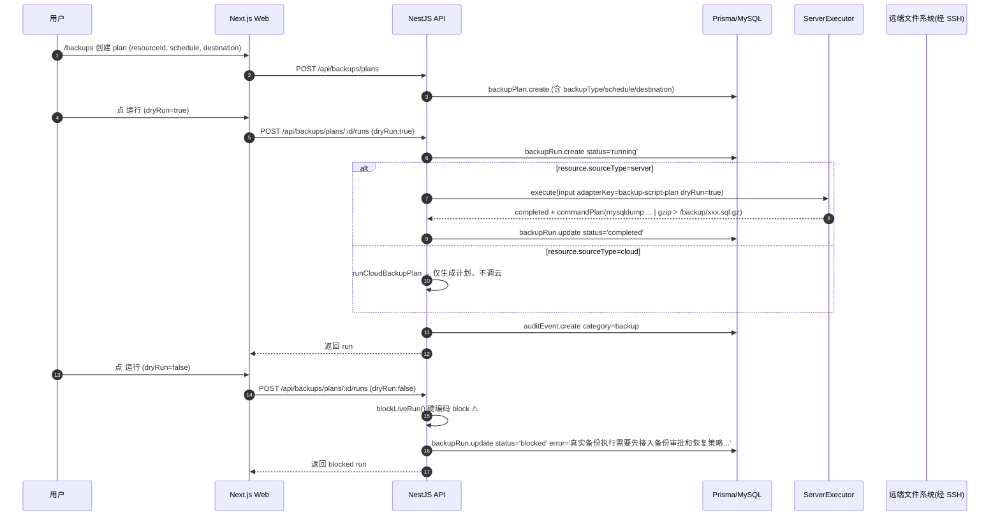

# devpilot 平台能力总览（纳管 / 部署 / 资源申请）

> 本文档基于 `apps/devpilot-api/`（NestJS）与 `apps/devpilot-web/`（Next.js）的源代码逐行核对而成。所有事实声明都附 `file:line` 引用。无法在代码中验证的内容标 `TODO: verify`。
>
**仓库根**：`/Users/zhaoxingbo/Workspace/ai-driven/svton`
**生成日期**：2026-07-21

---

## 目录

- [Part 1：平台总览](#part-1平台总览)
- [Part 2：业务逻辑图（业务流程）](#part-2业务逻辑图)
- [Part 3：组织架构图](#part-3组织架构图)
- [Part 4：功能地图](#part-4功能地图)
- [Part 5：数据流向图](#part-5数据流向图)
- [Part 6：页面结构图](#part-6页面结构图)
- [Part 7：缺口分析](#part-7缺口分析)
- [Part 8：建议（按 P0/P1/P2 排序）](#part-8建议按-p0p1p2-排序)

---

## Part 1：平台总览

### 1.1 一句话定义（基于代码）

devpilot 是一个面向"项目脚手架 → 资源申请 → 部署运维"全链路的**控制平面（control plane）**：它把"团队 / 项目 / 环境 / 应用服务 / 服务器 / 站点 / 资源"建模为可治理对象，对外提供 CRUD + 审批 + 审计 + 监控 + 日志 + 备份的统一接入层；对真实基础设施的变更统一收敛到 `ServerExecutor` 这条执行管线上（dry-run 默认开启，live 执行需 SSH / server-agent / 审批）。代码引用：

- 平台核心模型在 `apps/devpilot-api/prisma/schema.prisma:13-2388`（共 39 个 Prisma model，覆盖 User/Team/Project/Application/Server/Site/ManagedResource/DeploymentRun/ResourceRequest/BackupPlan/AlertRule/LogStream/AuditEvent/OperationApproval/ControlAccessPolicy/ServerExecutionJob 等）。
- 平台对外的统一 HTTP 响应封装在 `apps/devpilot-api/src/app.module.ts:117-125`（`HttpModule.forRoot` 把成功响应包成 `{ code, message, data, timestamp }`，排除 StreamableFile 与 SSE 路径）。
- 平台的执行管线入口 `ServerExecutorService` 在 `apps/devpilot-api/src/server-executor/server-executor.service.ts:47-193`，三个适配器：`SshLiveServerExecutorAdapter`（默认禁用）、`ServerAgentServerExecutorAdapter`（默认禁用）、`ScriptPlanServerExecutorAdapter`（默认适配器，非 dryRun 一律返回 `blocked`）。
- 平台启动入口 `apps/devpilot-api/src/main.ts:5-43`，默认端口 `process.env.PORT || 3101`（line 35），全局 API 前缀 `/api`（line 33），全局 `ValidationPipe` 启用 `whitelist + forbidNonWhitelisted + transform`（line 15-24）。

### 1.2 技术栈（cite `package.json`）

**后端**（`apps/devpilot-api/package.json`）：

| 维度 | 选型 | 引用 |
|---|---|---|
| 框架 | NestJS 10.3 | `apps/devpilot-api/package.json:18-20` |
| ORM | Prisma 5.7（MySQL） | `apps/devpilot-api/package.json:24`；`apps/devpilot-api/prisma/schema.prisma:5-8` |
| 鉴权 | passport-jwt + passport-local + bcrypt | `apps/devpilot-api/package.json:44-46`；`apps/devpilot-api/src/auth/auth.service.ts:1-4` |
| 远程执行 | ssh2 1.17（SSH live adapter） + dockerode 5.0（docker inventory） | `apps/devpilot-api/package.json:38,41` |
| 云厂商 SDK | `@alicloud/cdn20180510`、`@alicloud/sls20201230`、`@alicloud/pop-core`、`cloudflare`、`cos-nodejs-sdk-v5`（Tencent COS）、`qiniu`、`tencentcloud-sdk-nodejs-cdn` | `apps/devpilot-api/package.json:11-13,28,30,40,52` |
| Git 集成 | `@octokit/rest`（GitHub）、`@gitbeaker/rest`（GitLab）、自实现 Gitee provider | `apps/devpilot-api/package.json:22,14`；`apps/devpilot-api/src/git/git.service.ts:5-7` |
| 模板渲染 | mustache 4.2、js-yaml 5.2、archiver 6.0（zip 产物） | `apps/devpilot-api/package.json:36,37,34` |
| 队列 / 锁 | `@nestjs/schedule` 6.1 + 自实现 DB 队列（`ServerExecutorQueueModule`） + redlock 5.0-beta（Redis 可用时） | `apps/devpilot-api/package.json:21,42`；`apps/devpilot-api/src/app.module.ts:99-106` |
| 通知 | nodemailer 7（邮件告警通道） | `apps/devpilot-api/package.json:43` |
| 校验 | zod 3.22、class-validator 0.14 | `apps/devpilot-api/package.json:14,33` |
| 内部包 | `@svton/nestjs-authz` `@svton/nestjs-cache` `@svton/nestjs-redis` `@svton/nestjs-http` `@svton/nestjs-logger` `@svton/nestjs-config-schema` | `apps/devpilot-api/package.json:25-30` |

**前端**（`apps/devpilot-web/package.json`）：

| 维度 | 选型 | 引用 |
|---|---|---|
| 框架 | Next.js 15 + React 19 | `apps/devpilot-web/package.json:20,22,23` |
| 数据获取 | SWR 2.2 + 自实现 `use-api` registry | `apps/devpilot-web/package.json:29`；`apps/devpilot-web/src/hooks/api/use-api.ts:11-16` |
| 表单 | react-hook-form 7.80 + zod 3.23 + @hookform/resolvers 5.4 | `apps/devpilot-web/package.json:7,30,18` |
| 国际化 | next-intl 4.13 | `apps/devpilot-web/package.json:21` |
| SSE | @microsoft/fetch-event-source 2.1（日志流推送） | `apps/devpilot-web/package.json:8` |
| 鉴权 | next-auth 5.0-beta.25（已声明但 `auth.controller.ts` 实际用自实现 JWT） | `apps/devpilot-web/package.json:19`；`apps/devpilot-api/src/auth/auth.service.ts:114-130` |
| 样式 | Tailwind 3.4 + clsx + tailwind-merge | `apps/devpilot-web/package.json:13,26,31,27` |
| UI 反馈 | sonner 2.0 | `apps/devpilot-web/package.json:28` |

### 1.3 高层架构图（mermaid）



来源：
- 39 个 Prisma model：`apps/devpilot-api/prisma/schema.prisma:13,77,137,193,240,276,347,381,414,464,527,550,584,602,619,673,726,766,794,832,885,939,1012,1049,1086,1113,1130,1158,1189,1232,1266,1297,1375,1436,1469,1514,1563,1617,1673,1720,1777,1834,1868,1930,1963,1992,2058,2119,2219,2234,2301`
- 40 个 controller：`apps/devpilot-api/src/<module>/*.controller.ts`（详见 [Part 4](#part-4功能地图)）
- SSH live adapter 默认禁用：`apps/devpilot-api/src/server-executor/adapters/ssh-live.adapter.ts:38-44`（`SERVER_EXECUTOR_LIVE_ENABLED` 默认 `"false"`）
- Docker inventory 真实：`apps/devpilot-api/src/resource-control/inventory/executors/docker-api-inventory-executor.ts`（用 `dockerode`）
- Server agent task-pull 默认禁用：`apps/devpilot-api/src/server-executor/server-executor-runtime-config.service.ts:75-81`
- 云厂商 SDK 真实调用：`apps/devpilot-api/src/cdn-config/`、`apps/devpilot-api/src/resource-control/inventory/cloud-provider-inventory.service.ts`

---

## Part 2：业务逻辑图

### 2.1 纳管（Onboarding）业务流程

"纳管"= 把外部基础设施（服务器、Docker 容器、云资源、Git 仓库、域名）注册到 devpilot 的治理域里，使其可观测、可审批、可审计。



**关键节点解释**：

| 步骤 | 服务方法 | 文件:行 | 真实/虚拟 |
|---|---|---|---|
| 加密服务器凭证 | `encryptCbc` | `apps/devpilot-api/src/server/server.service.ts`（经 `CryptoService`） | 真实 |
| TCP 端口测试 | `checkPortReachable` | `apps/devpilot-api/src/server/server.service.ts:168-169` | 真实但仅 TCP，不做 SSH 握手 |
| 服务探测 | `detectServices` | `apps/devpilot-api/src/server/server.service.ts:201-230` | **虚拟**：返回固定 `{nginx:false, docker:false, ...}`，注释明说"简化版：返回模拟数据"（line 210） |
| Docker 清单同步 | `syncServerDocker` | `apps/devpilot-api/src/resource-control/resource-control-sync.service.ts:53` | **真实**（走 dockerode API），但当 SSH live 禁用且无 Docker API 元数据时降级到 `inventory_stub_fallback`（line 148-150） |
| Stub fallback 内容 | `buildServerDockerInventory` | `apps/devpilot-api/src/resource-control/resource-control-docker-inventory.utils.ts:42-94` | **虚拟**：硬编码 4 个容器（`devpilot-api`、`nginx-proxy`、`mysql-primary`、`redis-cache`），与服务器实际情况无关 |
| 默认环境种子 | `ensureDefaultsForProject` | `apps/devpilot-api/src/project-environment/project-environment-defaults.service.ts`；常量 `DEFAULT_PROJECT_ENVIRONMENT_KEYS = ['dev','test','staging','prod']` | `apps/devpilot-api/src/project/project.service.ts:29` |

### 2.2 部署（Deployment）业务流程

"部署"= 把一次构建/部署/回滚/smoke 检查作为 `DeploymentRun` 落地，并（可选）走 `ServerExecutor` 真实执行。

```mermaid
flowchart TD
    START([用户在 applications 页选择服务<br/>点击 部署/重启/回滚])
    START --> DRY{dryRun?}
    DRY --"true (默认)"--> SUBMITDRY[POST /deployments/projects/:id/runs<br/>dryRun=true]
    DRY --"false (申请 live 审批)"--> SUBMITLIVE[POST /deployments/projects/:id/runs<br/>dryRun=false]
    SUBMITDRY --> CREATEDRY[创建 DeploymentRun<br/>status=running 或 queued<br/>deployment.service.ts:302-330]
    SUBMITLIVE --> CREATELIVE[创建 DeploymentRun<br/>status=running 或 queued]
    CREATEDRY --> EXEC[serverExecutor.execute<br/>script-plan adapter]
    EXEC --"dryRun=true"--> PLAN[生成 commandPlan<br/>status=completed<br/>script-plan.adapter.ts:85-115]
    CREATELIVE --> APPROVAL{已带 approvalId 且 approved?}
    APPROVAL --"是"--> EXEC2[serverExecutor.execute<br/>script-plan 默认 blocked<br/>或 ssh-live (默认禁用) ]
    APPROVAL --"否"--> NEEDAPPROVAL{queue?}
    NEEDAPPROVAL --"queue=true"--> Q2B[assertDeploymentRunTransition<br/>queued -> blocked ✓<br/>deployment-run-status.ts:42]
    NEEDAPPROVAL --"queue=false (默认)"--> R2B[assertDeploymentRunTransition<br/>running -> blocked ✗<br/>抛 illegal transition!]
    R2B --> BUG([500 错误<br/>P0 BUG])
    Q2B --> PENDING[创建 OperationApproval<br/>status=pending]
    EXEC2 --"script-plan 返回 blocked<br/>(live 默认禁用)"--> BLOCKED2[DeploymentRun blocked]
    PENDING --> REVIEW[审批人 POST /operation-approvals/:id/review]
    REVIEW --"approved"--> CONSUME[审批人点击 执行<br/>前端 approval-executor.service.ts<br/>POST /deployments/.../runs approvalId=...]
    CONSUME --> CREATELIVE
    BLOCKED2 --> REVIEW

    classDef bug fill:#f8d7da,stroke:#dc3545,stroke-width:3px
    class R2B,BUG bug
```

**关键代码引用**：

| 节点 | 文件:行 |
|---|---|
| 创建主 run（含 status 选择） | `apps/devpilot-api/src/deployment/deployment.service.ts:302-330`（`status: queue ? 'queued' : 'running'` 在 line 320） |
| 检测需审批 | `requiresDeploymentOperationApproval(dryRun)` → `deployment.service.ts:270` |
| **状态转换断言（bug 触发点）** | `apps/devpilot-api/src/deployment/deployment.service.ts:341`（`assertDeploymentRunTransition(run.status, DeploymentRunStatus.BLOCKED)` 当 `run.status==='running'` 时抛错） |
| 状态转换表 | `apps/devpilot-api/src/deployment/deployment-run-status.ts:41-45`（`RUNNING -> [COMPLETED, FAILED, CANCELLED]` 不含 `BLOCKED`） |
| 同样的 bug 在 rollback 流程 | `apps/devpilot-api/src/deployment/deployment.service.ts:674` |
| 前端调用入口 | `apps/devpilot-web/src/app/(dashboard)/operation-approvals/services/approval-executor.service.ts:101`（POST `/deployments/projects/:id/runs` 带 `dryRun:false` + `approvalId`） |
| 应用页面入口（dryRun） | `apps/devpilot-web/src/app/(dashboard)/applications/hooks/use-application-operations.ts:36`（默认 `dryRun:true`） |
| 项目页面（只读） | `apps/devpilot-web/src/app/(dashboard)/projects/[id]/hooks/use-project-detail.ts:59`（仅 `GET:/deployments/runs`） |

### 2.3 资源申请（Resource Request）业务流程

"资源申请"= 用户提交一张"我需要 mysql / redis / 域名 / 端口"单据，按资源类型的 `provisioningMode` 走不同交付路径。



**关键代码引用**：

| 节点 | 文件:行 |
|---|---|
| 5 种 mode 路由 | `apps/devpilot-api/src/resource-request/resource-request-provisioning.service.ts:57-79` |
| Pool provisioning（**虚拟**） | `apps/devpilot-api/src/resource-pool/resource-pool-provisioning.service.ts:29-72`（只 `crypto.randomBytes(16).toString('hex')` 当密码，不连真实 mysql/redis） |
| Deprovision stub | `apps/devpilot-api/src/resource-pool/resource-pool-provisioning.service.ts:74-79`（仅 `this.logger.log`） |
| HTTP 默认禁用 | `apps/devpilot-api/src/resource-request/resource-request-http-provisioning.service.ts:62-64`（`RESOURCE_PROVISIONING_HTTP_ENABLED` 默认 `false`） |
| HTTP 禁用时返回 `planned` | `apps/devpilot-api/src/resource-request/resource-request-http-provisioning.service.ts:125-131` |
| 15 默认 resource types | `apps/devpilot-api/src/resource-request/resource-type-defaults.constants.ts`（含 `mysql/postgresql/redis/server/domain/port/git-account/cloud-account/lt-*` 等，已通过 staging API 验证） |
| 种子执行入口 | `apps/devpilot-api/src/resource-request/resource-request.service.ts:61-63`（`onModuleInit` 调 `ensureDefaults`） |

---

## Part 3：组织架构图

### 3.1 所有权层级（Ownership Hierarchy）

引用全部来自 `apps/devpilot-api/prisma/schema.prisma`。

```mermaid
flowchart TD
    USER[User<br/>schema.prisma:13<br/>role: user|admin]
    USER --> TEAM[Team<br/>schema.prisma:77]
    USER -.->|teamMembers| TEAM
    TEAM --> MEMBER[TeamMember<br/>schema.prisma:137<br/>role: owner|admin|member]
    MEMBER -.->|userId| USER

    TEAM --> PROJ[Project<br/>schema.prisma:619]
    PROJ --> ENV[ProjectEnvironment<br/>schema.prisma:673<br/>key: dev|test|staging|prod<br/>unique per project]
    ENV --> ENVSERVER[ProjectEnvironmentServer<br/>schema.prisma:766<br/>unique envId+serverId]
    ENVSERVER --> SERVER[Server<br/>schema.prisma:193]

    PROJ --> APP[Application<br/>schema.prisma:794<br/>unique projectId+name]
    APP --> APPSVC[ApplicationService<br/>schema.prisma:832<br/>unique appId+envId+name]
    APPSVC -.->|serverId| SERVER
    APPSVC -.->|siteId| SITE[Site<br/>schema.prisma:414]
    APPSVC -.->|managedResourceId| MR[ManagedResource<br/>schema.prisma:1375]

    APPSVC --> DEPRUN[DeploymentRun<br/>schema.prisma:939]
    DEPRUN -.->|serverExecutionJobId| SEJ[ServerExecutionJob<br/>schema.prisma:276]
    DEPRUN -.->|operationApprovalId| OA[OperationApproval<br/>schema.prisma:2234]
    APPSVC --> OPERATION[ApplicationServiceOperationRun<br/>schema.prisma:885<br/>action: status|logs|restart|rollback]

    PROJ --> WEBHOOK[ProjectWebhook<br/>schema.prisma:1012<br/>deploymentMode: dry_run|queue|live_request]
    WEBHOOK --> DELIVERY[WebhookDelivery<br/>schema.prisma:1049<br/>unique webhookId+idempotencyKey]
    DELIVERY -.->|deploymentRunId| DEPRUN

    classDef core fill:#d4edda,stroke:#28a745
    classDef governance fill:#cce5ff,stroke:#007bff
    class USER,TEAM,MEMBER,PROJ,ENV,ENVSERVER,SERVER,APP,APPSVC,SITE,MR,DEPRUN,SEJ,OPERATION,WEBHOOK,DELIVERY core
    class OA governance
```

### 3.2 资源层级（Resource Hierarchy）

```mermaid
flowchart TD
    RTYPE[ResourceType<br/>schema.prisma:1158<br/>key unique<br/>provisioningMode: manual|pool|webhook|api|script|credential_only<br/>approvalMode: manual|auto|none]
    RTYPE --> REQ[ResourceRequest<br/>schema.prisma:1189<br/>status: pending|approved|rejected|completed|canceled]
    REQ --> PRUN[ResourceProvisioningRun<br/>schema.prisma:1297<br/>mode: api|webhook<br/>status: queued|running|planned|blocked|completed|failed]
    PRUN -.->|replayOfRunId| PRUN
    REQ --> INSTANCE[ResourceInstance<br/>schema.prisma:1232<br/>unique requestId<br/>status: active|released|expired|revoked]
    INSTANCE -.->|managedResources| MR

    POOL[ResourcePool<br/>schema.prisma:1113<br/>系统级（无 teamId）<br/>status: active|maintenance|full]
    POOL --> ALLOC[ResourceAllocation<br/>schema.prisma:1130<br/>status: active|released]
    ALLOC -.->|projectId| PROJ[Project]

    MR[ManagedResource<br/>schema.prisma:1375<br/>unique teamId+sourceType+provider+externalId<br/>provider: docker|aliyun-rds|aliyun-sls|tencent-cos]
    MR --> SYNC[ResourceSyncRun<br/>schema.prisma:1436]
    MR --> ACTION[ResourceActionRun<br/>schema.prisma:1469]
    MR --> CONN[ResourceConnectionRun<br/>schema.prisma:1563]
    MR --> QUERY[ResourceQueryRun<br/>schema.prisma:1617]
    MR --> METRIC[ResourceMetricSnapshot<br/>schema.prisma:1514<br/>metricSource 默认 docker_stats]
    MR -.->|serverId| SERVER[Server]
    MR -.->|credentialId| TCRED[TeamCredential<br/>schema.prisma:527<br/>type: cdn_qiniu|cloud_aws|...]

    REQ --> AUDIT[ResourceAuditLog<br/>schema.prisma:1266]
    INSTANCE --> AUDIT
    PRUN --> AUDIT

    classDef res fill:#ffe6cc,stroke:#ff9900
    class RTYPE,REQ,PRUN,INSTANCE,POOL,ALLOC,MR,SYNC,ACTION,CONN,QUERY,METRIC res
```

### 3.3 治理层级（Governance Hierarchy）

```mermaid
flowchart TD
    ACTOR[User]
    TEAM[Team]
    PROJ[Project]
    ENV[ProjectEnvironment]

    ACTOR --> OA[OperationApproval<br/>schema.prisma:2234<br/>category: resource_action|service_operation|deployment|site_sync<br/>status: pending|approved|rejected|cancelled<br/>consumedAt / expiresAt]
    OA -.->|targetType+targetId| TARGET[任意 targetType]
    OA --> OA_REVIEW[reviewer User]

    ACTOR --> CAP[ControlAccessPolicy<br/>schema.prisma:726<br/>effect: allow|deny<br/>principalType: team_role|user|any<br/>principalRole: owner|admin|member]
    CAP -.->|principalUserId| ACTOR
    CAP -.->|projectId| PROJ
    CAP -.->|environmentId| ENV

    ACTOR --> AUDIT[AuditEvent<br/>schema.prisma:2301<br/>21 个 *Id 关联字段<br/>category+action+targetType+targetId+status]
    AUDIT -.->|deploymentRunId| DEPRUN[DeploymentRun]
    AUDIT -.->|siteSyncRunId| SITESYNC[SiteSyncRun]
    AUDIT -.->|backupRunId| BACKUP[BackupRun]
    AUDIT -.->|operationApprovalId| OA
    AUDIT -.->|alertEventId| ALERT[AlertEvent]

    TEAM --> SCMD[ServerCommandPolicyTemplate<br/>schema.prisma:347<br/>allowedPatterns/blockedPatterns Json]
    SCMD -.->|projectId| PROJ
    SCMD -.->|environmentId| ENV

    SERVER[Server] --> LEASE[ServerExecutionLease<br/>schema.prisma:240<br/>互斥锁<br/>status: running|completed|failed|blocked|expired<br/>expiresAt 强制]
    SERVER --> SEJ[ServerExecutionJob<br/>schema.prisma:276<br/>retry 链：retryOfId<br/>status: queued|running|completed|failed|blocked|cancelled<br/>recoveredAt / recoveryCount]

    classDef gov fill:#cce5ff,stroke:#007bff
    class OA,CAP,AUDIT,SCMD,LEASE,SEJ gov
```

---

## Part 4：功能地图

### 4.1 后端模块清单（按字母序）

| # | 模块 | Controller（base path） | 路由数 | Service 主文件 | 真实/虚拟 | 备注 |
|---|---|---|---|---|---|---|
| 1 | admin | `admin.controller.ts:6` `/admin` | 5 | `admin.service.ts` | 真实（CRUD） | `stats/users/resource-pools` 直接 Prisma 查询；`updateUserRole` 无审计 |
| 2 | application | `application.controller.ts:50` `/applications` | 9 | `application.service.ts` (925 行) | 真实（CRUD + 调 server-executor） | 含 services 子资源 + operationRuns |
| 3 | audit-event | `audit-event.controller.ts:19` `/audit-events` | 1（GET list） | `audit-event.service.ts` | 真实 | 仅查询；写入由其他模块经 `AuditEventService.create` 调用 |
| 4 | auth | `auth.controller.ts:7` `/auth` | 3 | `auth.service.ts` | 真实 | register/login(JWT)/profile；无 refresh、无 OAuth 端点（仅 schema 有 Account） |
| 5 | backup | `backup.controller.ts:37` `/backups` | 5 | `backup.service.ts` (729 行) + `backup-restore.service.ts` | **dryRun 真实 / live 硬编码 blocked** | `backup.service.ts:169-173` 非 dryRun 直接 block："真实备份执行需要先接入备份审批和恢复策略" |
| 6 | cdn | `cdn.controller.ts:13` `/cdn` | 5（POST 生成器） | `cdn.service.ts` | 真实 | 仅生成 url-config / frontend-config / refresh-script / nextjs-config / env-config 字符串，不调云 API |
| 7 | cdn-config | `cdn-config.controller.ts:34` `/cdn-configs` + `:165 /team-credentials` | 5 + 3 | `cdn-config.service.ts` (326 行) | 真实 | 持久化 CDN 配置；`purge` 走云 SDK |
| 8 | common | （基础设施，无 controller） | - | `crypto/` `lock/` `ssh/` `sse/` 等 | 真实 | `CryptoModule` `LockModule` `SshModule` 全局注入：`app.module.ts:94-100` |
| 9 | config | （未见独立 controller，仅有 `common/config/env.schema.ts`） | 0 | - | 真实 | zod env 校验 |
| 10 | control-access-policy | `control-access-policy.controller.ts:27` `/control-access-policies` | 4 | `control-access-policy-crud.service.ts` + `control-access-policy-access.service.ts` | 真实 | RBAC 策略；`owner_bypass` 模式：`control-access-policy-access.service.ts:26-28` |
| 11 | deployment | `deployment.controller.ts:34` `/deployments` | 7 | `deployment.service.ts` (2103 行) | **dryRun 真实 / live 有 P0 bug** | 详见 [Part 7.2](#72-部署状态机-bug--critical) |
| 12 | domain | `domain.controller.ts:13` `/domain` | 4（POST 生成器） | `domain.service.ts` | 真实 | 纯字符串模板生成（nginx-config / certbot-script） |
| 13 | generator | `generator.controller.ts:17` `/projects` | 4 | `generator.service.ts` (1467 行) | 真实 | zip 产物真实生成（archiver）；下载、清理带审计 |
| 14 | git | `git.controller.ts:13` `/git` | 6 | `git.service.ts` | 真实 | GitHub(GitHub)/GitLab(Gitbeaker)/Gitee 三 provider；GCM 加密 token |
| 15 | health | `health.controller.ts:4` `/health` | 1 | （inline） | 真实 | 返回 `{status:'ok'}` |
| 16 | key-center | `key-center.controller.ts:24` `/keys` | 8 | `key-center.service.ts` | 真实 | CSPRNG 生成 JWT/api_key/db_pwd 等；AES-CBC 存储；支持 project-scoped export |
| 17 | log-center | `log-center.controller.ts:29` + `log-stream-operations.controller.ts:25` + `log-stream-tail.controller.ts:41` `/logs` | 14 | 22 个 service 文件 | 真实 | SSE 实时推送（`@microsoft/fetch-event-source` 对接）；session 限流；retention 清理调度 |
| 18 | monitoring | 4 个 controller 都挂 `/monitoring` | 14 | 36 个 service 文件 | 真实 | 含 alert-rules / alert-events / silences / notification-channels / deliveries / SLO 仪表盘 / 资源指标仪表盘 |
| 19 | operation-approval | `operation-approval.controller.ts:23` `/operation-approvals` | 2 | `operation-approval.service.ts` (187 行) | 真实 | pending/approved/rejected；consumedAt 幂等；expiresAt 过期 |
| 20 | preset | `preset.controller.ts:13` `/presets` | 7 | `preset.service.ts` | 真实 | 团队级 ProjectConfig 预设；支持 import/export |
| 21 | project | `project.controller.ts:52` `/projects` | 5 | `project.service.ts` | 真实 | 创建后自动 ensure 4 个 env |
| 22 | project-environment | `project-environment-read.controller.ts:22` + `project-environment-write.controller.ts:31` `/project-environments` | 12 | 12 个 service 文件 | 真实 | 含 sync-suggestions / bulk-bind / copy（resources / sites / cdn-configs） |
| 23 | project-webhook | `project-webhook.controller.ts:49` `/project-webhooks` + `:210 /webhooks/git` | 7 | `project-webhook.service.ts` (1633 行) | 真实 | GitHub/GitLab/Gitee/generic 签名验证；idempotencyKey 去重 |
| 24 | proxy-config | `proxy-config.controller.ts:28` `/proxy-configs` | 7 | `proxy-config.service.ts` | 真实 | nginx-proxy-manager 风格；`sync` 走 server-executor |
| 25 | registry | `registry.controller.ts:4` `/registry` | 10（GET 元数据） | `registry.service.ts` (334 行) | 真实 | 模板/资源类型/frontend-libs 静态目录 |
| 26 | resource | `resource.controller.ts:17` `/resources` | 5 | `resource.service.ts` | 真实 | 团队级凭据（mysql/redis/qiniu-kodo 等） |
| 27 | resource-control | `resource-control.controller.ts:35` + `:114` `/resource-control` | 16 | 14 个 service 文件 | **docker API 真实 / SSH live fallback stub / 云 inventory 部分真实** | 详见 [Part 7.4](#74-docker-inventory-stub-fallback--major) |
| 28 | resource-pool | `resource-pool.controller.ts:26` `/resource-pools` | 9 | `resource-pool.service.ts` + 4 个子 service | **provisioning 完全虚拟** | 详见 [Part 7.3](#73-资源池-provisioning-虚拟--major) |
| 29 | resource-request | 4 个 controller：`:38 /resource-types` `:75 /resource-requests` `:332 /resource-instances` `:398 /resource-audit-logs` + `resource-audit-logs.controller.ts:13` | 27 | 25 个 service 文件 | **manual/credential_only 真实 / pool 虚拟 / http 默认禁用** | 详见 [Part 7.5](#75-资源申请-http-provisioning-默认禁用--major) |
| 30 | server | `server.controller.ts:34` `/servers` | 7 | `server.service.ts` (285 行) | **CRUD 真实 / detectServices 虚拟 / testConnection 仅 TCP** | 详见 [Part 7.6](#76-server-detectservices-模拟数据--minor) |
| 31 | server-executor | 4 个 controller：`server-agent.controller.ts:14` `server-command-policy-template.controller.ts:34` `server-execution-job.controller.ts:35` `server-execution-lease.controller.ts:23` | 17 | 60+ 个 service 文件 + 3 adapters | **架构完整 / 默认禁用 live** | 详见 [Part 7.7](#77-server-executor-默认禁用-live--major) |
| 32 | site | `site.controller.ts:18,49` `/sites` | 15 | 11 个 service 文件 | **dryRun 真实 / live 经 server-executor** | sync-plan / diagnostics / openresty-* / smoke-check / tls-probe / tls-renew / rollback |
| 33 | team | `team.controller.ts:26` `/teams` | 8 | `team.service.ts` (280 行) | 真实 | team CRUD + 成员管理（add/remove/role） |

**合计**：261 条路由（统计自 `apps/devpilot-api/src/**/*.controller.ts` 的 `@Get|@Post|@Put|@Patch|@Delete` 装饰器，详存 `/tmp/codex-tool-runs/svton/platform-map/all-routes.txt`）。

### 4.2 前端页面 ↔ 后端 API 映射

> 提取自 `apps/devpilot-web/src/app/(dashboard)/*/hooks/*.ts` 与 `*/services/*.ts` 中的 `apiRequest('METHOD:/path', ...)` 与 `useQueryLoose('GET:/path')` 调用。详存 `/tmp/codex-tool-runs/svton/platform-map/page-api-paths.txt`。

| 前端页面 | 主路由 | 调用的 API（method:path） |
|---|---|---|
| `/dashboard` | `dashboard/page.tsx` | `GET:/deployments/runs`, `GET:/monitoring/alert-events`, `GET:/projects`, `GET:/resource-requests` |
| `/projects` | `projects/page.tsx` | `GET:/projects`, `POST:/projects` |
| `/projects/new` | `projects/new/page.tsx` | `POST:/projects/generate`, `GET:/projects/:id/download`, `POST:/projects/artifacts/cleanup` |
| `/projects/import` | `projects/import/page.tsx` | （走 `POST:/presets/import`） |
| `/projects/[id]` | `projects/[id]/page.tsx` | `GET:/projects/:id`, `GET:/deployments/runs?projectId=`, `GET:/project-webhooks`, `GET:/project-environments`, `GET:/applications`, `GET:/monitoring/service-slo/dashboard`, `GET:/resource-control/resources` |
| `/applications` | `applications/page.tsx` | `GET:/applications`, `POST:/applications`, `POST:/applications/:id/services`, `PUT:/applications/:id/services/:sid`, `POST:/applications/:id/services/:sid/operations`, `POST:/deployments/projects/:id/runs` |
| `/servers`, `/servers/[id]` | `servers/page.tsx` | `GET:/servers`, `POST:/servers` |
| `/sites` | `sites/page.tsx` | `GET:/sites`, `POST:/sites`, `GET:/project-environments`, `GET:/proxy-configs` |
| `/proxy-configs`, `/proxy-configs/[id]` | `proxy-configs/page.tsx` | `GET:/proxy-configs`, `POST:/proxy-configs`, `POST:/proxy-configs/:id/sync`, `DELETE:/proxy-configs/:id` |
| `/cdn-configs`, `/cdn-configs/[id]` | `cdn-configs/page.tsx` | `GET:/cdn-configs`, `POST:/cdn-configs`, `GET:/team-credentials`, `POST:/team-credentials` |
| `/domain` | `domain/page.tsx` | `POST:/domain/nginx-config` |
| `/cdn` | `cdn/page.tsx` | `POST:/cdn/url-config`, `POST:/cdn/frontend-config`, `POST:/cdn/refresh-script`, `POST:/cdn/nextjs-config`, `POST:/cdn/env-config` |
| `/resource-control` | `resource-control/page.tsx` | `GET:/resource-control/resources`, `GET:/resource-control/actions`, `GET:/resource-control/action-runs`, `GET:/resource-control/connection-runs`, `GET:/resource-control/query-runs`, `GET:/servers`, `POST:/resource-control/cloud/sync` |
| `/resources` | `resources/page.tsx` | `GET:/resources`, `POST:/resources`, `GET:/registry/resource-types` |
| `/resource-requests` | `resource-requests/page.tsx` | `GET:/resource-requests`, `POST:/resource-requests`, `GET:/resource-types`, `GET:/projects`, `GET:/resource-requests/provisioning-runs/supervisor`, `POST:/resource-requests/provisioning-runs/process-next`, `POST:/resource-requests/provisioning-runs/recover-stale` |
| `/resource-instances` | `resource-instances/page.tsx` | `GET:/resource-instances` |
| `/keys` | `keys/page.tsx` | `GET:/keys`, `POST:/keys`, `POST:/keys/generate` |
| `/backups` | `backups/page.tsx` | `GET:/backups/plans`, `POST:/backups/plans`, `GET:/backups/runs`, `GET:/resource-control/resources` |
| `/monitoring` | `monitoring/page.tsx` | `GET:/monitoring/alert-rules`, `POST:/monitoring/alert-rules`, `GET:/monitoring/alert-events`, `GET:/monitoring/notification-channels`, `POST:/monitoring/notification-channels`, `GET:/monitoring/silences`, `POST:/monitoring/silences`, `GET:/monitoring/resource-metrics/dashboard`, `GET:/monitoring/service-slo/dashboard` |
| `/logs` | `logs/page.tsx` | `GET:/logs/streams`, `POST:/logs/streams`, `GET:/logs/entries`, `GET:/logs/stats`, `GET:/logs/collection-runs`, `GET:/logs/retention-runs`, `GET:/logs/stream-sessions` + 多个上下文 GET |
| `/execution-governance` | `execution-governance/page.tsx` | `GET:/server-execution-jobs`, `GET:/server-execution-jobs/supervisor`, `POST:/server-execution-jobs/process-next`, `POST:/server-execution-jobs/recover-stale`, `GET:/server-execution-leases`, `POST:/server-execution-leases/expire-stale` |
| `/execution-policies` | `execution-policies/page.tsx` | `GET:/server-command-policy-templates`, `POST:/server-command-policy-templates`, `GET:/projects`, `GET:/project-environments` |
| `/operation-approvals` | `operation-approvals/page.tsx` | `GET:/operation-approvals`, `POST:/operation-approvals/:id/review`, `POST:/deployments/projects/:id/runs`, `POST:/deployments/runs/:id/rollback`, `POST:/sites/:id/sync-plan`, `POST:/sites/:id/sync-runs/:runId/rollback`, `POST:/applications/:id/services/:sid/operations`, `POST:/resource-control/resources/:rid/actions` |
| `/audit-events` | `audit-events/page.tsx` | `GET:/audit-events` |
| `/access-policies` | `access-policies/page.tsx` | `GET:/control-access-policies`, `POST:/control-access-policies`, `GET:/projects`, `GET:/project-environments` |
| `/presets` | `presets/page.tsx` | `GET:/presets`, `POST:/presets`, `POST:/presets/import` |
| `/git` | `git/page.tsx` | `GET:/git/connections`, `POST:/git/connect` |
| `/teams`, `/teams/[id]` | `teams/page.tsx` | `GET:/teams` |
| `/admin/resource-pools` | `admin/resource-pools/page.tsx` | `GET:/resource-pools`, `POST:/resource-pools` |
| `/admin/resource-types` | `admin/resource-types/page.tsx` | `GET:/resource-types`, `POST:/resource-types` |

---

## Part 5：数据流向图

### 5.1 流程一：纳管新项目 → 第一次 deployment run



**模型写入**：`Project`, `ProjectEnvironment`×4, `Application`, `ApplicationService`, `DeploymentRun`, `OperationApproval`, `AuditEvent`。

**外部系统**：无（zip 在本地磁盘 `generated-projects/`，所有 server-executor 调用走 script-plan 干跑）。

### 5.2 流程二：资源申请 mysql → 交付凭据

以默认 `lt-mysql-pool`（provisioningMode=pool, approvalMode=auto）为例：



**真实程度**：凭据是**密码学随机的字符串**，但底层 mysql 实例**并不存在**——`provisionResource` 没有调用 mysql client（`mysql2` 在 `package.json` 但本服务未引用），也没有调用云 RDS API。`deprovisionResource` 仅 `logger.log`。

**外部系统**：无。

### 5.3 流程三：备份计划 → 备份产物



**关键引用**：`apps/devpilot-api/src/backup/backup.service.ts:168-173` 的 `blockLiveRun` 是硬编码阻断，非 dryRun 一律 blocked。

**外部系统**：dryRun 模式下完全不触碰远端文件系统；script-plan adapter 生成的 commandPlan 仅是字符串，未执行。

---

## Part 6：页面结构图

### 6.1 路由树

```
apps/devpilot-web/src/app/
├── layout.tsx                       # 根 layout
├── globals.css
├── not-found.tsx
├── (auth)/                          # 未登录可见
│   └── layout.tsx
│   (无 login/register 页面 → 实际登录由 /api/auth/login 直连)
├── (home)/                          # 营销首页
│   └── layout.tsx
└── (dashboard)/                     # 鉴权后主界面
    ├── layout.tsx                   # Header + Sidebar + Breadcrumbs + main
    ├── loading.tsx, error.tsx
    ├── dashboard/page.tsx           # 全局仪表盘
    ├── projects/
    │   ├── page.tsx                 # 项目列表
    │   ├── new/page.tsx             # 新建（zip 生成）
    │   ├── import/page.tsx          # 从 preset 导入
    │   └── [id]/page.tsx            # 项目详情（含部署/环境/服务/webhook 等 panel）
    ├── applications/page.tsx        # 应用与服务（无 [id] 子页）
    ├── servers/page.tsx, [id]/page.tsx
    ├── sites/page.tsx
    ├── proxy-configs/page.tsx, [id]/page.tsx
    ├── cdn-configs/page.tsx, [id]/page.tsx
    ├── domain/page.tsx              # 域名/Nginx 配置生成器
    ├── cdn/page.tsx                 # CDN 配置生成器
    ├── resource-control/page.tsx    # 基础设施资源管控
    ├── resources/page.tsx           # 团队级资源凭据
    ├── resource-requests/page.tsx   # 资源申请单
    ├── resource-instances/page.tsx  # 已交付的资源实例
    ├── keys/page.tsx                # 密钥中心
    ├── backups/page.tsx             # 备份计划
    ├── monitoring/page.tsx          # 告警规则与事件
    ├── logs/page.tsx                # 日志流（SSE）
    ├── execution-governance/page.tsx # ServerExecutionJob/Lease 治理
    ├── execution-policies/page.tsx  # ServerCommandPolicyTemplate
    ├── operation-approvals/page.tsx # 高危操作审批
    ├── audit-events/page.tsx        # 统一审计
    ├── access-policies/page.tsx     # 控制面访问策略
    ├── presets/page.tsx             # 项目配置预设
    ├── git/page.tsx                 # Git 连接
    ├── teams/page.tsx, [id]/page.tsx
    └── admin/                       # admin only（前缀过滤：navigation-items.ts:148）
        ├── resource-pools/page.tsx
        └── resource-types/page.tsx
```

### 6.2 导航分区 ↔ 页面映射

来源：`apps/devpilot-web/src/components/layout/navigation-items.ts:82-145`。

| 分区（titleKey） | 导航项（labelKey : href） |
|---|---|
| `dashboard` | `dashboard : /dashboard` |
| `sectionProjects` | `createProject : /projects/new`、`myProjects : /projects`、`applications : /applications` |
| `sectionInfrastructure` | `servers : /servers`、`sites : /sites`、`proxyConfigs : /proxy-configs`、`cdnConfigs : /cdn-configs`、`domainConfigGenerator : /domain`、`cdnConfigGenerator : /cdn` |
| `sectionResources` | `resourceControl : /resource-control`、`resourceCredentials : /resources`、`resourceRequests : /resource-requests`、`resourceInstances : /resource-instances`、`keys : /keys` |
| `sectionOperations` | `backups : /backups`、`monitoring : /monitoring`、`logs : /logs`、`executionGovernance : /execution-governance`、`executionPolicies : /execution-policies` |
| `sectionGovernance` | `operationApprovals : /operation-approvals`、`auditEvents : /audit-events`、`accessPolicies : /access-policies` |
| `sectionConfig` | `presets : /presets`、`git : /git`、`teamManagement : /teams`、`resourcePools : /admin/resource-pools`、`resourceTypes : /admin/resource-types` |

Admin 角色过滤：`navigation-items.ts:154-167` —— 非 admin 用户隐藏 `/admin/` 前缀的所有项。

---

## Part 7：缺口分析

> 严重度定义：**critical** = 阻塞核心流程；**major** = 重要且影响"平台感"；**minor** = 体验/一致性。

### 7.1 纳管阶段缺口

| # | 缺口 | 严重度 | 位置 | 说明 / 建议 |
|---|---|---|---|---|
| G1 | `server.detectServices` 返回硬编码模拟数据 | minor | `apps/devpilot-api/src/server/server.service.ts:210-219` | 注释明说"简化版：返回模拟数据，实际实现需要通过 SSH 执行命令检测"。建议接入 server-executor 远程执行 `which nginx/docker/node/pm2` 之类命令；或复用 `resource-control` 的 docker inventory。 |
| G2 | `server.testConnection` 只做 TCP 端口探测 | minor | `apps/devpilot-api/src/server/server.service.ts:167-198` | 不验证 SSH 凭据可用性，用户加了密码错的服务器也能显示 online。建议复用 `SshTransportFactory` 做轻量握手。 |
| G3 | Webhook `WebhookDelivery.signatureStatus` 默认 `unchecked` | minor | `apps/devpilot-api/prisma/schema.prisma:1059` | 需核对实际签名验证是否在 service 中落地。TODO: verify in `project-webhook.service.ts`。 |
| G4 | Server 与 ResourceType **没有直接关联** | minor | schema.prisma 中 `Server` 无 `resourceTypeId` 字段；只有 ManagedResource 把二者桥接 | 当一个 server 上的 mysql 同时是 "申请来的实例" + "docker 发现的容器" 时，缺一致的资源身份。建议在 ManagedResource 层用 `resourceInstanceId` 字段已存在（`schema.prisma:1382`）但实际入库时是否填？TODO: verify。 |

### 7.2 部署状态机 bug — **CRITICAL**

| 项 | 内容 |
|---|---|
| 严重度 | **critical（P0）** |
| 现象 | 用户在 applications 页点 "申请 live 审批"（`dryRun:false` + `queue:false`）→ API 返回 500 `illegal deployment run transition: running -> blocked` |
| 根因 | `DeploymentRun` 在创建时 status = `queue ? 'queued' : 'running'`（`deployment.service.ts:320, 646`），随后当需要审批且无 approved approval 时，代码调用 `assertDeploymentRunTransition(run.status, DeploymentRunStatus.BLOCKED)`（`deployment.service.ts:341, 674`）。状态转换表 `deployment-run-status.ts:44` 把 `RUNNING -> [COMPLETED, FAILED, CANCELLED]` 列为合法，**不含 BLOCKED**，因此抛错。 |
| 触发条件 | 1) `dryRun=false`；2) `queue=false`（前端默认）；3) 未传已批准的 `approvalId` |
| 影响范围 | 1) `createRun` 主流程（`deployment.service.ts:341`）；2) `rollbackRun` 主流程（`deployment.service.ts:674`）；3) 整个 `operation-approvals` 页面的 `executeDeployment` 路径（`approval-executor.service.ts:101` 在审批通过后调用 `POST:/deployments/projects/:id/runs` dryRun=false + queue 默认 false）|
| 临时绕过 | 调用时显式传 `queue:true`，此时 run 创建为 `queued`，`QUEUED -> BLOCKED` 合法（`deployment-run-status.ts:42`） |
| 推荐修复 | 二选一：<br>(A) 在 `deployment-run-status.ts:44` 给 `RUNNING` 加 `BLOCKED`：<br>`[DeploymentRunStatus.RUNNING, [DeploymentRunStatus.BLOCKED, DeploymentRunStatus.COMPLETED, ...]]`<br>(B) 在 `deployment.service.ts:320, 646` 当 `requiresApproval && !approvedApproval` 时强制以 `queued` 状态创建（更符合"待审批就是排队"的语义）。建议 (B) + 保留 (A) 的允许度。 |
| 同类隐患 | `smokeCheckRun`（`deployment.service.ts:1321-1353`）**不**调审批路径，所以不受影响；但 `failure-rollback` / `smoke-failure-rollback` 入口需复核（TODO: verify `requestFailureRollback` 是否同样模式）。 |

### 7.3 资源池 provisioning 虚拟 — **MAJOR**

| 项 | 内容 |
|---|---|
| 严重度 | **major（P1）** |
| 现象 | 通过 `POST /api/resource-pools/allocate` 或 `lt-mysql-pool` / `lt-redis-pool` 资源申请，返回的凭据**不是真实可用的 mysql/redis 连接**。`deprovisionResource` 也不真删。 |
| 根因 | `apps/devpilot-api/src/resource-pool/resource-pool-provisioning.service.ts:29-72`：`provisionResource` 仅用 `crypto.randomBytes(16).toString('hex')` 当密码、`crypto.randomInt(1, 16)` 当 redis db 编号；没有任何 mysql client / redis client 调用。`deprovisionResource`（line 74-79）只 `this.logger.log`。 |
| 影响 | 1) 用户申请后拿凭据连不上；2) `allocated` 计数器虽然真实递增（`resource-pool-allocation-lifecycle.service.ts:53`），但与底层真实容量脱节；3) "ResourcePool full" 判定虚假。 |
| 推荐修复 | 接入 `mysql2`（已在 `package.json:39`）：对 mysql pool 执行 `CREATE DATABASE` + `CREATE USER` + `GRANT`；对 redis pool 用 `ioredis`（已在 `package.json:40`）的 `CONFIG SET` 或 Redis 6 ACL 用户。或者在 provisioningConfig 里加 `provisioningMode='api'` 让外部队列服务处理（已有 HTTP provisioning 框架）。 |

### 7.4 Docker inventory stub fallback — **MAJOR**

| 项 | 内容 |
|---|---|
| 严重度 | **major（P1）** |
| 现象 | 在 staging 默认配置下（`SERVER_EXECUTOR_LIVE_ENABLED=false` 且服务器无 `dockerApiHost`/`dockerApiSocket` 元数据），调用 `POST /api/resource-control/servers/:id/sync-docker` 总是写入 4 条**硬编码**容器记录（`devpilot-api`、`nginx-proxy`、`mysql-primary`、`redis-cache`），与该服务器实际运行的容器无关。这就是用户反馈"resource-control 显示 picshare 容器"现象的成因之一（实际可能是 dockerode API 路径返回的真实容器 + 这个 stub 兜底混杂）。 |
| 根因 | `apps/devpilot-api/src/resource-control/resource-control-sync.service.ts:128-151`：<br>1) `collectServerDockerInventory` 调 `serverExecutorService.execute(dryRun:false)`；<br>2) 默认 SSH live 禁用 → script-plan adapter 返回 `status:'blocked'`（`script-plan.adapter.ts:51-81`）；<br>3) `execution.status === 'completed'` 为 false（`resource-control-sync.service.ts:141`）；<br>4) 走 fallback 调 `buildServerDockerInventory(server, dto, environment)`（`resource-control-docker-inventory.utils.ts:42-94`），返回硬编码 4 个 seed。 |
| 影响 | 1) ManagedResource 表里混入"假容器"；2) 后续 metric / action / connection 操作基于假数据；3) 用户感知到"我的服务器上明明没装 mysql，但 devpilot 显示 mysql-primary 在跑"。 |
| 推荐修复 | 三选一：<br>(A) 当 SSH live 禁用时**不写 stub**，syncRun 标 `failed` 或新增 `disabled` 状态；<br>(B) 把 stub 标志位写进 ManagedResource.metadata（已经写了 `syncMode:'inventory_stub'`，line 58/79/88）并在前端显著提示；<br>(C) 强制让 server 元数据带 `dockerApiSocket=/var/run/docker.sock`，启用 dockerode API 直连（`docker-inventory-executor.factory.ts:32-46`）。建议 (A) + (C)。 |

### 7.5 资源申请 HTTP provisioning 默认禁用 — **MAJOR**

| 项 | 内容 |
|---|---|
| 严重度 | **major（P1）** |
| 现象 | 默认环境变量 `RESOURCE_PROVISIONING_HTTP_ENABLED=false` 时，所有 `provisioningMode='api'` 或 `'webhook'` 的资源申请（如 `lt-fake-provider-api`）最终 `ResourceProvisioningRun.status='planned'`、`requiresManualCompletion=true`，**不会真的发 HTTP 请求**。 |
| 根因 | `apps/devpilot-api/src/resource-request/resource-request-http-provisioning.service.ts:62-64`、`:125-131`。代码注释 `http_dispatch_disabled`。 |
| 影响 | 自动化交付流（用户期望 webhook 调 Provisoner 服务）需要先改 env 才能跑通。 |
| 推荐修复 | 在 staging / 生产 docker-compose 显式声明 `RESOURCE_PROVISIONING_HTTP_ENABLED=true` 并配 `RESOURCE_REQUEST_PROVISIONING_HTTP_QUEUE_ENABLED=true`；或在前端资源类型管理页标注"HTTP 交付未启用"。 |

### 7.6 Server executor 默认禁用 live — **MAJOR**

| 项 | 内容 |
|---|---|
| 严重度 | **major（P1）** |
| 现象 | 默认配置下，所有走 server-executor 的非 dryRun 操作（部署、备份、site sync、resource action、log collection）都会被 `script-plan` adapter 返回 `status:'blocked'`，错误信息"真实 Server executor transport 尚未启用"。 |
| 根因 | `apps/devpilot-api/src/server-executor/adapters/script-plan.adapter.ts:51-81`：`if (!input.dryRun) return { status: 'blocked', ... }`。<br>SSH live adapter 启用条件 `SERVER_EXECUTOR_LIVE_ENABLED='true'`（`ssh-live.adapter.ts:42`）默认 false；server-agent 启用条件 `SERVER_EXECUTOR_AGENT_TARGET_ENABLED='true'`（`server-executor-runtime-config.service.ts:75-81`）默认 false；queue worker 启用 `SERVER_EXECUTOR_QUEUE_WORKER_ENABLED='true'`（line 101-107）默认 false。 |
| 影响 | 平台所有"真实变更"流在默认部署下都不可用；用户必须显式配 env + 提供 SSH key auth 服务器。 |
| 推荐修复 | 1) 在文档 / 部署 compose 中明示这些 env；2) 在 supervisor 页（`/execution-governance`）显著展示各 adapter 的启用状态（已经有 `getSupervisorSnapshot` 在 `server-executor-supervisor.service.ts`，需要在前端透出）；3) ssh-live adapter 当前仅支持 `authType:'key'`（`ssh-live.adapter.ts:92-99`），password auth 用户会被 block——建议补充 password transport。 |

### 7.7 Backup live 执行硬编码阻断 — **MAJOR**

| 项 | 内容 |
|---|---|
| 严重度 | **major（P1）** |
| 现象 | `POST /api/backups/plans/:id/runs {dryRun:false}` 永远返回 `blocked`，错误信息固定"真实备份执行需要先接入备份审批和恢复策略，本阶段只生成 dry-run 计划"。 |
| 根因 | `apps/devpilot-api/src/backup/backup.service.ts:168-173`：`if (!dryRun) { return blockLiveRun(...) }`。`blockLiveRun` 在 service 内部辅助方法。 |
| 影响 | 备份功能在 UI 上"看着能用"（用户能建 plan、能 run、能看到 dry-run 计划），但永远生成不出真实备份文件。 |
| 推荐修复 | 接入 `OperationApprovalService`（其他模块已有完整范式），让 backup 也能走"申请→审批→执行"链路；同时为 `BackupRun` 加 `operationApprovalId` 字段（schema 当前没有，`schema.prisma:1720-1774`）。 |

### 7.8 后端有 API 但前端无页面

| API | 路径 | 建议 |
|---|---|---|
| `GET /resource-pools/my/allocations` | `resource-pool.controller.ts:125` | 当前用户在所有团队的分配记录，建议放在 `/resources` 或 `/resource-instances` 页加 tab。 |
| `GET /resource-pools/project/:projectId/allocations` | `resource-pool.controller.ts:130` | 在 `/projects/[id]` 详情页加 allocations panel。 |
| `POST /resource-requests/:id/review` | `resource-request.controller.ts:226` | 资源申请审批页面（当前只有列表 + supervisor，缺 review 入口）。 |
| `POST /resource-requests/:id/complete` | `resource-request.controller.ts:237` | manual 模式下人手填凭据的页面。 |
| `POST /resource-requests/:id/cancel` | `resource-request.controller.ts:262` | 取消按钮。 |
| `POST /resource-instances/:id/release` | `resource-request.controller.ts:380` | 释放实例按钮。 |
| `GET /resource-audit-logs` | `resource-audit-logs.controller.ts:22` + `resource-request.controller.ts:404` | 资源专属审计 tab。 |
| `GET /keys/project/:projectId/export` | `key-center.controller.ts:156` | 项目详情页"导出 .env"按钮。 |
| `POST /keys/project/:projectId/generate` | `key-center.controller.ts:132` | 项目详情页"一键生成 .env 所需密钥"。 |
| `POST /operation-approvals/:id/review` 后端有，前端只在 approval-executor service 用 | `operation-approval.controller.ts:41` | UI 已有"批准/拒绝"按钮（`use-approvals.ts:61`），但只对部分 category 暴露。 |
| `GET /resource-control/metric-trends`、`/metric-series` | `resource-control.controller.ts:95, 101` | 监控页加资源指标趋势图。 |
| `POST /resource-control/resources/:rid/connection-probe`、`/query-runs` | `resource-control.controller.ts:141, 148` | resource-control 详情页加"探测/查询"按钮。 |
| `POST /servers/:id/detect` | `server.controller.ts:84` | servers 页加"重新探测服务"按钮（注意当前是模拟数据，先修 G1）。 |
| `POST /monitoring/notification-deliveries/:id/retry` | `monitoring-notification.controller.ts:130` | 通知投递列表的"重试"按钮。 |
| `GET /monitoring/service-slo/templates` | `monitoring-dashboard.controller.ts:49` | SLO 模板选择器。 |
| `POST /sites/:id/sync-plan`、`/diagnostics`、`/openresty-*`、`/smoke-check`、`/tls-probe`、`/tls-renew` | `site.controller.ts:89-145` | 当前 sites 页只有 list + create，缺操作入口。 |
| `POST /deployments/runs/:id/retry`、`/smoke-check`、`/failure-rollback`、`/smoke-failure-rollback` | `deployment.controller.ts:124-172` | 项目详情页 deployment panel 加这些操作。 |
| `POST /webhooks/git/:token` | `project-webhook.controller.ts:214` | 这是 Git provider 回调端点，不需要 UI 但需在文档说明。 |

### 7.9 前端有页面但功能不完整

| 页面 | 缺什么 |
|---|---|
| `/teams` | 只有 list；缺 create / addMember / updateMemberRole 入口（后端都有 `team.controller.ts`）。 |
| `/resource-requests` | 缺 review / complete / cancel / retry-provisioning 按钮（后端都有）。 |
| `/resource-instances` | 缺 release 按钮。 |
| `/backups` | 缺 update plan（PUT）、restore（POST restore）的 UI（后端都有 `backup.controller.ts:66, 104`）。 |
| `/monitoring` | 缺 alert-rules evaluate、events acknowledge、deliveries retry 的 UI。 |
| `/logs` | 入口齐全，但 stream-sessions/:sessionId/close 等管理按钮的状态在前端展示是否完整？TODO: verify。 |

### 7.10 命名 / 约定不一致

| # | 不一致点 | 位置 | 建议 |
|---|---|---|---|
| C1 | `ApplicationServiceOperationRun.action` 用裸字符串 `status|logs|restart|rollback`；`DeploymentRun.mode` 用 `deploy|rollback|smoke_check`；`BackupRun.trigger` 用 `manual|schedule|api` —— 都未抽常量 | schema.prisma:896, 952, 1730 | 仿照 `deployment-run-status.ts` 的 `DeploymentRunStatus` 常量做法，给每个非 enum 的 status 字段都建常量文件。 |
| C2 | 同一字段不同模块默认值不同：`Server.status` 默认 `"unknown"`（schema:204），`ManagedResource.status` 默认 `"unknown"`（schema:1389），但 `ApplicationService.status` 默认 `"active"`（schema:849），`Site.status` 默认 `"draft"`（schema:429） | schema.prisma 多处 | 文档化每个 status 的合法值集合。 |
| C3 | 加密算法不统一：`CryptoService` 同时提供 `encryptCbc`/`decryptCbc` 与 `encryptGcm`/`decryptGcm`。`ResourcePool`/`Resource`/`KeyCenter` 用 CBC（`resource-pool-provisioning.service.ts:31`、`key-center.service.ts:17-24`），`GitConnection` 用 GCM（`git.service.ts:32-38`） | 各 service | 统一到 GCM（更安全），CBC 标记 deprecated。 |
| C4 | 控制器 RBAC 写法不统一：`resource-pool.controller.ts:35-37` 在方法级加 `@UseGuards(AuthzGuard) @Roles('admin')`；`admin.controller.ts:7-8` 在类级加；`team.controller.ts:27-28` 只用 `JwtAuthGuard` 不加 AuthzGuard（自实现 owner 校验在 service） | 多处 | 统一到类级 `@UseGuards(JwtAuthGuard, AuthzGuard) @Roles(...)` 范式（project / deployment / application 已采用）。 |
| C5 | `ResourcePoolController.getMyAllocations`（`resource-pool.controller.ts:125-128`）只有类级 `@UseGuards(JwtAuthGuard)`，**未挂 AuthzGuard 也未指定 Roles**，任何登录用户都能查自己的分配 | 同上 | 加 `@Roles('team_member')` 或确认是设计意图（"看自己的"不需要 team_member 角色）。 |
| C6 | 时间字段命名：部分用 `startedAt/finishedAt`（DeploymentRun, BackupRun），部分用 `requestedAt/reviewedAt/consumedAt`（OperationApproval, ResourceRequest），部分用 `acquiredAt/releasedAt`（ServerExecutionLease） | schema.prisma 多处 | 命名约定文档化即可，不必返工。 |

### 7.11 其他值得记录的点

- **AES key 来源**：`apps/devpilot-api/src/common/crypto/crypto.module.ts`（TODO: verify key 来源是否 env 注入；这是核心安全点）。
- **OperationApproval 的 category 取值**：schema 注释写 `resource_action | service_operation | deployment`（`schema.prisma:2246`），但前端 `approval-executor.service.ts:17-29` 还处理 `site_sync`。需确认 schema 注释过期还是 service 越界。建议把 category 升级为 Prisma enum 或抽常量。
- **`User.role` 默认 `"user"`**（`schema.prisma:19`），`admin` 是系统级；team 级角色在 `TeamMember.role`（`schema.prisma:141`）—— 两层角色模型在 `authz.config.ts:81-92` 已正确建模，但 `admin.controller.ts` 的 `@Roles('admin')` 是系统级 admin，与 team owner 不同。建议在文档里强调这个区别。

---

## Part 8：建议（按 P0/P1/P2 排序）

### P0 — 阻塞核心流程

1. **修 DeploymentRun 状态机 bug**（[Part 7.2](#72-部署状态机-bug--critical)）
   - 改 `apps/devpilot-api/src/deployment/deployment-run-status.ts:44`，把 `BLOCKED` 加入 `RUNNING` 的合法后继；或改 `deployment.service.ts:320, 646` 让需要审批的 run 一律以 `queued` 创建。
   - 同时为 `requestFailureRollback`、`requestSmokeFailureRollback` 增加状态机回归测试。

2. **明确 BackupRun live 阻断的策略**（[Part 7.7](#77-backup-live-执行硬编码阻断--major)）
   - 要么补 `OperationApproval` 链路（schema 加字段 + service 改造），要么在前端显著提示"当前版本仅支持 dry-run 计划"，不要让用户以为能备份。

### P1 — 影响"平台感"

3. **资源池 provisioning 落地真实驱动**（[Part 7.3](#73-资源池-provisioning-虚拟--major)）
   - 用 `mysql2` 实现 mysql pool 的 CREATE DATABASE/USER；用 `ioredis` 实现 redis pool 的 ACL；或在 staging 切换到 `provisioningMode='api'` + 外部 Provisioner。

4. **Docker inventory stub fallback 收敛**（[Part 7.4](#74-docker-inventory-stub-fallback--major)）
   - 默认配置下不写 stub，syncRun 标 `disabled`；强制 server 元数据带 `dockerApiSocket` 走真实 dockerode。

5. **资源申请 review/complete/cancel 入口在 UI 暴露**（[Part 7.8](#78-后端有-api-但前端无页面)、[Part 7.9](#79-前端有页面但功能不完整)）
   - `/resource-requests` 与 `/resource-instances` 页加按钮。

6. **HTTP provisioning env 显式声明**（[Part 7.5](#75-资源申请-http-provisioning-默认禁用--major)）
   - 在 `docker-compose.devpilot-staging.yml` 加 `RESOURCE_PROVISIONING_HTTP_ENABLED=true` 等开关；或在 UI 资源类型管理页标注。

7. **Sites / Deployment 详情操作按钮补齐**（[Part 7.8](#78-后端有-api-但前端无页面)）
   - `/sites` 加 sync-plan / diagnostics / tls-probe / tls-renew；`/projects/[id]` 的 deployment panel 加 retry / smoke-check / rollback。

8. **Server-executor 启用状态透出**（[Part 7.6](#76-server-executor-默认禁用-live--major)）
   - `/execution-governance` 页显著展示 SSH live / agent / queue worker 各项是否启用；password auth SSH 支持补齐（`ssh-live.adapter.ts:92`）。

### P2 — 体验与一致性

9. **server.detectServices 改真实探测**（[Part 7.1 G1](#71-纳管阶段缺口)）。
10. **server.testConnection 加 SSH 握手**（G2）。
11. **状态字符串常量化**（[Part 7.10 C1](#710-命名--约定不一致)）。
12. **加密算法统一到 GCM**（C3）。
13. **控制器 RBAC 写法统一**（C4、C5）。
14. **OperationApproval.category 与 schema 注释对齐**（[Part 7.11](#711-其他值得记录的点)）。
15. **`/teams`、`/backups`、`/monitoring` 页面交互补齐**（[Part 7.9](#79-前端有页面但功能不完整)）。
16. **审计覆盖：`admin.service.ts:51 updateUserRole` 与 `:128 updateResourcePoolStatus` 没有写 `AuditEvent`**（其他模块都有），补齐。

---

## 附录：核心数据模型与文件位置索引

### A.1 主要 Prisma 模型清单（39 个，按域分组）

**用户与团队**（`schema.prisma`）
- `User:13`、`Team:77`、`TeamMember:137`、`Account:155`（OAuth）、`GitConnection:174`

**服务器与代理**
- `Server:193`、`ServerExecutionLease:240`、`ServerExecutionJob:276`、`ServerCommandPolicyTemplate:347`

**网络与域名**
- `ProxyConfig:381`、`Site:414`、`SiteSyncRun:464`、`TeamCredential:527`、`CDNConfig:550`

**项目与应用**
- `Resource:584`、`Preset:602`、`Project:619`、`ProjectEnvironment:673`、`ControlAccessPolicy:726`、`ProjectEnvironmentServer:766`、`Application:794`、`ApplicationService:832`、`ApplicationServiceOperationRun:885`、`DeploymentRun:939`、`ProjectWebhook:1012`、`WebhookDelivery:1049`、`SecretKey:1086`

**资源池与申请**
- `ResourcePool:1113`、`ResourceAllocation:1130`、`ResourceType:1158`、`ResourceRequest:1189`、`ResourceInstance:1232`、`ResourceAuditLog:1266`、`ResourceProvisioningRun:1297`

**基础设施管控**
- `ManagedResource:1375`、`ResourceSyncRun:1436`、`ResourceActionRun:1469`、`ResourceMetricSnapshot:1514`、`ResourceConnectionRun:1563`、`ResourceQueryRun:1617`

**备份与监控**
- `BackupPlan:1673`、`BackupRun:1720`、`AlertRule:1777`、`AlertSilence:1834`、`AlertEvent:1868`、`AlertNotificationChannel:1930`、`AlertNotificationDelivery:1963`

**日志与治理**
- `LogStream:1992`、`LogEntry:2058`、`LogCollectionRun:2119`、`LogRetentionRun:2199`、`OperationApproval:2234`、`AuditEvent:2301`

### A.2 关键 service 文件路径速查

| 业务 | 文件 |
|---|---|
| 部署主流程 | `apps/devpilot-api/src/deployment/deployment.service.ts` |
| 部署状态机 | `apps/devpilot-api/src/deployment/deployment-run-status.ts` |
| 站点同步 | `apps/devpilot-api/src/site/site-sync-execution.service.ts` |
| 备份 | `apps/devpilot-api/src/backup/backup.service.ts` |
| 资源申请 dispatch | `apps/devpilot-api/src/resource-request/resource-request-provisioning.service.ts` |
| 资源池 provisioning | `apps/devpilot-api/src/resource-pool/resource-pool-provisioning.service.ts` |
| 资源池分配生命周期 | `apps/devpilot-api/src/resource-pool/resource-pool-allocation-lifecycle.service.ts` |
| HTTP provisioning | `apps/devpilot-api/src/resource-request/resource-request-http-provisioning.service.ts` |
| Docker inventory | `apps/devpilot-api/src/resource-control/resource-control-sync.service.ts` |
| Docker inventory stub | `apps/devpilot-api/src/resource-control/resource-control-docker-inventory.utils.ts` |
| Server executor | `apps/devpilot-api/src/server-executor/server-executor.service.ts` |
| Script-plan adapter | `apps/devpilot-api/src/server-executor/adapters/script-plan.adapter.ts` |
| SSH live adapter | `apps/devpilot-api/src/server-executor/adapters/ssh-live.adapter.ts` |
| 审批 | `apps/devpilot-api/src/operation-approval/operation-approval.service.ts` |
| 控制面策略 | `apps/devpilot-api/src/control-access-policy/control-access-policy-access.service.ts` |
| RBAC 配置 | `apps/devpilot-api/src/authz.config.ts` |
| 鉴权 | `apps/devpilot-api/src/auth/auth.service.ts` |

### A.3 关键前端文件路径速查

| 业务 | 文件 |
|---|---|
| 全局 layout | `apps/devpilot-web/src/app/(dashboard)/layout.tsx` |
| 导航定义 | `apps/devpilot-web/src/components/layout/navigation-items.ts` |
| SWR 数据层 | `apps/devpilot-web/src/hooks/api/use-api.ts` |
| API client | `apps/devpilot-web/src/lib/api-client/` |
| 项目详情 | `apps/devpilot-web/src/app/(dashboard)/projects/[id]/page.tsx` |
| 项目部署 panel | `apps/devpilot-web/src/app/(dashboard)/projects/[id]/components/deployment-panel.tsx` |
| 应用操作 | `apps/devpilot-web/src/app/(dashboard)/applications/hooks/use-application-operations.ts` |
| 审批执行编排 | `apps/devpilot-web/src/app/(dashboard)/operation-approvals/services/approval-executor.service.ts` |

---

**文档结束**。所有 `TODO: verify` 项需后续单独跟踪。
