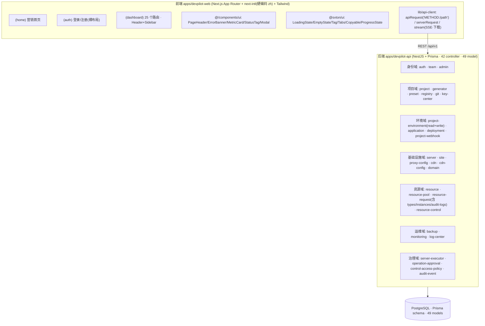
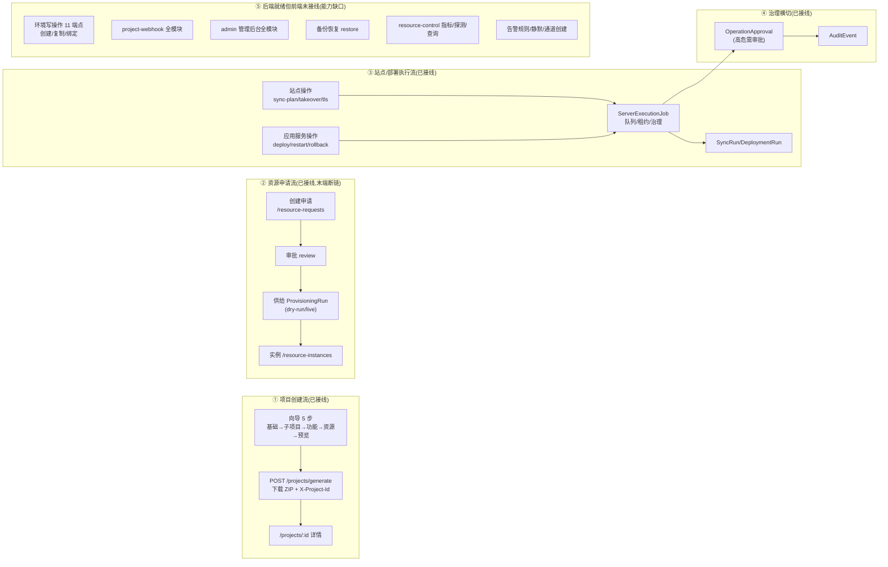
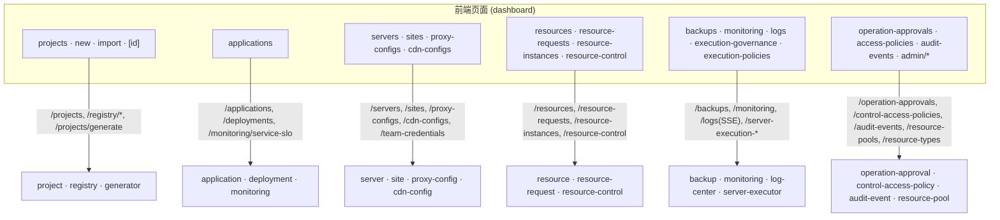

# Devpilot UI/UX 全量审计与架构地图

> 日期:2026-07-21 · 基线:`apps/devpilot-web` + `apps/devpilot-api` 实际源码 · 全部结论附文件:行号证据,无臆测。

---

## 0. 修复状态总览(2026-07-21 六个批次全部落地,tsc + next build 验证通过)

| 批次 | 范围 | 状态 |
|---|---|---|
| 一 | P0 功能缺陷:向导资源录入接线(P0-1)、step-features loading(P0-7)、团队假删除(P0-3)、团队权限失效(P0-4)、proxy 坏链(P0-6)、项目详情死面板接线+错误态(P0-2/P0-8 项目域)、导航前缀高亮+25 图标(P1-2) | ✅ 已修复 |
| 二 | 导航 6 分区重组、孤儿页 /domain /cdn 接入(P1-5)、/resources 术语统一(P1-4)、全局面包屑(P1-3)、路由三件套 loading/error/not-found(P1-3)、admin 导航角色门控(P2-10) | ✅ 已修复 |
| 三 | sonner 反馈体系+feedback 封装(P1-8)、alert/confirm 全站清零约 100 处(P1-8)、ConfirmDialog 三级确认、StatusTag+STATUS_TONE_MAP 统一(P1-10)、约 50 处硬编码色板收敛(P1-11) | ✅ 已修复 |
| 四 | use-polling-list 轮询(部署/供给/备份/告警/队列/站点,P1-7)、监控页 Tab 化+创建 UI 接线(P0-5)、sites 按钮墙收敛+聚焦面板去重(P1-12)、exec-gov 23 卡→4 聚合卡+折叠组+job 下钻(P1-12)、applications 服务行收敛、audit-events 9→4 卡+target 实体链接(P2-2 部分) | ✅ 已修复 |
| 五 | /dashboard 仪表盘首页+登录落地改向(P1-1/P1-6 残余)、备份恢复接线(GAP)、申请↔实例↔项目↔应用实体链接(P2-2)、实例 delivery 字段化、en.json 全量补译 1538+62 keys(P1-9 残余) | ✅ 已修复 |
| 六 | proxy 状态卡误用 destructive、resource-control 死数据清理、backups/logs 细节、向导跳步校验+取消出口、auth/home 整页 i18n、第三方占位按钮删除(后端无 OAuth,代码实证)、home 功能卡文案对齐真实能力、孤儿 utils 删除(P2-4 残余) | ✅ 已修复 |

**已知遗留(降级处理,不影响主链路)**:①移动端抽屉式导航(现仍为 header 折叠面板,已统一高亮)——建议后续独立迭代;②applications SLO 摘要 N+1 请求、sites sync-runs N+1(P2-5)——需后端批量接口配合,未动;③resource-requests/audit-events 无分页(P2-9)——数据量增长后需处理;④en locale 切换开关(request.ts 仍硬编码 zh,en.json 已就绪);⑤GAP 清单中环境写操作 11 端点、admin 管理后台、resource-control 指标/探测等大型能力接线——属新功能开发,建议单独立项。

---

## 1. 组织架构图(模块分层)



**关键架构事实**:ServerExecutionJob 是统一执行底座,被 SiteSyncRun / DeploymentRun / BackupRun / ResourceActionRun / LogCollectionRun / ApplicationServiceOperationRun 通过 `serverExecutionJobId` 引用;OperationApproval 与 AuditEvent 横向贯穿所有写操作。

---

## 2. 业务逻辑图(核心业务流程)



---

## 3. 数据流向图(页面 → API → 模块)



**映射核验结论**:前端所有调用均能在后端 controller 找到路由(0 个悬空调用);唯一可疑项 `domain/hooks/use-domain-config.ts:48` 调用 `/domain/certbot-script` 缺 `POST:` 前缀。反向缺口(后端有、前端无)共 18 组,详见 §6-GAP。

---

## 4. 页面结构图(路由树 + 导航可达性)

图例:✅=Sidebar 唯一入口 · 🔁=多重入口 · 🚫=孤儿页面 · 🔗=仅页面内链接可达

```
/ (home 布局: Header, 无 Sidebar)
└── /                            营销首页(登录后仍显示"登录"CTA)
(auth 布局: 裸渲染)
├── /login · /register           (第三方登录按钮无 onClick,占位)
(dashboard 布局: Header + Sidebar)  ⚠ 无 (dashboard)/page.tsx —— 无仪表盘落地页
├── 项目: /projects/new 🔁 · /projects ✅ · /applications ✅
│   ├── /projects/[id] 🔗(无返回按钮;详情态导航不高亮)
│   └── /projects/import 🔗
├── 基础设施(10 项,最重): /servers · /resource-control · /backups · /monitoring
│   · /logs · /execution-governance · /execution-policies · /sites · /proxy-configs · /cdn-configs
│   └── [id] 详情: servers/proxy-configs/cdn-configs 🔗(详情态均不高亮)
├── 资源: /resources 🔁(Header 叫"资源管理",Sidebar 叫"资源凭证") · /resource-requests · /resource-instances · /keys
├── 配置(语义混杂): /presets 🔁 · /git · /audit-events · /operation-approvals · /access-policies
├── 团队(单项分区): /teams · /teams/[id] 🔗
├── 管理: /admin/resource-pools · /admin/resource-types
├── /domain 🚫 孤儿(0 入站链接)
└── /cdn 🚫 孤儿(0 入站链接;与 /cdn-configs 功能重叠)
```

---

## 5. 功能地图(页面 → 功能卡片,标注健康度)

✅ 健康 · ⚠️ 有缺陷 · ❌ 失效/永久占位 · 💀 死代码

| 页面 | 功能卡片 | 标注 |
|---|---|---|
| /projects | 页头(导入/新建)·项目卡网格·空态引导 | ⚠️ error 被吞成空态;无搜索/筛选/分页 |
| /projects/new | 步骤指示器·5 步表单·ZIP 提交 | ❌ 第 4 步资源录入完全未接线(死输入框 step-resources-sub.tsx:106-150);❌ step-features loading 失效(:43);⚠️ 任意跳步无校验;💀 file-preview.tsx 131 行死代码 |
| /projects/import | 接入方式三选·五段表单·环境多选 | ✅ 三态最完整;⚠️ 校验仅名称非空 |
| /projects/[id] | 概览(可编辑)·环境·应用·部署·Webhook | ❌ 部署/Webhook 面板永久空态(数据从未加载,use-project-detail.ts);❌ 4 个 API 请求中 3 个无消费者;💀 3 个死组件;⚠️ 无返回按钮 |
| /applications | 指标卡×4·创建表单×2·应用卡·服务行·SLO 摘要 | ⚠️ 服务行 9 按钮墙;⚠️ SLO N+1 请求;⚠️ 12 字段表单无 label;alert() 反馈 |
| /servers(+[id]) | 列表卡·添加弹窗·测试连接·详情编辑·服务检测 | ❌ 详情页 `/proxy-configs/new?serverId=` 坏链([id]/page.tsx:94);⚠️ error 仅 console;alert() 反馈;状态圆点自绘 |
| /resource-control | 筛选×3·资源卡(动作)·动作/连接/查询 runs | ⚠️ 无下钻;无发起探测/查询入口;💀 credentials 数据+defaultCredentialProfiles 常量无消费 |
| /backups | 指标×4·计划表单·计划卡·运行侧栏 | ⚠️ runPlan 固定 dryRun,无 live 入口无说明;无恢复 restore 入口(后端有);删除/归档无路径 |
| /monitoring | 资源指标·SLO 面板·规则·事件·静默·通道 | ❌ createRule/createSilence/createChannel 已实现零引用(use-monitoring-actions.ts:105-131);❌ 投递记录无面板;无轮询 |
| /logs | 统计×4·流管理·条目·SSE Tail·策略×4·runs | ✅ 全域最强(唯一实时机制);⚠️ 单页过载无折叠;💀 ui-bits.tsx 死代码;硬编码英文 |
| /execution-governance | 治理操作×4·Supervisor 12 指标·Worker/Agent 卡·Job/Lease 表 | ⚠️ 23 张指标卡全平铺(全域最拥挤);job 无详情/日志下钻;硬编码英文最多;错误用 EmptyState 渲染 |
| /execution-policies | 指标×5·策略表单·模板卡 | ✅ CRUD 闭环完整;confirm 硬编码中文 |
| /sites | 队列开关·聚焦面板·站点卡·计划运行 | ⚠️ 单卡 10-12 个平铺按钮(全域按钮噪音之最);⚠️ N+1 请求;状态色三套体系;alert() |
| /proxy-configs(+[id]) | 表格(排序)·添加弹窗·详情·Nginx 预览 | ✅ 链路最完整;⚠️ 状态卡误用 destructive 红边([id]/components/proxy-config-view.tsx:130);alert() |
| /cdn-configs(+[id]) | Tabs(配置/凭证)·配置卡·purge 弹窗 | ✅ 健康;⚠️ provider 映射双份定义漂移风险 |
| /resources | 凭证行列表·动态 Schema 表单弹窗 | ⚠️ error 态缺失;行信息过简(无状态/无下钻);alert()/confirm() |
| /resource-requests | 状态卡×5·申请表·审批·供给 runs·治理面板 | ✅ 流转可见性好;⚠️ 手写遮罩弹层×3(无焦点管理);链路末端无跳实例链接 |
| /resource-instances | 实例卡·交付 JSON dump | ⚠️ error 缺失;`<pre>JSON.stringify</pre>` 过简;死胡同无回链 |
| /keys | 密钥卡·生成/存储弹窗 | ⚠️ 整页硬编码 blue-600/gray 色板(不走 tokens);error 静默 |
| /presets | 预设行·导入/导出·保存弹窗 | ✅ 加载→向导串联健康;⚠️ error 静默/alert |
| /git | 连接卡·仓库列表·连接弹窗 | ⚠️ 孤立标题区块(page.tsx:77-83);error 静默;断开无 confirm |
| /audit-events | 指标卡×9·筛选·事件表 | ⚠️ 9 卡噪音;事件 target 纯文本不可溯源;无分页 |
| /operation-approvals | 指标×5·筛选·审批卡 | ✅ 流转可见;⚠️ 审批意见硬编码"同意执行"不可自定义 |
| /access-policies | 指标×5·表单·策略行 | ✅ 级联过滤好;⚠️ CSV 输入门槛高 |
| /teams(+[id]) | 团队卡·成员 Tabs·设置·危险区 | ❌ 删除团队不调 API 假删除([id]/page.tsx:170-177);❌ 权限判断取任意成员角色(:71-74) |
| /admin/resource-pools | 池卡(容量进度)·表单弹窗 | ✅ 唯一处理 403;⚠️ 硬编码色板;提交失败静默 |
| /admin/resource-types | 类型表格·Schema 编辑器 | ⚠️ error 缺失;403 未处理(与 pools 不一致) |
| /login·/register | 表单卡 | ⚠️ 第三方按钮纯占位;整页硬编码中文;无忘记密码 |
| /(home) | Hero·功能卡×6·快捷入口×3 | ⚠️ 登录态不分流;文案与现有能力脱节 |

---

## 6. 问题清单(按优先级,全部附证据)

### P0 — 功能性缺陷(必须修)
| # | 问题 | 证据 |
|---|---|---|
| P0-1 | 向导第 4 步资源录入完全未接线:manual 输入框无 value/onChange,三个下拉无 onChange | `project-wizard/step-resources-sub.tsx:106-150`、`step-resources.tsx:41-99` |
| P0-2 | 项目详情页部署/Webhook 面板永久空态:deploymentRuns/webhooks 状态声明后从无加载 | `projects/[id]/hooks/use-project-detail.ts`、`deployment-panel.tsx:12`、`webhook-panel.tsx:9` |
| P0-3 | 团队详情"删除团队"只弹 confirm 跳转,从不调删除 API(假删除) | `teams/[id]/page.tsx:170-177` |
| P0-4 | 团队详情权限判断取成员列表中任意 owner/admin,myRole 几乎恒真,权限 UI 失效 | `teams/[id]/page.tsx:71-74` |
| P0-5 | 监控页创建 UI 缺失:createRule/createSilence/createChannel/retryDelivery 已实现但零引用,投递记录无面板 | `monitoring/hooks/use-monitoring-actions.ts:105-131` |
| P0-6 | servers 详情页坏链 `/proxy-configs/new?serverId=` 命中 [id]='new' 必失败 | `servers/[id]/page.tsx:94` |
| P0-7 | step-features loading bug:请求发出后同步 setLoading(false),加载门永不生效 | `project-wizard/step-features.tsx:43` |
| P0-8 | 列表 error 被伪装成空态:projects 列表/详情、servers、sites、proxy-configs 失败仅 console.error | `projects/page.tsx:34-37`、`use-servers.ts:20-21`、`use-sites.ts:77-78` 等 |

### P1 — 信息架构与状态可感知(本次重构主线)
| # | 问题 | 证据 |
|---|---|---|
| P1-1 | 无仪表盘落地页:登录后 redirect `/teams`;Logo 固定 `/` 回营销页;`nav.dashboard` 文案 0 引用 | `(dashboard)` 无 page.tsx、`header.tsx:35-40`、`redirect-path.utils.ts:1` |
| P1-2 | 活跃高亮对子路由完全失效:`pathname === item.href` 精确匹配,所有二级页面失去位置反馈 | `sidebar.tsx:29`、`header.tsx:105` |
| P1-3 | 全站无面包屑(grep `breadcrumb` 0 结果)、无 loading.tsx/error.tsx/not-found.tsx | 全库 |
| P1-4 | 同一页面多名多入口:`/resources` 在 Header 叫"资源管理"、Sidebar 叫"资源凭证";3 页三处重复入口 | `navigation-items.ts:13,44`、`HomeGreeting.tsx:26` |
| P1-5 | 孤儿页面:/domain、/cdn 无导航入口且与 /sites、/cdn-configs 功能重叠 | `(dashboard)/domain`、`(dashboard)/cdn` |
| P1-6 | 导航认知负荷:25 项纯文字无图标、基础设施分区 10 项平铺、"配置"分区混入审计/审批、团队单项分区 | `navigation-items.ts:17-71` |
| P1-7 | 全域无轮询(除 logs SSE):部署/供给/告警/队列等运行中状态必须手动刷新 | 各页 hooks(logs 除外) |
| P1-8 | 反馈体系分裂:alert()/confirm() 硬编码中文 / ErrorBanner / 静默 console 三制并存 | `use-servers.ts:43`、`use-sites.ts:105`、`use-cdn-configs.ts:52-68` 等 15+ 处 |
| P1-9 | i18n 割裂:(auth)、(home)、向导全部步骤标题、key-card、badges、exec-gov 大量硬编码中英文;en.json nav 为 null | `login/page.tsx`、`projects/new/page.tsx:16-22`、`messages/en.json` |
| P1-10 | 状态标签三套体系:StatusTag / 自绘圆点(server-card:15) / 自绘 getStatusClass(sites utils-format:86) + indigo/purple 调色板外颜色 | 多处 |
| P1-11 | 视觉体系分裂:keys、admin/resource-pools 整页硬编码 blue-600/gray 色板不走 design tokens | `KeysContent.tsx:64-72`、`pool-card.tsx` |
| P1-12 | 高密度页面:sites 单卡 10-12 按钮、exec-gov 23 指标卡、applications 服务行 9 按钮、audit-events 9 卡 | 见功能地图 |

### P2 — 交互路径与一致性
| # | 问题 | 证据 |
|---|---|---|
| P2-1 | 详情页返回缺失/语义错误:projects/[id] 无返回;其余详情返回一律 push 列表而非 back() | `projects/[id]/page.tsx:24-36` 等 |
| P2-2 | 跨页断链:项目↔应用双向断链;申请→实例、审计→目标、实例→密钥均不可跳转 | `application-card.tsx:48`、`event-table.tsx:70-84` |
| P2-3 | 弹窗两套实现:全局 Modal vs resource-requests 三个手写遮罩(无焦点陷阱/ESC) | `create-request-modal.tsx:23-28` 等 |
| P2-4 | 死代码:file-preview.tsx、ResourceCopyFollowUpPanel、SiteCopyFollowUpPanel、ConfigProfileMetric、logs/ui-bits.tsx | grep 0 引用确认 |
| P2-5 | N+1 请求:applications SLO 按服务逐个请求;sites 每站点一次 sync-runs | `use-application-service-slos.ts:39-61`、`use-sites.ts:69-75` |
| P2-6 | auth 布局裸渲染无出口;登录页第三方按钮占位;无忘记密码 | `(auth)/layout.tsx:2`、`login/page.tsx:106-125` |
| P2-7 | 登录页 Header 主链接无活跃态样式;TeamSwitcher 加载期 Header 布局跳动 | `header.tsx:48`、`team-switcher.tsx:47` |
| P2-8 | 移动端导航层级反转:菜单按钮在 Header 最底部,25 项塞 grid-cols-2 下拉 | `header.tsx:76-118` |
| P2-9 | 无分页:resource-requests、audit-events 全量加载;表格 min-w 1040px 横滚 | `use-audit-events.ts:36-44` |
| P2-10 | admin 导航无权限门控,403 处理仅 resource-pools 有 | `navigation-items.ts:64-70` |

### GAP — 后端就绪但前端未接线(产品能力缺口,18 组)
环境写操作 11 端点 · project-webhook 全模块 · admin 管理后台全模块 · 备份恢复 restore · resource-control 指标/探测/查询/绑定 · 告警规则/静默/通道创建(P0-5)· 资源池分配/我的配额 · 部署重试/冒烟/失败回滚变体 · 应用/服务编辑删除 · 密钥编辑/项目级生成导出 · registry 11 端点仅用 3 · git 建仓/推送 · 代理配置编辑 PUT · 删除项目 DELETE · 资源审计日志页 · 预设编辑 PUT · SLO 模板/规则编辑 · generator preview/二次下载
