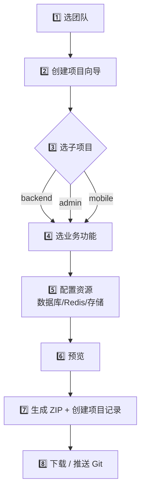
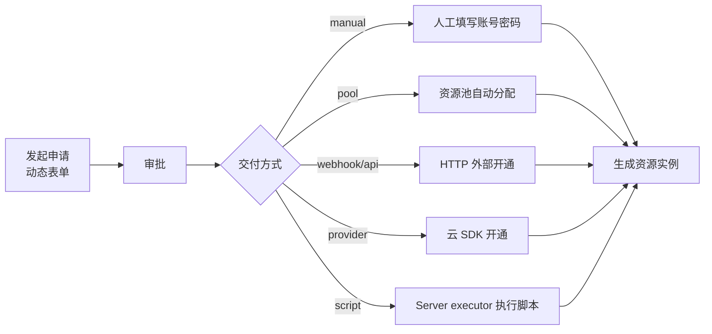
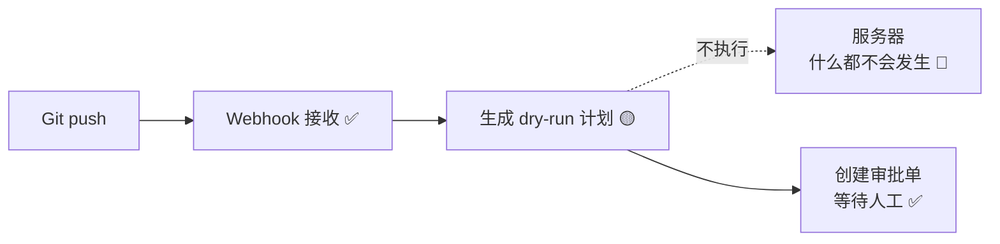

# Devpilot 使用指南

> 项目初始化与资源管控平台 · 面向新用户 · 5 分钟上手

---

## 关于本指南里的「图」

本指南中的图都是**结构示意**（流程图、布局框图、状态表格），用来帮你一眼看清"在哪点、怎么走、什么状态"。
真实界面的截图建议你后续替换到 `docs/devpilot/images/` 目录下，文中已预留位置。

功能状态图例：

| 标记 | 含义 |
|------|------|
| ✅ **可用** | 当前就能完整使用 |
| 🟡 **部分可用** | 主流程能用，部分能力是模拟或待补 |
| 🔧 **开发中** | 已有骨架/界面，真实执行待补 |
| 🔒 **需开启** | 代码完整，但默认关闭，需配置环境变量才能用 |

---

## 一、Devpilot 是什么

Devpilot 是一个**研发与运维控制平面**：你在这里创建项目、管理开发资源、配置服务器和站点，把"代码变更 → 部署上线 → 监控运维"串成一条可追踪的闭环。


**一句话定位**：以前你需要在 5 个工具之间切换才能上线一个项目，现在 Devpilot 把它们收拢到一个界面里。

---

## 二、登录与团队

### 2.1 进入系统

打开 Devpilot 后台地址（本地预览通常是 `http://localhost:43100`）：

```
┌─────────────────────────────────────────┐
│              Devpilot                    │
│      登录到 Devpilot                      │
│                                         │
│   邮箱:    [_____________________]       │
│   密码:    [_____________________]       │
│                                         │
│          [    登录      ]                │
│                                         │
│   还没有账号? 注册                       │
│                                         │
│   或使用第三方登录                       │
│   [ GitHub ]  [ GitLab ]  [ Gitee ]     │
└─────────────────────────────────────────┘
```

- ✅ **可用**：邮箱密码注册/登录、GitHub/GitLab/Gitee 第三方登录
- 第一次使用：点「注册」→ 填邮箱密码 → 注册成功后自动登录

### 2.2 团队切换器（顶部左上角）

Devpilot 里**所有项目和资源都按团队隔离**。你看到的数据只属于当前选中的团队。

```
┌──────────────────────────────────────────────────┐
│ Devpilot  ▼ 我的团队        创建项目 资源管理 ...  │  ← 顶部 Header
├──────────────────────────────────────────────────┤
│ [团队切换器] 点击下拉:                            │
│   我的团队                                        │
│     • 团队 A   [当前]                             │
│     • 团队 B                                      │
│     + 创建新团队                                  │
│     ⚙ 管理团队                                    │
└──────────────────────────────────────────────────┘
```

- ✅ **可用**：创建团队、切换团队、跳转团队管理
- ⚠️ **重要**：做任何操作前，先确认左上角选中的是你想要的团队，否则数据会建到错误的团队下

---

## 三、界面布局总览

登录后的主界面是标准的「顶栏 + 左侧导航 + 主内容区」三栏结构：

```
┌─────────────────────────────────────────────────────────────┐
│ [Logo] [▼团队]    创建项目  资源管理  配置预设    [用户名 ▾]   │ ← 顶栏 Header
├──────────┬──────────────────────────────────────────────────┤
│ 项目     │                                                  │
│  创建项目 │                                                  │
│  我的项目 │                                                  │
│  应用服务 │             主内容区                              │
│ 基础设施  │         （当前页面的表单、列表、详情）             │
│  服务器   │                                                  │
│  ...      │                                                  │
│ 资源      │                                                  │
│ 配置      │                                                  │
│ 团队      │                                                  │
│ 管理员    │                                                  │
└──────────┴──────────────────────────────────────────────────┘
```

左侧导航共 **6 大组**，下面逐组介绍。

---

## 四、快速上手：创建你的第一个项目（5 分钟）

这是 Devpilot 的**核心流程**，也是你最常做的事。跟着走一遍：



| 步骤 | 操作位置 | 你要做什么 |
|------|---------|-----------|
| 1 | 顶栏团队切换器 | 确认当前团队正确 |
| 2 | 侧边栏 → **创建项目**（`/projects/new`） | 填项目名、组织名、描述、包管理器 |
| 3 | 向导内 | 勾选子项目：**backend / admin / mobile** |
| 4 | 向导内 | 勾选业务功能：缓存、限流、队列、对象存储、短信、OAuth、支付、权限 |
| 5 | 向导内 | 配置资源：手动填写 / 选已有凭证 / 资源池分配 / 跳过 |
| 6 | 向导内 | 预览依赖、目录结构、`.env`、生成文件 |
| 7 | 点「生成」 | 后端生成 ZIP、写 Project 记录、返回项目 ID |
| 8 | 项目详情页 | 下载 ZIP / 推送到 Git 仓库 |

### 状态说明

- ✅ **项目向导**：完整可用，UI 流程顺
- ✅ **生成 ZIP + 项目记录**：能下载、能在「我的项目」看到
- 🟡 **推送 Git**：能配置 GitHub/GitLab/Gitee token，但向导内的「一键发布闭环」还在打磨
- 🟡 **资源联动**：生成时能消费你填的凭证，但「资源池自动开通真实数据库」仍是模拟

> 💡 **验收小贴士**：生成的 ZIP 解压后跑 `pnpm install && pnpm type-check` 应该能通过。这是衡量"生成是否成功"的最快方式。

---

## 五、功能模块详解

下面按侧边栏的 6 大组逐个说明。每个模块给出：**用途 / 怎么用 / 当前状态**。

### 📦 第一组：项目

| 菜单 | 路径 | 用途 | 状态 |
|------|------|------|------|
| **创建项目** | `/projects/new` | 项目向导（见第四节） | ✅ 可用 |
| **我的项目** | `/projects` | 项目列表、详情、编辑、删除 | ✅ 可用 |
| **应用服务** | `/applications` | 项目下可部署的服务视角 | 🟡 最小闭环 |

**「我的项目」详情页能看到什么**：

```
项目详情
├── 基本信息（名称、组织、描述）
├── 生成配置快照（你向导里选了啥）
├── 关联环境（dev / test / staging / prod）
├── 关联资源（数据库、Redis、密钥）
├── 下载 ZIP（带有效期，过期需清理）
└── 跨环境同步建议（哪些环境还缺资源）
```

**应用服务** 🟡：能把项目拆成 `Application / Service`，挂到环境、服务器、站点。但**真实日志流、指标详情、Secret 注入**还在开发中。

---

### 🖥️ 第二组：基础设施

这是运维的主战场，模块最多。

| 菜单 | 路径 | 用途 | 状态 |
|------|------|------|------|
| **服务器管理** | `/servers` | SSH 服务器登记、连通性测试 | 🟡 |
| **资源管控** | `/resource-control` | Docker / MySQL / Redis / RDS / COS 清单与只读查询 | 🟡 |
| **备份计划** | `/backups` | 数据库/Redis 备份计划 | 🔧 |
| **监控告警** | `/monitoring` | 告警规则、事件、通知、SLO | 🟡 |
| **日志中心** | `/logs` | 日志归档、SSE 实时 tail、查询 | 🟡 |
| **执行治理** | `/execution-governance` | 执行任务、队列、Supervisor 状态 | 🟡 |
| **执行策略** | `/execution-policies` | SSH 命令白名单策略 | ✅ |
| **站点管控** | `/sites` | Nginx/OpenResty 配置、TLS 证书 | 🟡 |
| **代理配置** | `/proxy-configs` | Nginx upstream/server 配置生成 | 🟡 |
| **CDN 配置** | `/cdn-configs` | CDN 凭证、域名、缓存规则 | 🟡 |

#### 重点模块怎么用

**服务器管理** 🟡
登记一台服务器：填 IP、端口、SSH 用户、认证方式（推荐 key）→ 点「测试连通」。连通性测试是真的，但**服务检测目前是模拟数据**。

**资源管控** 🟡
连接 Docker / MySQL / Redis / 阿里云 RDS / SLS / 腾讯 COS，能看清单、做连接探测、跑**只读查询**。
- ✅ 真能连：Docker 容器、MySQL/Redis 只读查询、RDS/SLS/COS inventory
- 🔧 待补：写操作、完整结果表格

**监控告警** 🟡
配置 `AlertRule`（阈值/burn-rate/错误预算）→ 设 `AlertSilence` 静默 → 配通知通道（Webhook / 飞书 / 钉钉 / 企微 / 邮件）。资源指标大盘、服务 SLO 大盘都能看。
- 🔧 待补：真实多周期错误预算策略

**日志中心** 🟡
建日志流 → SSE 实时 tail（带断线重连、cursor 续传）→ 级别统计、错误告警。SLS 凭据-backed live 查询可用。
- 🔧 待补：agent 级持续 follow（现在的 follow 是定时拉取）

**站点管控** 🟡
这是最复杂的模块。一个 `Site` 承载：Nginx/OpenResty 同步、配置 diff、Smoke 检查、配置快照回滚、TLS 证书生命周期。

```
站点生命周期：
配置 draft → [审批+确认] → live 同步到服务器 → Smoke 检查
                ↑                                      ↓
                └──── 配置快照回滚 ←─── 失败告警 ←────┘
```

- ✅ Nginx 配置预览、配置 diff、配置快照
- 🔒 **live 同步 / reload / TLS 续期**：代码完整，但默认关闭，需配 `SERVER_EXECUTOR_LIVE_ENABLED=true` + 审批 + 确认文本（见第八节）
- 🔧 待补：证书库上传绑定、真实环境 smoke 自动化

**执行治理** 🟡
看所有 `ServerExecutionJob`（部署、同步、备份、资源动作都走这里）。能看到队列积压、lease 并发、Supervisor 状态、agent readiness。
- 🔧 待补：真实 server-agent 长连接、多实例协调

> ⚠️ **关于「代理配置」和「CDN 配置」**：侧边栏里 `/proxy-configs` 和老的 `/domain`、`/cdn` 和 `/cdn-configs` 有功能重叠，规划上会收敛到「站点管控」和「CDN 配置」。建议新用户优先用 **站点管控** 和 **CDN 配置**。

---

### 🔐 第三组：资源

| 菜单 | 路径 | 用途 | 状态 |
|------|------|------|------|
| **资源凭证** | `/resources` | 团队级 MySQL/PG/Redis/Kodo/短信连接配置 | ✅ |
| **资源申请** | `/resource-requests` | 申请资源（动态表单 + 审批 + 交付） | 🟡 |
| **资源实例** | `/resource-instances` | 已交付的资源实例、释放 | ✅ |
| **密钥中心** | `/keys` | 项目密钥生成、保存、导出 | 🟡 |

#### 动态资源申请（推荐用法）

Devpilot 不把资源类型写死。你可以申请任意资源类型，每种类型有自己的表单和交付方式：



| 交付方式 | 状态 | 说明 |
|---------|------|------|
| `manual` 人工交付 | ✅ | 审批后填账号密码，创建实例 |
| `pool` 资源池分配 | 🟡 | 能分配，但**真实开通数据库/Redis 是模拟** |
| `webhook` / `api` | 🔧 | 默认关闭，HTTP adapter 边界完整但默认不调真实接口 |
| `provider` 云 SDK | 🔧 | 默认 dry-run 生成 plan，真实 Aliyun/Tencent SDK transport 待补 |
| `script` 脚本执行 | 🔧 | 走 Server executor，依赖 live 开关 |

**密钥中心** 🟡：生成、保存、查看都有，但和 Git 发布、真实 provider 的完整密钥注入闭环还在开发中。

---

### ⚙️ 第四组：配置

| 菜单 | 路径 | 用途 | 状态 |
|------|------|------|------|
| **配置预设** | `/presets` | 保存向导配置，下次复用 | ✅ |
| **Git 连接** | `/git` | GitHub/GitLab/Gitee token 管理 | ✅ |
| **审计事件** | `/audit-events` | 所有敏感操作的审计日志 | ✅ |
| **操作审批** | `/operation-approvals` | live 部署/同步等高风险操作审批 | ✅ |
| **访问策略** | `/access-policies` | 团队/项目级 RBAC | 🟡 |

- ✅ **配置预设**：向导配一半可以存预设，下次直接载入，也支持导入导出
- ✅ **Git 连接**：token 加密存储，能列仓库、建仓库、推文件
- ✅ **审计事件**：密钥读取、Git token 使用、服务器凭证使用都有记录
- 🟡 **访问策略**：覆盖了主要读写接口，但更细的项目/环境级 RBAC、e2e 权限用例待补

---

### 👥 第五组：团队

| 菜单 | 路径 | 用途 | 状态 |
|------|------|------|------|
| **团队管理** | `/teams` | 成员、角色（owner/admin/member）、邀请 | ✅ |

完全可用。三种角色的权限边界：

| 角色 | 能做什么 |
|------|---------|
| **owner** | 一切：删团队、改成员角色 |
| **admin** | 管项目、资源、服务器、密钥 |
| **member** | 查看项目、查看资源、用项目初始化 |

---

### 🛠️ 第六组：管理员（仅平台管理员）

| 菜单 | 路径 | 用途 | 状态 |
|------|------|------|------|
| **资源池管理** | `/admin/resource-pools` | 系统级数据库/Redis/Nginx/CDN 池 | 🟡 |
| **资源类型** | `/admin/resource-types` | 动态资源类型定义（schema 编辑） | ✅ |

**资源类型** ✅：这是 Devpilot 灵活性的核心。管理员可以新增资源类型，用可视化字段编辑器定义「申请表单 schema」「交付表单 schema」「环境变量模板」「敏感字段」。后端启动时已内置默认类型：MySQL、Redis、服务器、端口、域名、Git 账号、云厂商账号等。

**资源池** 🟡：CRUD 和分配/释放接口都有，分配记录含 teamId/projectId/userId，但**真实开通是模拟**。

---

## 六、发布上线链路：能用吗？

这是你最关心的。**一句话：代码完整，但默认是「安全沙箱」状态，开箱只跑 dry-run。**

### 默认行为（开箱即用）



- ✅ Webhook 能接收 GitHub/GitLab/Gitee 事件
- 🟡 默认 `deploymentMode=dry_run`，只生成计划
- 🔴 live transport 默认 blocked，服务器上无任何副作用
- ✅ 所有 live 操作强制人工审批（安全设计）

### 要真实部署，需要满足

| 条件 | 如何配置 |
|------|---------|
| 1. 开启 live transport | `.env` 设 `SERVER_EXECUTOR_LIVE_ENABLED=true` |
| 2. 开启队列 worker（用队列时） | `SERVER_EXECUTOR_QUEUE_WORKER_ENABLED=true` |
| 3. 服务器用 SSH key 认证 | password auth 会被 block |
| 4. webhook 配 `live_request` | 仍需人工审批，无自动 live |
| 5. 通过审批 + 输入确认文本 | 确认文本 = 项目名 |
| 6. 服务器上构建命令就绪 | Devpilot 不做平台侧镜像构建，是远端 `git pull` + 你的 build/deploy 脚本 |

详细配置见**第八节**。

> ⚠️ **安全前置**：在把 webhook 暴露到公网前，必须先修复签名校验漏洞（见第九节）。

---

## 七、能力总览速查表

按「能不能现在就用」排序，方便你快速判断。

### ✅ 现在就能完整用

- 注册登录、团队管理、成员角色
- 项目创建向导、生成 ZIP、项目记录、配置预设
- 资源凭证 CRUD、密钥生成、Git 连接
- 动态资源类型管理、资源申请（人工交付）、资源实例
- 审计事件、操作审批、执行策略
- 日志归档与 SSE 实时 tail
- 监控告警规则、通知通道、SLO 大盘

### 🟡 主流程能用，部分待补

- 应用服务（缺真实日志流/指标详情）
- 服务器管理（连通性测试真，服务检测模拟）
- 资源管控（只读查询真，写操作缺）
- 站点管控（Nginx 预览真，live 同步需开启）
- 备份计划（dry-run 真实，真实备份待补）
- 访问策略（主接口覆盖，细粒度 RBAC 待补）

### 🔧 开发中（代码骨架在，真实执行待补）

- **真实发布链路**：live 部署、真实 Git 发布闭环
- **资源池真实开通**：数据库/Redis 自动创建
- **云 provider SDK**：Aliyun/Tencent 真实 transport
- **server-agent runtime**：长连接、任务拉取、多实例协调
- **证书库**：上传、私钥存储、绑定
- **真实备份恢复**：恢复演练、备份失败告警

### 🔒 默认关闭，需配置

- SSH live 执行（`SERVER_EXECUTOR_LIVE_ENABLED`）
- 队列 worker（`SERVER_EXECUTOR_QUEUE_WORKER_ENABLED`）
- 自动回滚 / Smoke 调度器
- TLS 续期调度器（且默认 `--dry-run`）

---

## 八、附录：开启真实部署的最小配置

> 仅用于**测试环境验证**。生产环境请先读完第九节的安全须知。

```bash
# apps/devpilot-api/.env
SERVER_EXECUTOR_LIVE_ENABLED=true         # SSH live adapter 命中
SERVER_EXECUTOR_QUEUE_WORKER_ENABLED=true # queued job 被消费
ENCRYPTION_KEY=<32位随机字符串>            # 必改！默认是硬编码值
# 可选：自动化治理
DEPLOYMENT_AUTO_ROLLBACK_SCHEDULER_ENABLED=true
SITE_TLS_RENEW_SCHEDULER_ENABLED=true
SITE_TLS_RENEW_SCHEDULER_DRY_RUN=false
```

验证步骤：

1. 登记一台测试服务器（SSH key 认证，`/servers`）
2. 配 Git 连接（`/git`），webhook 设 `live_request`
3. push 代码 → 进「操作审批」人工批准 → 输入项目名确认
4. 进「执行治理」看 job 是否真实执行
5. 进「站点管控」配 Nginx，走审批 → 确认 live 同步

---

## 九、⚠️ 上公网前必须修复的安全项

以下问题在当前代码中确实存在，**暴露 webhook 到公网前必须处理**：

| 问题 | 位置 / 说明 | 风险 |
|------|------------|------|
| **未签名请求可绕过校验** | `project-webhook.service.ts` 校验时，请求完全不带签名头返回 `missing`，而代码只拒绝 `invalid`，`missing` 放行 | 任何人都能伪造 webhook 触发部署计划 |
| **加密 key 硬编码默认值** | `ENCRYPTION_KEY` 未配置时回退到 `'default-32-char-encryption-key!'` | 所有加密的 secret/token 形同明文 |
| **原生签名无重放保护** | GitHub/GitLab 签名路径不要求时间戳，无重放窗 | 截获的请求可被重放 |

**最低修复**：配一个强随机 `ENCRYPTION_KEY`，并让 webhook 校验对 `missing` 也拒绝（或强制要求签名头）。

---

## 十、遇到问题怎么办

| 现象 | 排查方向 |
|------|---------|
| 看不到任何数据 | 顶栏左上角团队切换器，确认选对了团队 |
| 生成 ZIP 后 `type-check` 失败 | 检查向导里选的子项目和业务功能组合是否兼容 |
| live 部署一直 blocked | 确认 `.env` 里 live 开关、队列 worker 开关都开了 |
| 服务器连通测试失败 | 确认 SSH 用 key 认证（password 会被 block）、网络可达 |
| 站点 live 同步没反应 | 同步是强制审批 + 确认文本（=站点名），先去「操作审批」 |
| webhook 触发了但没部署 | 默认是 dry-run，要 live 需配 `live_request` + 审批 |

---

**版本**：本指南基于 2026-07-03 的代码状态。功能随开发推进会持续更新，最新进度见 `docs-internal/devpilot/requirements-and-progress.md`。
