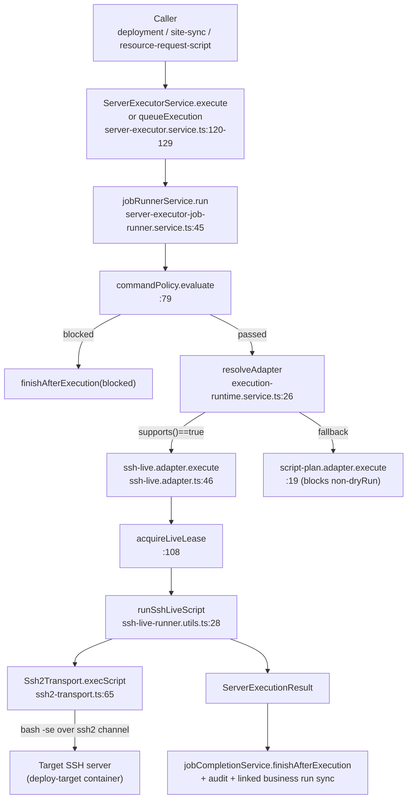
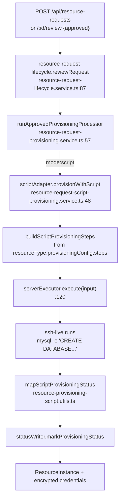
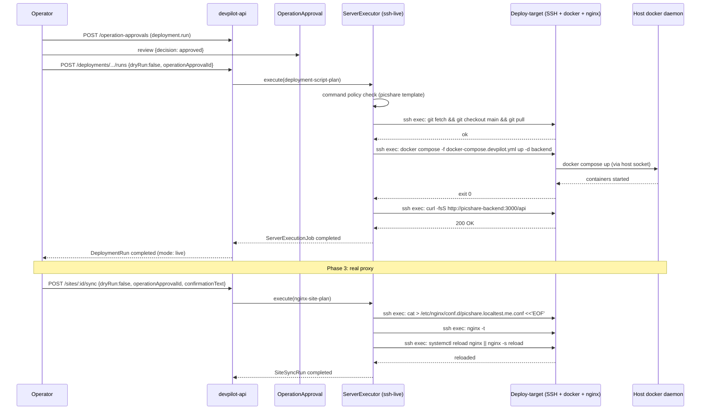

# Devpilot Real Data-Plane — Investigation (picshare target)

Date: 2026-07-22
Scope: determine, line-by-line, what it takes to make devpilot **actually** manage
and deploy picshare — i.e. real MySQL/Redis provisioning (working credentials),
real `git fetch → build → deploy` execution on a target server, real nginx
proxy config write + reload — all traceable through devpilot's API/UI with no
out-of-band `docker run`.
Investigator: invest subagent. Read-only. No code modified, no Docker state changed.

All paths are absolute under `/Users/zhaoxingbo/Workspace/ai-driven/svton` unless a
`picshare/` prefix is used (then under `/Users/zhaoxingbo/Workspace/ai-driven/picshare`).
Every claim cites `file:line`.

Companion docs (do not duplicate — this doc focuses on the **data plane**):
- `docs/todos/2026-07-22-picshare-full-integration-investigation.md` (metadata wiring)
- `docs/todos/2026-07-22-picshare-deployment-investigation.md` (deployment dry-run evidence)
- `docs/todos/2026-07-22-picshare-deployment-plan.md` (Phase 1 dry-run plan)

---

## 0. Executive summary (20 lines)

1. **Config+data only is NOT enough.** Real deployment + real provisioning + real
   proxy reload all require code changes (or infra workarounds with their own
   frictions). The single biggest blocker is that the only **working** live
   execution adapter (`ssh-live`) requires **key-based SSH auth** and the staging
   SSH target (`devpilot-g003-ssh-server`) is configured for **password auth** —
   so the adapter hard-blocks it (`ssh-live.adapter.ts:92-98`).
2. **3 code blockers** stand between "dry-run + fake credentials" and "real":
   (a) `ProxyConfig.sync()` is a stub that only flips DB status
   (`proxy-config.service.ts:240-272`); (b) pool provisioning fabricates
   credentials without touching MySQL (`resource-pool-provisioning.service.ts:29-72`);
   (c) an **env var name bug** — schema defines
   `RESOURCE_REQUEST_PROVISIONING_HTTP_ENABLED` (`env.schema.ts:137`) but the code
   reads `RESOURCE_PROVISIONING_HTTP_ENABLED`
   (`resource-request-http-provisioning.service.ts:63`,
   `resource-request-provisioning.service.ts:166`). The schema-named env will do
   nothing.
3. **Count of code changes for a full real flow:** ~5 files, ~250-400 LoC
   (ssh-live password support OR a key-seeded ssh server; pool-provisioning real
   impl; proxy-config real write; env name fix). Plus 1 infra change (SSH key
   seeding / new proxy target).
4. **Recommended Phase 1 (minimum viable real deployment):** focus on
   **real execution only** (skip real provisioning and real proxy for now) —
   flip `SERVER_EXECUTOR_LIVE_ENABLED=true`, seed an SSH key into the staging
   `openssh-server` container (or bring a new one with key auth), store the key
   as a devpilot Server's credentials, then issue a non-dryRun DeploymentRun
   that runs `docker compose up -d` on the SSH target. This proves the live
   pipeline end-to-end with ~0 LoC of code (only data + 1 small infra/Dockerfile
   change for key auth).
5. **Recommended Phase 2 (real provisioning):** fix the env-var-name bug (1-line)
   OR switch picshare's ResourceType to `mode:script`/`mode:pool`-real. Cheapest
   real-credentials win is **mode:api against the staging `fake-provider`** after
   the env-name fix — it returns `root`/real endpoint to a live MySQL on the
   staging network (`docker-compose.devpilot-staging.yml:188-213`).
6. **Recommended Phase 3 (real proxy reload):** make `ProxyConfig.sync()` write
   the rendered config to the proxy server via server-executor (it already has
   the rules — `nginx-site-plan` adapter allows `cat > /etc/nginx/conf.d/...`,
   `nginx -t`, `systemctl reload nginx` — see §C). Or repurpose `virtual-nginx`
   with a bind-mounted `conf.d` and run site-sync against it.
7. **Traceability:** every live execution creates a `ServerExecutionJob`,
   `DeploymentRun`/`SiteSyncRun`/`ResourceProvisioningRun`, an audit event, and
   (optionally) an `OperationApproval`. All queryable from the UI. The data
   plane is fully observable once enabled.
8. **OperationApproval is unavoidable for non-dryRun deploy/site-sync**
   (`deployment.service.ts:1922-1924`,
   `site-operation-policy.utils.ts:31-33`). It cannot be auto-approved in code;
   the requester must call `POST /api/operation-approvals/:id/review` with a
   second identity (or the same owner). Plan for this in any automation.
9. **Genuine blocker for Phase 1:** none that is "code-required" if we accept
   seeding an SSH key into the openssh-server container (an infra/data step,
   not a code change). The other blockers (provisioning, proxy) are Phase 2/3.

The rest of this document substantiates each of these with `file:line`.

---

## 1. Current state (every closed gate, verified)

### 1.1 Server-executor data plane

| Gate | Where | Default | Effect |
|---|---|---|---|
| Live execution master switch | `env.schema.ts:141` (`SERVER_EXECUTOR_LIVE_ENABLED`) | `false` | When off, `ssh-live.adapter.ts:42`'s `supports()` returns false for every non-dryRun input; the runtime falls through to `script-plan.adapter.ts:51-81` which returns `status:'blocked'` |
| Queue worker | `env.schema.ts:142` (`SERVER_EXECUTOR_QUEUE_WORKER_ENABLED`) | `true` | On by default — not a blocker, just the polling loop |
| Server agent transport | `env.schema.ts:153-162` (`SERVER_EXECUTOR_AGENT_*`) | all `false` | The `server-agent` adapter only matches when `target.transport==='server_agent'`, which itself requires `SERVER_EXECUTOR_AGENT_TARGET_ENABLED=true` AND a healthy agent heartbeat (`server-executor-target-resolution.service.ts:39-56`). Off → never selected. |
| OperationApproval required for non-dryRun deploy | `deployment.service.ts:1922-1924` | always | Non-dryRun deploy creates a pending approval and refuses to execute until reviewed (`site-sync-execution.service.ts:80`, `operation-approval-requirement.service.ts:34`) |
| Confirmation text required for site.sync/rollback/tls_renew | `site-operation-policy.utils.ts:35-37`, `ssh-live.adapter.ts:57-67` | always | Caller must pass `confirmationText === site.name` or live adapter blocks |

Verified runtime state: the prior investigation
(`docs/todos/2026-07-22-picshare-deployment-plan.md:20-23`) confirmed the
`devpilot-app-api` container has NONE of the `SERVER_EXECUTOR_*` envs set.

### 1.2 Resource-provisioning data plane

| Gate | Where | Default | Effect |
|---|---|---|---|
| HTTP provisioning switch (schema name) | `env.schema.ts:137` (`RESOURCE_REQUEST_PROVISIONING_HTTP_ENABLED`) | `false` | **BUG:** the code reads `RESOURCE_PROVISIONING_HTTP_ENABLED` (without `_REQUEST`) — see `resource-request-http-provisioning.service.ts:63` and `resource-request-provisioning.service.ts:166`. Setting the schema-named env has NO effect. |
| HTTP provisioning switch (code-read name) | `resource-request-http-provisioning.service.ts:62-64` | `false` (fallback) | Even setting `RESOURCE_PROVISIONING_HTTP_ENABLED=true` works, but the env is undocumented in `env.schema.ts` so it won't be validated. |
| HTTP queue switch | `env.schema.ts:138` (`RESOURCE_REQUEST_PROVISIONING_HTTP_QUEUE_ENABLED`) | `false` | When off, HTTP provisioning runs inline (not via the resource-request queue worker). |
| Pool provisioning is fake | `resource-pool-provisioning.service.ts:29-72` | always | Generates `user_<name>` + random hex password and returns; **never connects to MySQL**. The pool's `adminConfig` is decrypted but only read for redis password reuse (line 62-66). |
| Pool provisioning is the only mode that returns credentials synchronously | `resource-request-provisioning.service.ts:69-71` | always | `mode:'pool'` always returns completed credentials; `mode:'webhook'|'api'|'provider'` only run for real if HTTP enabled (see above); `mode:'script'` runs through server-executor (gated by live flag); `mode:'manual'|'credential_only'` are no-ops. |

### 1.3 Proxy/domain data plane

| Gate | Where | Default | Effect |
|---|---|---|---|
| `ProxyConfig.sync()` writes nothing to disk | `proxy-config.service.ts:240-272` | always | Method just sets `status:'active'` + `lastSyncAt` in DB and returns the rendered nginx text in the response body. Comment at line 254-255: "简化版：只更新状态 / 实际实现需要通过 SSH 写入配置文件并重载 Nginx". |
| `DomainService` is a pure text generator | `domain.service.ts:1-151` | always | `generateNginxConfig` returns a string. No DB write, no DNS, no SSH. The whole `domain/` module has no provisioning side-effects. |
| Site sync IS real (if executor live) | `site-sync-execution.service.ts:74-110`, `site-sync-plan.utils.ts:105-118` | gated by executor | Unlike `ProxyConfig.sync()`, `Site` sync submits a real `nginx-site-plan` server-executor job that writes `/etc/nginx/conf.d/<domain>.conf` via heredoc, runs `nginx -t`, and `systemctl reload nginx || nginx -s reload`. So **the path for real proxy config already exists** — it just needs the live executor + a reachable nginx target. |

### 1.4 Backup data plane

| Gate | Where | Default | Effect |
|---|---|---|---|
| Backup live execution | `backup.service.ts:168` (per problem statement) | gated | Not re-investigated in depth; same `SERVER_EXECUTOR_LIVE_ENABLED` gate applies. Out of scope for this doc (picshare backup is Phase 3+). |

---

## 2. Server-executor deep dive (A)

### 2.1 The execution pipeline (end-to-end)

Entry points (all funnels into the same core):

- **Direct/inline:** `ServerExecutorService.execute()` → `submissionService.execute()` → `jobRunnerService.run()` (`server-executor.service.ts:120-122`, `server-executor-submission.service.ts:13-16`).
- **Queued:** `ServerExecutorService.queueExecution()` → `submissionService.queueExecution()` enqueues a `ServerExecutionJob` row; the polling worker (`server-executor-queue-worker.service.ts:26-44`, started in `onModuleInit` at `server-executor.service.ts:104-106`) picks it up and runs the same `jobRunnerService.run()`.
- **Site sync:** `site-sync-execution.service.ts:122-149` (queued) / `:132-149` (direct).
- **Deployment:** `deployment.service.ts:426-444` (queued) / direct path nearby.
- **Resource provisioning (script mode):** `resource-request-script-provisioning.service.ts:114-133`.

Per-job lifecycle (`server-executor-job-runner.service.ts:45-177`):
1. Create cancellation token + register with running-cancellation registry (`:51-52`).
2. Start job heartbeat (renews the queue lock every `SERVER_EXECUTOR_QUEUE_HEARTBEAT_SECONDS`, default 30) (`:53-55`).
3. Attach runtime observer (captures remote PID for later kill) (`:56-57`).
4. **Evaluate command policy** (`:79`). If blocked → finish as blocked (`:80-90`).
5. **Resolve adapter** by `adapter.supports(input)` (`execution-runtime.service.ts:26-36`, called at `:99`).
6. **Acquire live lease** (`:108-119`). One lease per (team, target) — serialises concurrent live ops against the same server.
7. **Run `adapter.execute(leasedInput)`** (`:142`).
8. **Release lease** + write final `ServerExecutionJob` status + audit (`:143-157`).
9. On throw: release lease as `failed`, fail job, sync linked business run (`:159-171`).

Adapter resolution order (in the runtime's `adapters` array,
`server-executor-execution-core-factory.service.ts:70-76`):

```
[ sshLiveAdapter, serverAgentAdapter?, scriptPlanAdapter ]
```

First adapter whose `supports()` returns true wins.

### 2.2 Adapter-by-adapter behaviour

#### 2.2.1 `script-plan` (fallback) — `adapters/script-plan.adapter.ts`

- `supports()`: `transport==='ssh' || transport==='none'` (`:15-17`).
- `execute()`:
  - If `cancellationToken` requested → cancelled result (`:24-49`).
  - **If `!input.dryRun` → returns `status:'blocked', mode:'blocked_live_execution'`** (`:51-81`). This is the source of every "blocked by script-plan adapter" message. Comment at `:60`: "真实 Server executor transport 尚未启用，当前只生成受控脚本计划。"
  - If `dryRun` → completed (or blocked if `blockOnWarnings` and warnings exist) (`:83-115`).

So when live is OFF, every non-dryRun execution lands here and is blocked —
this is the master off-switch behaviour.

#### 2.2.2 `ssh-live` — `adapters/ssh-live.adapter.ts`

- `supports()`: `transport==='ssh' && dryRun===false && SERVER_EXECUTOR_LIVE_ENABLED==='true'` (`:38-44`).
- `execute()`:
  1. Cancellation check (`:53-55`).
  2. Confirmation-text check — if `requiredConfirmationText` set and mismatched → blocked (`:57-67`).
  3. Executable check — empty required commands or warnings → blocked (`:69-76`).
  4. **`serverId` must be set** (`:78-85`).
  5. **Decrypt credentials via `serverService.getDecryptedCredentials`** (`:87-90`).
  6. **`credentials.authType` MUST equal `'key'`** — otherwise blocked with "SSH live adapter 当前仅支持 key auth；password auth 请使用 server agent 或补充受控密码 transport" (`:92-98`). **This is Gate A.**
  7. `runSshLiveScript(...)` — opens an ssh2 session, feeds a wrapped bash script, collects stdout/stderr/exitCode, observes a remote PID marker for cancellation, and can kill the remote process tree on cancel/timeout (`ssh-live-runner.utils.ts:28-132`).
- `cleanupRemoteExecutionSession()` — connects again and `killSshRemoteProcessTree(pid)` (`:120-196`). Used by stale-remote-cleanup.

**SSH transport impl** (`common/ssh/ssh2-transport.ts`): uses the `ssh2` npm
package (not the `ssh` CLI). Connect options at `:51-61` pass BOTH `privateKey`
AND `password`; `hostVerifier: () => true` skips host-key verification (i.e. the
equivalent of `StrictHostKeyChecking=no`). `execScript` runs `bash -se` and
writes the script to stdin (`:108-139`).

**Credential mapping** (`ssh-live-transport.utils.ts:9-18`):
`toSshTransportCredentials` sets `privateKey = credentials.credentials` and
**never sets `password`**. So even though ssh2 accepts password, the live adapter
path hard-requires key auth and feeds the credential string as a PEM private key.

#### 2.2.3 `server-agent` — `adapters/server-agent.adapter.ts`

- `supports()`: `transport==='server_agent'` only (`:50-52`).
- `execute()`:
  - Resolves `SERVER_EXECUTOR_AGENT_ENABLED` + dispatcher URL + token via `server-agent-dispatch-config.utils.ts`.
  - If `dryRun` → dry-run result (`:76-87`).
  - If not enabled/dispatcher unconfigured/not executable → blocked with a reason (`:89-107`).
  - Otherwise POSTs the command envelope to the dispatcher URL (`dispatchToAgent`, `:128-176`).
- This adapter requires an **out-of-process agent** running on the target that polls devpilot for tasks via the task-pull contract (`server-agent-task-pull-*.service.ts`, gated by `SERVER_EXECUTOR_AGENT_TASK_PULL_ENABLED`). There is no such agent shipped in the staging stack. Bringing one up for picshare is a much larger investment than ssh-live.

**Verdict:** server-agent is not the right Phase 1 path. ssh-live is.

### 2.3 Adapter factory / DI

The three adapters are all `@Injectable()` and registered in
`server-executor.module.ts:86-88`. They are constructor-injected into
`ServerExecutorService` (`server-executor.service.ts:54-62`) and passed into
`ServerExecutorWiringFactoryService` → `ServerExecutorExecutionCoreFactoryService`
which builds the runtime adapter array
(`server-executor-execution-core-factory.service.ts:70-76`).

No code change is needed to "select" ssh-live — it self-selects via `supports()`
when `SERVER_EXECUTOR_LIVE_ENABLED=true` and the target transport is `ssh`.

### 2.4 Command policy (what commands are allowed)

`ServerCommandPolicyService.evaluate()` runs **before** adapter dispatch
(`server-executor-job-runner.service.ts:79-90`). Steps:

1. Load matching `ServerCommandPolicyTemplate` rows by `(teamId, projectId, environmentId, adapterKey, operationKey)` (`server-command-policy-template-matcher.service.ts:21-45`).
2. For each step's command:
   - If matches a `DANGEROUS_COMMAND_PATTERNS` entry → blocked (`server-command-policy.service.ts:106-118`).
   - If matches a template's `blockedPatterns` → blocked (`:120-134`).
   - If matches a built-in rule (with matching `adapters`+`operations`+`pattern`) → allowed (`:136-151`).
   - If matches a template's `allowedPatterns` → allowed (`:153-167`).
   - Otherwise → blocked with `no-allowlist-match` (`:169-176`).

Built-in rule sources (`server-command-policy-rules.constants.ts:7-12`):
`CONTAINER_COMMAND_RULES`, `DEPLOYMENT_COMMAND_RULES`,
`SITE_COMMAND_RULES`, `OPENRESTY_COMMAND_RULES`.

#### Picshare-relevant rules

| Picshare command | Built-in rule? | Citation |
|---|---|---|
| `git fetch --all --prune && git checkout <branch> && git pull` | yes — `git-deployment-checkout` | `server-command-policy-deployment-rules.constants.ts:18-24` |
| `pnpm install` / `pnpm build` / `npm run build` / `yarn build` | yes — `node-build` | `:31-37` |
| `docker build ...` / `docker compose build ...` | yes — `docker-build` | `:38-43` |
| `docker compose pull \| up -d [\--build] \| restart ...` | yes — `docker-compose-deploy` | `:45-50` |
| `curl -fsS <url>` (health check) | yes — `curl-health-check` (operations include `deployment.run`, `deployment.smoke_check`, etc.) | `:4-17` |
| `cat > /etc/nginx/conf.d/<x>.conf <<'EOF' ... EOF` | yes — `nginx-config-heredoc` | `server-command-policy-site-rules.constants.ts:21-25` |
| `nginx -t` | yes — `nginx-test` | `server-command-policy-openresty-rules.constants.ts:29-33` |
| `systemctl reload nginx \|\| nginx -s reload` | yes — `nginx-reload` | `:34-39` |

**Caveat — the picshare deployment uses `docker compose -f <file> ...`** (with an
explicit `-f`), but the built-in `docker-build` and `docker-compose-deploy`
patterns do **not** allow a leading `-f <file>` — they only allow trailing
args (`[a-zA-Z0-9_./:@=+-]+`). Verified at
`server-command-policy-deployment-rules.constants.ts:42, 49`. This is the exact
gotcha already worked around in production by the picshare template
`cmrvcmd78001edq6bdhadofkq` with custom `allowedPatterns`
(`docs/devpilot/local-test-data.md:387-396`). **That template is the mechanism**
for adding allowlist patterns — confirmed by
`server-command-policy.service.ts:153-167` and the matcher at
`server-command-policy-template-matcher.service.ts:47-60`. Patterns are
interpreted by `isCommandPolicyPatternMatch` (`server-command-policy-pattern.utils.ts`)
— the `regex:` prefix means "treat the rest as a JS regex".

**So adding picshare deployment commands to the allowlist is a DATA-only
operation** (POST/PUT to `/api/server-command-policy-templates`). No code change.

#### Adding allowlist patterns — the contract

`POST /api/server-command-policy-templates` body shape (derived from
`dto/server-command-policy-template.dto.ts` + `schema.prisma:347-376`):
`{ name, teamId (from header), projectId?, environmentId?, adapterKeys: string[], operationKeys: string[], allowedPatterns: string[], blockedPatterns: string[], enabled, priority }`.

The matcher selects templates whose `adapterKeys`/`operationKeys` include (or
are empty — wildcard) the execution's `adapterKey`/`operationKey`
(`server-command-policy-template-matcher.service.ts:42-44`).

### 2.5 OperationApproval — unavoidable for non-dryRun deploy

- `requiresDeploymentOperationApproval(dryRun)` returns `!dryRun`
  (`deployment.service.ts:1922-1924`). So every real deploy requires an
  OperationApproval.
- Site sync: `requiresSiteOperationApproval(action, dryRun)` returns true for
  `!dryRun && (mutatesNginxConfig(mode) || action==='site.tls_renew')`
  (`site-operation-policy.utils.ts:31-33`). So `site.sync`, `site.rollback`,
  `site.tls_renew` (non-dryRun) require approval.
- `OperationApprovalRequirementService.evaluate()` always returns
  `required: true` (`operation-approval-requirement.service.ts:33-59`) — there is
  no auto-approve mode in code. The only way through is
  `POST /api/operation-approvals/:id/review { decision: 'approved' }`
  (`operation-approval.service.ts:74-117`). The reviewer must satisfy
  `accessPolicyService.assertCanReviewApproval`; the default requirement is
  `ownerBypass: true, defaultReviewerRole: 'admin'`
  (`operation-approval-requirement.service.ts:44-46`).

**Implication:** any "one-shot" automation that creates + approves + deploys
must (a) create the pending approval, (b) call review with an admin/owner
identity, (c) pass `operationApprovalId` into the deploy call. This is data +
API only — no code change.

### 2.6 ServerExecutionLease

- `acquireLiveLease(input)` calls `liveLeaseService.acquire(...)` with
  `leaseTtlMs = SERVER_EXECUTOR_LEASE_TTL_SECONDS*1000` (default 120s)
  (`server-executor-execution-runtime.service.ts:38-42`,
  `env.schema.ts:149`).
- Implemented on top of the `DistributedLock` (DB row lock by team+target).
- Default lock impl is `NoopDistributedLock` when `DISTRIBUTED_LOCK` is not
  provided (`server-executor.service.ts:66-68`). In staging it's typically
  backed by Redis via the prisma/redis lock adapter — not re-verified here.
- One live execution at a time per (team, target). Concurrent live deploys to
  the same server queue behind the lease.
- **Acquiring a lease is NOT a blocker** — it just serialises. No setup needed.

---

## 3. Resource provisioning deep dive (B)

### 3.1 The dispatch surface

`ResourceRequestProvisioningService.runApprovedProvisioningProcessor()`
(`resource-request-provisioning.service.ts:57-79`) routes by
`normalizeProvisioningMode(resourceType.provisioningMode)`:

| Mode | Handler | Real? |
|---|---|---|
| `manual` / `credential_only` | no-op (returns request unchanged) (`:66-68`) | N/A |
| `pool` | `poolAdapter.provisionFromPool` (`:69-71`) | **FAKE** — see §3.2 |
| `script` | `scriptAdapter.provisionWithScript` (`:72-74`) | **REAL but gated** by server-executor live flag (see §3.4) |
| `provider` | `providerAdapter.provisionWithProviderAdapter` (`:75-77`) | Out of scope; behaves like HTTP against a managed provider |
| `webhook` / `api` | `httpAdapter.provisionWithHttpAdapter` (`:78`) | **REAL if HTTP enabled** — see §3.3 |

Trigger: when a request transitions to `approved` (via `reviewRequest`
`dto.status==='approved'` or initial `createRequest` with
`resourceType.approvalMode==='none'`),
`resource-request-lifecycle.service.ts:57-58, 100-101` invokes the processor.

### 3.2 Pool provisioning — what's real, what's fake

`ResourceRequestPoolProvisioningService.provisionFromPool()`
(`resource-request-pool-provisioning.service.ts:34-123`):
1. Reads `poolId` from `resourceType.provisioningConfig.poolId` (`:40-51`).
2. Requires `request.projectId` (`:53-63`).
3. Calls `resourcePoolService.allocateResource({ poolId, projectId, resourceName })`
   (`:67-71`), which delegates to
   `ResourcePoolAllocationLifecycleService.allocateResource()`
   (`resource-pool-allocation-lifecycle.service.ts:24-75`):
   - Reads the `ResourcePool` row (`prisma.schema:1113-1127`): `{ type, endpoint, adminConfig (encrypted), capacity, allocated, status }`.
   - Generates `resourceName` (e.g. `db_<projectId[-6]>`) (`:43-45`).
   - **Calls `provisioningService.provisionResource(pool, resourceName)`** (`:46-49`).
4. `provisionResource()` (`resource-pool-provisioning.service.ts:29-72`):
   - Decrypts `adminConfig` via `cryptoService.decryptCbc` (`:30-32`).
   - For `mysql`: returns `{ host, port, database: resourceName, username: 'user_'+resourceName, password: randomBytes(16).hex }` (`:35-44`). **No `CREATE DATABASE`, no `CREATE USER`, no GRANT.**
   - For `postgresql`: same shape with `schema:'public'` (`:45-55`).
   - For `redis`: returns `{ host, port, db: randomInt(1,16), password: adminConfig.password, keyPrefix: resourceName+':' }` (`:56-68`). **No `SELECT` to verify, no DB-index reservation enforcement.**
5. `deprovisionResource()` just logs — no `DROP` (`:74-79`).

**Verdict:** pool mode is a credentials-generator, not a real provisioner.

#### Making pool real — options

| Option | Code change? | Feasibility | Risk |
|---|---|---|---|
| (a) Implement real `CREATE DATABASE`/`CREATE USER`/`GRANT` via a `mysql2` client in `provisionResource()` | **Yes** — ~80 LoC in `resource-pool-provisioning.service.ts` + a new mysql2 dep + connection pooling. Redis: pick a free DB index via `INFO keyspace` or just always `db=0` with the keyPrefix. | High | SQL injection in resourceName (mitigated: `db_<6hex>` from cuid); credentials leak on partial failure; no transactional rollback. |
| (b) Use HTTP provisioning against `fake-provider` (mode `api`) | **No code** if env-name bug is fixed; else 1-line fix. | High | `fake-provider` always returns the SAME hardcoded credentials (`docker-compose.devpilot-staging.yml:204-211`) — fine for staging demo, not for real isolation. |
| (c) Use `script` provisioning (run `mysql -e "CREATE DATABASE..."` via server-executor) | No code, but requires live executor + SSH target with mysql client. | Medium | Same live-executor prerequisites as deployment; command-policy template needed for the `mysql` / `redis-cli` commands. |

### 3.3 HTTP provisioning — what's real

`ResourceRequestHttpProvisioningService.provisionWithHttpAdapter()`
(`resource-request-http-provisioning.service.ts:73-155`):
1. Reads `url`, `method` from `resourceType.provisioningConfig`
   (`:81-83`).
2. Creates a `ResourceProvisioningRun` row (`:90-93`).
3. If `RESOURCE_REQUEST_PROVISIONING_HTTP_QUEUE_ENABLED` and not forced inline → marks queued and returns (`:95-99`).
4. Validates `url`/`method`/credential ref; if missing → blocked (`:101-122`).
5. **If `!this.httpProvisioningEnabled()` → marks `status:'planned', reason:'http_dispatch_disabled'` and returns** (`:125-131`). This is the off-switch.
6. Otherwise: `executeHttpProvisioningFetch()` does `fetch(url, { method, headers, body: buildExternalProvisioningPayload(...) })` with bounded retry
   (`:133-154`).
7. On 2xx: `buildHttpProvisioningCompletion()` extracts `delivery`/`credentials`/`resource`/`instance` from the response body (`resource-provisioning-http-request.utils.ts:115-137`) and calls `statusWriter.completeProvisionedRequest()` which creates a `ResourceInstance` with encrypted credentials (`:191-199`).

**The `httpProvisioningEnabled()` method reads
`RESOURCE_PROVISIONING_HTTP_ENABLED`** (NOT the schema-named
`RESOURCE_REQUEST_PROVISIONING_HTTP_ENABLED`)
(`resource-request-http-provisioning.service.ts:62-64`).
Same bug in `resource-request-provisioning.service.ts:166`.

#### Verifying against the staging fake-provider

`docker-compose.devpilot-staging.yml:188-213` defines a `node:20-alpine`
container running an inline HTTP server on port `19091` (host port
`${DEVPILOT_STAGING_FAKE_PROVIDER_PORT:-19091}`). On any non-`/health` POST it
returns:

```json
{
  "providerRunId": "fake-provider-<ts>",
  "instanceName": "docker-backed-mysql",
  "createInstance": true,
  "config": { "host": "127.0.0.1", "port": 3320, "database": "devpilot_g003_staging" },
  "delivery": { "endpoint": "mysql://127.0.0.1:3320/devpilot_g003_staging" },
  "credentials": { "username": "root", "password": "redacted-staging-password" }
}
```

Note the password is literally `'redacted-staging-password'` — **the
fake-provider is itself fake**; it doesn't open a DB, it just parrots a
hardcoded JSON body. So even after fixing the env-name bug and pointing a
ResourceType's `provisioningConfig.url` at `http://devpilot-g003-fake-provider:19091/provision`,
the returned credentials will **not actually authenticate** against
`devpilot-g003-api-mysql` (whose real root password is `password`, see
`docker-compose.devpilot-staging.yml:18`).

**To get genuinely working credentials via HTTP provisioning against the staging
stack, the fake-provider's response must be patched** (a 1-line infra change in
the compose file's inline node script: set `password: 'password'` and
`port: 3321` pointing at `devpilot-g003-mysql`). Or write a tiny real
provider that runs `CREATE DATABASE`/`CREATE USER`.

#### `delivery` / `credentials` splitting

`splitDeliveryAndCredentials` (pool) and `resolveHttpProvisioningDeliverySource`
(http) both produce the shape persisted into `ResourceInstance.config` and
`.credentials` (encrypted). The picshare application reads these from the
resource-instance API to populate its own env.

### 3.4 Script provisioning — server-executor gated

`ResourceRequestScriptProvisioningService.provisionWithScript()`
(`resource-request-script-provisioning.service.ts:48-149`):
1. Builds `ServerCommandStep[]` from `resourceType.provisioningConfig.steps` (or `.command`) via `buildScriptProvisioningSteps` (`resource-provisioning-script.utils.ts:46-60`) (`:54-65`).
2. Resolves target via `serverExecutor.resolveTarget(teamId, serverId)` (`:67-68`).
3. Builds a `ServerExecutionInput` with `adapterKey: 'resource-provisioning-script'`, `operationKey: 'resource.provision.<key>'`, `dryRun` from config (default **true**!) (`:69-111`).
4. Submits via `serverExecutor.execute()` or `.queueExecution()` (`:114-120`).
5. Maps outcome → `provisioningStatus` via `mapScriptProvisioningStatus` (`:135`).

**Key insight:** script-mode provisioning IS the way to do "real `CREATE
DATABASE` over SSH". It re-uses the entire server-executor pipeline, so:
- It is gated by the same `SERVER_EXECUTOR_LIVE_ENABLED` flag (otherwise the
  script-plan adapter blocks it).
- It needs a `serverId` whose SSH target has a `mysql`/`redis-cli` client.
- The script commands need a command-policy template allowing them (built-in
  rules have NO `mysql`/`redis-cli`/`psql` patterns — verified by grepping
  `server-command-policy-*-rules.constants.ts`).

**This is the right Phase 2 path for genuinely-isolated picshare credentials**
(run `CREATE DATABASE picshare_<env>; CREATE USER ...; GRANT ALL ...` on
`devpilot-g003-mysql`).

### 3.5 Redis real provisioning

Redis has no `CREATE DATABASE`. Real options:
- Allocate a DB index `0-15` (current pool impl already does
  `randomInt(1,16)` at `resource-pool-provisioning.service.ts:61`).
- Use a `keyPrefix` for namespace isolation (current pool impl already does
  `${resourceName}:` at `:66`).
- For real isolation: run a dedicated redis per project (heavy) or use Redis 6+
  ACL (`ACL SETUSER`) — requires a script-mode provisioning step.

For picshare, the simplest real path is: dedicated `picshare-redis` container
(already exists per `docs/todos/2026-07-22-picshare-deployment-plan.md:78-91`)
with no password, and the ResourceRequest just records its endpoint. That makes
"real provisioning" a credentials-lookup, not a creation.

---

## 4. Domain / proxy deep dive (C)

### 4.1 ProxyConfig — config-text generator only

`ProxyConfigService` (`proxy-config.service.ts`):
- `create/update/findAll/findOne/remove` are pure CRUD against the `ProxyConfig` table (`schema.prisma:381+`).
- `generateNginxConfig(config)` renders `NGINX_CONFIG_TEMPLATE` (Mustache) into a string (`:198-228`). Pure.
- `preview(teamId, id)` returns `{ config: string, filename }` (`:231-237`). No side-effects.
- **`sync(teamId, id)`** (`:240-272`):
  - Loads the config + server.
  - Requires `serverId` (`:250-252`).
  - **Sets `status:'active'`, `lastSyncAt: now`, `syncError: null` in DB.**
  - Returns `{ success: true, message: '配置已同步（模拟）', nginxConfig: <rendered> }`.
  - **Never SSHes, never writes a file, never reloads nginx.** Comment at `:254-255`.

**Making ProxyConfig real** requires:
- Resolving a target server (already modelled via `serverId`).
- Submitting a server-executor job that writes the rendered config to
  `/etc/nginx/conf.d/<domain>.conf` and reloads.
- This is essentially what `Site` sync already does (see §4.2). So the cleanest
  fix is **deprecate `ProxyConfig.sync()` in favour of `Site.sync()`** — they
  overlap, and Site already has the real pipeline wired.

### 4.2 Site sync — REAL when executor is live

`SiteSyncExecutionService.execute()` (`site-sync-execution.service.ts:74-110`):
- Resolves target (`:75`).
- Builds execution input with `adapterKey: 'nginx-site-plan'`, `operationKey: options.operationKey`, `dryRun: options.dryRun` (`:100-108`).
- For non-dryRun + mutating action → blocks unless an approved OperationApproval is supplied (`:80`, `:112-121`).
- Submits via `serverExecutor.queueExecution` (if `options.queue`) or `.execute` (`:122-149`).

`buildSyncPlan(site)` (`site-sync-plan.utils.ts:89-118`) emits 4 commands:
1. `cat > /etc/nginx/conf.d/<domain>.conf <<'EOF'\n<nginxConfig>\nEOF` — required, risk medium.
2. `certbot --nginx -d <domains> --email <email> --agree-tos --non-interactive` — required only if TLS enabled + letsencrypt.
3. `nginx -t` — required, risk low.
4. `systemctl reload nginx || nginx -s reload` — required, risk medium.

All four are covered by built-in command-policy rules
(`server-command-policy-site-rules.constants.ts:21-25`,
`server-command-policy-openresty-rules.constants.ts:29-39`). So a real site
sync against an nginx:alpine target with systemd... wait — `nginx:alpine` does
NOT have systemd. The `systemctl reload nginx || nginx -s reload` rule relies
on the `||` fallback to `nginx -s reload`, which IS available in `nginx:alpine`.

So: **against a plain `nginx:alpine` container, site sync would work** — the
`systemctl` part fails (no systemd), the `|| nginx -s reload` part succeeds.

### 4.3 The staging `virtual-nginx` as proxy target — feasibility

`docker-compose.devpilot-staging.yml:177-181`:
```yaml
virtual-nginx:
  image: nginx:alpine
  container_name: devpilot-g003-virtual-nginx
  ports:
    - "127.0.0.1:${DEVPILOT_STAGING_NGINX_PORT:-18098}:80"
```

Problems:
- **No `conf.d` volume** — anything written via `cat > /etc/nginx/conf.d/...`
  is lost on container restart.
- **No SSH server inside** — site-sync needs to SSH in to run the commands.
  `nginx:alpine` ships no sshd.
- **Runs as `root` inside, but no password/key configured** — even if we add
  sshd, we'd need to seed auth.

So `devpilot-g003-virtual-nginx` is NOT usable as a server-executor target
without image rebuild. Options:

| Option | Infra change? | Code change? |
|---|---|---|
| (A) Reuse the **picshare-proxy** container from `picshare/docker-compose.picshare-proxy.yml` — already up, has a bind-mounted conf, but also no SSH. Same problem. | small (add sshd + key) | none |
| (B) Use the staging **openssh-server** container (`devpilot-g003-ssh-server`) as BOTH deploy target AND nginx host — install nginx inside it (or `docker run` nginx from it). | medium | none |
| (C) Bring a NEW dedicated container: openssh-server + nginx + docker CLI, mount the host docker socket so it can run `docker compose`. | small (new compose entry) | none |
| (D) Skip server-executor for nginx reload — write the config via `docker cp` from the API container directly, then `docker exec ... nginx -s reload` via docker-socket-proxy. | large — socket-proxy is **read-only GET** (`docker-compose.devpilot-staging.yml:139-160`) | significant code |

**Recommended: Option C** — a single "devpilot deploy target" container that
has: sshd (key auth), docker CLI (talks to host socket), nginx, git, pnpm.
This becomes the picshare deployment AND proxy host. See §6.

### 4.4 Domain generator — pure text

`DomainService` (`domain.service.ts`) only validates domain syntax
(`:7-10`) and renders nginx config text (`:13-118`) / a certbot shell script
(`:121-145`). No persistence, no DNS, no SSH. **Real domain provisioning is
out of devpilot's scope today** — it's whatever the operator does externally
(e.g. `localtest.me` wildcard DNS for staging).

---

## 5. Picshare end-to-end real flow (D)

Assuming all gates open (env flags flipped, SSH target with key auth reachable,
command-policy templates created). Each step cites its code path.

### Step 1 — MySQL resource request → real DB + working credentials

**Recommended path: `mode:script` against `devpilot-g003-mysql` (port 3321 host
/ 3306 container, root/password).**

1. Create `ResourceType` (or update existing) with
   `provisioningMode:'script'`, `provisioningConfig: { serverId: '<ssh-target-server-id>', dryRun: false, adapterKey: 'resource-provisioning-script', operationKey: 'resource.provision.picshare_mysql', steps: [...] }`.
   The steps are `ServerCommandStep[]` carrying commands like:
   - `mysql -h devpilot-g003-mysql -uroot -ppassword -e "CREATE DATABASE IF NOT EXISTS picshare_<env>; CREATE USER IF NOT EXISTS 'picshare_<env>'@'%' IDENTIFIED BY '<random>'; GRANT ALL ON picshare_<env>.* TO 'picshare_<env>'@'%'; FLUSH PRIVILEGES;"`
   - These commands need a command-policy template allowing `^mysql -h \S+ -uroot -p\S+ -e "..."` (no built-in rule covers this).
2. `POST /api/resource-requests` with the resourceType, projectId, environmentId.
   - If `resourceType.approvalMode==='none'` → request is born `approved` and the processor runs immediately (`resource-request-lifecycle.service.ts:46`).
   - Else `POST /api/resource-requests/:id/review { status:'approved' }` triggers the processor (`:100-101`).
3. Processor: `runApprovedProvisioningProcessor` → `scriptAdapter.provisionWithScript` → `serverExecutor.execute()` (`resource-request-script-provisioning.service.ts:114-120`).
4. Adapter: ssh-live runs the `mysql` command on the SSH target (which must be able to reach `devpilot-g003-mysql` — they're on the same `devpilot-g003-staging_default` network if the SSH target is on that network).
5. Outcome: `provisioningStatus = mapScriptProvisioningStatus(execution, dryRun=false)` (`:135`). If exit 0 → `completed`; credentials were created for real.
6. **Gap:** script-mode provisioning does NOT capture credentials from stdout — it only records the command result. So picshare still needs to know the generated DB/user/password. **Workaround:** generate the password deterministically from a SecretKey (out-of-band), or extend the script to write credentials to a known file the API reads back, OR use pool/http mode which DO capture credentials. For Phase 2, recommend `mode:pool` real (option a in §3.2) so credentials flow into `ResourceInstance.credentials`.

**Cheaper Phase 2 alternative: `mode:api` against a real provider.** Fix the
env-name bug, point `provisioningConfig.url` at a real provider (or patched
fake-provider), and the response body's `credentials` block flows into
`ResourceInstance` automatically
(`resource-request-http-provisioning.service.ts:191-199`).

### Step 2 — Redis resource request

Same shape. For real isolation, dedicated `picshare-redis` container (no
password) is simplest; ResourceRequest just records `host: picshare-redis,
port: 6379, db: 0`. Use `mode:credential_only` (no provisioning — operator
fills in `POST /api/resource-requests/:id/complete`). For full
automation, `mode:api` against a provider that returns the endpoint.

### Step 3 — Application deployment (the real flow)

Code path: `DeploymentService` → builds steps via `buildCommandSteps`
(`deployment-command-builders.utils.ts:30-37`):

| step | command (picshare) | policy rule |
|---|---|---|
| checkout | `git fetch --all --prune && git checkout main && git pull` | `git-deployment-checkout` (built-in) |
| build | (picshare uses docker build, so typically empty or `pnpm install`) | `node-build` or template |
| deploy | `docker compose -f docker-compose.devpilot.yml up -d backend` | **needs template** — built-in `docker-compose-deploy` doesn't allow leading `-f <file>` |
| health_check | `curl -fsS http://picshare-backend:3000/api` | `curl-health-check` |

Sequence:
1. `POST /api/operation-approvals` (or let deploy create it) → reviewer approves.
2. `POST /api/deployments/projects/:projectId/runs` with
   `{ applicationId, applicationServiceId, environmentId, dryRun:false, operationApprovalId, confirmationText? }`.
   - `requiresDeploymentOperationApproval(false)===true` (`deployment.service.ts:1922-1924`).
   - Target resolved via `serverExecutor.resolveTarget(teamId, serverId)` (`:266`).
   - Execution input built with `adapterKey:'deployment-script-plan'`, `operationKey:'deployment.run'`, `dryRun:false` (`:399-401`).
3. `serverExecutor.execute()` → `jobRunnerService.run()`:
   - Command policy evaluated — picshare template must allow the `docker compose -f ...` step (`server-command-policy.service.ts:153-167`).
   - Adapter resolved → ssh-live (since live is on, transport is ssh).
   - Lease acquired, `adapter.execute()` SSHes into target, runs the wrapped bash script.
4. The SSH target must have: `git`, `docker` CLI (with access to the host docker daemon — either DinD or socket mount), network reachability to `picshare-backend:3000` for the health check.
5. Outcome written to `DeploymentRun` + `ServerExecutionJob` + audit.

**Target server for deployment — options (§17 of the brief):**

| Option | Reachable by ssh-live? | Can run docker? | Recommendation |
|---|---|---|---|
| (a) `devpilot-g003-ssh-server` (openssh-server image) | Yes (port 2222, key auth must be added) | No (no docker CLI, no socket) | Reject — can't `docker compose up` |
| (b) Docker host via docker-socket-proxy | No (proxy is HTTP, not SSH) | Only GET endpoints | Reject — read-only socket proxy |
| (c) New "deploy target" container: openssh-server base + docker CLI + host socket mount + git + pnpm + nginx | Yes | Yes (via host socket) | **Recommended** |
| (d) Picshare's own containers as the deploy target | Only if one of them runs sshd | They ARE the docker workloads | Circular — reject |

### Step 4 — Domain → proxy config → nginx reload → picshare.localtest.me routes

**Recommended path: `Site.sync()` (NOT `ProxyConfig.sync()`).**

1. Stand up a proxy nginx (either picshare-proxy or the new deploy-target with nginx installed) on `devpilot-g003-staging_default`.
2. Create a devpilot `Server` record pointing at it (`host: <proxy-container-name>, port: 22, authType: 'key', credentials: <PEM>`).
3. `POST /api/sites` with `runtimeType:'reverse_proxy'`, `runtimeConfig:{ upstreamUrl:'http://picshare-admin:3001' }`, `primaryDomain:'picshare.localtest.me'`, `serverId:<proxy-server-id>`.
4. `POST /api/operation-approvals` → approve.
5. `POST /api/sites/:id/sync` with `{ action:'site.sync', dryRun:false, operationApprovalId, confirmationText:<site.name> }`.
   - `buildSyncPlan` emits the heredoc + `nginx -t` + reload commands (`site-sync-plan.utils.ts:105-110`).
   - `SiteSyncExecutionService.execute()` submits via server-executor (`site-sync-execution.service.ts:132-149`).
   - ssh-live writes `/etc/nginx/conf.d/picshare.localtest.me.conf` and reloads.
6. DNS: `localtest.me` wildcard resolves to 127.0.0.1; operator hits the proxy's published host port.

**What could fail:**
- The proxy nginx is `nginx:alpine` → no systemd → `systemctl reload nginx` fails, but `|| nginx -s reload` saves it (rule at `server-command-policy-openresty-rules.constants.ts:38`).
- If the proxy's `conf.d` is a bind mount (picshare-proxy is), the written file persists; if not, it's lost on restart.
- TLS: `certbot --nginx` needs port 80 + DNS pointing real → skip TLS for staging (use `tls.enabled=false`).

---

## 6. Change categorization (E)

### 6.1 Config-only (env vars on the API container, no code change)

| Change | Effect |
|---|---|
| `SERVER_EXECUTOR_LIVE_ENABLED=true` on `devpilot-app-api` | ssh-live adapter becomes selectable for non-dryRun |
| `SERVER_EXECUTOR_QUEUE_WORKER_ENABLED=true` (already default) | queue worker polls |
| `SERVER_EXECUTOR_AGENT_TARGET_ENABLED=true` (only if using server-agent — not recommended) | server-agent transport eligible |
| `RESOURCE_REQUEST_PROVISIONING_HTTP_QUEUE_ENABLED=true` | HTTP provisioning goes via the queue worker |
| **`RESOURCE_PROVISIONING_HTTP_ENABLED=true`** (note: the CODE-READ name, not the schema name — see §1.2 bug) | HTTP provisioning actually dispatches |

### 6.2 Data-only (create/update via API or DB)

| Change | Effect |
|---|---|
| Create `Server` record for the SSH deploy target (key auth, PEM credentials) | ssh-live can resolve + decrypt credentials |
| Create `ServerCommandPolicyTemplate` for picshare deploy commands (`docker compose -f ...`) | unblocks the deploy step |
| Create `ServerCommandPolicyTemplate` for `mysql -e "..."` (if script provisioning) | unblocks DB provisioning |
| Create `ResourceType` with `provisioningMode:'script'/'api'/'pool'` + `provisioningConfig` | selects the real provisioning path |
| Create `ResourcePool` (mysql/redis) with real endpoint + encrypted adminConfig | pool mode has something to allocate from |
| Create `OperationApproval` rows + review them | unblocks non-dryRun deploy/site-sync |
| Create `Site` + `Server` for the proxy | enables real nginx config via site-sync |
| Patch picshare ApplicationService deployConfig (deployCommand with `-f`, workingDirectory, healthCheckUrl) | correct command shape |

### 6.3 Code change (must modify apps/devpilot-api/src/**)

| Change | Files | LoC | Why |
|---|---|---|---|
| **Fix env-name bug**: rename reads `RESOURCE_PROVISIONING_HTTP_ENABLED` → `RESOURCE_REQUEST_PROVISIONING_HTTP_ENABLED` (or add the old name to schema). | `resource-request-http-provisioning.service.ts:63`, `resource-request-provisioning.service.ts:166`, `resource-request.service.spec.ts:2323` | 3 lines | Without this, the schema-documented env does nothing. |
| **Make pool provisioning real** (Phase 2 option a): inject a `mysql2`-based provisioner that runs `CREATE DATABASE/USER/GRANT`. | `resource-pool-provisioning.service.ts` (rewrite ~80 LoC) + new dep + DI | ~150 LoC | Real MySQL isolation per project. |
| **Make ProxyConfig.sync() real**: delegate to server-executor (or delete and route via Site). | `proxy-config.service.ts:240-272` | ~60 LoC | Currently a stub. |
| **Optional: ssh-live password auth**: relax the `authType==='key'` gate and pass `password` through `toSshTransportCredentials`. | `ssh-live.adapter.ts:92-98`, `ssh-live-transport.utils.ts:9-18` | ~20 LoC | Lets the staging `openssh-server` (password auth) be used without seeding a key. Security trade-off. |
| **Optional: script-provisioning credential capture**: parse stdout for a JSON credentials blob and persist into `ResourceInstance`. | `resource-request-script-provisioning.service.ts` + `resource-provisioning-script.utils.ts` | ~80 LoC | Currently script mode can't return credentials. |

Total code change for the full real flow: **~5 files, ~250-400 LoC**.

### 6.4 Infra (containers, volumes, networks)

| Change | Effect |
|---|---|
| Bring a "devpilot deploy target" container: openssh-server + docker CLI + host socket mount + git + pnpm + nginx, on `devpilot-g003-staging_default` | Single SSH target for deploy + proxy reload |
| Seed an SSH public key into the deploy target's `authorized_keys` (and store the private key as the devpilot Server's credentials) | ssh-live key-auth works |
| Patch `fake-provider` to return real `password:'password'` + correct port, OR write a tiny real provider | HTTP provisioning returns working credentials |
| (If using picshare-proxy for the proxy target) install sshd in that image, OR use the deploy-target container instead | Site sync can SSH in |

---

## 7. Phased plan

### Phase 1 — Minimum viable REAL deployment (config + data + 1 infra, NO code change)

**Goal:** prove that devpilot can actually run `git fetch → docker compose up -d`
on a real target via SSH, observable through the UI.

**Changes:**
1. **Infra:** bring a deploy-target container (see §6.4) with key-auth SSH +
   docker CLI + host docker socket. Seed `~/.ssh/authorized_keys`.
2. **Config:** set `SERVER_EXECUTOR_LIVE_ENABLED=true` on `devpilot-app-api`
   (`docker compose ... up -d` after editing the compose env, or
   `docker exec ... set env` won't persist — must edit compose).
3. **Data:**
   - Create a devpilot `Server` record (key auth, PEM private key as
     `credentials`, `host:<deploy-target-container-name>`, `port:22`).
   - Ensure the picshare `ServerCommandPolicyTemplate`
     (`cmrvcmd78001edq6bdhadofkq`) is enabled and covers
     `docker compose -f ... up -d` (it already does per
     `docs/devpilot/local-test-data.md:387-396`).
   - Create + approve an `OperationApproval` for `deployment.run`.
   - Patch picshare ApplicationService `deployConfig.workingDirectory` to a path
     inside the deploy-target where the picshare repo is cloned (or where the
     compose file lives).
4. **Trigger:** `POST /api/deployments/projects/:projectId/runs` with
   `dryRun:false, operationApprovalId`.

**Acceptance criteria:**
- `ServerExecutionJob.status==='completed'`, `exitCode:0`.
- `DeploymentRun.status==='completed'`, `result.mode==='live'` (or similar).
- `docker ps` on the host shows the picshare containers (re)started by the
  deploy-target via the host socket.
- Logs in the UI show the live stdout/stderr from `docker compose up`.

**Risks:**
- The deploy-target container needs docker CLI compatible with the host daemon
  version; socket mount gives full docker access (security).
- If picshare repo isn't cloned on the deploy-target, `git fetch` fails — either
  pre-clone or remove that step (`buildCommandSteps` makes it required only if
  `gitRepo` is set — `deployment-command-builders.utils.ts:32`).
- ResourceRequest for MySQL/Redis NOT real in Phase 1 — picshare uses its own
  dedicated MySQL/Redis containers (per existing plan).

**Phase 1 explicitly does NOT include:** real resource-request provisioning,
real proxy config reload. Those are Phase 2/3.

### Phase 2 — Real resource provisioning (small code change OR config+data)

**Goal:** a `ResourceRequest` for MySQL returns credentials that actually
authenticate.

**Option 2A (no code, just env fix — but env name is buggy):**
- Set `RESOURCE_PROVISIONING_HTTP_ENABLED=true` (the code-read name).
- Patch `fake-provider` to return real credentials.
- Point picshare's mysql `ResourceType.provisioningConfig.url` at
  `http://devpilot-g003-fake-provider:19091/provision`.
- Caveat: still fake-isolation (same `root` user, shared DB).

**Option 2B (recommended, small code):**
- Fix the env-name bug (3 lines).
- Implement real pool provisioning (~150 LoC) OR add script-mode credential
  capture (~80 LoC).
- Create a `ResourcePool` for mysql pointing at `devpilot-g003-mysql:3306`
  with encrypted `adminConfig:{ password:'password' }`.

**Acceptance criteria:**
- `ResourceInstance.credentials` (decrypted) can be used to `mysql -h <host> -u <user> -p<pass>` and run `SELECT 1`.
- The picshare backend starts successfully using those credentials.

**Risks:** SQL injection in generated usernames (mitigated: hex-suffix only);
partial-failure leaks orphan DBs.

### Phase 3 — Real proxy config + reload (code change)

**Goal:** `Site.sync()` writes a real nginx config and reloads, so
`picshare.localtest.me` routes correctly through a devpilot-managed proxy.

**Changes:**
- Use the deploy-target container (with nginx installed) as the proxy.
- Create `Site` + `Server` + `OperationApproval`; call `POST /api/sites/:id/sync`.
- (Optional) delete `ProxyConfig.sync()` or delegate it to Site.

**Acceptance criteria:**
- `curl -H 'Host: picshare.localtest.me' http://<proxy-host-port>/` returns the
  picshare admin UI (HTTP 200).
- `SiteSyncRun.status==='completed'`, `result.mode` indicates live execution.
- The config file exists at `/etc/nginx/conf.d/picshare.localtest.me.conf`
  inside the proxy container.

**Risks:** `nginx:alpine` has no systemd — relies on the `|| nginx -s reload`
fallback; TLS/certbot path is brittle in staging.

---

## 8. Diagrams (mermaid)

### 8.1 Real execution pipeline (server-executor)



### 8.2 Real resource provisioning flow (script mode)



### 8.3 Real deployment sequence (picshare end-to-end, Phase 1+3)



---

## 9. Adversarial alternatives (rejected, with reasons)

### 9.1 Rejected: use server-agent adapter instead of ssh-live

**Why considered:** avoids the SSH key-seeding step; agent polls devpilot.
**Why rejected:**
- Requires a running svton-CLI agent process on the target (the
  `SERVER_EXECUTOR_AGENT_TASK_PULL_*` envs and task-pull contract,
  `server-agent-task-pull-*.service.ts`). No such agent is shipped or
  containerised in the staging stack.
- Requires `SERVER_EXECUTOR_AGENT_TARGET_ENABLED=true` + dispatcher URL + token
  (`server-agent.adapter.ts:50-52`, `server-agent-dispatch-config.utils.ts`).
- The agent adapter is a much larger bring-up than seeding one SSH key.
- ssh-live already covers 100% of the picshare deployment commands.

### 9.2 Rejected: deploy ON the `devpilot-g003-ssh-server` container

**Why considered:** already SSH-reachable (port 2222), user `devpilot`/`devpilot`.
**Why rejected:**
- `lscr.io/linuxserver/openssh-server:latest` has no docker CLI, no docker
  socket, no git, no pnpm — can't run `docker compose up`.
- Password auth only (`docker-compose.devpilot-staging.yml:93`); ssh-live
  hard-requires key auth (`ssh-live.adapter.ts:92-98`).
- Could be made to work by rebuilding the image, but at that point bringing a
  purpose-built deploy-target container is cleaner.

### 9.3 Rejected: real ProxyConfig.sync() via direct `docker exec` through docker-socket-proxy

**Why considered:** avoids needing SSH on the proxy container.
**Why rejected:**
- The staging `docker-socket-proxy` is locked to GET-only
  (`docker-compose.devpilot-staging.yml:139-160`, comment at :142-144 explicitly
  says no POST/EXEC).
- `docker exec` requires POST `/containers/:id/exec` + `/exec/:id/start` — both
  blocked.
- Re-enabling would expand the socket-proxy's attack surface for the entire
  staging stack.
- Site-sync via SSH on the deploy-target achieves the same outcome more safely.

### 9.4 Rejected: share `devpilot-g003-mysql` for picshare (no new mysql container)

**Why considered:** zero new infra.
**Why rejected:**
- Couples picshare schema to the staging devpilot DB; a bad prisma migration
  could corrupt it. Already discussed and rejected in the prior investigation
  (`docs/todos/2026-07-22-picshare-deployment-investigation.md:286-298`).
- The picshare plan already ships a dedicated `picshare-mysql`
  (`docs/todos/2026-07-22-picshare-deployment-plan.md:53-77`).

### 9.5 Rejected: auto-approve OperationApprovals in code

**Why considered:** simplifies one-shot automation.
**Why rejected:**
- `OperationApprovalRequirementService.evaluate()` always returns
  `required:true` (`operation-approval-requirement.service.ts:34`) by design —
  non-dryRun mutations are intentionally gated.
- Changing this would weaken the control plane's safety model for everyone,
  not just picshare.
- The two-call (create + review) flow is automatable from a script; no real
  friction.

---

## 10. Risk register

| ID | Risk | Likelihood | Impact | Mitigation |
|---|---|---|---|---|
| R1 | Flipping `SERVER_EXECUTOR_LIVE_ENABLED=true` exposes real shell execution to anyone with API access | Medium | High | Ensure access-control policies (`control-access-policy`) are reviewed; restrict `deployment.run`/`site.sync` to admin role; keep staging bound to 127.0.0.1. |
| R2 | The env-name bug (`RESOURCE_PROVISIONING_HTTP_ENABLED` vs schema name) misleads operators into thinking HTTP provisioning is enabled when it isn't (or vice-versa) | High (already bit us) | Medium | Fix in Phase 2 (3-line change). Until then, document the correct env name. |
| R3 | ssh-live writes the private key in-memory only (`ssh2-transport.ts:55`), but the key is stored encrypted in the DB (`server.service.ts:16-23`). A compromised API host leaks all keys. | Low | High | Use a dedicated deploy-target key per team; rotate; restrict DB access. |
| R4 | `hostVerifier: () => true` (`ssh2-transport.ts:60`) disables host-key checking — MITM risk on hostile networks | Low (staging is local) | Medium | Acceptable for staging; for prod, implement a real `hostVerifier`. |
| R5 | The deploy-target container with host docker socket mount has full docker access — `docker run --privileged` etc. | Medium | High | Run the deploy-target as a non-root user; scope the socket via a more granular proxy (e.g. allow only specific endpoints); audit. |
| R6 | Concurrent live deploys to the same server are serialised by the lease (120s TTL) — long builds may time out | Medium | Medium | Raise `SERVER_EXECUTOR_LEASE_TTL_SECONDS` and `SERVER_EXECUTOR_QUEUE_LOCK_TTL_SECONDS`; pipeline long builds. |
| R7 | `script-plan` adapter silently blocks if live flag is off — error message is generic | High | Low | Monitor `ServerExecutionJob.status='blocked'` rows; alert on count > 0. |
| R8 | picshare's command-policy template uses `regex:` patterns that could over-match (e.g. `^docker compose -f \S+ up -d( \S+)*$` matches arbitrary services) | Medium | Medium | Tighten regexes; review template periodically. |
| R9 | `fake-provider` returns a literally-useless password (`'redacted-staging-password'`) — operators may not notice | High (if used) | Medium | Patch the compose entry or write a real provider; add a smoke test that connects with the returned credentials. |
| R10 | Site-sync's `systemctl reload nginx` fails on `nginx:alpine`; only the `||` fallback works | Low | Low | Already mitigated by the rule pattern; verify exit code is 0 after fallback. |
| R11 | Non-dryRun deploy that fails mid-script leaves `DeploymentRun` stuck in `running` (prior bug, `docs/devpilot/local-test-data.md:380-400`) | Medium | Medium | Ensure command-policy passes BEFORE the run (dry-run first); have a DB-level recovery playbook. |

---

## 11. Quick reference — env var contract (correct names)

| Variable | Schema name (`env.schema.ts`) | Code-read name(s) | Status |
|---|---|---|---|
| Live execution master | `SERVER_EXECUTOR_LIVE_ENABLED` (`:141`) | same (`ssh-live.adapter.ts:42`) | OK — set this to `true` |
| Server agent enabled | `SERVER_EXECUTOR_AGENT_ENABLED` (`:153`) | same (`server-agent-dispatch-config.utils.ts`) | OK |
| Server agent target eligible | `SERVER_EXECUTOR_AGENT_TARGET_ENABLED` (`:154`) | same (`server-executor.service.ts` → target-resolution) | OK |
| HTTP provisioning enabled | `RESOURCE_REQUEST_PROVISIONING_HTTP_ENABLED` (`:137`) | **`RESOURCE_PROVISIONING_HTTP_ENABLED`** (`resource-request-http-provisioning.service.ts:63`, `resource-request-provisioning.service.ts:166`) | **BUG — names diverge** |
| HTTP provisioning queue | `RESOURCE_REQUEST_PROVISIONING_HTTP_QUEUE_ENABLED` (`:138`) | same (`resource-request-http-provisioning.service.ts:68`) | OK |
| Queue worker enabled | `SERVER_EXECUTOR_QUEUE_WORKER_ENABLED` (`:142`) | same (`server-executor-runtime-config.service.ts`) | OK |
| Lease TTL | `SERVER_EXECUTOR_LEASE_TTL_SECONDS` (`:149`) | same | OK |

---

End of document.
