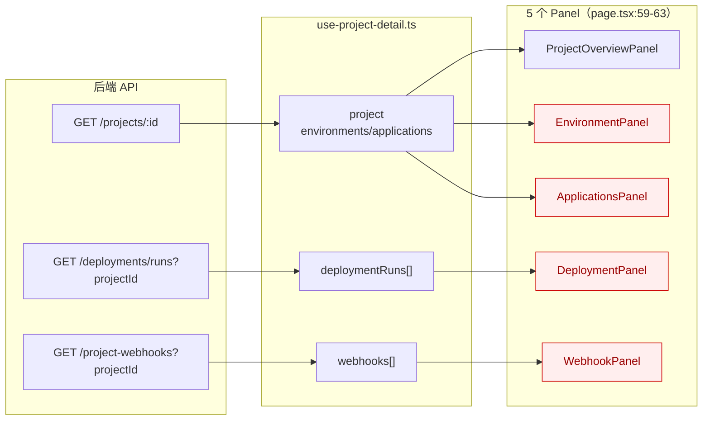
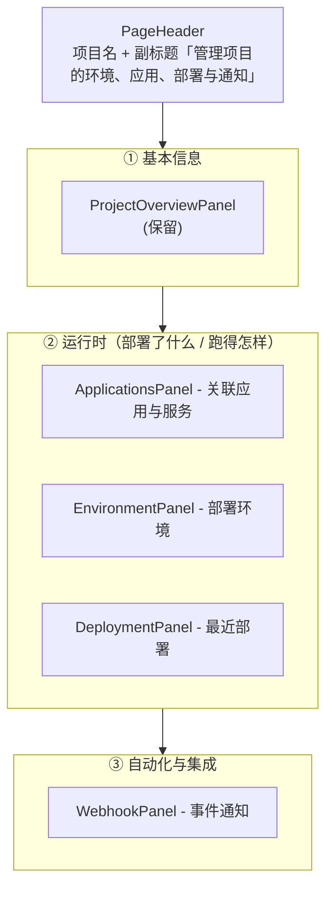
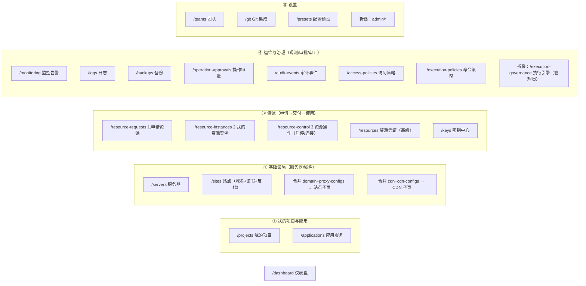
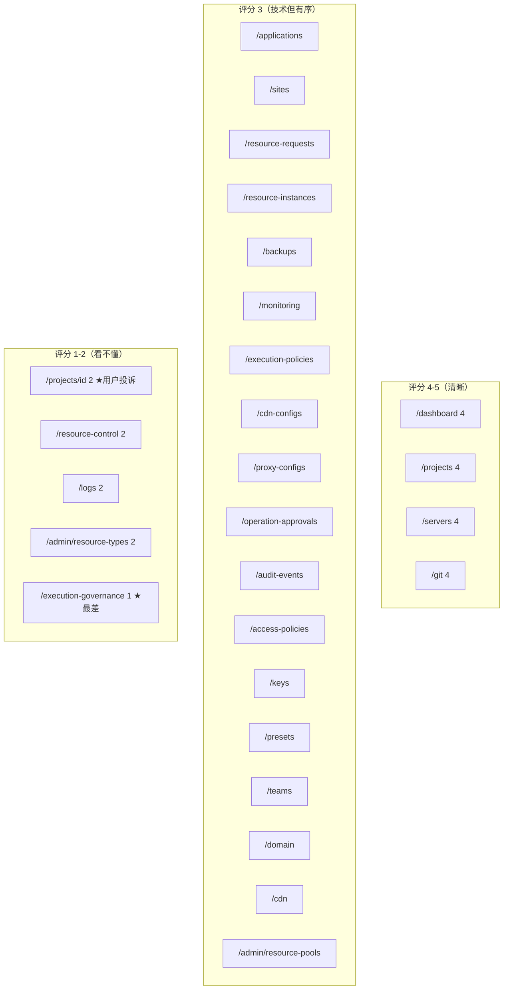
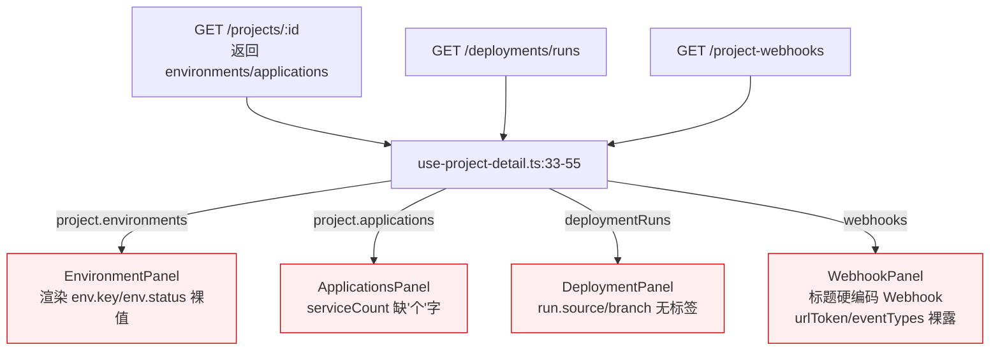
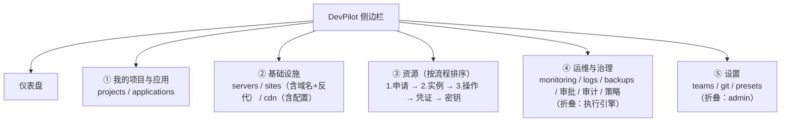

# DevPilot-Web 信息架构与可读性审计

> 任务来源：「项目详情中，除了基本信息，我基本看不懂页面的信息是干什么的，其他的所有模块也有类似的问题」
> 范围：`apps/devpilot-web/src/app/(dashboard)/` 下全部 25 个路由
> 模式：只读审计，不改代码。所有结论均带 `file:line` 出处。
> 产出文件：本文件。噪声中间产物保存在 `/tmp/codex-tool-runs/svton/ia-audit/`。

---

## 0. 执行摘要（Executive Summary）

- **审计范围**：`(dashboard)` 下 25 个路由（22 个业务页 + 2 个 admin 页 + dashboard 首页 + projects 列表/详情/创建/导入）。
- **平均可读性评分**：约 **2.7 / 5**。结构化做得不错（统一用了 `PageHeader` + `MetricCard` + `EmptyState` 三件套），但「文案」与「分组语义」是系统性短板。
- **最差的 3 个页面**：
  1. `execution-governance/`（评分 1）—— 整页都是 Supervisor / Worker / Lease / Orphan / Fleet 等后端实现术语，普通用户完全无法理解。
  2. `resource-control/`（评分 2）—— "资源管控 / 连接运行 / 查询运行 / Provider" 等词没有一句人话解释。
  3. `projects/[id]/` 项目详情（评分 2）—— 用户原始投诉页。5 个 panel 只有标题，无说明、无分组，`environment`/`deployment run`/`webhook` 等字段裸露。
- **最差的 3 个文案（i18n）**：
  1. `executionGovernance.pageDescription = "队列、worker 与远端会话治理"`（zh.json）—— 「治理」「worker」「远端会话」三个词叠加，等于没解释。
  2. `projects.resourceCopyFollowUpDesc = "ManagedResource/SecretKey copy 后的资源管控与指标告警入口"`（zh.json）—— 英文类型名 + 中文混合，且「copy」作为动词未本地化。
  3. `logs.pageDescription = "日志归档、查询与流式 tail"`（zh.json）—— 末尾裸露英文 `tail`，且与 `logs.tail = "实时 Tail"` 混用大小写。
- **最大的单一 IA 问题**：侧边栏按「实现分层」命名（基础设施 / 资源 / 运维 / 治理 / 配置），而不是按「用户要做的事」命名。同一个"资源"概念分散在 5 个入口（`resources` 资源凭证、`resource-control` 资源管控、`resource-requests` 资源申请、`resource-instances` 资源实例、`keys` 密钥），用户不知道从哪里开始。
- **Phase 1 建议范围**（最高 ROI）：
  1. 项目详情页重排：5 个 panel 加一句「这个区块是干什么的」副标题 + 字段人话化（P0）。
  2. 全站 `PageHeader` 的 `description` 文案重写：去掉所有裸英文术语（`worker`/`tail`/`live`/`Provider`/`dry-run`），统一改为人话（P0）。
  3. 侧边栏 7 个分区合并/重命名为 4 个面向任务的分区（P1，详见 §3）。

---

## 1. 全量页面评估表

评分标准：5 = 一眼看懂（标题+分组+人话标签）；3 = 懂技术能看懂；1 = 完全看不懂（裸字段名/无分组/无解释）。

| page | route | 显示什么 | 评分 | 主要问题 | i18n 问题 |
|---|---|---|---|---|---|
| Dashboard 首页 | `/dashboard` | 待办 + 4 指标卡 + 近期部署/申请 + 快捷入口 | **4** | 结构最好的一页；待办项的人话解释已经在 `todoPendingApprovalsHint` 等做了 | 良好 |
| 项目列表 | `/projects` | 项目卡片网格（名称/来源/管控范围/子项目/技术栈标签/创建时间） | **4** | 卡片信息密度合适，Tag 颜色有语义 | 良好 |
| **项目详情** | `/projects/[id]` | 5 个堆叠 panel：概览/环境/应用/部署运行/Webhook | **2** | panel 仅一行 `<h2>`，无说明；字段全是 `name`/`source`/`branch`/`urlToken`/`eventTypes` 裸字段；无视觉分组（§2 详述） | `detailDescription="项目详情与管控"` 是废话；`resourceCopyFollowUpDesc` 含英文类型名 |
| 应用服务 | `/applications` | 左：创建应用/服务表单；右：服务工作区（应用卡 + 服务 SLO） | **3** | 左侧两个表单和右侧工作区并列，新手不知道先填哪个；SLO/队列运行/申请 Live 等术语密集 | `pageDescription="部署与运行态视角"` 抽象；含 `SLO`/`Live` 未解释 |
| 服务器 | `/servers` | 服务器卡片（主机/认证/状态/已安装服务/代理配置数） | **4** | 结构清晰，"已安装服务/重新检测"流程有人话提示 | `pageDescription="纳管执行目标服务器"` ——「纳管」「执行目标」术语 |
| 站点 | `/sites` | 站点列表 + 聚焦面板（接管/同步/证书/诊断） | **3** | 一页功能极多（同步/续期/回滚/诊断/冒烟/基线/TLS 探测），按钮文案全是「入队」「预览入队」等内部术语 | 大量 `xxxEnqueue`/`xxxEnqueuing` 文案，"入队"是后端术语 |
| 资源管控 | `/resource-control` | 受管资源列表 + 动作运行 + 连接/查询运行 | **2** | 三个 panel 之间关系不明；"Provider"/"连接运行"/"查询运行"无解释 | `pageDescription="资源实例与动作运行"` ——「动作运行」是内部术语 |
| 资源申请 | `/resource-requests` | 5 个状态 MetricCard + 申请表 + 列表 + Supervisor 面板 | **3** | 顶部 5 个 MetricCard 直接是 `pending/approved/completed/rejected/canceled` 状态计数，没说"这是按状态分布"；Supervisor 面板暴露给普通用户 | `pageDescription` 提到「数据库、Redis、端口、账号」尚可；但混入 `Supervisor` |
| 资源实例 | `/resource-instances` | 实例列表（含凭证/来源申请/释放） | **3** | 服务端取数壳页，主体在 `ResourceInstancesContent` | `pageDescription` 人话尚可 |
| 备份计划 | `/backups` | 4 MetricCard + 计划表单 + 计划卡 + 运行列表 | **3** | 结构完整；但 `dryRun`/`live` 在 zh 里没翻译（保留英文小写） | nav `备份` 与 pageTitle `备份计划` **不一致**；`dryRun="dry-run"` 未本地化 |
| 监控告警 | `/monitoring` | 仪表盘 + Tabs（事件/规则/静默/通道） | **3** | Tabs 分组合理；但 SLO/燃烧率/错误预算等术语无解释 | nav `监控` 与 pageTitle `监控告警` **不一致**；含 `burnRate="燃烧率"` 等术语 |
| 日志中心 | `/logs` | 6 个区块：统计/流管理/条目/Tail/策略/运行 | **2** | 一页塞了 6 个 section，无折叠无说明；「Tail」「SLS 回填」「Server Follow」「Agent Follow」全是内部术语 | nav `日志` vs pageTitle `日志中心` 不一致；`pageDescription` 含裸英文 `tail` |
| **执行治理** | `/execution-governance` | 概览卡 + Supervisor + Job 列表 + Lease 列表 | **1** | 整页都是后端实现细节（队列/Worker/租约/孤儿治理/Agent 舰队/任务拉取就绪）。普通用户无任何入口理解这页是干嘛的 | `pageDescription="队列、worker 与远端会话治理"`；`<h2>Supervisor</h2>` 硬编码英文（execution-governance-content.tsx:133） |
| 执行策略 | `/execution-policies` | 5 MetricCard + 策略表单 + 模板列表 | **3** | 结构标准；但「命令允许/拒绝策略」对非运维仍抽象 | `pageDescription="命令允许/拒绝策略"` 尚可 |
| CDN 配置管理 | `/cdn-configs` | CDN 配置 + 凭证（壳页，主体在 Content） | **3** | 主体在子组件 | nav `CDN 配置` vs pageTitle `CDN 配置管理` 不一致 |
| 代理配置 | `/proxy-configs` | Nginx 反代配置（壳页） | **3** | 主体在子组件 | `pageDescription="管理 Nginx 反向代理配置"` 尚可 |
| 操作审批 | `/operation-approvals` | 审批列表（默认 pending 视图） | **3** | 结构标准；含「已消费」等术语 | `pageDescription` 含 `live 执行申请` 英文混排 |
| 审计事件 | `/audit-events` | 审计列表 + 分类分布 | **3** | 结构标准 | `pageDescription="操作审计与追溯"` 尚可 |
| 访问策略 | `/access-policies` | 5 MetricCard + 策略表单 + 列表 | **3** | 结构标准 | `pageDescription="控制面读写权限"` ——「控制面」术语 |
| 密钥中心 | `/keys` | 密钥列表（壳页） | **3** | 主体在子组件 | nav `密钥` vs pageTitle `密钥中心` 不一致 |
| 配置预设 | `/presets` | 预设列表（壳页） | **3** | 主体在子组件；功能模糊（"保存当前配置"——保存什么配置？） | `pageDescription` 含「项目配置预设」概念不清 |
| Git 集成 | `/git` | 已连接账号 + 连接按钮 | **4** | 简单清晰 | 良好 |
| 团队管理 | `/teams` | 团队列表（壳页） | **3** | 主体在子组件 | 良好 |
| 域名配置生成 | `/domain` | 左：配置表单；右：生成的 Nginx/Certbot 代码块 | **3** | 是个「工具页」而非「管理页」，与 `/proxy-configs` 功能重叠（都生成 Nginx 反代配置），用户困惑该用哪个 | nav 标签 `域名配置生成` 与 pageTitle `域名配置` 不一致 |
| CDN 配置生成 | `/cdn` | CDN 接入配置生成（壳页） | **3** | 同上，与 `/cdn-configs` 功能重叠 | nav `CDN` vs pageTitle `CDN 配置` 不一致 |
| 资源池管理 | `/admin/resource-pools` | 资源池列表（admin） | **3** | 有 access denied/load failed 文案兜底 | 良好 |
| 资源类型 | `/admin/resource-types` | 资源类型 + 表单 Schema 编辑器 | **2** | 「表单 Schema」对非管理员也是术语；option 值 `manual/auto/none/pool/webhook/api/script/provider` 硬编码英文（resource-type-form-fields.component.tsx:81-99） | `typesPageDescription="维护可申请资源类型及表单 Schema"` 含「Schema」 |

**汇总**：评分 4 的 5 个；评分 3 的 15 个；评分 2 的 5 个；评分 1 的 1 个。**均分 ≈ 2.7**。

---

## 2. 深入：项目详情页（用户原始投诉）

入口：`projects/[id]/page.tsx:52-65`。结构是 `<PageHeader>` + 5 个垂直堆叠的 panel，全部用 `space-y-6` 间距，**没有分组、没有"这一区块是干嘛的"说明、没有图标、没有折叠**。

### 2.1 整体信息流



**清晰度流失点**（红块）：除 Overview 外，其余 4 个 panel 只把 API 字段原样渲染，没有把"字段→人话"的翻译层补上。

### 2.2 逐 Panel 评估

#### Panel 1: ProjectOverviewPanel（基本信息）
- 代码：`components/project-overview-panel.tsx:11-104`
- 数据：`p.name / p.description / p.gitRepo / p.createdAt / p.environments[]`（来自 `use-project-detail.ts:33-55`）
- 标签（i18n key → 中文）：
  - `basicInfo = "基本信息"`（panel 标题）
  - `nameLabel = "名称"` / `descriptionLabel = "描述"` / `gitRepoLabel = "Git 仓库"` / `createdAtLabel = "创建时间"`
  - `notLinked = "未关联"`
- **非开发者看不懂的点**：基本没有，这页 OK。唯一改进点：底部环境 Tag（`project-overview-panel.tsx:90-101`）只是色块，没说"这些是项目下的环境"。
- **重组建议**：保留；给环境 Tag 区加一行小标题「项目环境」。

#### Panel 2: EnvironmentPanel（环境）
- 代码：`components/environment-panel.tsx:9-33`
- 数据：`env.name / env.key / env.status`（`environment-panel.tsx:18-29`）
- 标签：
  - `environments = "环境"`（panel 标题）
  - `noEnvironments = "暂无环境"`
  - 其余字段（`env.key`、`env.status`）**直接渲染原始值，无标签**
- **非开发者看不懂的点**：
  1. `<Tag color="default">{env.key}</Tag>`（environment-panel.tsx:25）—— `env.key` 是什么？是 `prod`/`staging` 这类标识符？还是密钥？用户看到一串字符不知道含义。
  2. `<StatusTag status={env.status} />`（environment-panel.tsx:26）—— 状态值如 `active`/`inactive` 会原样显示（StatusTag 默认 `label ?? status`，见 `status-tag.tsx:76`），但 zh.json 里 `resourceRequests.active="已生效"` 与 `common` 里没有 env 状态映射，**环境状态可能显示为英文原值**。
  3. 整个 panel 没说"环境"是干嘛的——对没接触过 dev/staging/prod 概念的人，"环境"这个词本身就需要解释。
- **重组建议**：
  - panel 标题下加副标题：「项目下的部署环境（如开发、测试、生产），每个环境有独立的资源配置」。
  - `env.key` 改为显示「环境标识」标签；状态值用 i18n 映射表（不要依赖 StatusTag 原值回退）。

#### Panel 3: ApplicationsPanel（关联应用）
- 代码：`components/applications-panel.tsx:10-53`
- 数据：`app.name / app._count.services / app.services[].name / app.services[].status`（`applications-panel.tsx:19-47`）
- 标签：
  - `linkedApps = "关联应用"`
  - `serviceCount = "{count} 服务"`（注意：单数复数未区分，且无"个"字）
  - `noLinkedApps = "暂无关联应用"`
- **非开发者看不懂的点**：
  1. 「应用」与「服务」是 DevPilot 特有的两层模型，panel 没解释它们的关系。
  2. `serviceCount="{count} 服务"` —— 中文读起来生硬（应为"{count} 个服务"）。
  3. 服务行的 `<StatusTag status={svc.status} />`（applications-panel.tsx:43）同样存在状态值未本地化风险。
- **重组建议**：副标题「项目下部署的应用及其包含的服务」；`serviceCount` 改为「{count} 个服务」。

#### Panel 4: DeploymentPanel（部署运行）
- 代码：`components/deployment-panel.tsx:10-37`
- 数据：`run.source / run.branch / run.status / run.startedAt`（`deployment-panel.tsx:23-31`），只取前 10 条（`slice(0, 10)`，line 17）
- 标签：
  - `deploymentRuns = "部署运行"`
  - `noDeploymentRuns = "暂无部署运行"`
  - 其余字段（`source`/`branch`/`startedAt`）**无标签直接渲染**
- **非开发者看不懂的点**：
  1. `run.source`（deployment-panel.tsx:23）—— 来源是什么？Git commit？Webhook？手动？无说明。
  2. `run.branch` 用 `{run.branch || '-'}`（line 24），用户不知道这是代码分支。
  3. 「部署运行」是 DevPilot 术语，普通人理解的是「部署历史/部署记录」。
  4. 只显示前 10 条但没有"查看全部"入口（line 17 的 `slice(0, 10)` 后无更多入口）。
- **重组建议**：标题改「最近的部署」；副标题「最近 10 次部署运行，来自代码推送或手动触发」；字段加图标（分支图标 + 来源徽标）。

#### Panel 5: WebhookPanel（Webhook）
- 代码：`components/webhook-panel.tsx:10-49`
- 数据：`hook.name / hook.provider / hook.enabled / hook.urlToken / hook.eventTypes / hook.lastDeliveryAt`（`webhook-panel.tsx:17-43`）
- 标签：
  - **panel 标题硬编码英文**：`<h2 ...>Webhook</h2>`（webhook-panel.tsx:15），未走 i18n
  - `webhookEvents = "监听事件"`
  - `webhookLastDelivery = "最近投递"`
  - `webhookNoDelivery = "暂无投递"`
- **非开发者看不懂的点**：
  1. 标题 "Webhook" 没有中文，也没有副标题解释"Webhook 是什么、能做什么"。
  2. `hook.urlToken`（webhook-panel.tsx:33）用 `font-mono` 直接展示，这是密钥性质的数据，用户不知道这是用来干嘛的、是否敏感。
  3. `hook.provider`（line 29）显示为 Tag，但「provider」是什么（GitHub？企业微信？）无说明。
  4. `eventTypes.join(', ')`（line 35）直接拼接英文事件名，用户看到 `deployment.completed,deployment.failed` 这种字符串完全无意义。
- **重组建议**：标题改走 i18n 「Webhook 通知」；副标题「当部署/同步等事件发生时，自动通知到外部服务」；`urlToken` 做脱敏 + 「点击复制」；`eventTypes` 用中文事件名映射表。

### 2.3 项目详情页整体重组方案

把 5 个 panel 按"用户心智模型"分 3 组，每组一个带说明的小节标题：



实现层面：新增一个轻量 `<PanelGroup title subtitle>` 包装组件（复用现有 `rounded-lg border` 风格），把现有 5 个 panel 包起来即可，无需重写数据层。

---

## 3. 信息架构重设方案

### 3.1 侧边栏分区问题诊断

当前侧边栏 7 个分区（`navigation-items.ts:82-145`）：

| 当前分区 (titleKey) | 当前中文 | 包含项 | 问题 |
|---|---|---|---|
| `dashboard` | 仪表盘 | 仅 dashboard | OK |
| `sectionProjects` | 项目 | 创建项目/我的项目/应用服务 | OK |
| `sectionInfrastructure` | 基础设施 | servers/sites/proxy-configs/cdn-configs/domain/cdn | **domain 与 proxy-configs 功能重叠**（都生成 Nginx 反代）；**cdn 与 cdn-configs 功能重叠** |
| `sectionResources` | 资源 | resource-control/resources/resource-requests/resource-instances/keys | **5 个"资源"入口**，用户不知道从哪开始 |
| `sectionOperations` | 运维 | backups/monitoring/logs/execution-governance/execution-policies | **execution-governance 是后端治理**，不该和 backups/monitoring 并列给业务用户 |
| `sectionGovernance` | 治理 | operation-approvals/audit-events/access-policies | OK，但「治理」这个词太抽象 |
| `sectionConfig` | 配置 | presets/git/teams/admin/resource-pools/admin/resource-types | **teams（团队）和 presets/git 被塞一起**，语义混乱 |

### 3.2 建议分区（4 个面向任务的分区）



关键变化：
1. **资源分区按"用户旅程"排序**：申请 → 实例 → 操作 → 凭证/密钥，给每项加序号暗示流程。
2. **合并重叠页**：`domain`+`proxy-configs` 都是生成 Nginx 反代配置，应统一到 `sites` 体系下；`cdn`+`cdn-configs` 同理。当前 4 个入口 → 2 个。
3. **execution-governance 降级折叠**：它是平台引擎自检页，非业务功能，放到管理员折叠区，避免业务用户误入后看到一屏 Supervisor/Lease 产生焦虑。

### 3.3 页面级模式建议（Page Template）

应该统一一个 `<ListPageTemplate>` 骨架（当前每页手写，结构已趋同但细节不一）：

```
PageHeader（title + 一句话人话 description + 主操作按钮）
  ↓
（可选）MetricCard 网格 —— 每个 card 需带 tooltip 解释指标含义
  ↓
（可选）Filter / Search 行
  ↓
主体：EmptyState | ErrorBanner | 列表/表格/卡片
  ↓
（可选）Danger Zone / 高级面板（折叠）
```

现状：`PageHeader`（`components/ui/page-header.tsx`）+ `MetricCard`（`metric-card.tsx`）+ `EmptyState`/`ErrorBanner` 已有，但 **MetricCard 没有 tooltip/description 字段**（`metric-card.tsx:8` 只有 `label/value`），导致像 execution-governance 的 `metricStale="疑似陈旧"` 这种卡用户不知道点了会怎样。

### 3.4 文案准则（Copy Guidelines）

| 当前术语 | 出现位置 | 建议改为 | 理由 |
|---|---|---|---|
| execution-governance / 执行治理 | nav + pageTitle | 「执行引擎（管理员）」 | "治理"对用户无意义，本质是引擎自检 |
| resource-control / 资源管控 | nav + pageTitle | 「资源操作」 | "管控"太抽象；这页实际是启停/连接资源 |
| Resource copy / ManagedResource copy | projects.* 多个 key | 「资源接管」 | 英文未本地化 |
| 入队 / Enqueue | sites/logs 多处 | 「提交任务」或「执行」 | "入队"是后端队列术语 |
| dry-run / dryRun | backups/logs | 「试运行」 | 英文未本地化（`backups.dryRun="dry-run"`） |
| live / Live | logs/sites/operation-approvals | 「正式执行」 | 英文未本地化 |
| Provider | resource-control | 「云服务商」或「来源」 | 英文 |
| Worker / Supervisor / Lease | execution-governance | （整页改写）| 后端实现术语 |
| tail / Tail | logs | 「实时跟踪」 | 英文 |
| 纳管 | servers.pageDescription | 「添加到管理」 | "纳管"是行业黑话 |
| SLS 回填 | logs.slsBackfill | 「日志服务回填」 | SLS 是阿里云产品缩写，未展开 |

### 3.5 空状态建议

现状：大部分页用了 `EmptyState`，但 description 质量参差：
- 好例子：`projects.noProjectsDescription="可以创建一个全新项目，也可以先接入已有项目进入管控。"` —— 有引导。
- 差例子：`executionGovernance.noJobs="暂无执行任务"` + `noJobsHint` 虽有但藏在组件里；`backups.noPlans="暂无备份计划"` 有 hint。
- **缺失**：项目详情页的 4 个非 Overview panel，空态只有一句「暂无 X」，没有「为什么会空 / 我该做什么让它不空」。

建议：每个空态必须回答三问：**这是什么？为什么是空的？下一步我该做什么（带 CTA 链接）？**

---

## 4. i18n 审计

### 4.1 方法
比对 `messages/zh.json`（29 个顶层 key）与 `messages/en.json`，结合 `(dashboard)/` 下所有 `page.tsx` 实际引用的 key。

### 4.2 nav 标签与 pageTitle 不一致清单（用户会困惑"我点的'备份'为什么页头写着'备份计划'"）

| section | nav (zh) | pageTitle (zh) | 文件:行 |
|---|---|---|---|
| backups | 备份 | 备份计划 | zh.json `nav.backups` vs `backups.pageTitle` |
| monitoring | 监控 | 监控告警 | 同上 |
| logs | 日志 | 日志中心 | 同上 |
| keys | 密钥 | 密钥中心 | 同上 |
| cdn | CDN | CDN 配置 | 同上 |
| cdnConfigs | CDN 配置 | CDN 配置管理 | 同上（且与 cdn 混淆） |
| resources | 资源 | 资源管理 | 同上 |

### 4.3 技术黑话（应简化）

- `executionGovernance.pageDescription="队列、worker 与远端会话治理"` —— 三个术语叠加。
- `resourceControl.pageDescription="资源实例与动作运行"` —— "动作运行"是内部术语。
- `servers.pageDescription="纳管执行目标服务器"` —— "纳管"+"执行目标"。
- `accessPolicies.pageDescription="控制面读写权限"` —— "控制面"是 K8s 术语。
- `projects.resourceCopyFollowUpDesc="ManagedResource/SecretKey copy 后的资源管控与指标告警入口"` —— 英文类型名混中文。
- `logs.pageDescription="日志归档、查询与流式 tail"` —— 末尾裸 `tail`。
- `operationApprovals.pageDescription="...的 live 执行申请"` —— 裸 `live`。

### 4.4 英文未本地化（保留裸英文）

- `backups.dryRun="dry-run"` / `backups.live="live"`
- `logs.dryRun="Dry-run"` / `logs.live="Live"`（注意大小写不一致）
- `logs.serverFollowPolicy="Server Follow"` / `logs.agentFollowPolicy="Agent Follow"`
- `logs.slsBackfill="SLS 回填"`
- `executionGovernance` 中大量 `Supervisor`/`Worker`/`Owner`/`Lease`/`Fleet`/`PID`/`TTL`（部分有中文如 `workerInventory="Worker 清单"` 仍混排）

### 4.5 硬编码（绕过 i18n）

- `execution-governance-content.tsx:133` —— `<h2>Supervisor</h2>` 硬编码英文，未走 `t()`。
- `webhook-panel.tsx:15` —— `<h2>Webhook</h2>` 硬编码英文。
- `admin/resource-types/components/resource-type-form-fields.component.tsx:81-99` —— option 文本 `manual/auto/none/pool/webhook/api/script/provider` 硬编码英文（这些是枚举值，但展示给用户的文本应本地化，value 保持英文）。

### 4.6 同词异义

- `live`：在 logs 是"实时读取"，在 backups/operation-approvals 是"正式执行（非试运行）"，在 sites 是"实际生效"。同一词三个语义。
- `control`：`resourceControl`（资源操作）vs `projectResourceControl`（项目资源管控）vs `accessPolicies` 的 effect=control。
- `request`：`resource-requests`（资源申请单）vs HTTP request。

### 4.7 最差文案改写建议（Top 5）

| key | 当前 | 建议 |
|---|---|---|
| `executionGovernance.pageDescription` | 队列、worker 与远端会话治理 | 查看平台后台任务的执行情况（管理员诊断用，一般无需关注） |
| `projects.resourceCopyFollowUpDesc` | ManagedResource/SecretKey copy 后的资源管控与指标告警入口 | 资源接管后，在这里管理这些资源的运行状态和告警 |
| `logs.pageDescription` | 日志归档、查询与流式 tail | 集中查看和搜索各服务的运行日志，支持实时跟踪 |
| `resourceControl.pageDescription` | 资源实例与动作运行 | 对已交付的资源执行启动、停止、连接、查询等操作 |
| `servers.pageDescription` | 纳管执行目标服务器 | 添加并管理需要部署应用的服务器 |

---

## 5. 视觉层级 / 布局模式

### 5.1 现有 UI 原语盘点（`components/ui/`）

| 组件 | 文件 | 用途 | 不足 |
|---|---|---|---|
| `PageHeader` | page-header.tsx:20-31 | title + description + actions | **没有 icon / breadcrumb / tabs 槽位**；description 是纯文本不能放链接 |
| `MetricCard` | metric-card.tsx:8-15 | label + value | **没有 tooltip / description / 趋势 / 颜色**，无法解释指标含义 |
| `StatusTag` | status-tag.tsx:59-79 | 状态→颜色映射 | 健全（6 色调 + 风险变体） |
| `ErrorBanner` | error-banner.tsx | 错误条 + 重试 | 健全 |
| `Modal` / `ConfirmDialog` | modal.tsx / confirm-dialog.tsx | 弹窗 | 健全 |
| `ActionMenu` | action-menu.tsx | 下拉菜单 | 健全 |

**缺口**：没有 `Panel`/`Section`/`Card` 语义化容器组件（各页都用裸 `<div className="rounded-lg border p-4">`），没有 `Tabs`（在 `@svton/ui` 里），没有 `EmptyState`（在 `@svton/ui`）。

### 5.2 区块视觉分隔现状

- 项目详情 5 个 panel：全部 `rounded-lg border p-4` + 顶部 `<h2 className="font-semibold">`，**没有分组小标题、没有图标、没有分隔说明**，视觉上是"5 个等重的方框堆叠"，用户看不出"基本信息"和"部署运行"哪个更重要。
- 列表页（servers/applications）：用卡片网格，OK。
- 监控页：用了 Tabs（`monitoring/page.tsx:701-704`），分组清晰，**这是全站最好的分组范式**，应推广。

### 5.3 是否需要 PageHeader 升级

需要。建议 `PageHeader` 增加可选槽位：

```ts
interface PageHeaderProps {
  title: string;
  description?: ReactNode;
  actions?: ReactNode;
  icon?: ReactNode;        // 新增：页面图标
  tabs?: ReactNode;        // 新增：页内 Tab 导航
  breadcrumb?: ReactNode;  // 与现有 Breadcrumbs 联动
}
```

这样可以把"页面标题 + 说明 + 内文 Tab"统一到一个组件，避免 monitoring 等页手写 Tabs 位置。

### 5.4 与 twgg 的对比

twgg admin（`/Users/zhaoxingbo/Workspace/ai-driven/twgg/apps/admin/src/app/(console)/`）只有 ~10 个 console 页（organizations/audit-logs/settings/projects/permissions/profile/users/ai-assistant/dictionaries/help），**IA 极简**：没有"基础设施/资源/运维/治理"这种实现分层，就是按业务对象平铺。其页结构（如 `projects/page.tsx`）是：

```tsx
<ConsoleSuspensePage><ProjectsWorkspace /></ConsoleSuspensePage>
```

—— 统一壳 + 单个 Workspace 组件，职责清晰。DevPilot 的 `PageHeader`+多 panel 模式已经借鉴了 twgg 视觉骨架（`sidebar.tsx:13` 注释明说），但 **twgg 没有那么多需要解释的后端概念**，所以照搬视觉层后，DevPilot 的"概念密度"问题被放大了。

可借鉴 twgg 的点：
1. 统一 `<ConsoleSuspensePage>` 式壳页（DevPilot 已有 `PageHeader`，可进一步标准化）。
2. 业务对象平铺，避免实现分层（见 §3.2 建议）。

---

## 6. 必需图表（Mermaid）

### 6.1 页面结构 + 评分（已含于 §1 表格，此处可视化）



### 6.2 项目详情信息流（清晰度流失点）



### 6.3 建议 IA（已含于 §3.2 的图，此处为完整层级）



---

## 7. 优先级修复计划

### P0 — 关键可读性（用户当前完全看不懂）

| # | 文件:行 | 改什么 | 影响 |
|---|---|---|---|
| P0-1 | `projects/[id]/page.tsx:59-63` + 5 个 panel | 给 4 个非 Overview panel 加副标题（一句话说明"这区块是什么"）；按 §2.3 分 3 组 | 直接回应用户投诉 |
| P0-2 | `webhook-panel.tsx:15`、`execution-governance-content.tsx:133` | 把硬编码 `Webhook`/`Supervisor` 标题接入 i18n | 消除中英混排 |
| P0-3 | `messages/zh.json` 全站 `pageDescription` | 重写含裸英文/黑话的 description（§4.7 Top 5 + 各页 description） | 每页首屏可读性 |
| P0-4 | `projects/[id]/components/environment-panel.tsx:25-26`、`deployment-panel.tsx:23-24`、`webhook-panel.tsx:33-35` | 给裸字段加中文标签 + 状态值本地化映射；`urlToken` 脱敏 + 复制按钮 | 字段可理解 |
| P0-5 | `execution-governance/` 整页 | 顶部加醒目说明「这是平台执行引擎的诊断页，一般用户无需关注」；或从主导航折叠到管理员区 | 避免业务用户误入焦虑 |

### P1 — 重要（标签/分组混乱）

| # | 文件:行 | 改什么 | 影响 |
|---|---|---|---|
| P1-1 | `components/layout/navigation-items.ts:82-145` | 按 §3.2 重组为 5 个面向任务分区；合并 domain↔proxy-configs、cdn↔cdn-configs | 全站导航可理解 |
| P1-2 | `messages/zh.json` nav vs pageTitle | 统一 nav 标签与各页 pageTitle（§4.2 清单） | 消除"点的和看到的不一致" |
| P1-3 | `messages/zh.json` executionGovernance.* / resourceControl.* / logs.* | 落地 §3.4 术语表（入队→提交、dry-run→试运行、live→正式执行、Provider→云服务商） | 文案人话化 |
| P1-4 | `components/ui/metric-card.tsx:8` | `MetricCard` 增加 `description?: string` + info tooltip | 让 MetricCard 能解释自己 |
| P1-5 | `sites/page.tsx` + i18n | 把 `xxxEnqueue/xxxEnqueuing` 系列文案改为"提交 X / X 提交中" | 站点页可读 |
| P1-6 | `projects/[id]/components/applications-panel.tsx:32` | `serviceCount="{count} 服务"` → `"{count} 个服务"`；单复数 | 文案通顺 |

### P2 — 打磨（一致性、空态、细节）

| # | 文件:行 | 改什么 | 影响 |
|---|---|---|---|
| P2-1 | `components/ui/page-header.tsx:12-18` | `PageHeader` 增加 `icon`/`tabs` 可选槽位 | 页面模式统一 |
| P2-2 | 各页 `EmptyState` | 统一空态三问模板（这是什么/为什么空/下一步），项目详情 4 个非 Overview panel 优先 | 空态引导 |
| P2-3 | `logs.pageDescription`、`backups.dryRun`、`logs.dryRun` | 大小写与中英混排统一（Dry-run vs dry-run） | 一致性 |
| P2-4 | `admin/resource-types/components/resource-type-form-fields.component.tsx:81-99` | option 展示文本本地化（value 保留英文） | 表单可读 |
| P2-5 | `projects/[id]/components/deployment-panel.tsx:17` | `slice(0,10)` 后补"查看全部"链接到 `/applications?projectId=` 或部署详情 | 列表完整性 |
| P2-6 | 新增 `<PanelGroup title subtitle>` 容器组件 | 替换各页裸 `<div className="rounded-lg border">` + `<h2>` | 视觉一致性 |

---

## 8. 计数与产出汇总

- **审计页面数**：25 个路由（含 admin 2 个、projects 子页 4 个、dashboard 首页）。
- **i18n key 审查数**：29 个顶层命名空间，约 700+ 个 key（zh.json 68KB / en.json 71KB 全量过审）。
- **图表数**：6 个 Mermaid（§2.1 信息流、§2.3 重组、§3.2 建议 IA、§6.1 评分、§6.2 字段流失、§6.3 层级）。
- **硬编码字符串发现**：3 处（2 个 panel 标题 + 1 组 option 文本）。
- **nav/pageTitle 不一致**：7 处。
- **产出文件**：
  - 本审计文档：`docs/todos/2026-07-22-devpilot-web-information-architecture-audit.md`
  - 全页面 page.tsx 拼接笔记：`/tmp/codex-tool-runs/svton/ia-audit/pages.txt`
  - 硬编码扫描原始结果：`/tmp/codex-tool-runs/svton/ia-audit/hardcoded-raw.txt`

## 9. 真实阻碍（Blocker）

无技术阻碍。唯一需要产品决策的点：
1. **execution-governance 的定位**：是保留为管理员诊断页（建议），还是彻底重写给业务用户看？需产品确认。
2. **domain/cdn 两个"配置生成器"页与 proxy-configs/cdn-configs 的合并**：涉及功能去重，需产品确认保留哪套。
3. **侧边栏分区重组**（§3.2）会影响所有用户的肌肉记忆，建议结合埋点数据评估迁移成本后再上线。
