# Picshare Full Integration into Devpilot — Investigation

Date: 2026-07-22
Scope: identify what "纳管+部署在整个项目中所有资源串起来" means for picshare, gap-analyse every
relevant devpilot entity, design domain routing, and produce a phased plan.
Investigator: `/dev:invest` subagent (read-only). No code modified, no Docker state changed
(observed `devpilot-app-api`, `devpilot-g003-docker-socket-proxy`, and the api-mysql DB
read-only).

All claims cite `file:line`. Reproducible evidence captured under
`/tmp/codex-tool-runs/svton/picshare-integration/`.

---

## TL;DR (executive summary)

Picshare today is a **siloed island**: a Project + Application + 2 ApplicationServices + 1
fictional Server + 2 dry-run DeploymentRuns. None of devpilot's other resource connectors
fire from it. The three most important missing edges are:

1. **ManagedResources for picshare's 4 containers** — picshare's Server
   (`Picshare Docker Host`) has zero ManagedResources, so resource-control, backup, and
   metric dashboards all ignore picshare.
2. **Site + ProxyConfig for the admin UI** — picshare is reachable only by raw host port
   `4101`; there is no devpilot `Site` or `ProxyConfig` modelling the domain.
3. **ApplicationService.managedResourceId + AlertRule** — neither picshare service is
   linked to a ManagedResource, and no AlertRule watches the backend's health.

**Domain routing recommendation (one line):** stand up a dedicated
`picshare-proxy` nginx container on the staging network (the staging `virtual-nginx` is a
bare `nginx:alpine` with no config volume and cannot be configured from inside devpilot),
front `picshare.localtest.me` → `picshare-admin:3001` and `picshare.localtest.me/api` →
`picshare-backend:3000`, then record a devpilot `Site` + `ProxyConfig` reflecting it.

**Phase 1 scope (one line):** data-only wirings achievable now — Site, ProxyConfig,
AlertRule + AlertNotificationChannel, BackupPlan, ResourceRequest, ServerCommandPolicyTemplate,
LogStream, and seed picshare's 4 ManagedResources via direct DB INSERT (matches the
`local-test-data.md:251` precedent for LT-Docker Host); plus the proxy container.

**Phase 2 scope (one line):** needs code/infra changes — fix
`docker-inventory-executor.factory.ts:60` to honour the URL port so a real `sync-docker`
works against picshare, enable `SERVER_EXECUTOR_LIVE_ENABLED=true` + key-auth SSH so
deploy/backup/sync actually execute, and implement real pool provisioning.

**Key risks:** the factory's hard-coded port 2376 silently breaks real inventory for any
in-network docker-socket-proxy; devpilot's `ProxyConfig.sync()` and `domain/nginx-config`
endpoints are config-text generators only (never write to disk); non-dryRun deploy/backup/
site-sync all gate on the same disabled server-executor flag.

**Genuine blocker:** none for Phase 1. Phase 2 cannot proceed without a one-line code
change in the dockerode factory and a deliberate env-var change on `devpilot-app-api`.

---

## 1. Current state map (what is wired today, with ids)

Source: `docs/devpilot/local-test-data.md:272-457` (the picshare section) + DB read.

| Entity | Name | id | Wired to picshare Project? |
|---|---|---|---|
| Team | Test Org | `cmrusn8mw0009fp5bnu9kuiin` | — |
| Project | Picshare | `cmrvcfd5t000cdq6b01jka11s` | centre |
| ProjectEnvironment | dev | `cmrvcfd6e000edq6bm9xulgvq` | yes (+ test/staging/prod auto) |
| Server | Picshare Docker Host | `cmrvcfrj5000mdq6b5pdfqn6e` | referenced by both services' `serverId` |
| Application | Picshare Application | `cmrvcg4dy000odq6bvn5ojggn` | yes |
| ApplicationService | backend | `cmrvcg9r3000sdq6bcdzqtl96` | yes (server set, managedResource NULL) |
| ApplicationService | admin | `cmrvcge1f000wdq6b995vmef2` | yes (server set, managedResource NULL) |
| ServerCommandPolicyTemplate | Picshare docker-compose-file deployment | `cmrvcmd78001edq6bdhadofkq` | yes |
| DeploymentRun | backend dry-run | `cmrvcmhw0001gdq6bxfv9c0pk` | yes |
| DeploymentRun | admin dry-run | `cmrvcmn22001mdq6b9l78cawx` | yes |
| ManagedResource | (none for picshare) | — | **NOT WIRED** |
| ProjectEnvironmentServer | (none for picshare) | — | **NOT WIRED** |
| ResourceRequest | (none) | — | **NOT WIRED** |
| Site / ProxyConfig | (none) | — | **NOT WIRED** |
| BackupPlan / BackupRun | (none) | — | **NOT WIRED** |
| AlertRule / AlertNotificationChannel | (none) | — | **NOT WIRED** |
| LogStream | (none) | — | **NOT WIRED** |
| CDNConfig / TeamCredential | (none) | — | **NOT WIRED** |
| SecretKey | (none) | — | **NOT WIRED** |

Verified the picshare Server has `services = NULL` and `tags = ["picshare","local-test","deploy-target"]`
(DB SELECT). So no `dockerApiHost` hint → any `sync-docker` against it falls back to the
fictional stub inventory (`resource-control-docker-inventory.utils.ts:42-94`).

Verified the 4 picshare containers ARE on `devpilot-g003-staging_default`
(`docker network inspect`): `picshare-admin`, `picshare-backend`, `picshare-mysql`,
`picshare-redis` — alongside `devpilot-g003-docker-socket-proxy`.

---

## 2. Resource model diagram (Project → all related entities)

Built from `apps/devpilot-api/prisma/schema.prisma`. Edges cite the relation field.

```mermaid
graph TD
    Project[Project schema.prisma:619]

    Project-->|environments schema.prisma:632| Env[ProjectEnvironment :673]
    Project-->|environmentServers :661| EnvSrv[ProjectEnvironmentServer :766]
    Project-->|applications :637| App[Application :794]
    Project-->|applicationServices :638| AppSvc[ApplicationService :832]
    Project-->|deploymentRuns :658| Dep[DeploymentRun :939]
    Project-->|sites :634| Site[Site :414]
    Project-->|proxyConfigs :633| Proxy[ProxyConfig :381]
    Project-->|siteSyncRuns :635| SiteSync[SiteSyncRun :464]
    Project-->|managedResources :654| MR[ManagedResource :1375]
    Project-->|resourceRequests :655| RR[ResourceRequest :1189]
    Project-->|resourceInstances :656| RI[ResourceInstance :1232]
    Project-->|resourceProvisioningRuns :657| RPR[ResourceProvisioningRun :1297]
    Project-->|cdnConfigs :652| CDN[CDNConfig :550]
    Project-->|secretKeys :653| SK[SecretKey :1086]
    Project-->|backupPlans :641| BP[BackupPlan :1673]
    Project-->|backupRuns :642| BR[BackupRun :1720]
    Project-->|alertRules :643| AR[AlertRule :1777]
    Project-->|alertEvents :645| AE[AlertEvent :1868]
    Project-->|logStreams :647| LS[LogStream :1992]
    Project-->|logEntries :648| LE[LogEntry :2058]
    Project-->|projectWebhooks :659| WH[ProjectWebhook :1012]
    Project-->|serverCommandPolicyTemplates :662| SCPT[ServerCommandPolicyTemplate :347]
    Project-->|controlAccessPolicies :663| CAP[ControlAccessPolicy :726]

    EnvSrv-->|server :779| Server[Server :193]
    AppSvc-->|server :856| Server
    AppSvc-->|managedResource :858| MR
    AppSvc-->|site :857| Site
    MR-->|server :1398| Server
    MR-->|resourceInstance :1401| RI
    BP-->|resource :1698| MR
    BP-->|server :1699| Server
    AR-->|applicationService :1808| AppSvc
    AR-->|managedResource :1811| MR
    AR-->|site :1810| Site
    AR-->|server :1809| Server
    Site-->|proxyConfig :438| Proxy
    Site-->|server :437| Server
    RR-->|resourceType :1212| RT[ResourceType :1158]
    RR-->|instance :1215| RI
    Proxy-->|server :399| Server

    classDef missing fill:#fbb,stroke:#c33,color:#000
    class MR,RR,RI,Site,Proxy,SiteSync,BP,BR,AR,AE,LS,LE,CDN,SK,WH,SCPT,CAP,EnvSrv missing
```



Red nodes = NOT wired today for picshare. Green (default) = wired.

Other connectors that touch picshare transitively:
- `ResourcePool`/`ResourceAllocation` (`schema.prisma:1113, 1130`) — system-level pools that
  a `ResourceRequest` can allocate from when its `ResourceType.provisioningMode = 'pool'`.
- `AuditEvent` (`:2300`) — every wire produces an audit event; picshare already has audit
  rows from its DeploymentRuns.
- `OperationApproval` (`:2234`) — required for non-dryRun deploy/site-sync/resource-action.
- `AlertNotificationChannel` (`:1930`) — destination for AlertRule events.
- `TeamCredential` (`:527`) — used by CDN, cloud inventory, resource provisioning.

---

## 3. Gap analysis (per entity type)

Format: **Entity** — wired? what's needed? data-only vs code change?

### 3.1 ManagedResource (`schema.prisma:1375`)

**NOT wired.** Picshare's 4 containers (`picshare-mysql`, `picshare-redis`,
`picshare-backend`, `picshare-admin`) are running on the staging network but appear in zero
devpilot records.

**Why it matters:** ManagedResource is the central hub for resource-control, backup, alert
rules, log streams, metric snapshots, and ApplicationService binding
(`schema.prisma:1403-1416`). Without it, picshare is invisible to all of these.

**Normal creation path:** `POST /api/resource-control/servers/:serverId/sync-docker`
(`resource-control-sync.service.ts:53-84`). Two executors
(`resource-control/inventory/executors/`):
- `docker-api-inventory-executor.ts` — real dockerode `listContainers`.
- `cli-docker-inventory-executor.ts` — SSH + `docker ps` parse.

The factory `docker-inventory-executor.factory.ts:32-66` picks dockerode iff the server's
`tags` or `services` JSON contains `dockerApiHost` (TCP) or `dockerApiSocket` (unix).

**Blocker for the dockerode path:**
1. picshare Server has `services = NULL` → factory returns null → CLI path.
2. CLI path runs `docker ps` over SSH; server-executor transport is disabled → falls back
   to the stub at `resource-control-docker-inventory.utils.ts:42-94`, producing fictional
   `devpilot-api`/`nginx-proxy`/`mysql-primary`/`redis-cache` names that have nothing to do
   with picshare.
3. Even if we add `services.dockerApiHost = "tcp://devpilot-g003-docker-socket-proxy:2375"`
   to picshare's Server, the factory at `:60` hard-codes `port: 2376` and ignores the URL's
   port. Verified live:
   ```
   docker exec devpilot-app-api node -e '...new d({host:"devpilot-g003-docker-socket-proxy",port:2376})...'
   => ERR-port2376 connect ECONNREFUSED 172.24.0.6:2376
   docker exec devpilot-app-api node -e '...port:2375...'
   => count=48   (including all 4 picshare containers)
   ```
   The docker-socket-proxy container listens on **2375** inside the network; only the
   host-side published port is 2376 (`docker-compose.devpilot-staging.yml:151`).

**Fix options:**
- (a) **Code change (1 line):** `docker-inventory-executor.factory.ts:60` — parse port from
  the URL instead of hard-coding 2376. Then set picshare Server's
  `services.dockerApiHost = "tcp://devpilot-g003-docker-socket-proxy:2375"` and call
  `sync-docker`.
- (b) **Data-only:** hand-INSERT 4 ManagedResource rows for picshare (matches the LT-Docker
  Host precedent at `local-test-data.md:251`: "DB-updated ✅"). No code change. This is the
  Phase 1 path.
- (c) Expose docker-socket-proxy on a second internal port 2376 (compose change) —
  rejected: bigger blast radius, doesn't fix the underlying bug.

**Decision: Phase 1 = (b) hand-seed; Phase 2 = (a) code fix so future `sync-docker` works.**

### 3.2 ProjectEnvironmentServer (`schema.prisma:766`)

**NOT wired.** Picshare's dev env (`cmrvcfd6e000edq6bm9xulgvq`) is not bound to the Picshare
Docker Host server. This binding is what `sync-docker` auto-creates
(`resource-control-binding.service.ts` via `bindServerToEnvironment`, called from
`resource-control-sync.service.ts:66`). Since we never ran a real sync, no binding exists.

**Fix:** `POST /api/project-environments/:envId/servers { serverId }` or direct DB INSERT.
Data-only.

### 3.3 ResourceRequest + ResourceInstance (`schema.prisma:1189, 1232`)

**NOT wired.** Picshare's backend uses its own dedicated `picshare-mysql` + `picshare-redis`
containers (declared in `picshare/docker-compose.devpilot.yml:5-44`). These resources are
**outside** the platform's resource-pool model.

**Two interpretations:**
- (i) **"Outside is fine" — picshare owns its infra, devpilot just observes it.** Then we
  record the 4 ManagedResources (3.1) and skip ResourceRequest entirely. This matches the
  twgg/deyi/net-portal precedent (each brings its own mysql/redis) cited in the prior
  investigation `2026-07-22-picshare-deployment-investigation.md:288-298`.
- (ii) **"Inside the platform" — picshare should have ResourceRequests against the LT MySQL
  / Redis pools** (`local-test-data.md:92-93`). Then we POST ResourceRequests and trigger
  provisioning. BUT pool provisioning is **non-executing**
  (`resource-pool-provisioning.service.ts:29-72` just generates fake credentials without
  touching MySQL/Redis — confirmed at `local-test-data.md:255-260`). So even if we create
  the requests, the delivered credentials will not actually work, and picshare would still
  need to point at its own dedicated containers.

**Decision: interpretation (i).** Picshare's dedicated containers are cleaner, match
precedent, and the pool-provisioning subsystem is non-functional today. Create the
ManagedResources (data-only) so the platform *observes* picshare's infra; skip
ResourceRequest. **Optional Phase 1 cherry on top:** file `ResourceRequest`s with
`status: completed` purely as bookkeeping records that *document* picshare's
self-provisioned resources (with `result.note: "self-provisioned via dedicated docker-compose"`),
so the platform has a paper trail. Justification: ResourceRequest is the only entity that
formally says "this project asked for MySQL+Redis and got them" — even if virtual.

### 3.4 Site + ProxyConfig + SiteSyncRun (`schema.prisma:414, 381, 464`)

**NOT wired.** Picshare admin UI is reachable only by raw host port `4101`. A real
deployment would have a domain.

**Normal flow:**
1. Create `ProxyConfig` (`POST /api/proxy-configs`) — persistent record of `domain` +
   `upstreams[]` + `ssl` + `customConfig`.
2. Create `Site` (`POST /api/sites`) — persistent record binding a `primaryDomain`,
   `runtimeType` (e.g. `reverse_proxy`), `runtimeConfig` (upstream), `serverId` (the nginx
   box), `proxyConfigId`, `projectId`, `environmentId`.
3. `POST /api/sites/:id/sync-plan` generates the nginx config text
   (`site-config-gen.utils.ts:41-115`) and a command plan that would write it to
   `/etc/nginx/conf.d/<domain>.conf` and reload nginx.
4. The command plan is executed via server-executor — **gated on
   `SERVER_EXECUTOR_LIVE_ENABLED`** like everything else
   (`site-sync-execution.service.ts:74-150`).

**`ProxyConfig.sync()` is a stub** (`proxy-config.service.ts:240-272`): only flips status to
`active` and returns the rendered config text; never writes anywhere. Same for `domain/*`
endpoints (`domain.controller.ts:43-81`) — pure config-text generators.

**`devpilot-g003-virtual-nginx` cannot host picshare routing** — it's `image: nginx:alpine`
with no config volume (`docker-compose.devpilot-staging.yml:177-181`). To make it proxy we
would need to (a) add a bind-mounted `conf.d` directory, (b) get config into it (either
manually or via a working server-executor).

**Fix options:**
- (a) **Phase 1 (recommended):** stand up a dedicated `picshare-proxy` container
  (nginx:alpine + bind-mounted `conf.d/picshare.localtest.me.conf`) on the staging network.
  User adds `picshare.localtest.me` to `/etc/hosts` → `127.0.0.1`. Proxy publishes host
  port `4143:80` (or whatever's free). Create devpilot `ProxyConfig` + `Site` records that
  *document* the setup (status `active`). No devpilot code change, no live server-executor
  needed. This is honest: devpilot's `Site` reflects reality.
- (b) Phase 2: enable live server-executor + configure `devpilot-g003-virtual-nginx` with a
  mounted `conf.d` volume so `Site` sync actually writes the file.

**Decision: Phase 1 = (a) dedicated picshare-proxy + Site/ProxyConfig records.**

### 3.5 CDNConfig + TeamCredential (`schema.prisma:550, 527`)

**NOT wired.** Picshare uses `STORAGE_TYPE: cos` (Tencent COS) per
`docker-compose.devpilot.yml:69-75`, but with empty creds (`COS_SECRET_ID: ""`) so uploads
degrade silently. Devpilot's `CDNConfig` (`POST /api/cdn-configs`) requires a real
`TeamCredential` row of `type: cdn_qiniu | cdn_aliyun | cdn_cloudflare`.

**Fix:** Out of scope for picshare integration — there is no `cdn_tencent_cos` provider
adapter (the providers list at `cdn-config/providers/` covers qiniu/aliyun/cloudflare per
the schema comment `schema.prisma:530`). Phase 3.

### 3.6 BackupPlan + BackupRun (`schema.prisma:1673, 1720`)

**NOT wired.** Picshare-mysql holds real user data and should be backed up.

**Normal flow:**
1. `POST /api/backup/plans { resourceId: <picshare-mysql ManagedResource id>,
   backupType: 'logical', schedule, retentionDays, destinationType: 'local',
   destination: { path: '/var/backups/devpilot/picshare' } }`.
2. `POST /api/backup/plans/:planId/runs { dryRun: true }` — generates a `mysqldump` command
   plan via `server-executor`.

**Prereq:** a ManagedResource of `kind: 'mysql'` for picshare-mysql (see 3.1). Without it,
`backup.service.ts:88` rejects (`getBackupableResource` throws).

**Non-dryRun blocked:** `backup.service.ts:169-174` explicitly:
`blockLiveRun('真实备份执行需要先接入备份审批和恢复策略，本阶段只生成 dry-run 计划')`.

**Fix:** Phase 1 — create the plan + dry-run BackupRun (data-only, after seeding
ManagedResources). Phase 2 — wire a real `mysqldump` execution path (needs server-executor
live + a destination the executor can write to; `devpilot-g003-backup-target` already
exists on the staging network per `docker-compose.devpilot-staging.yml:183-186`).

### 3.7 AlertRule + AlertNotificationChannel + AlertEvent (`schema.prisma:1777, 1930, 1868`)

**NOT wired.** No alert fires if picshare-backend goes down.

**Available metrics** (from `monitoring-alert-rule.constants.ts` + the evaluation services
in `monitoring/`):
- `cpuPercent`, `memoryPercent` etc. (resource metric threshold) — needs ResourceMetricSnapshot
  rows, which come from `docker stats` via ResourceActionRun (gated on server-executor).
- `service_status` (deployment smoke check) — needs DeploymentRun smoke-check records.
- `site_smoke_check` — needs SiteSyncRun smoke-check records (`monitoring-alert-site-smoke-check-evaluation.service.ts:36-58`).
- `health_status` — generic.
- `backup_status` — needs BackupPlan.

**The most useful rule today** is `category: 'service', metric: 'service_status'` against
the picshare-backend ApplicationService — but its evaluation
(`monitoring-alert-deployment-smoke-check-evaluation.service.ts`) reads DeploymentRun
smoke-check rows, which requires a non-dryRun smoke check (gated).

**Realistic Phase 1 rule:** `category: 'site', metric: 'site_smoke_check'` against the
picshare `Site` (after 3.4), OR `category: 'resource', metric: 'cpuPercent'` against the
picshare-backend ManagedResource (after 3.1) with `evaluationMode: 'manual'` — the rule
exists in the DB and is evaluable on demand via `POST /monitoring/alert-rules/:id/evaluate`,
even if no scheduler fires it automatically.

**NotificationChannel:** `POST /api/monitoring/notification-channels { type: 'webhook',
config: { url: ... } }` or `type: 'email'` (Mailhog is staged at `devpilot-g003-mailhog`).
Note `local-test-data.md:179-182`: SMTP is `liveEnabled: false` unless env vars are set on
the API container — emails persist as delivery rows but aren't actually sent. Use `webhook`
pointing at Mailhog's HTTP API, or accept dry-run notifications.

### 3.8 LogStream + LogEntry (`schema.prisma:1992, 2058`)

**NOT wired.** Picshare-backend's stdout is invisible to devpilot.

**Normal flow:** `POST /api/log-center/streams` (admin) creates a LogStream scoped to
`managedResourceId` or `applicationServiceId`. Log collection runs
(`LogCollectionRun :2119`) tail logs via server-executor (`adapterKey: 'log-collection-plan'`)
— gated. Without live executor, you can hand-write LogEntry rows for demonstration.

**Fix:** Phase 1 — create a LogStream for picshare-backend (data-only). Phase 2 — wire live
log collection.

### 3.9 SecretKey (`schema.prisma:1086`)

**NOT wired.** Picshare's `JWT_SECRET`, `MYSQL_PASSWORD`, etc. live as plaintext env in
`docker-compose.devpilot.yml:64-79`. Devpilot's SecretKey stores encrypted secrets
(`schema.prisma:1086-1108`) and can be linked to a Project + Environment.

**Fix:** Phase 1 — `POST /api/key-center/keys` for each of picshare's secrets (data-only).
The ApplicationService schema has `secretKeyIds Json?` (`schema.prisma:847`) — wire the ids
into both picshare services.

### 3.10 ProjectWebhook (`schema.prisma:1012`)

**NOT wired.** Picshare has no Git webhook configured. If picshare's repo were on GitHub,
this would let `git push` trigger a DeploymentRun.

**Fix:** Out of scope for this slice — picshare's "repo" is a local directory, not a Git
remote. Phase 3.

### 3.11 ServerCommandPolicyTemplate (`schema.prisma:347`)

**WIRED** — picshare already has `cmrvcmd78001edq6bdhadofkq` with the regex patterns that
unblocked its dry-run deployments (`local-test-data.md:387-396`). No action.

### 3.12 ControlAccessPolicy + AuditEvent + OperationApproval

Transitive — these get created automatically by other actions. AuditEvent already has
picshare entries from the DeploymentRuns. No explicit wiring needed.

---

## 4. Domain routing design

### 4.1 Proposed test domain

`picshare.localtest.me` → `127.0.0.1` (user adds to `/etc/hosts`).

`localtest.me` is a public DNS wildcard that already resolves any subdomain to
`127.0.0.1` — so **the user does not even need to edit `/etc/hosts`**. We use the explicit
hosts-entry form anyway because the brief mentions it and it's robust against DNS changes.

Verifiedpicshare's own nginx config (`picshare/nginx/picshare.conf:1-40`) already uses
`picshare.svton.cn` for production with `/api → 3100` and `/ → admin` — we mirror that
shape on `picshare.localtest.me` over HTTP (no TLS in local staging).

### 4.2 Nginx proxy plan

The staging `devpilot-g003-virtual-nginx` is a bare `nginx:alpine` with no config volume
(`docker-compose.devpilot-staging.yml:177-181`). It cannot be reconfigured from inside
devpilot. Two options:

**Option A (Phase 1, recommended): dedicated `picshare-proxy` container.**

Create `picshare/nginx/devpilot-proxy.conf`:
```nginx
server {
    listen 80;
    server_name picshare.localtest.me;

    # Admin UI (Next.js) at root
    location / {
        proxy_pass http://picshare-admin:3001;
        proxy_http_version 1.1;
        proxy_set_header Host $host;
        proxy_set_header X-Real-IP $remote_addr;
        proxy_set_header X-Forwarded-For $proxy_add_x_forwarded_for;
        proxy_set_header X-Forwarded-Proto $scheme;
    }

    # Backend API
    location /api {
        proxy_pass http://picshare-backend:3000;
        proxy_http_version 1.1;
        proxy_set_header Host $host;
        proxy_set_header X-Real-IP $remote_addr;
        proxy_set_header X-Forwarded-For $proxy_add_x_forwarded_for;
        proxy_set_header X-Forwarded-Proto $scheme;
    }
}
```

Run (host-side):
```sh
docker run -d --name picshare-proxy \
  --network devpilot-g003-staging_default \
  -p 4143:80 \
  -v /Users/zhaoxingbo/Workspace/ai-driven/picshare/nginx/devpilot-proxy.conf:/etc/nginx/conf.d/picshare.localtest.me.conf:ro \
  nginx:alpine
```

Reachability:
- Browser → `http://picshare.localtest.me/` (after `/etc/hosts` edit) → picshare-admin.
- Browser → `http://picshare.localtest.me/api` → picshare-backend.
- Direct host port still works: `http://127.0.0.1:4100/api`, `http://127.0.0.1:4101/`.

**Option B (Phase 2): repurpose `devpilot-g003-virtual-nginx`.** Add a bind-mounted
`conf.d` volume to `docker-compose.devpilot-staging.yml:177-181`, drop the same config file
in there. Then `devpilot-g003-virtual-nginx` becomes a real shared proxy and devpilot's
Site model can describe it accurately. Requires staging stack restart.

### 4.3 Devpilot records reflecting the domain

After the proxy is up:

1. **ProxyConfig** (`POST /api/proxy-configs`):
   ```json
   {
     "name": "Picshare Proxy",
     "domain": "picshare.localtest.me",
     "projectId": "cmrvcfd5t000cdq6b01jka11s",
     "serverId": "<picshare-proxy Server id, see 4.4>",
     "upstreams": [{"host": "picshare-admin", "port": 3001}],
     "ssl": {"enabled": false, "type": "none"},
     "websocket": false
   }
   ```
2. **Site** (`POST /api/sites`):
   ```json
   {
     "name": "Picshare Site",
     "primaryDomain": "picshare.localtest.me",
     "projectId": "cmrvcfd5t000cdq6b01jka11s",
     "environmentId": "cmrvcfd6e000edq6bm9xulgvq",
     "serverId": "<picshare-proxy Server id>",
     "proxyConfigId": "<from step 1>",
     "runtimeType": "reverse_proxy",
     "runtimeConfig": {"upstreamUrl": "http://picshare-admin:3001"},
     "tls": {"enabled": false},
     "accessPolicy": {}
   }
   ```
3. **Optional SiteSyncRun** (`POST /api/sites/:id/sync-plan` with `dryRun: true`) — generates
   and stores the nginx config text in `SiteSyncRun.nginxConfig`
   (`site-sync-execution.service.ts:82-90`) for paper-trail purposes. Will not write to disk
   (server-executor disabled).

### 4.4 The "picshare-proxy Server" record

Register the proxy container itself as a devpilot Server so Site/ProxyConfig can reference
it. Same pattern as `LT-Nginx Target` (`local-test-data.md:51`):
- `name: 'Picshare Proxy Host'`
- `host: 'picshare-proxy'`, `port: 80`
- `authType: 'password'`, `username: 'nginx'`, `credentials: 'nginx'` (fictional)
- `tags: ['picshare', 'local-test', 'proxy-target']`

`/api/servers/:id/test` returns `online` via the TCP-ping path because
`picshare-proxy:80` is reachable from the API container on the staging network.

---

## 5. Target state diagram (every edge that should exist for "full integration")

```mermaid
graph TD
    P[Project Picshare]

    P-->|environments| DEV[dev env]
    P-->|environmentServers| ENVSRV[dev ↔ Picshare Docker Host]
    P-->|applications| APP[Picshare Application]
    APP-->|services| BE[backend service]
    APP-->|services| AD[admin service]
    BE-.->|managedResourceId| MR_BE[MR: picshare-backend]
    AD-.->|managedResourceId| MR_AD[MR: picshare-admin]
    BE-.->|siteId| SITE[Site: picshare.localtest.me]

    P-->|sites| SITE
    SITE-->|proxyConfigId| PROXY[ProxyConfig]
    SITE-->|serverId| PROXYSRV[Server: Picshare Proxy Host]
    PROXY-->|serverId| PROXYSRV

    P-->|managedResources| MR_MY[MR: picshare-mysql]
    P-->|managedResources| MR_RD[MR: picshare-redis]
    P-->|managedResources| MR_BE
    P-->|managedResources| MR_AD

    MR_MY-->|server| DOCKSRV[Server: Picshare Docker Host]
    MR_RD-->|server| DOCKSRV
    MR_BE-->|server| DOCKSRV
    MR_AD-->|server| DOCKSRV

    BE-->|serverId| DOCKSRV
    AD-->|serverId| DOCKSRV

    P-->|deploymentRuns| DEP1[DeploymentRun backend]
    P-->|deploymentRuns| DEP2[DeploymentRun admin]

    P-->|backupPlans| BP[BackupPlan: picshare-mysql logical]
    BP-->|resource| MR_MY
    BP-->|runs| BR[BackupRun dry-run]

    P-->|alertRules| AR1[AlertRule: backend health]
    AR1-->|applicationService| BE
    AR1-->|managedResource| MR_BE
    P-->|alertRules| AR2[AlertRule: site smoke]
    AR2-->|site| SITE

    P-->|alertEvents| AE[AlertEvent if backend down]

    ANC[AlertNotificationChannel: webhook/email]-->|deliveries| AND[AlertNotificationDelivery]
    AE-.->|triggers delivery| AND

    P-->|logStreams| LS[LogStream: picshare-backend stdout]
    LS-->|applicationService| BE
    LS-->|managedResource| MR_BE

    P-->|resourceRequests| RR1[ResourceRequest: MySQL self-provisioned]
    RR1-->|instance| RI1[ResourceInstance: picshare-mysql]
    RI1-.->|managedResources| MR_MY
    P-->|resourceRequests| RR2[ResourceRequest: Redis self-provisioned]
    RR2-->|instance| RI2[ResourceInstance: picshare-redis]
    RI2-.->|managedResources| MR_RD

    P-->|secretKeys| SK1[SecretKey: JWT_SECRET]
    P-->|secretKeys| SK2[SecretKey: MYSQL_PASSWORD]
    BE-.->|secretKeyIds| SK1
    BE-.->|secretKeyIds| SK2

    P-->|serverCommandPolicyTemplates| SCPT[existing: docker-compose-file deployment]

    classDef done fill:#bfb,stroke:#393,color:#000
    class P,APP,BE,AD,DEP1,DEP2,DOCKSRV,SCPT done
```



Green = already wired today. White = Phase 1 wirings. The single most-connected node is
**ManagedResource** — it unlocks backup, alert, log, metric, and ApplicationService linkage.

---

## 6. Prioritized integration plan

### Phase 1 — data-only wirings achievable now (no devpilot code change)

Order matters because of FKs.

| Step | What | How | Effect |
|---|---|---|---|
| 1.1 | Seed 4 ManagedResources for picshare containers | direct DB INSERT (or repeat after each env rebuild). Model on `local-test-data.md:251` precedent. | Unlocks backup/alerts/logs/metrics dashboards |
| 1.2 | Bind picshare dev env ↔ Picshare Docker Host | `POST /api/project-environments/:envId/servers { serverId }` (or DB INSERT into ProjectEnvironmentServer) | Visible in environment topology |
| 1.3 | Link ApplicationService.managedResourceId | `PUT /api/applications/:id/services/:svcId` with `managedResourceId` for backend + admin | Service → resource edge |
| 1.4 | Create picshare-proxy container | `docker run` (see §4.2) | Domain routing works |
| 1.5 | Create picshare-proxy Server record | `POST /api/servers` | Reachable target for Site |
| 1.6 | Create ProxyConfig + Site | `POST /api/proxy-configs` + `POST /api/sites` | Domain modelled |
| 1.7 | Create AlertNotificationChannel | `POST /api/monitoring/notification-channels` (webhook → Mailhog) | Destination for alerts |
| 1.8 | Create AlertRules | `POST /api/monitoring/alert-rules` for site smoke + backend metric | Rules persist, evaluable on demand |
| 1.9 | Create BackupPlan + dryRun BackupRun | `POST /api/backup/plans` + `POST /api/backup/plans/:id/runs` | Backup paper trail |
| 1.10 | Create LogStream | `POST /api/log-center/streams` | Log topology reflects picshare |
| 1.11 | Create SecretKeys | `POST /api/key-center/keys` for JWT/MYSQL/REDIS; link ids into services | Centralised secret inventory |
| 1.12 | Optional: ResourceRequests as bookkeeping | `POST /api/resource-requests` for MySQL/Redis with `status: completed` note | Paper trail of self-provisioning |

Verification after Phase 1: a single `GET /api/projects/cmrvcfd5t000cdq6b01jka11s` (with the
right `include` query) returns picshare with all 12+ edge types populated; the mermaid diagram
in §5 is fully green (modulo Phase 2 live execution).

### Phase 2 — needs code or infra changes

| Step | What | Code change? | Effect |
|---|---|---|---|
| 2.1 | Fix dockerode factory port | `docker-inventory-executor.factory.ts:60` — parse port from URL | Real `sync-docker` works against picshare |
| 2.2 | Add `dockerApiHost` tag to picshare Server | Data-only after 2.1 | `sync-docker` populates ManagedResources for real |
| 2.3 | Enable `SERVER_EXECUTOR_LIVE_ENABLED=true` on `devpilot-app-api` | `docker-compose.devpilot-app.yml` env + container restart | Non-dryRun deploy/backup/site-sync can execute |
| 2.4 | Provision SSH key auth on a docker-capable target | Infra — replace `devpilot-g003-ssh-server` sandbox with a real docker host, OR mount docker.sock into API container | Live deployments work |
| 2.5 | Implement real pool provisioning | `resource-pool-provisioning.service.ts:29` — actually `CREATE DATABASE`/user | ResourceRequests deliver working credentials |
| 2.6 | Repurpose `devpilot-g003-virtual-nginx` as shared proxy | Staging compose change + bind mount | One nginx serves multiple Sites |
| 2.7 | Implement ProxyConfig.sync() for real | `proxy-config.service.ts:240` — actually write+reload | ProxyConfig records take effect |
| 2.8 | SMTP env on API container for email notifications | Infra | AlertNotificationChannel email deliveries are sent |

### Phase 3 — out of scope (future slices)

- ProjectWebhook for picshare's GitHub repo (when picshare has one).
- Tencent COS CDNConfig + TeamCredential (needs `cdn_tencent_cos` provider adapter —
  current list at `cdn-config/providers/` is qiniu/aliyun/cloudflare per
  `schema.prisma:530`).
- Live log collection (LogCollectionRun actually tailing container stdout).
- SLO dashboards (the monitoring module has a full SLO subsystem —
  `monitoring-alert-service-slo-*-evaluation.service.ts` — that's overkill for this slice).

---

## 7. Risks + adversarial alternatives

### 7.1 Risks

| Risk | Likelihood | Impact | Mitigation |
|---|---|---|---|
| Hand-seeded ManagedResources drift from real container state | medium | records show stopped container as running | Document in record `metadata.syncMode: 'manual_seed'`; re-seed after each `docker compose down/up`; Phase 2.1 enables real sync |
| picshare-proxy container adds another moving part | medium | one more container to start/stop | It's a single nginx; or skip and use raw 4100/4101 + a Site record marked `draft` |
| Adding `secretKeyIds` to services without rotating the actual env values confuses operators | low | secrets look "managed" but containers still read plaintext env | Document that SecretKey is bookkeeping until Phase 2 live deploy injects them |
| Direct DB INSERTs bypass audit trail | medium | no AuditEvent for the seeded MRs | After INSERT, also INSERT matching AuditEvent rows (or accept the gap; the LT- precedent at `local-test-data.md:251` did the same) |
| `localtest.me` DNS stops resolving | very low | domain unreachable | Use explicit `/etc/hosts` entry (belt + suspenders) |
| Host port 4143 already taken | low | proxy container fails to start | Verified free at investigation time; pick next free if needed |
| AlertRule with no scheduler never fires | certain | alert is decorative | Accept for Phase 1; rules are still evaluable on demand via `POST /monitoring/alert-rules/:id/evaluate`. Phase 2 enables the scheduler |
| BackupPlan dry-run never produces a real dump | certain | backup is decorative | Accept for Phase 1; Phase 2.3+4 enables real dumps |
| Non-dryRun deploy stays blocked | certain (Phase 1) | devpilot "can't actually deploy" | Already true today; Phase 1 doesn't make it worse. Phase 2.3+4 fixes it |

### 7.2 Adversarial alternatives (rejected)

**Rejected A: enable `SERVER_EXECUTOR_LIVE_ENABLED=true` now and let devpilot actually
execute everything.** Would require (1) editing
`docker-compose.devpilot-app.yml` env block + container restart, (2) provisioning key-auth
SSH on a docker-capable target (the `devpilot-g003-ssh-server` sandbox has no docker
daemon), (3) writing command-policy templates allowing `docker compose`/`git`/`mysqldump`,
(4) obtaining OperationApprovals for each non-dryRun op. The prior investigation at
`2026-07-22-picshare-deployment-investigation.md:483-502` already rejected this as
multi-slice. Confirmed: API container env has no `SERVER_EXECUTOR_*` vars
(`docker inspect devpilot-app-api`).

**Rejected B: skip Site/ProxyConfig and just publish host port 4143 directly from
picshare-admin.** This loses the domain abstraction (no `picshare.localtest.me`, just
`127.0.0.1:4143`) and means devpilot has nothing to model. The user explicitly asked about
domain routing, so we keep the proxy + Site.

**Rejected C: try to use `devpilot-g003-virtual-nginx` as the proxy without code/infra
changes.** It has no config volume — there's literally no way to inject a server block from
inside devpilot today. Would require a compose change + restart, which is Phase 2.

**Rejected D: do interpretation (ii) for ResourceRequest (use LT MySQL/Redis pools).**
Pool provisioning is non-executing (`resource-pool-provisioning.service.ts:29-72`): the
delivered `user_<name>` / random password credentials are never actually created in MySQL,
so picshare-backend would fail to connect. Plus it breaks the established pattern (twgg,
deyi, net-portal all run their own infra). Rejected.

**Rejected E: skip Phase 1 entirely and only do Phase 2.** Phase 2 requires code changes
and env restarts that the user may not want in a "study the platform" context. Phase 1
gives the user a fully-wired devpilot topology to inspect and demonstrate, with zero code
risk.

---

## 8. Concrete Phase 1 implementation steps

Reproducible script form. Assumes the API is reachable at `http://127.0.0.1:3121` and the
picshare containers + devpilot staging stack are up (verified at investigation time).

### 8.0 Auth

```sh
TOKEN=$(curl -s -X POST http://127.0.0.1:3121/api/auth/login \
  -H 'Content-Type: application/json' \
  -d '{"email":"admin@devpilot.local","password":"DemoPass123!"}' \
  | python3 -c 'import sys,json;print(json.load(sys.stdin)["data"]["accessToken"])')
TEAM_ID=cmrusn8mw0009fp5bnu9kuiin
PROJECT_ID=cmrvcfd5t000cdq6b01jka11s
DEV_ENV_ID=cmrvcfd6e000edq6bm9xulgvq
DOCK_SRV_ID=cmrvcfrj5000mdq6b5pdfqn6e
APP_ID=cmrvcg4dy000odq6bvn5ojggn
BE_SVC_ID=cmrvcg9r3000sdq6bcdzqtl96
AD_SVC_ID=cmrvcge1f000wdq6b995vmef2
H=(-H "Authorization: Bearer $TOKEN" -H "X-Team-Id: $TEAM_ID" -H 'Content-Type: application/json')
```

### 8.1 Seed 4 ManagedResources (direct DB INSERT — no API endpoint exists)

```sh
# Pattern matches local-test-data.md:251 (LT-Docker Host / devpilot-g003-mysql etc.)
docker exec -i devpilot-g003-api-mysql mysql -uroot -ppassword devpilot_g003_staging <<SQL
INSERT INTO ManagedResource
  (id, teamId, createdById, serverId, projectId, environmentId, sourceType, provider,
   kind, name, externalId, status, endpoint, metadata, config, lastSyncAt, createdAt, updatedAt)
VALUES
  (CONCAT('mr_picshare_mysql'), '$TEAM_ID', NULL, '$DOCK_SRV_ID', '$PROJECT_ID', '$DEV_ENV_ID',
   'server', 'docker', 'mysql', 'Picshare Docker Host / picshare-mysql',
   '$DOCK_SRV_ID:docker:mysql:picshare-mysql', 'active', 'picshare-mysql:3306',
   JSON_OBJECT('syncMode','manual_seed','engine','mysql','deployedBy','docker'),
   JSON_OBJECT('containerName','picshare-mysql','port',3306), NOW(), NOW(), NOW()),
  (CONCAT('mr_picshare_redis'), '$TEAM_ID', NULL, '$DOCK_SRV_ID', '$PROJECT_ID', '$DEV_ENV_ID',
   'server', 'docker', 'redis', 'Picshare Docker Host / picshare-redis',
   '$DOCK_SRV_ID:docker:redis:picshare-redis', 'active', 'picshare-redis:6379',
   JSON_OBJECT('syncMode','manual_seed','engine','redis','deployedBy','docker'),
   JSON_OBJECT('containerName','picshare-redis','port',6379), NOW(), NOW(), NOW()),
  (CONCAT('mr_picshare_backend'), '$TEAM_ID', NULL, '$DOCK_SRV_ID', '$PROJECT_ID', '$DEV_ENV_ID',
   'server', 'docker', 'docker_container', 'Picshare Docker Host / picshare-backend',
   '$DOCK_SRV_ID:docker:container:picshare-backend', 'running', 'picshare-backend:3000',
   JSON_OBJECT('syncMode','manual_seed','image','picshare-backend:devpilot'),
   JSON_OBJECT('containerName','picshare-backend','image','picshare-backend:devpilot','ports','4100:3000'),
   NOW(), NOW(), NOW()),
  (CONCAT('mr_picshare_admin'), '$TEAM_ID', NULL, '$DOCK_SRV_ID', '$PROJECT_ID', '$DEV_ENV_ID',
   'server', 'docker', 'docker_container', 'Picshare Docker Host / picshare-admin',
   '$DOCK_SRV_ID:docker:container:picshare-admin', 'running', 'picshare-admin:3001',
   JSON_OBJECT('syncMode','manual_seed','image','picshare-admin:devpilot'),
   JSON_OBJECT('containerName','picshare-admin','image','picshare-admin:devpilot','ports','4101:3001'),
   NOW(), NOW(), NOW())
ON DUPLICATE KEY UPDATE status=VALUES(status), endpoint=VALUES(endpoint), lastSyncAt=NOW(), updatedAt=NOW();
SQL
```

> Note: real cuids must be generated (the `CONCAT('mr_picshare_...')` placeholders are
> illustrative — use `cuid()` via a one-off node script or the API's own cuid generator).
> Capture each generated id into a shell var for the next steps.

### 8.2 ProjectEnvironmentServer binding

```sh
curl -s -X POST http://127.0.0.1:3121/api/project-environments/$DEV_ENV_ID/servers \
  "${H[@]}" -d "{\"serverId\":\"$DOCK_SRV_ID\",\"role\":\"docker-host\"}"
```

(If no such endpoint exists in this build, fall back to direct DB INSERT into
ProjectEnvironmentServer with `teamId, projectId, environmentId, serverId, role, status`.)

### 8.3 Link ApplicationService.managedResourceId

```sh
curl -s -X PUT http://127.0.0.1:3121/api/applications/$APP_ID/services/$BE_SVC_ID \
  "${H[@]}" -d "{\"managedResourceId\":\"$MR_PICSHARE_BACKEND\"}"
curl -s -X PUT http://127.0.0.1:3121/api/applications/$APP_ID/services/$AD_SVC_ID \
  "${H[@]}" -d "{\"managedResourceId\":\"$MR_PICSHARE_ADMIN\"}"
```

### 8.4 Stand up picshare-proxy + add hosts entry

Write `picshare/nginx/devpilot-proxy.conf` (content in §4.2), then:

```sh
docker run -d --name picshare-proxy \
  --network devpilot-g003-staging_default \
  -p 4143:80 \
  -v /Users/zhaoxingbo/Workspace/ai-driven/picshare/nginx/devpilot-proxy.conf:/etc/nginx/conf.d/picshare.localtest.me.conf:ro \
  nginx:alpine

# User-side (or rely on localtest.me wildcard DNS):
echo '127.0.0.1 picshare.localtest.me' | sudo tee -a /etc/hosts

# Verify:
curl -H 'Host: picshare.localtest.me' http://127.0.0.1:4143/api   # → backend health JSON
curl -H 'Host: picshare.localtest.me' http://127.0.0.1:4143/       # → admin HTML
```

### 8.5 Create picshare-proxy Server + ProxyConfig + Site

```sh
# Server
PROXY_SRV_ID=$(curl -s -X POST http://127.0.0.1:3121/api/servers "${H[@]}" -d '{
  "name":"Picshare Proxy Host","host":"picshare-proxy","port":80,
  "username":"nginx","authType":"password","credentials":"nginx",
  "tags":["picshare","local-test","proxy-target"]
}' | python3 -c 'import sys,json;print(json.load(sys.stdin)["data"]["id"])')

# ProxyConfig
PROXY_ID=$(curl -s -X POST http://127.0.0.1:3121/api/proxy-configs "${H[@]}" -d "{
  \"name\":\"Picshare Proxy\",\"domain\":\"picshare.localtest.me\",
  \"projectId\":\"$PROJECT_ID\",\"serverId\":\"$PROXY_SRV_ID\",
  \"upstreams\":[{\"host\":\"picshare-admin\",\"port\":3001}],
  \"ssl\":{\"enabled\":false,\"type\":\"none\"},\"websocket\":false
}" | python3 -c 'import sys,json;print(json.load(sys.stdin)["data"]["id"])')

# Site
SITE_ID=$(curl -s -X POST http://127.0.0.1:3121/api/sites "${H[@]}" -d "{
  \"name\":\"Picshare Site\",\"primaryDomain\":\"picshare.localtest.me\",
  \"projectId\":\"$PROJECT_ID\",\"environmentId\":\"$DEV_ENV_ID\",
  \"serverId\":\"$PROXY_SRV_ID\",\"proxyConfigId\":\"$PROXY_ID\",
  \"runtimeType\":\"reverse_proxy\",
  \"runtimeConfig\":{\"upstreamUrl\":\"http://picshare-admin:3001\"},
  \"tls\":{\"enabled\":false},\"accessPolicy\":{}
}" | python3 -c 'import sys,json;print(json.load(sys.stdin)["data"]["id"])')
```

### 8.6 AlertNotificationChannel + AlertRules

```sh
# Notification channel (webhook to Mailhog's API-ish endpoint, or just record it)
ANC_ID=$(curl -s -X POST http://127.0.0.1:3121/api/monitoring/notification-channels "${H[@]}" -d '{
  "name":"Picshare Alerts","type":"webhook",
  "config":{"url":"http://devpilot-g003-mailhog:8025/api/v2/messages"},
  "severityFilter":["warning","critical"]
}' | python3 -c 'import sys,json;print(json.load(sys.stdin)["data"]["id"])')

# Alert rule on picshare-backend resource metric (manual eval)
curl -s -X POST http://127.0.0.1:3121/api/monitoring/alert-rules "${H[@]}" -d "{
  \"name\":\"picshare-backend down\",\"category\":\"resource\",\"metric\":\"health_status\",
  \"severity\":\"critical\",\"condition\":{\"operator\":\"==\",\"threshold\":\"down\"},
  \"evaluationMode\":\"manual\",\"enabled\":true,
  \"projectId\":\"$PROJECT_ID\",\"environmentId\":\"$DEV_ENV_ID\",
  \"managedResourceId\":\"$MR_PICSHARE_BACKEND\"
}"

# Alert rule on site smoke
curl -s -X POST http://127.0.0.1:3121/api/monitoring/alert-rules "${H[@]}" -d "{
  \"name\":\"picshare site smoke fail\",\"category\":\"site\",\"metric\":\"site_smoke_check\",
  \"severity\":\"warning\",\"condition\":{\"windowRuns\":3,\"failureThreshold\":2},
  \"evaluationMode\":\"manual\",\"enabled\":true,
  \"projectId\":\"$PROJECT_ID\",\"siteId\":\"$SITE_ID\"
}"
```

### 8.7 BackupPlan + dryRun BackupRun

```sh
BP_ID=$(curl -s -X POST http://127.0.0.1:3121/api/backup/plans "${H[@]}" -d "{
  \"name\":\"Picshare MySQL daily\",\"resourceId\":\"$MR_PICSHARE_MYSQL\",
  \"backupType\":\"logical\",\"schedule\":\"0 2 * * *\",\"retentionDays\":7,
  \"destinationType\":\"local\",\"destination\":{\"path\":\"/var/backups/devpilot/picshare\"}
}" | python3 -c 'import sys,json;print(json.load(sys.stdin)["data"]["id"])')

curl -s -X POST http://127.0.0.1:3121/api/backup/plans/$BP_ID/runs "${H[@]}" -d '{"dryRun":true}'
```

### 8.8 LogStream + SecretKeys + optional ResourceRequests

```sh
# LogStream for picshare-backend
curl -s -X POST http://127.0.0.1:3121/api/log-center/streams "${H[@]}" -d "{
  \"name\":\"picshare-backend stdout\",\"sourceType\":\"docker\",
  \"projectId\":\"$PROJECT_ID\",\"environmentId\":\"$DEV_ENV_ID\",
  \"applicationServiceId\":\"$BE_SVC_ID\",\"managedResourceId\":\"$MR_PICSHARE_BACKEND\"
}"

# SecretKeys (one per picshare env secret)
for K in JWT_SECRET MYSQL_PASSWORD REDIS_PASSWORD; do
  curl -s -X POST http://127.0.0.1:3121/api/key-center/keys "${H[@]}" -d "{
    \"name\":\"picshare-$K\",\"type\":\"custom\",
    \"projectId\":\"$PROJECT_ID\",\"environmentId\":\"$DEV_ENV_ID\",
    \"value\":\"<redacted-placeholder>\",\"description\":\"Picshare $K\"
  }"
done
```

### 8.9 Verify

```sh
# Single nested fetch — picshare project should now show 12+ edge types
curl -s "http://127.0.0.1:3121/api/projects/$PROJECT_ID?include=managedResources,sites,proxyConfigs,backupPlans,alertRules,logStreams,secretKeys,resourceRequests" \
  "${H[@]}" | python3 -m json.tool | head -100

# Resource-control inventory now lists picshare
curl -s "http://127.0.0.1:3121/api/resource-control/resources?projectId=$PROJECT_ID" \
  "${H[@]}" | python3 -c 'import sys,json;d=json.load(sys.stdin)["data"];print(len(d),"resources");[print(r["kind"],r["name"]) for r in d]'

# Domain actually routes
curl -s http://picshare.localtest.me/api   # → {"code":0,"message":"success",...}
```

---

## Appendix A — evidence captured

- `docker inspect devpilot-app-api` → no `SERVER_EXECUTOR_*` env vars (confirms live executor
  still disabled).
- `docker network inspect devpilot-g003-staging_default` → picshare's 4 containers +
  `devpilot-g003-docker-socket-proxy` all present.
- `docker exec devpilot-app-api node -e '...dockerode...port:2376...'` → ECONNREFUSED
  (factory hard-coded port fails).
- `docker exec devpilot-app-api node -e '...dockerode...port:2375...'` → count=48 incl. all
  picshare containers (real inventory path is reachable, just blocked by factory bug).
- DB SELECT on Server table → `LT-Docker Host` has `services: {"mysql":true,"redis":true,"docker":true}`
  (no `dockerApiHost`); `Picshare Docker Host` has `services: NULL`.

## Appendix B — rejected "just enable live executor" deep-dive

To make Phase 2.3+4 concrete (NOT for this slice):

1. Edit `docker-compose.devpilot-app.yml` `api:` service `environment:` to add
   `SERVER_EXECUTOR_LIVE_ENABLED: "true"`.
2. Recreate the container: `docker compose -f docker-compose.devpilot-app.yml up -d api`.
3. The live SSH adapter (`server-executor/adapters/ssh-live.adapter.ts`) requires key auth
   (`local-test-data.md` gotcha: "SSH live adapter 当前仅支持 key auth") — so convert the
   `devpilot-g003-ssh-server` target to key auth, OR mount the host docker socket into the
   API container and add a `server_agent` adapter target.
4. The `devpilot-g003-ssh-server` sandbox has no docker daemon, so even with live SSH,
   `docker compose` commands would fail. Need either a host-mounted docker.sock or a
   dedicated docker-host target.
5. Write ServerCommandPolicyTemplate allowing `git`/`docker compose`/`mysqldump` for the
   picshare project.
6. Obtain OperationApproval for each non-dryRun deploy/backup.

This is multi-slice work and explicitly deferred.
