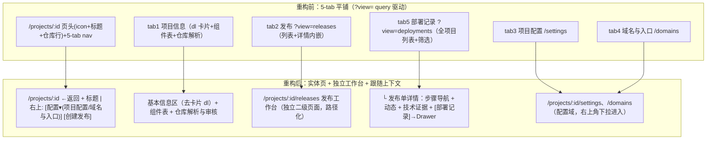
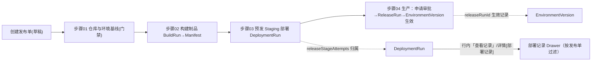
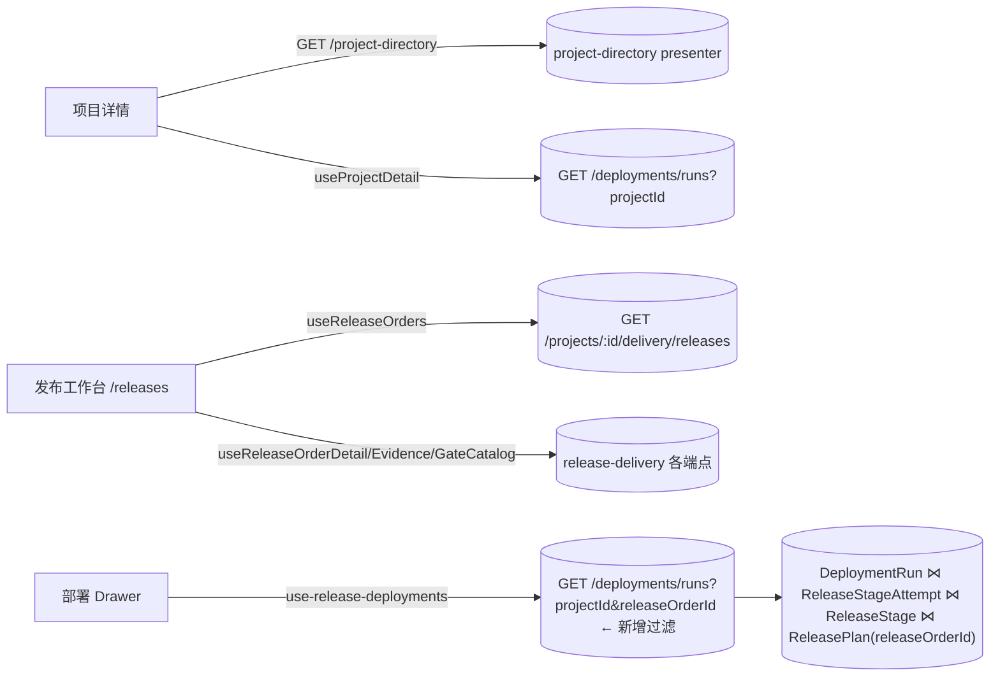
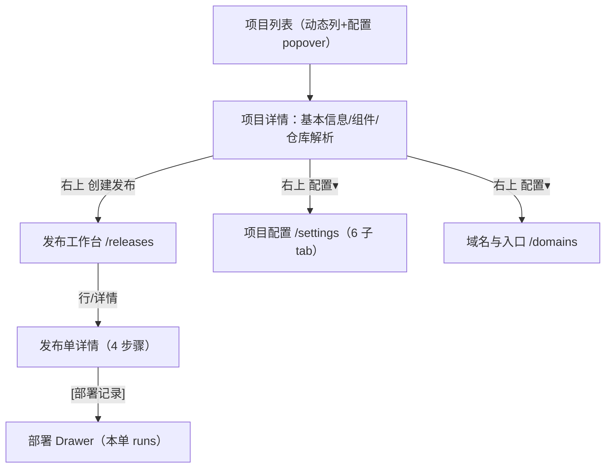
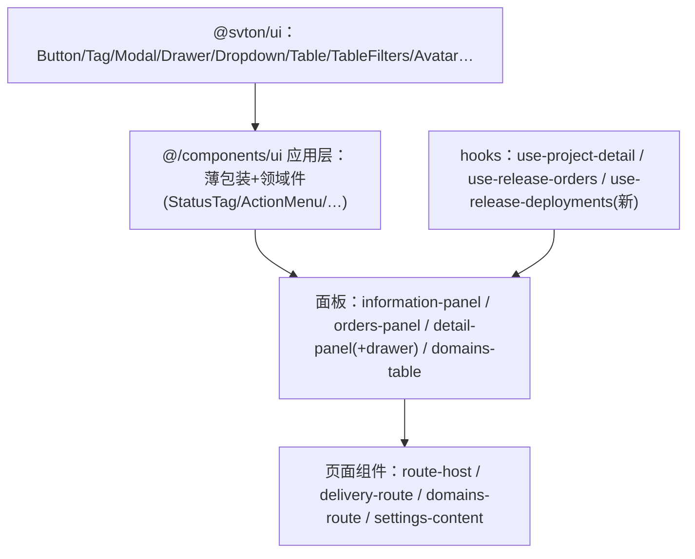

# 项目详情页 IA 重构（2026-08-23）：决策、五图与实现对照

> 依据实际代码梳理（非假设）：路由宿主 `project-route-host.tsx`、页头 `project-workbench-header.tsx`、
> 发布工作台 `project-delivery-route.tsx` / `release-order-detail-panel.tsx`、部署域
> `deployment.service.ts`（listRuns）与 `deployment-run-include.constants.ts`、数据链
> `DeploymentRun →(releaseStageAttempts)→ ReleaseStage →(releasePlanId)→ ReleasePlan →(releaseOrderId)→ ReleaseOrder`。

## 一、页面结构图（重构前 → 后）

## 二、业务逻辑图（发布流程与部署归属）

## 三、数据流向图（页面 → API → 表）

## 四、功能地图（项目域）

## 五、组织架构图（前端组件分层）

## 六、六项决策与实现对照

| # | 决策（设计/产品依据） | 实现 |
|---|---|---|
| 1 | 实体页惯例：← 返回（history>1 back 否则回列表），标题即身份 | `project-workbench-header.tsx` 重写 |
| 2 | 仓库/分支=低频参考，已在基本信息区与仓库解析区（重复违反"同一事实不进多容器"）→ 移除 | 同上（标题区仅名称） |
| 3 | 契约"排版优先于容器"→ 基本信息去卡片为分区排版 | `project-information-panel.tsx` |
| 4 | 发布=流程工作台非信息分区；双层 tabs（nav+步骤）认知负担大 → 独立二级页面（与 settings/domains 同级路径化）；`?view=releases` 302 兼容 | `/releases/page.tsx` + `releasesViewRedirectHref` |
| 5 | 低频配置不占一级导航 → 右上「配置▾」（@svton/ui Dropdown） | header 动作区 |
| 6 | 数据上部署即发布执行产物（releaseStageAttempts 归属链）→ 按单 Drawer + runId 深链聚焦；旧 `?view=deployments&runId` 重定向进 Drawer | `release-deployments-drawer.tsx` + API `releaseOrderId` 过滤 |

## 七、兼容与深链

- `?view=releases` → `/releases`（保留 create/releaseOrderId 等参数）
- `?view=deployments&runId=x` → `/releases?deploymentRunId=x`（详情页解析归属单开 Drawer）
- `deploymentRunHref(projectId, runId, releaseOrderId?)`：发布列表行与 run 行链接均携带 order 上下文
- 项目列表行「部署记录」动作移除（部署跟随发布，入口收敛到发布域）

## 八、遗留与建议

- `overview-tab.tsx` / `latest-deployment-hero.tsx` 为无引用死代码（含旧 view=deployments 注释），建议删除（本次未动，避免与在途分支冲突）
- Dashboard「最近部署」等站外入口若仍指向 `?view=deployments`，由统一重定向兜底，后续可直连 Drawer 深链
