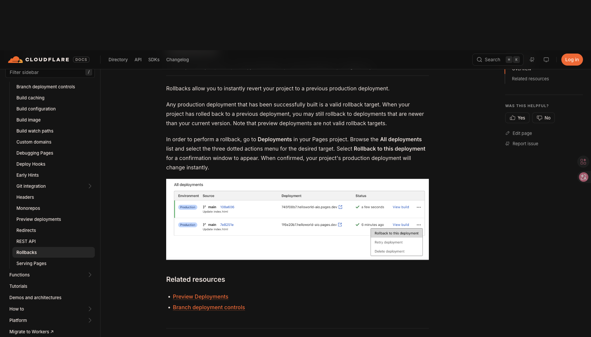
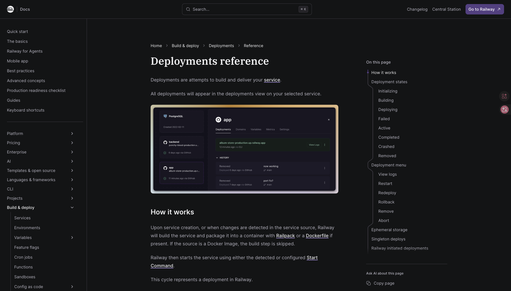
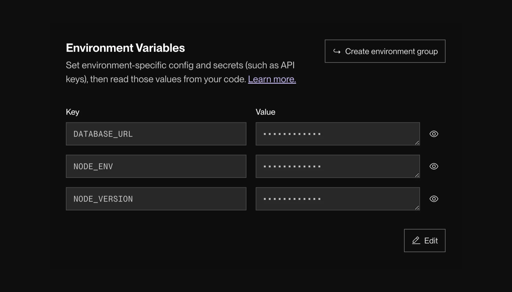
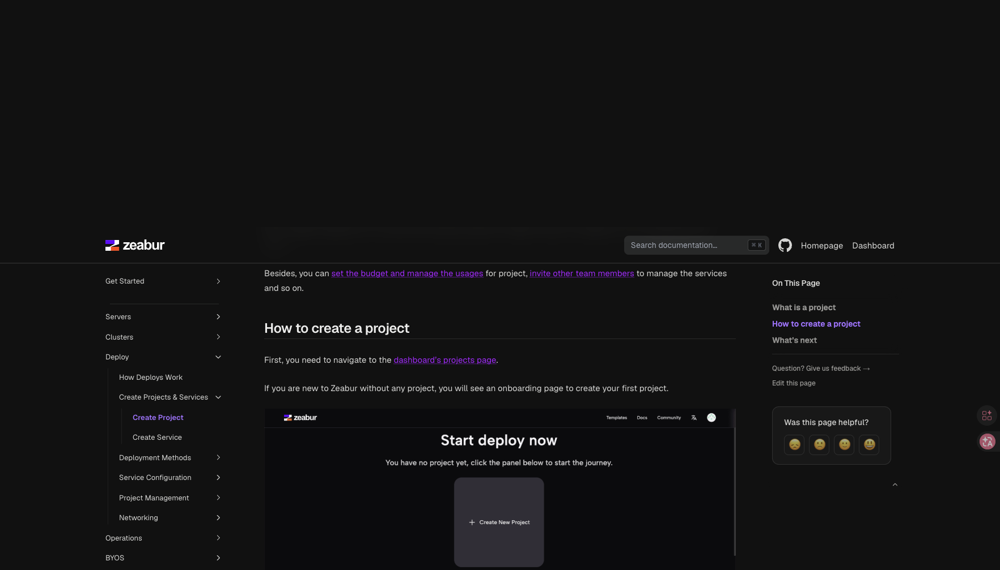
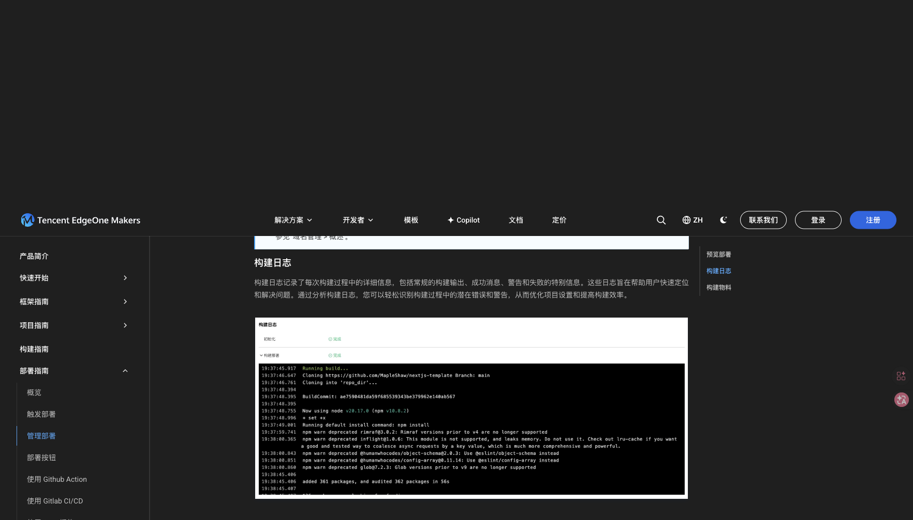

# Devpilot 项目模块竞品矩阵（官方证据版）

> 调研日期：2026-08-26（Asia/Shanghai）
> 调研对象：Vercel、Cloudflare Pages、Netlify、Railway、Render、Zeabur、腾讯 EdgeOne Makers
> 方法：优先尝试官方控制台；Vercel 控制台被登录墙阻断，其余产品未假定存在登录态。结论主要来自当前官方文档及文档中的官方控制台截图。黑屏、加载中、错误或错误裁切截图均已拒绝并从证据目录删除。
> 边界：这是竞品研究，不是对未登录控制台的完整可用性或无障碍审计；键盘、焦点、实时 loading/error 动画、响应式和读屏行为仍需登录后的真实任务流验证。

## 1. 证据等级与截图索引

证据等级：

- **A**：本次直接访问的官方控制台真实状态。
- **B**：当前官方文档中的官方控制台截图或明确操作步骤；可确认产品模型和界面结构，不能替代实时交互审计。
- **C**：当前官方文档文字；可确认语义或规则，不能确认精确视觉。
- **D**：登录墙或缺图，只能证明访问限制，不用于推断产品能力。

| 产品 | 本次可用证据 | 等级 | 已验收截图 |
|---|---|---:|---|
| Vercel | Dashboard 重定向登录；部署、变量、日志、域名、Promote 官方文档 | B/C，登录墙 D | [部署概览](../screenshots/2026-08-26/competitors/vercel/deployments-overview.png)、[环境变量](../screenshots/2026-08-26/competitors/vercel/environment-variables.png)、[日志](../screenshots/2026-08-26/competitors/vercel/logs.png)、[Promote](../screenshots/2026-08-26/competitors/vercel/promote-production.png)、[域名](../screenshots/2026-08-26/competitors/vercel/domains.png)、[登录墙](../screenshots/2026-08-26/competitors/vercel/login-wall.png) |
| Cloudflare Pages | Rollback、域名、构建配置官方文档及控制台截图 | B/C | [Rollback](../screenshots/2026-08-26/competitors/cloudflare/rollbacks.png)、[自定义域名](../screenshots/2026-08-26/competitors/cloudflare/custom-domains.png) |
| Netlify | Deploy、环境变量、域名官方文档；本轮仅环境变量截图通过视觉 QA | B/C | [环境变量](../screenshots/2026-08-26/competitors/netlify/environment-variables.png) |
| Railway | 部署、日志、变量、域名官方文档及控制台截图 | B/C | [部署视图与状态](../screenshots/2026-08-26/competitors/railway/deployments-states.png)、[部署操作](../screenshots/2026-08-26/competitors/railway/deployment-actions.png)、[日志](../screenshots/2026-08-26/competitors/railway/logs.png)、[变量](../screenshots/2026-08-26/competitors/railway/variables.png)、[域名](../screenshots/2026-08-26/competitors/railway/domains.png) |
| Render | Rollback、变量、日志、域名官方文档及控制台截图 | B/C | [Rollback](../screenshots/2026-08-26/competitors/render/rollbacks.png)、[变量 UI](../screenshots/2026-08-26/competitors/render/environment-variables.png)、[日志入口](../screenshots/2026-08-26/competitors/render/logs.png)、[域名流程](../screenshots/2026-08-26/competitors/render/domains.png) |
| Zeabur | 项目、Rollback、日志、变量、域名官方文档及控制台截图 | B/C | [项目空态](../screenshots/2026-08-26/competitors/zeabur/project-empty.png)、[Rollback](../screenshots/2026-08-26/competitors/zeabur/rollbacks.png)、[日志](../screenshots/2026-08-26/competitors/zeabur/logs.png)、[变量](../screenshots/2026-08-26/competitors/zeabur/environment-variables.png)、[域名](../screenshots/2026-08-26/competitors/zeabur/domains.png) |
| EdgeOne Makers | 中文官方部署、环境、日志、域名文档及控制台截图 | B/C | [部署生命周期](../screenshots/2026-08-26/competitors/edgeone/deployment-lifecycle.png)、[构建日志](../screenshots/2026-08-26/competitors/edgeone/deploys-logs.png)、[域名](../screenshots/2026-08-26/competitors/edgeone/domains.png) |

典型视觉证据：

## 2. 模块划分与总览

| 产品 | 项目/服务边界 | 项目总览如何组织 | 对 Devpilot 的对照意义 | 证据 |
|---|---|---|---|---|
| Vercel | Team → Project → Deployment；配置以 Project Settings 为中心 | Project Overview 首先展示最新 Production deployment、URL、commit、构建信息与错误；历史进入 Deployments | 项目页首屏应回答“线上是谁、来自哪个版本、是否健康、下一步去哪”，不要先展示低频配置 | [Deployments overview](https://vercel.com/docs/deployments/overview)、[Project settings](https://vercel.com/docs/project-configuration/project-settings) |
| Cloudflare Pages | Account → Workers & Pages → Project；项目内 Deployments / Custom domains / Settings | 项目工作区以少量顶级 Tab 分工，部署和域名不混入通用设置表单 | 一级模块应按用户任务分，而非按后端表结构分；Deployment 和 Domain 是独立工作区 | [Custom domains](https://developers.cloudflare.com/pages/configuration/custom-domains/)、[Rollbacks](https://developers.cloudflare.com/pages/configuration/rollbacks/) |
| Netlify | Team → Project/Site → Deploys / Domain management / Project configuration | Overview 是入口，部署、域名和配置分为明确侧栏模块 | Devpilot 项目详情可维持“概览—发布—域名—设置”，但发布对象应有跨页稳定身份 | [Manage deploys](https://docs.netlify.com/deploy/manage-deploys/manage-deploys-overview/)、[Assign domain](https://docs.netlify.com/manage/domains/manage-domains/assign-a-domain-to-your-site-app/) |
| Railway | Project 是服务画布；进入 Service 后使用 Deployments / Domains / Variables / Metrics / Settings | 总览以服务拓扑和当前环境为主；操作留在当前 service panel | 多服务项目适合“项目拓扑 + 对象侧面板”，避免把每个服务拆成孤立全屏页 | [Deployments reference](https://docs.railway.com/deployments/reference)、[Variables](https://docs.railway.com/variables) |
| Render | Workspace → Project/Environment → Service；Service 下 Events、Logs、Environment、Settings | 以长期运行的 Service 为主对象，deploy 是 Events 流中的事件 | 若 Devpilot 面向应用/服务运维，应让“当前服务”比“某次构建记录”更稳定 | [Deploys](https://render.com/docs/deploys)、[Projects and environments](https://render.com/docs/projects) |
| Zeabur | Project 是可共同部署和内网互通的 Services 集合 | 空项目只给 Deploy New Service；非空后按 service 配置、日志、域名 | 空态先建立对象；创建服务前不应展示无上下文的发布/配置按钮 | [Create Project](https://zeabur.com/docs/en-US/deploy/create/create-project)、[Core Deployment](https://zeabur.com/docs/en-US/deploy) |
| EdgeOne Makers | Project → Production/Preview system environments → deployments/domains | 面向前端/全栈站点；生产和预览是固定环境，部署由分支触发 | 对 Devpilot 可借鉴“环境是稳定容器、部署是不可变记录”，但不应照搬仅两个环境的限制 | [Build guide](https://pages.edgeone.ai/zh/document/build-guide)、[Deployment overview](https://pages.edgeone.ai/zh/document/deployment-overview) |

## 3. Deployments / Releases 列表、状态与流程编排

| 产品 | 列表/布局 | 状态与字段 | 动作编排 | 证据强度 |
|---|---|---|---|---:|
| Vercel | Deployments 独立列表；Overview 只保留最新生产部署 | environment、URL、commit、build time、framework、logs/errors | 行级省略号承载 Redeploy / Inspect / Assign domain / Promote；高风险动作进入确认 | B/C |
| Cloudflare Pages | All deployments 使用高密度表格 | Environment、Source/branch/commit、Deployment URL、Status、time、View build | Rollback 藏在目标行省略号，只有成功 Production 可作为目标；确认后立即切换生产 | B |
| Netlify | Deploys 支持 ID/branch 搜索，以及 time/context/status 过滤 | Successful、Unsuccessful、Enqueued、Pending review、Accepted、Rejected | 详情页 Publish Deploy 承担瞬时回滚；Lock 阻止新构建自动发布；Cancel/Retry/Delete/Download 均是对象动作 | C |
| Railway | 当前部署突出，历史折叠/弱化；service panel 保持上下文 | Initializing → Building → Deploying → Active；另有 Failed / Completed / Crashed / Removed | 状态决定动作可见性：View logs、Restart、Redeploy、Rollback、Remove、Abort；旧版本超出 retention 后隐藏 rollback | B |
| Render | Deploy 作为 Events feed 事件，而非单独数据库式大表 | deploy started/live/failed 与 commit、时间、触发来源共同展示 | Cancel 从 deploy detail；Rollback 位于历史成功事件，触发后创建新 deploy | B |
| Zeabur | Service 的 Deployments history | 每次部署形成 snapshot；回滚后也新增一条 deployment | Rollback → 新部署 → 标准 health check → 成功后切流；失败记录仍保留 | C |
| EdgeOne Makers | 部署列表 + deployment detail 的日志/构建物料 | Preview/Production、成功/失败/失效；每次部署唯一 URL | 成功构建物只保留最近三条；旧记录变“失效”并返回 401，可按原配置“重新部署”恢复 | B/C |

建议 Devpilot 的发布状态统一为三个层次：

1. **粗状态**（用于列表扫描）：等待、构建中、部署中、待审批、可用、失败、已取消、已回滚/已替换。
2. **当前阶段**（用于进行中详情）：拉取代码、安装依赖、构建、物料上传、目标部署、健康检查、审批/切流。
3. **终态原因**（用于排障）：失败阶段、错误摘要、最后有效日志、责任对象、可执行恢复动作。

不要把“审批未通过”“配置缺失”“构建失败”“部署失败”都压成同一个红色 `failed`；它们的责任人和修复入口不同。

## 4. Deployment detail、日志与 gates

| 产品 | 详情层次 | 日志展示 | Gate/健康语义 | 可借鉴点 |
|---|---|---|---|---|
| Vercel | Summary/Resources/Build outputs 与 logs 分层 | Build、Runtime、Activity、Audit、Drains 各自独立；Runtime 支持 search/inspect/share | Promote/production assignment 与 deployment checks/保护分开 | 首屏先摘要，原始证据按需展开；不要用一块无限长日志代替结论 |
| Cloudflare Pages | Deployment row → View build/detail | 构建日志绑定部署；rollback 是列表上下文动作 | 只有成功 Production 可回滚；Preview 不是回滚目标 | 动作可用性由真实状态决定，禁用时给原因 |
| Netlify | Deploy detail 是发布、日志、AI failure diagnosis 的汇合点 | 失败时在 log 上方提供 “Why did it fail?” 与诊断建议 | Pending review / Accepted / Rejected 把未知作者权限作为发布 gate | 故障摘要必须位于日志之前，并能跳到相关行 |
| Railway | 点击 deployment 打开 Details / Build Logs / Deploy Logs | 单部署面板和跨服务 Log Explorer 两种入口；filter 支持属性查询 | Healthcheck 成功后才 Active；状态控制动作菜单 | “对象日志”和“全局排障”应是两种模式，不要混成一页 |
| Render | Events → 点击 Deploy → deploy detail | 运行时日志另有可搜索 Log Explorer | 零停机切换；overlapping deploy policy；rollback 复用 artifact | 详情要显式说明切流/健康检查，而非把构建成功等同线上可用 |
| Zeabur | Deployments 中看 build logs；Logs tab 看 runtime | Runtime 实时流；支持关键词；重启/重部署后旧实例日志不保留 | Rollback 也走 health check，旧版本继续服务至新版本健康 | 必须展示日志保留边界；“当前无日志”不应假装“没有发生错误” |
| EdgeOne Makers | Build logs + 构建物料 | 阶段状态在日志上方，日志包含普通、成功、警告、失败 | 官方更新日志称构建过程已细分为更多步骤 | 可借鉴“阶段摘要 + 原始日志 + 构建物料”三层 |

## 5. Environment / config / variables / secrets

| 产品 | 作用域模型 | Secret 处理 | 变更何时生效 | 交互亮点 / 风险 |
|---|---|---|---|---|
| Vercel | Production、Preview、Development、Custom environments；Preview 可绑定 branch | 每项选择 Config 或 Secret；Secret 保存后 write-only | 只影响新 deployment，不回写历史 deployment | 变量和环境关系清楚；Promote/rollback 是否重建决定采用哪一版变量，必须在动作前说明 |
| Cloudflare Pages | Production / Preview 的构建变量 | 支持变量与 secret（Workers 侧 secret 独立管理） | 触发后续构建 | 简单但跨 Pages/Workers 的配置边界可能增加认知成本 |
| Netlify | site/shared；scope 为 Builds/Functions/Runtime/Post processing；值再按 deploy context | `Contains secret values` 后受额外访问限制且不可恢复为普通值；变化进入 audit log | 需要后续 build/deploy | “资源范围”和“环境上下文”是两个正交维度，适合 Devpilot 明确建模 |
| Railway | service/shared/reference；支持跨服务引用和 sealed variable | sealed 后 UI/API 均不可取回 | 变更先成为 staged changes，review 后 deploy 才生效 | 最值得抄：配置修改与生产应用分离，页面始终提示待发布变更 |
| Render | service variables、secret files、environment groups | 值默认掩码，可用 group 共享 | Save only / Save and deploy / Save, rebuild and deploy 三种显式选择 | 最值得抄：保存动作直接表达对构建与运行实例的影响 |
| Zeabur | service Variables，支持 other-service / special variable reference | 密码值掩码 | 注入新部署/运行服务，官方文档未给复杂版本绑定 | 变量引用比复制值更适合多服务项目；需防循环和来源不透明 |
| EdgeOne Makers | 每个变量含 name/value/note/scope；Production/Preview 独立 | 官方文档确认环境范围，未提供足够本轮视觉证据判断 secret reveal 细节 | 仅适用于新 deployment | “备注”是低成本高价值字段，能解释变量用途、来源、轮换责任 |

Devpilot 变量页建议固定展示：`Key`、`类型（Config/Secret）`、`生效环境`、`来源（项目/共享/服务引用）`、`最近修改人/时间`、`是否已进入当前 Release`、`待发布状态`。值不是默认主信息；Secret 值不应靠“眼睛按钮”无限次明文读取。

## 6. Domains

| 产品 | 域名对象与状态 | 流程 | 对 Devpilot 的启发 |
|---|---|---|---|
| Vercel | project domain、team ownership、DNS record、SSL/verification | Add domain → 提示 apex/www → 给出 A/CNAME/nameserver/TXT 方案 → verify → Ready | 不只显示字符串；必须显示绑定对象、DNS 期望值、验证状态和访问结果 |
| Cloudflare Pages | Custom domains 表格带 Verifying/Active 和 Complete DNS setup | Set up domain → 输入 → 平台内 zone 自动处理或外部 CNAME → 验证 | 表格适合多域名；状态旁直接给下一步动作 |
| Netlify | Primary domain、aliases、Deploy Preview/branch domain、Pending DNS verification | Domain management → Add → Verify → 选择 Netlify DNS 或外部 DNS | 域名与 deployment context 有明确关系，适合预览域名治理 |
| Railway | Public/private domains；generated/custom | Settings → Public Networking → Custom Domain → 同时配置 CNAME + TXT → verified | DNS 所需记录应成组展示；缺 TXT 时明确 404 后果 |
| Render | onrender.com + custom domain，自动 TLS | Add → 外部 DNS → Verify；失败提示等待传播；可禁用默认域名 | 把步骤编号、状态、影响和重试放在同一流程中 |
| Zeabur | generated `zeabur.app` 与 custom domain 两个并列入口 | Domains tab → Generate 或 Custom → DNS info → propagation | 创建入口先分“快速测试”和“正式域名”，文案目的明确 |
| EdgeOne Makers | project domain、deployment domain、custom domain；custom domain 可关联 Production/Preview | 添加 → ownership 验证 → CNAME → SSL/HTTP2/IPv6；中国大陆区还要备案 | 国内场景必须把备案/区域/证书作为前置条件；域名可切换环境但应审计和确认 |

## 7. Rollback / promote / approval

| 产品 | 行为模型 | 数据/配置影响是否说明 | 值得抄 / 不应抄 |
|---|---|---|---|
| Vercel | Instant rollback 是重新分配域名，不重建；Preview promote 通常重建；staged production promote 可不重建 | 官方明确 rollback 不重建环境变量，preview promote 会改用 Production vars | **抄**：一个动作前解释“会不会重建、域名指向、变量版本”；**不抄**：把三种语义都叫“发布” |
| Cloudflare Pages | 成功 Production 记录可瞬时切换；Preview 不可作为 rollback target | 文档明确目标资格，配置细节较少 | **抄**：行级入口 + 确认；禁用时解释目标为什么不合格 |
| Netlify | Publish previous atomic deploy；Lock 可阻止后续自动发布覆盖 | 文档警告 auto publishing 会覆盖 rollback | **抄**：事故恢复后提供“锁定发布”保护；但必须显示自动化是否会再次覆盖 |
| Railway | Rollback/Redeploy 都创建部署；旧 artifact 受 retention 限制 | 官方明确使用目标 source code，变量/配置快照细节不足 | **抄**：动作仅在可恢复版本显示；**不抄**：Rollback 与 Redeploy 文案近似、语义区分不足 |
| Render | 复用目标 artifact 创建 deploy；Dashboard rollback 自动关闭 autodeploy | 官方有逐项矩阵：start command/env/instance count 取目标，disk/domain 等保持当前 | **最值得抄**：确认前显示“目标版本 vs 当前配置”差异矩阵，并自动阻止坏提交再次覆盖 |
| Zeabur | 从 snapshot 创建新 deploy，healthcheck 后切流 | 明确不恢复 env、volume、database | **抄**：把不可回滚的数据写在确认框；数据库 migration 给硬警告 |
| EdgeOne Makers | 旧构建物失效时只能 redeploy；域名总指向环境最新成功 deployment | 无完整 rollback 官方证据 | 不应把“重新部署旧配置”伪装成瞬时回滚；Devpilot 要显示这两者耗时和风险不同 |

审批建议：竞品中真正清晰的审批证据少于部署/回滚证据。Devpilot 若已有 release gate，应将其设计为 Release 的阶段，而不是散落在审批中心：`检查项 → 证据 → 责任人 → 决策 → 决策影响 → 继续/阻断`。审批中心用于跨项目队列，项目发布页保留同一审批对象的上下文视图。

## 8. Empty / error / loading / blocked

| 状态 | 竞品处理 | Devpilot 应采用 |
|---|---|---|
| 空项目 | Zeabur 只显示 “Start deploy now / Create New Project” 和下一步 | 一个空态只解决一个阻塞；不要同时放域名、变量、发布、监控四个主按钮 |
| 无部署 | Vercel/Netlify/Cloudflare 的任务模型都先引导创建/触发 deployment | 说明触发来源（Git push、手动、API）并给首选动作，次选文档 |
| 失败部署 | Netlify 把 diagnosis 放在 log 上方；Render 从 Events 直达失败 deploy | 先展示失败阶段、摘要和修复动作，再让用户展开原始日志 |
| 排队/受限 | Railway 明确 Limited Access、队列继续、已有服务不受影响、恢复后自动处理 | 状态文案要同时回答原因、影响范围、是否自动恢复、用户是否需要行动 |
| 配置未生效 | Railway 的 staged changes、Render 的三种 Save 行为直接表达“保存”和“应用”差异 | 所有变更都显示“已保存 / 已发布 / 当前运行版本是否包含” |
| 域名验证中 | Cloudflare/Netlify/Render/Railway 都把验证状态与 DNS 下一步绑定 | 状态后紧跟精确操作；不要只给“处理中，请稍后” |
| Loading | 本轮无登录控制台，不能可靠验证 skeleton/延迟文案 | 需要 Devpilot 本地真实慢网测试；不得从官方静态截图推断 |

## 9. Tables vs cards、渐进披露与排版细节

### 9.1 什么时候用表格，什么时候用卡片

| 信息类型 | 竞品共识 | Devpilot 建议 |
|---|---|---|
| 多条 deployment/domain/variable | Cloudflare 等使用表格或紧凑行，方便比较状态、时间、环境和动作 | 5 条以上、列结构稳定时用表格；保留筛选、排序、键盘行导航 |
| 当前生产状态/最新部署 | Vercel、Railway 用更强的 overview/card 区域 | 只对“当前线上版本、阻断事故、待审批”使用强调卡；不要把所有区块都做大卡片 |
| 项目服务拓扑 | Railway/Zeabur 采用 canvas/service cards | 多服务项目可用画布；单服务项目不要强迫用户理解拓扑 |
| 空态/创建入口 | Zeabur 使用单卡单动作 | 主动作一个，次要入口用文字链接，不要并列多个 primary CTA |

### 9.2 技术证据的渐进披露

推荐顺序：

1. **结论**：可用/阻断/失败/待审批。
2. **可操作原因**：哪个 gate、变量、域名、目标或 healthcheck 失败。
3. **关键证据**：版本、环境、目标、责任人、时间、错误摘要。
4. **原始证据**：完整日志、构建物、API payload、审计事件。

Vercel、Railway、Render、EdgeOne 都把“摘要/阶段”和“原始日志”分层。Devpilot 不应默认铺开数百行日志，也不应只给一句 AI 总结；摘要必须能追溯到原始证据。

### 9.3 字体加粗到底加粗什么，为什么

| 字段/元素 | 推荐字重 | 原因 | 竞品证据 |
|---|---:|---|---|
| 项目/服务名、deployment 版本或 commit subject | 600 | 当前对象身份，用户必须先确认“我在操作谁” | Railway service/deployment panel、Render Events |
| 粗状态（Active/Failed/Verifying/Pending review） | 500–600，配语义色/图标 | 扫描表格时优先判断风险；不能仅靠颜色 | Cloudflare deployment/domain 表、Railway 状态 |
| 失败阶段、gate 名、阻断原因 | 600 | 决定下一步动作 | Netlify failure diagnosis、EdgeOne 阶段日志 |
| 环境名（Production/Preview） | 500 或 pill | 它是作用域，不是说明文字 | Vercel、Cloudflare、EdgeOne |
| 域名、commit SHA、变量 key、ID、命令 | 400–500 + monospace | 技术值要可复制和精确区分；不应靠粗体制造层级 | Vercel/Railway/Render 文档及 UI |
| 时间、触发来源、作者、分支、辅助说明 | 400、弱化色 | 支撑判断但不是主对象 | Render Events、Railway history |
| 表头 | 500 | 只建立列结构；表头不应比行内失败状态更抢眼 | Cloudflare deployments/domain tables |
| 高风险动作 | 500；危险色只用于最终 destructive action | 需要可见但不应常驻成全局 primary | Cloudflare row menu、Render rollback confirmation |

不建议：同时把项目名、URL、分支、时间、作者、状态、所有数值都加粗；这会消除信息层级。粗体应该服务于“对象、状态、阻断、下一步”，技术值靠等宽字体和复制 affordance 表达精确性。

## 10. 适合 Devpilot 抄作业的清单

### P0：直接纳入设计稿

1. **项目 Overview 四问** `[证据 B/C；当前前端可直接借鉴]`：当前生产版本、健康、最近变更、下一步；字段缺失时显示未知，不发明健康结论（Vercel）。
2. **Release 状态三层模型** `[证据 B/C；当前 ReleaseOrder/Run 可直接映射]`：粗状态、当前阶段、终态原因；阶段日志与原始日志分层（Railway、EdgeOne）。
3. **Release detail 首屏摘要** `[证据 B/C；当前字段条件借鉴]`：环境、版本、目标、触发来源、时间与 gate；只展示 API 已返回事实，日志放二级 Drawer。
4. **配置 staged changes** `[证据 B；仅限当前变量 draft/revision]`：变量/Secret reference/resource binding 的变更进入本地 draft，保存生成 append-only config revision；不宣称所有设置变更都会进入 Release（Railway）。
5. **变量保存影响选择** `[证据 B；needs backend]`：Render 的 save-only/redeploy/rebuild 三分支只保留为未来影响模型；当前 Devpilot 没有三种执行 API，不画可点击能力。
6. **回滚影响矩阵** `[证据 B/C；needs backend]`：代码/物料/变量/域名/数据差异可作为未来只读契约；当前缺完整 rollback policy 与执行模型，不纳入可用动作。
7. **事故保护** `[证据 B/C；needs backend]`：发布锁与自动发布覆盖保护需要新的持久状态、权限和恢复契约；当前不得展示可执行 lock（Netlify、Render）。
8. **域名任务流** `[证据 B/C；needs backend]`：DNS 记录组、传播 ETA、访问测试、备案/区域/证书都依赖未返回字段与执行器；当前只借鉴“状态紧邻精确动作”，仅展示 Site 字段和 dry-run plan。
9. **故障摘要在日志前** `[证据 B/C；当前 presenter 可直接借鉴]`：先显示失败阶段、根因、影响与决定，再展开 server-sanitized evidence（Netlify）。
10. **一个空态一个动作** `[证据 C；当前前端可直接借鉴]`：项目无服务或当前环境无 Site 时只保留一个精确创建动作（Zeabur）。

### P1：有条件借鉴

1. Railway 式服务画布仅用于真实多服务项目；单应用项目保留线性详情导航。
2. Netlify 式变量双维度（scope × deploy context）适合 Devpilot，但需用矩阵/过滤器避免单表过宽。
3. EdgeOne 的 Production/Preview 固定环境适合轻量项目；Devpilot 若支持 staging/custom environment，不要硬编码为两个。
4. Vercel 的行级省略号动作保持列表紧凑；高频 `查看详情/查看日志` 可直接显示，其余收进菜单。

### 不建议照抄

1. **把 Promote、Rollback、Redeploy 都翻译成“发布”**：它们是否重建、变量来源、耗时和回退路径不同。
2. **只展示红绿状态**：必须同时有文本、图标和原因。
3. **把日志当详情页主体**：日志是证据，不是结论。
4. **Rollback 只问“确定吗”**：必须说明数据、变量、域名和自动部署影响。
5. **所有内容做卡片**：部署历史、变量、域名需要高密度比较，优先表格/紧凑行。
6. **Secret 默认可反复明文查看**：采用 write-only/sealed 或受控短时查看，并写审计日志。
7. **域名只显示“验证中”**：必须提供缺少哪条 DNS 记录、复制值、检测结果和重试入口。

## 11. 官方来源清单

- Vercel：[Deployments](https://vercel.com/docs/deployments/overview)、[Logs](https://vercel.com/docs/logs)、[Environment variables](https://vercel.com/docs/environment-variables)、[Promoting deployments](https://vercel.com/docs/deployments/promoting-a-deployment)、[Add a domain](https://vercel.com/docs/domains/working-with-domains/add-a-domain)、[Rollback CLI](https://vercel.com/docs/cli/rollback)
- Cloudflare：[Rollbacks](https://developers.cloudflare.com/pages/configuration/rollbacks/)、[Custom domains](https://developers.cloudflare.com/pages/configuration/custom-domains/)、[Build configuration](https://developers.cloudflare.com/pages/configuration/build-configuration/)
- Netlify：[Manage deploys](https://docs.netlify.com/deploy/manage-deploys/manage-deploys-overview/)、[Environment variables](https://docs.netlify.com/build/environment-variables/overview/)、[Secrets Controller](https://docs.netlify.com/build/environment-variables/secrets-controller/)、[Assign a domain](https://docs.netlify.com/manage/domains/manage-domains/assign-a-domain-to-your-site-app/)
- Railway：[Deployments reference](https://docs.railway.com/deployments/reference)、[Logs](https://docs.railway.com/observability/logs)、[Variables](https://docs.railway.com/variables)、[Domains](https://docs.railway.com/networking/domains/working-with-domains)
- Render：[Deploys](https://render.com/docs/deploys)、[Rollbacks](https://render.com/docs/rollbacks)、[Environment variables](https://render.com/docs/configure-environment-variables)、[Troubleshooting deploys](https://render.com/docs/troubleshooting-deploys)、[Custom domains](https://render.com/docs/custom-domains)
- Zeabur：[Create project](https://zeabur.com/docs/en-US/deploy/create/create-project)、[Rollbacks](https://zeabur.com/docs/en-US/operations/deployment/rollbacks)、[Logging](https://zeabur.com/docs/en-US/operations/monitoring/logging)、[Environment variables](https://zeabur.com/docs/en-US/deploy/config/environment-variables)、[Public networking](https://zeabur.com/docs/en-US/deploy/networking/public-networking)
- EdgeOne Makers：[部署概览](https://pages.edgeone.ai/zh/document/deployment-overview)、[管理部署](https://pages.edgeone.ai/zh/document/manage-deploys)、[构建与环境](https://pages.edgeone.ai/zh/document/build-guide)、[自定义域名](https://pages.edgeone.ai/zh/document/custom-domain)、[更新日志](https://pages.edgeone.ai/zh/document/release-notes)

## 12. 明确缺口

- Vercel Dashboard 本次只到登录墙；没有把登录页当产品模块证据。
- Netlify 的部署/域名官方页面在本轮截图捕获中多次产生全黑图片，已删除；相关结论只按官方文字证据记为 C，不伪造界面截图。
- Cloudflare 构建变量页面和 EdgeOne 环境页各有一张黑图，已删除；变量/环境结论只使用官方文字。
- 没有登录态，无法验证 hover、focus、键盘、loading、toast、确认弹窗、响应式和网络失败恢复；这些应成为后续真实控制台对抗性审查的独立验收项。
