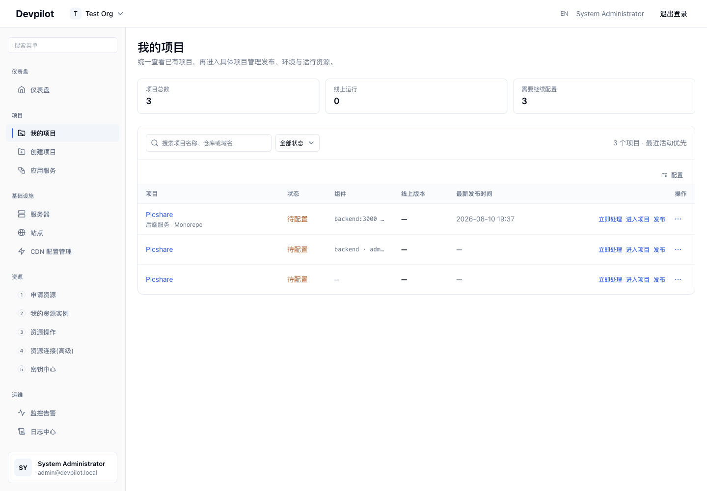
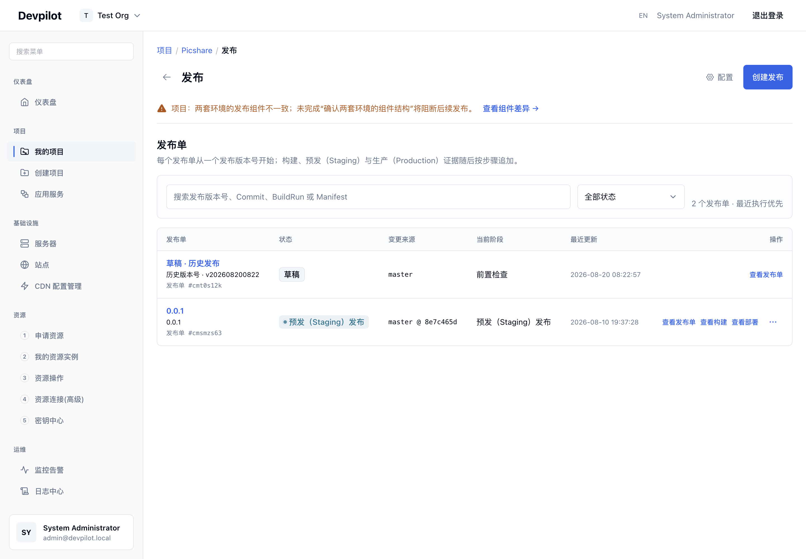
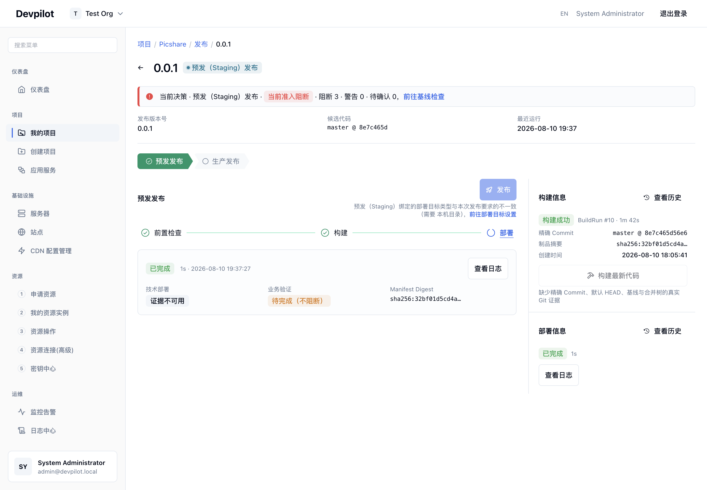
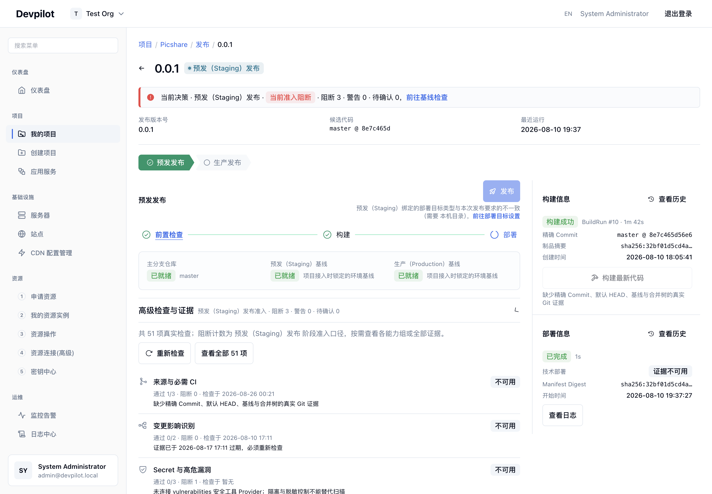
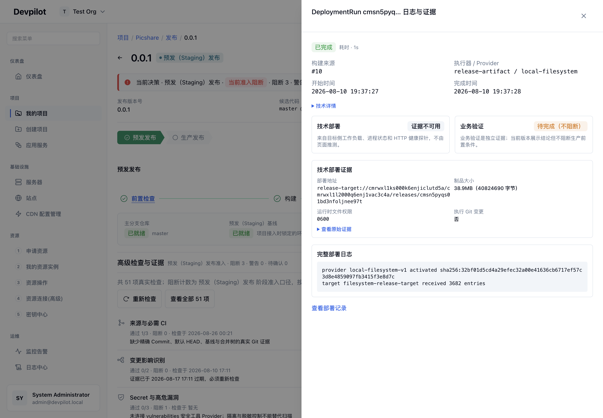
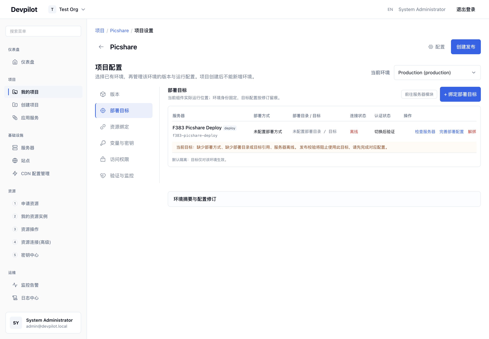
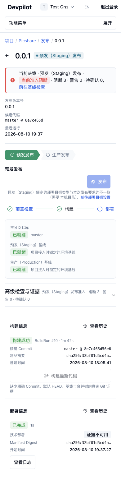

# Devpilot 当前运行态视觉与可访问性审计（2026-08-26）

## 1. 审计范围与证据口径

- 对象：本地当前运行态 `http://localhost:3120`，Picshare 项目 `cmrwxl1ks000k6enjiclutd5a`。
- 方法：使用独立 Chromium 任务空间逐页导航，先截图、再核对截图与可访问性树；本报告只引用本轮新截图。
- 视口：桌面主证据约 `1440 × 1000`；移动关键页为 `390px` 宽，并增加页面高度以避免把正常页面误判为裁切。
- 覆盖：项目列表、项目信息、发布列表、发布详情的预发/生产/准入/构建/部署日志、项目配置六个子区、域名入口、部署记录、创建发布与发布执行各步骤，以及三个移动关键页。
- 健康度定义：`健康` 表示内容完整加载且截图已人工复核；`可达但有缺陷` 表示核心状态可核对、同时存在明确的布局或路由问题；加载中、错误页和裁切图均未作为有效证据。
- 运行态说明：审计开始时既有 MySQL 容器异常退出，导致 API 重启与登录请求失败；在已授权的可恢复范围内，仅启动既有数据库容器并等待 API/Web 恢复，未改代码、镜像或数据卷。完整恢复日志：`/tmp/codex-tool-runs/svton/project-audit-runtime-recovery.log`。

## 2. 页面与流程覆盖清单

| # | 页面 / 状态 | URL / 进入方式 | 健康度 | 本轮证据 | 关键内容与交互 |
|---|---|---|---|---|---|
| 1 | 登录 | `/login` | 健康 | [01-login-desktop.png](../screenshots/2026-08-26/current/01-login-desktop.png) | 账号、密码、登录按钮；API 恢复后可正常进入工作台。 |
| 2 | 项目列表 | `/projects` | 健康 | [02-project-list-desktop.png](../screenshots/2026-08-26/current/02-project-list-desktop.png) | 总数/线上运行/待配置摘要，搜索与状态筛选，3 个项目行，立即处理/进入项目/发布/更多操作。 |
| 3 | Picshare 项目信息 | `/projects/cmrwxl1ks000k6enjiclutd5a` | 健康 | [03-project-info-desktop-cdp.png](../screenshots/2026-08-26/current/03-project-info-desktop-cdp.png) | 仓库、默认分支、发布策略、组件类型/状态/版本/路径与端口、发布入口。 |
| 4 | 发布列表 | `/projects/cmrwxl1ks000k6enjiclutd5a/releases` | 健康 | [04-release-list-desktop.png](../screenshots/2026-08-26/current/04-release-list-desktop.png) | 两套环境组件不一致的阻断提示、发布筛选、历史草稿与当前 `0.0.1`、查看部署/进入发布等操作。 |
| 5 | 发布详情：预发 | `/projects/.../releases/cmsmzs63q00ek1700clhiytmj` | 健康 | [05-release-detail-staging-desktop.png](../screenshots/2026-08-26/current/05-release-detail-staging-desktop.png) | 当前准入阻断计数、候选提交、预发/生产阶段、准入/构建/部署步骤、预发部署证据与发布阻断原因。 |
| 6 | 发布详情：生产 | 同页切换 Production | 健康 | [06-release-detail-production-desktop.png](../screenshots/2026-08-26/current/06-release-detail-production-desktop.png) | 构建产物摘要、生产待发布状态、发布生产按钮、环境版本入口。 |
| 7 | 准入概览 | 同页“准入校验” | 健康 | [07-release-gate-baseline-desktop-accepted.png](../screenshots/2026-08-26/current/07-release-gate-baseline-desktop-accepted.png) | 主分支、预发基线、生产基线的就绪状态。 |
| 8 | 准入明细展开 | 同页展开“51 项真实检查” | 健康 | [08-release-gate-expanded-desktop.png](../screenshots/2026-08-26/current/08-release-gate-expanded-desktop.png) | 4 组检查、可用/不可用计数、阻断数、证据缺失与目录异常结论。 |
| 9 | 部署日志抽屉 | 预发部署“查看日志” | 健康 | [09-release-deployment-log-drawer-desktop.png](../screenshots/2026-08-26/current/09-release-deployment-log-drawer-desktop.png) | run 状态、耗时、构建号、provider、起止时间、技术部署/业务验证、制品地址/大小/权限、原始证据与日志。 |
| 10 | 配置：版本 | `/projects/.../settings`，版本 tab | 可达但有缺陷 | [10-settings-version-desktop.png](../screenshots/2026-08-26/current/10-settings-version-desktop.png) | 环境版本、版本表、生产审批状态、修订与部署证据；桌面表格操作区发生碰撞。 |
| 11 | 配置：部署目标 | 同页“部署目标” | 健康 | [11-settings-deployment-target-desktop.png](../screenshots/2026-08-26/current/11-settings-deployment-target-desktop.png) | 目标卡、部署方式/目标/连接状态/认证状态、检查服务器/补齐配置/解绑，以及精确阻断说明。 |
| 12 | 配置：资源绑定 | 同页“资源绑定” | 健康 | [12-settings-resource-binding-desktop.png](../screenshots/2026-08-26/current/12-settings-resource-binding-desktop.png) | 服务器/站点/资源/实例/CDN/请求等库存计数，绑定修订，组件不可部署提示。 |
| 13 | 配置：变量与密钥 | 同页“变量与密钥” | 健康 | [13-settings-vars-secrets-desktop.png](../screenshots/2026-08-26/current/13-settings-vars-secrets-desktop.png) | 快照保存边界、变量空态、添加/导入/保存、密钥引用与历史。 |
| 14 | 配置：访问控制 | 同页“访问控制” | 健康 | [14-settings-access-desktop.png](../screenshots/2026-08-26/current/14-settings-access-desktop.png) | 控制面角色、deny 优先、生产审批边界、策略空态、默认团队角色、环境键锁定。 |
| 15 | 配置：验证与监控 | 同页“验证与监控” | 健康但内容不足 | [15-settings-validation-monitoring-desktop.png](../screenshots/2026-08-26/current/15-settings-validation-monitoring-desktop.png) | 仅有可观测性基线选择器；未配置时缺少近场引导。 |
| 16 | 域名与入口 | `/projects/cmrwxl1ks000k6enjiclutd5a/domains` | 健康但为空 | [16-domains-entry-desktop.png](../screenshots/2026-08-26/current/16-domains-entry-desktop.png) | 环境切换、添加域名入口、空态。 |
| 17 | 部署记录 | 发布列表“查看部署” | 健康 | [17-deployment-record-drawer-desktop.png](../screenshots/2026-08-26/current/17-deployment-record-drawer-desktop.png) | 可从发布上下文打开部署记录/证据抽屉。旧 `?view=deployments&runId=...` 深链持续停留“加载中”，见 blocker B1。 |
| 18 | 创建发布 | 发布列表“创建发布” | 健康 | [18-release-wizard-step1-desktop.png](../screenshots/2026-08-26/current/18-release-wizard-step1-desktop.png) | 单一弹窗：版本名称、语义化版本、可选说明；明确“不会自动构建/选择提交/部署”，缺字段时禁用创建并给出原因。 |
| 19 | 发布步骤：构建 | 发布详情“构建” | 健康 | [19-release-step-build-desktop.png](../screenshots/2026-08-26/current/19-release-step-build-desktop.png) | BuildRun #10、耗时、提交、日志；再次构建因缺准确提交/HEAD/基线/merge-tree 证据而禁用。 |
| 20 | 移动：项目列表 | `/projects`，390px | 可达但有缺陷 | [20-project-list-mobile-390.png](../screenshots/2026-08-26/current/20-project-list-mobile-390.png) | 摘要改为纵向；列表仍保持桌面表格，横向溢出，状态之后的内容与行操作默认不可见。 |
| 21 | 移动：发布详情 | 当前发布详情，390px | 健康 | [21-release-detail-mobile-390.png](../screenshots/2026-08-26/current/21-release-detail-mobile-390.png) | 阻断提示、版本、环境链、执行步骤与证据区均能纵向重排。 |
| 22 | 移动：版本配置 | 配置版本，390px | 可达但有缺陷 | [22-settings-version-mobile-390.png](../screenshots/2026-08-26/current/22-settings-version-mobile-390.png) | 六 tab 收起为“配置类型”选择器；版本表仍横向裁切，详细卡片下移。 |

## 3. 关键截图

### 项目与发布主链

### 配置、域名与移动

## 4. 信息层级与字段级观察

### 4.1 项目列表

- 摘要数值采用最大、加粗的数字，`项目总数 / 线上运行 / 需要继续配置` 为 `12px`、常规字重、灰色标签。原因合理：先让用户扫描运营数量，再读维度名称。
- 项目名 Picshare 是蓝色链接，实测约 `14px / 400`，点击区域约 `55 × 17px`；它承担对象识别与进入详情双重职责，但不像主操作，也不满足舒适触控尺寸。
- `待配置` 使用橙色状态，能与普通文本区分；组件串用紧凑等宽风格表达端口和组件名，但容器可见宽度约 `104px`、内容滚动宽度约 `462px`，信息被省略得过早。
- 行内的 `立即处理 / 进入项目 / 发布` 都是蓝色文字，权重几乎相同；更多按钮是 `36 × 36px`。对象、问题、去向存在，但用户必须逐项读文字判断主次。
- 桌面布局信息密度偏高；移动端仍是横向表格，默认只看见项目与状态，最重要的修复/发布操作落到屏幕外。

### 4.2 项目信息

- 仓库地址使用等宽/紧凑样式，默认分支 `master` 和发布策略 `标准发布` 加粗：前者是机器标识，后两者是会影响后续发布决策的配置，所以强调逻辑成立。
- 组件表中名称和类型置前，绿色 `active` badge 显示可用性；`master@8e7c465d` 与 `配置已变更` 被强调，组件路径和端口降为灰色辅助信息。层级真实、可扫描。
- 风险是单行同时承载组件、运行时、状态、提交、变更、路径、端口；对首次进入的用户，缺少“哪些字段会阻断发布”的视觉分组。

### 4.3 发布列表与详情

- 发布列表顶部橙色 banner 直接说明“两套环境组件不一致”及“将阻断后续发布”，并在同一上下文给出 `查看组件差异`。这是当前最成熟的原因—影响—行动闭环。
- 版本 `0.0.1`、环境 `Staging`、候选提交和更新时间按主次排布；但行操作仍以多个同色文字按钮并列，缺少一个明确的默认去向。
- 详情顶部红色 `当前准入阻断` 与 `阻断 3 / 警告 0 / 待确认 0` 是最高视觉层级，适合发布决策。候选提交和最近 run 置于版本标题下，便于核对当前操作对象。
- 环境链和执行步骤是两套相邻导航：`预发 → 生产` 代表生命周期，`准入 → 构建 → 部署` 代表执行步骤。语义正确，但同时出现时认知负荷高；建议在标题或辅助标签中明确“环境”和“步骤”。
- 预发部署已完成，但技术部署证据不可用、业务验证待完成，同时“发布”因目标配置不一致禁用；界面给出精确原因与 `前往部署目标`，没有把完成状态伪装成可发布。
- 切换到 Production 后，内容已展示生产摘要与 CTA，但页头仍显示 `预发（Staging）发布` badge，当前环境上下文不一致，属于高优先级决策风险。
- 51 项门禁按领域分组并给出可用/不可用/阻断数，`门禁目录缺失、重复或数量异常；当前结论已按不通过处理` 足够真实。问题在于决策结论、四组明细、环境链、步骤导航和右侧摘要同时争夺注意力。
- 部署抽屉把 run、构建、provider、时长、技术/业务验证、制品地址/大小/权限、原始证据和日志都放在同一层。对排障有价值，但长哈希/路径换行不稳定；建议默认摘要，原始证据与日志按需展开。

### 4.4 配置六区

- 桌面采用左侧垂直配置导航，移动收起为 `配置类型` 下拉，模块覆盖明确。
- `版本`：当前环境版本、版本表、修订与部署证据同时出现。表头约 `12px / 500` 灰色，单元格约 `14px`；`待生产审批` badge 与操作/日期发生实际重叠。移动端表格继续横向滚动，名称 `0.0.1` 和版本 `0.0.1` 重复但没有解释两个字段的差异。
- `部署目标`：对象名 `F383 Picshare Deploy` 加粗，slug 降级；`Offline` 红色、未配置项明确，橙色行把缺少字段、发布影响和 `补齐配置` 放在一起。缺点是检查服务器、补齐配置、解绑等操作都采用近似文字权重。
- `资源绑定`：库存以大量计数 chip 呈现，能快速确认“1 server / 1 site / 其余为 0”；但所有 chip 等权，发布真正依赖的资源没有被优先突出，且部分文案偏内部实现边界。
- `变量与密钥`：先说明 DeploymentRun 快照会存什么，空态区提供添加、导入、保存。蓝色 `保存` 在没有编辑内容时仍显得可用，容易造成无效操作预期。
- `访问控制`：用蓝色说明框解释角色、deny 优先和生产审批边界；环境键 `production` 使用加粗等宽样式并说明首次部署后锁定，强调原因准确。策略为空时只有说明和审批记录入口，缺少直接创建/绑定策略的路径。
- `验证与监控`：只有 `可观测性基线：尚未配置` 选择器，大片空白；没有告诉用户不配置会影响哪一步，也没有近场的 provider/基线创建 CTA。

### 4.5 域名、部署记录与创建发布

- 域名页有环境选择和右上角 `添加域名入口`，但中央空态仅写“当前环境还没有域名入口”，没有说明用途、影响和下一步；用户视线落在空态时，行动在远处。
- 部署记录在当前 IA 中通过发布列表的 `查看部署` 可达，抽屉保留了发布上下文，适合核对。旧深链无限加载说明路由兼容性或初始化存在缺口。
- 当前所谓“发布向导”不是多步向导，而是单一创建弹窗；它只收版本名称、语义版本和说明，并明确不会自动构建、选择提交或部署。后续步骤在发布详情内依次完成准入、构建、部署、生产发布，信息模型真实，但流程跨页面、跨导航模型。
- 缺版本名称时禁用创建，同时显示 `请填写版本名称后再创建发布`，禁用原因可见；这是良好的表单反馈。

## 5. 可访问性观察

### 已确认的优点

- 采样页面中的主要可交互控件都有可访问名称，未发现无名称按钮或链接。
- 环境链、发布执行步骤、环境配置分别暴露为有名称的 tablist；部署抽屉暴露为有标题的 dialog；发布阻断使用 alert；日志区域使用 log 语义。
- 标题、面包屑、状态文本与可见字段基本一致，技术状态没有只依赖颜色表达。

### 已确认或高可信风险

- 多类点击目标小于 44px：侧栏导航约 36px 高、环境 tab 约 32px、执行步骤约 36px、面包屑链接约 20px；项目行文字操作仅约 16px 高，更多按钮 `36 × 36px`。这会显著影响触控和运动障碍用户，但本轮不作完整 WCAG 合规结论。
- 小号灰色辅助文字大量使用 `12px`；从截图看层级清楚，但未做逐色数值对比度计算，不能确认所有组合满足阈值。
- 移动项目列表和版本表存在确认的横向溢出，默认隐藏后续字段和操作；这不仅是视觉问题，也影响键盘/屏幕放大用户的顺序理解。
- 桌面版本表状态、时间与操作发生碰撞，可能造成误读或误触。
- 本轮没有完成键盘全流程、焦点可见性、dialog 焦点锁定/返回、屏幕阅读器播报和 200% 缩放测试，这些必须列为后续专项，不应由截图推断通过。

## 6. 优先级结论与可抄作业方向

| 优先级 | 问题 / 机会 | 证据 | 建议方向 |
|---|---|---|---|
| P0 | Production 内容与页头 `预发（Staging）发布` badge 不一致 | 06 | 让页头 badge、环境链、主 CTA 共用单一环境状态源；环境切换时同步更新。 |
| P0 | 版本配置桌面表格发生状态/操作碰撞 | 10 | 固定关键列最小宽度；将次要时间移入详情；主操作收敛为一个按钮 + overflow。 |
| P1 | 移动列表/版本表横向溢出并隐藏操作 | 20、22 | 移动改为卡片或“对象摘要 + 状态 + 主操作 + 详情展开”，不要缩放桌面表格。 |
| P1 | 多数高频点击目标小于 44px | 02、05、10、21 | 文字操作增加可点击 padding，tab/导航至少 40–44px；保留视觉紧凑度但扩大命中盒。 |
| P1 | 环境链与执行步骤同时出现，层级难辨 | 05、08、21 | 加显式组标签；环境置于页头，步骤作为内容区唯一主 tab；避免两个同型导航相邻。 |
| P1 | 部署/门禁信息密度过高 | 08、09 | 首屏只保留结论、影响、下一步和关键证据；原始检查、证据、日志二级展开。 |
| P1 | 旧部署深链持续加载 | B1 | 增加路由迁移/重定向或失败态；保证旧书签能落到对应发布的部署抽屉。 |
| P2 | 域名与监控空态只有“无”，没有近场行动 | 15、16 | 在空态内写清用途/影响，并放置唯一主 CTA；顶部全局新增保留为次入口。 |
| P2 | 项目行和部署目标操作同色同权 | 02、11 | 每个对象保留一个主操作，修复动作紧邻阻断原因，低频动作进入更多菜单。 |
| P2 | 配置字段存在内部实现措辞、重复版本值 | 10、12 | 面向用户解释“名称 vs 语义版本”“绑定修订对发布的影响”；内部边界下沉到帮助。 |

## 7. Named blockers 与证据边界

- **B1 — legacy-deployment-deeplink-stuck-loading**：`/projects/cmrwxl1ks000k6enjiclutd5a?view=deployments&runId=cmsn5pyqs01bd3nfoljnee97t` 多次等待仍停在“加载中…”，无法取得健康截图；部署记录可通过发布列表 `查看部署` 正常打开，因此保留可达证据 17，并拒绝加载中截图。
- **B2 — destructive-release-actions-not-exercised**：为保持只读审计，没有创建新发布、触发构建、发布生产、修改配置、绑定资源或新增域名；创建弹窗、禁用原因和现有发布执行状态均已覆盖。
- **B3 — deep-accessibility-interaction-not-proven**：本轮验证了可访问名称与基础结构，但未执行完整键盘、焦点、屏幕阅读器、缩放和颜色数值审计。
- **B4 — repository-analysis-below-fold-not-exhausted**：项目信息主截图覆盖仓库与组件关键字段；页面下方的完整仓库分析长内容未逐段截图，本轮不以其作为视觉结论依据。
- **B5 — existing-repository-intake-no-healthy-current-screenshot**：`/projects/create` 的三步 connect / analysis review / baseline finalize 未取得一组健康当前截图；不能由项目详情或仓库分析折叠区替代该流程证据。
- **B6 — generated-project-wizard-no-healthy-current-screenshot**：`/projects/new` 的五步 basic / subprojects / features / resources / preview+ZIP 未取得健康当前截图；registry、资源模式和生成失败恢复仍是 named visual gap。
- **B7 — quick-publish-flow-no-healthy-current-screenshot**：`/projects/:id/publish` 的 Staging 选择、effective config review、create/build/deploy 与分阶段 retry 未取得健康当前截图。当前 release create Modal 只证明 `releases?create=true` 创建 ReleaseOrder，**不是** `/publish` 三步快捷发布的视觉证据；兼容深链 `/projects/:id/publish/:releaseOrderId` 也仅能以 redirect contract 证明。

## 8. 总结

当前 Devpilot 的优势是状态表达真实：阻断原因、环境差异、缺失证据、禁用原因、技术部署与业务验证被明确拆开，发布主链并未用虚假的成功状态掩盖缺口。最需要修正的是决策上下文一致性、表格响应式、操作命中尺寸和信息密度。优先修复 P0/P1 后，再用带近场行动的空态补齐配置与域名的学习成本，能在不改变真实数据模型的前提下明显提升可读性、可操作性和发布安全感。
