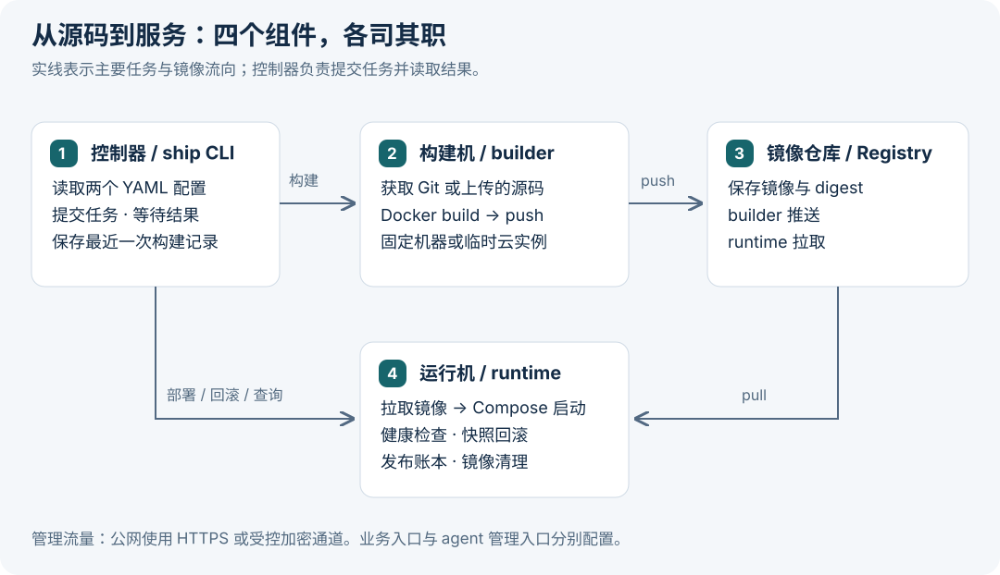
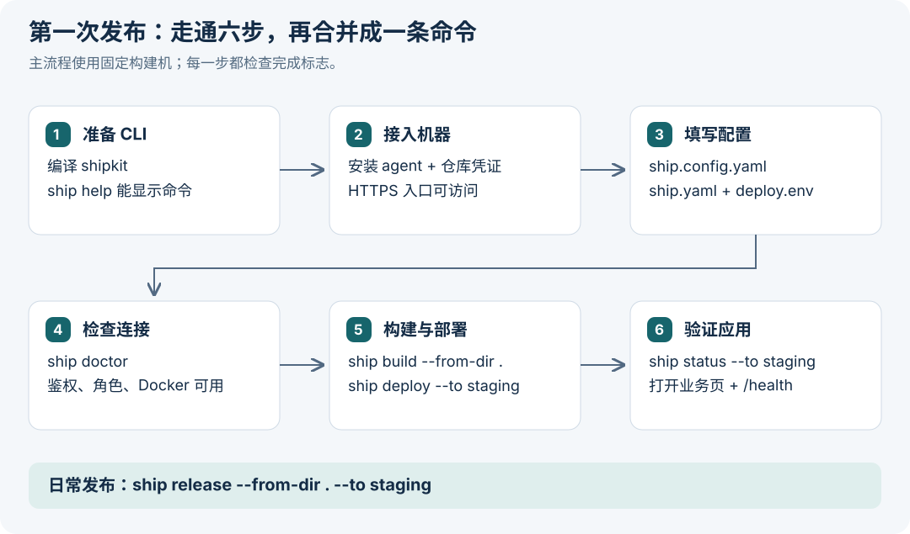
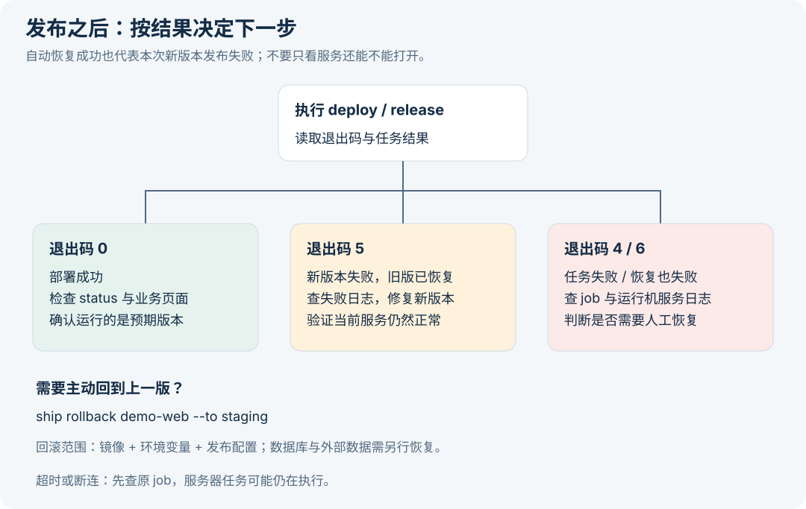

# Shipkit 图文使用手册

> 从准备机器到发布、回滚与清理。适用于当前仓库版本，核对日期：2026-09-29。
>
> 本文的域名、令牌和资源 ID 都是示例。流程图是操作示意，不是真机验收截图。当前本地回归记录为 92/92 通过；TLS 实机、云端到期销毁、真实 Docker 长 GC 仍待环境验收。

**阅读路线：** 第一次使用按 1–6 节操作；日常发布查第 7 节；出错查第 8 节；需要临时云构建机再看第 9 节。

## 1. Shipkit 能帮你做什么

Shipkit 把应用源码构建成 Docker 镜像，推送到镜像仓库，再让指定服务器拉取镜像并启动应用。它提供 CLI 和机器上的 agent，适合从本机发起交付。目前使用 Docker Compose 运行应用。



| 组件 | 放在哪里 | 负责什么 |
| --- | --- | --- |
| 控制器 `ship` | 你的电脑或交付服务器 | 读取配置、提交任务、等待结果 |
| builder agent | 固定构建机或临时腾讯云 CVM | 获取源码、构建和推送镜像 |
| 镜像仓库 | 已有 ACR、TCR 或自建 Registry | 保存可交付镜像 |
| runtime agent | 应用运行服务器 | 拉取镜像、部署、健康检查、回滚、清理镜像 |

CLI 的日常编排使用 HTTP API；公网链路需配 HTTPS，受控内网可按网络方案接入。首次安装允许由管理员通过 SSH 或现有运维工具完成。

**三个容易混淆的文件：**

| 文件 | 回答的问题 | 是否应提交 Git |
| --- | --- | --- |
| `ship.yaml` | 应用叫什么、怎么构建、端口与健康检查是什么 | 通常提交 |
| `ship.config.yaml` | 使用哪台构建机、哪个仓库、部署到哪里 | 含 agent token，勿提交真实配置 |
| `deploy.env` | 运行时需要哪些环境变量 | 含密钥时勿提交；可提交脱敏的 `.example` |

## 2. 第一次使用前准备什么

本手册先用 **static 固定构建机** 跑通完整流程，避免首次上手同时处理云资源生命周期。

| 准备项 | 需要满足的条件 |
| --- | --- |
| 控制器 | Node.js ≥ 20、pnpm、仓库依赖；Git 源码模式需要 Git，本地上传模式需要 tar |
| 两台 Linux 机器 | 一台 builder、一台 runtime；安装脚本支持 apt/dnf/yum 与 systemd；有 Docker 和 Compose 插件，或允许安装 |
| 镜像仓库 | 已建好目标命名空间；builder 有推送凭证，runtime 有拉取凭证 |
| 网络 | 控制器能访问两个 agent；builder 能访问源码、依赖和仓库；runtime 能访问仓库 |
| TLS | 公网访问时准备两个 agent 域名及对应证书/反代；本文用 `builder.example.com`、`runtime.example.com` |
| 应用 | Dockerfile、`ship.yaml`、运行环境变量，以及一个实际可用的健康检查路径 |

两种角色也可以共用专用测试机，但需要明确 agent 角色、端口和资源占用。本文以分开的机器为例。



## 3. 准备控制器命令

在 **svton 仓库根目录** 执行。新检出的仓库若尚未安装依赖，先按仓库约定运行 `pnpm install`。

```bash
pnpm --filter shipkit build
export SHIPKIT_ROOT="$PWD/shipkit"
ship() { node "$SHIPKIT_ROOT/dist/cli/main.js" "$@"; }
ship help
```

这里的 `ship` 是当前终端中的 shell 函数，避免依赖全局安装。新开终端后需重新设置绝对路径与函数。后面的 `ship` 命令均沿用它。

**完成标志：** 帮助中能看到 `build`、`deploy`、`release`、`rollback`、`status`、`doctor`、`builder`、`gc`。

## 4. 安装 agent 并接通 HTTPS

### 4.1 打包 agent，交给机器管理员

为使首次安装不依赖临时公网 HTTP 服务，主流程使用本地安装包。以下在 **控制器** 执行，只生成文件：

```bash
SHIP_BUNDLE_STAGE=$(mktemp -d)
cp -R "$SHIPKIT_ROOT/dist/." "$SHIP_BUNDLE_STAGE/"
printf '%s\n' '{"type":"module","private":true}' > "$SHIP_BUNDLE_STAGE/package.json"
tar -czf "$SHIP_BUNDLE_STAGE/../ship-agent-$(basename "$SHIP_BUNDLE_STAGE").tgz" -C "$SHIP_BUNDLE_STAGE" .
printf '安装包路径：%s\n' "$SHIP_BUNDLE_STAGE/../ship-agent-$(basename "$SHIP_BUNDLE_STAGE").tgz"
printf '安装脚本：%s\n' "$SHIPKIT_ROOT/bootstrap/install.sh"
```

通过已受信的 SSH/SCP 或运维文件传输，把安装包与 `install.sh` 送到两台目标机，分别保存为 `/root/ship-agent.tgz`、`/root/ship-install.sh`。这是首次安装的人工准备步骤。

### 4.2 分别安装两种角色

在 **builder 的 root Bash 终端** 执行。先为本机生成并安全保存一个独立 agent token，再在提示中输入；该值稍后要填进控制器配置。

```bash
read -r -s -p 'Builder agent token: ' AGENT_TOKEN; echo
export AGENT_TOKEN
ROLE=builder AGENT_PORT=7410 AGENT_BIND=127.0.0.1 \
  TARBALL=/root/ship-agent.tgz bash /root/ship-install.sh
unset AGENT_TOKEN
```

在 **runtime 的 root Bash 终端** 使用另一枚 token：

```bash
read -r -s -p 'Runtime agent token: ' AGENT_TOKEN; echo
export AGENT_TOKEN
ROLE=runtime AGENT_PORT=7410 AGENT_BIND=127.0.0.1 \
  TARBALL=/root/ship-agent.tgz bash /root/ship-install.sh
unset AGENT_TOKEN
```

安装脚本会检查或安装 Docker、Compose 和 Node，写入 `/opt/shipkit`、`/etc/shipkit/agent.env` 与 systemd 服务，然后启动 agent。默认数据目录是 `/opt/shipkit-data`。**重复执行安装会替换 agent 程序、重写凭证文件并重启服务**，已有安装应安排维护窗口并保留所需配置。

### 4.3 配置仓库凭证

在各机器上用受控编辑器修改 `/etc/shipkit/agent.env`，保留原来的 `SHIP_AGENT_TOKEN`：

| 机器 | 填写字段 | 用途 |
| --- | --- | --- |
| builder | `SHIP_PUSH_USER`、`SHIP_PUSH_PASSWORD` | 登录仓库并推送镜像 |
| runtime | `SHIP_PULL_USER`、`SHIP_PULL_PASSWORD` | 拉取私有镜像，优先使用只读账号 |

在 **各目标机** 保存后执行：

```bash
chmod 600 /etc/shipkit/agent.env
systemctl restart ship-agent
systemctl is-active ship-agent
curl -fsS http://127.0.0.1:7410/health
```

`/health` 只证明进程与基础状态可访问；后面还要通过 `doctor` 验证带鉴权的接口和角色。只在控制器运行 `docker login`，不会为远端 agent 配好仓库凭证。

### 4.4 给两个 agent 配置 TLS 反向代理

由机器管理员安装 Caddy、配置 DNS 和证书。在各机器上按 [agent Caddy 模板](../bootstrap/caddy/Caddyfile.tmpl) 配置入口；例如 runtime：

```caddyfile
runtime.example.com {
    reverse_proxy 127.0.0.1:7410
    request_body {
        max_size 320MB
    }
}
```

builder 使用 `builder.example.com`。已有 Caddy 站点时合并配置，避免覆盖其他站点。确认配置有效后再 reload。外部只开放网络方案所需的入口，7410 保持本机可达，证书校验保持开启。

**完成标志：** 控制器可通过正确域名访问 HTTPS agent，证书身份匹配；无需关闭证书校验。应用自己的业务域名和端口需另外配置，它们与 agent 管理入口不同。

### 4.5 可选：临时分发服务

已有受控内网或加密隧道时，可在控制器运行：

```bash
ship serve-bundle --host CONTROLLER_PRIVATE_IP --minutes 30
```

它输出 runtime、builder 各自的安装 URL 和 token；显式指定 30 分钟后自动关闭。当前 CLI 默认时长实际为 **45 分钟**，并支持 `--port`。

当前 `serve-bundle` 命令生成 HTTP 地址，监听 `0.0.0.0`，没有 `--https` 或 `--bundle-base-url` 参数。不要直接将它的明文安装命令作为公网安装方案。配置 HTTPS 分发时，**安装脚本与脚本内部下载的 agent 包都必须走 HTTPS**；只改外层 curl 的地址不够。动态模式的 `bundleBaseUrl` 见第 9 节。

## 5. 准备示例应用和配置

### 5.1 在独立目录里准备 demo

在 **控制器** 执行，避免修改仓库自带的演示文件：

```bash
mkdir -p "$HOME/shipkit-demo"
cp "$SHIPKIT_ROOT/examples/demo-web/app.js" "$HOME/shipkit-demo/"
cp "$SHIPKIT_ROOT/examples/demo-web/Dockerfile" "$HOME/shipkit-demo/"
cd "$HOME/shipkit-demo"
```

### 5.2 创建 `ship.config.yaml`

把域名、仓库、命名空间及两枚 token 替换成已准备好的值。`registry.url` 填 Registry 主机名，不带 `https://`。

```yaml
builder:
  mode: static
  static:
    url: https://builder.example.com
    token: REPLACE_WITH_BUILDER_TOKEN

registry:
  url: registry.example.com
  namespace: myteam

runtime:
  targets:
    staging:
      url: https://runtime.example.com
      token: REPLACE_WITH_RUNTIME_TOKEN
```

配置查找顺序为：显式 `--config PATH` → 当前目录的 `ship.config.yaml/.yml/.json` → `~/.ship/config.yaml`。参数放在子命令后，例如 `ship doctor --config /absolute/path/ship.config.yaml`。

### 5.3 创建 `ship.yaml`

```yaml
name: demo-web
dockerfile: Dockerfile
context: .
ports:
  - '3000:3000'
envFile: deploy.env
healthcheck:
  path: /health
  hostPort: 3000
  timeoutSeconds: 60
```

`3000:3000` 表示“运行服务器的 3000 端口 → 容器内的 3000 端口”。`healthcheck.hostPort` 应指向宿主机端口；本例 demo 提供 `/health`。

### 5.4 创建 `deploy.env`

```dotenv
PORT=3000
APP_VERSION=1.0.0
```

把 `ship.config.yaml`、`deploy.env` 加入本项目的 `.gitignore`，并限制文件权限：

```bash
chmod 600 ship.config.yaml deploy.env
```

运行时变量在部署阶段发给 runtime。构建时公开变量可用 `buildArgs`；默认 `strict` 策略只接受 `NEXT_PUBLIC_`、`VITE_`、`PUBLIC_`、`REACT_APP_` 前缀。不要把密钥放入 Docker build args。

## 6. 完成第一次发布

所有命令在 **包含 `ship.yaml` 的应用目录** 中执行。

### 6.1 先检查连接

```bash
ship doctor
```

检查 Node、配置、builder/runtime 的鉴权、角色和 Docker 可用性。仓库检查主要确认配置存在，**不替代真实 push/pull**；动态模式下它不会创建构建机。公网 HTTP 提示可能只是警告，即使退出码为 0，也仍需处理传输问题。

### 6.2 分两步发布，便于观察

```bash
ship build --from-dir .
ship deploy --to staging
ship status --to staging
```

`build` 包含构建和推送。`deploy` 默认使用本机记录的该应用最近一次构建结果；拿到镜像 digest 时会优先按 digest 部署。

**判断成功：** build 和 deploy 都以退出码 0 结束；status 中目标应用的镜像/发布记录符合预期；再打开业务地址并验证健康接口。例如，已经通过防火墙或隧道开放业务端口时：

```bash
curl -fsS http://RUNTIME_TEST_IP:3000/health
curl -fsS http://RUNTIME_TEST_IP:3000/
```

预期 `/health` 返回 `ok`，首页包含 `demo-web 1.0.0 on 3000`。这是 demo 的响应示例，不是本次文档编写时的实测结果。如果业务使用 HTTPS 域名，应改用实际业务 URL。

### 6.3 熟悉后合并成一条命令

```bash
ship release --from-dir . --to staging
```

它依次执行 build → push → deploy → 健康检查。单独 `deploy` 的默认等待预算为 15 分钟；build/release 默认使用 60 分钟预算。可传 `--timeout-min N` 调整客户端等待；它不等于服务器任务一定在同一时刻被取消。

## 7. 日常操作速查

| 想做什么 | 命令 | 需要知道 |
| --- | --- | --- |
| 发布当前本地目录 | `ship release --from-dir . --to staging` | 包含尚未提交的本地源码，仍从当前目录读取 `ship.yaml` |
| 发布已推送的 Git 提交 | `ship release --to staging` | 默认使用 origin 与当前 HEAD，远端需能取到该提交 |
| 只构建并推送 | `ship build --from-dir .` | 不改变运行机上的应用 |
| 部署指定镜像 | `ship deploy --ref registry.example.com/myteam/demo-web:TAG --to staging` | 仍需本地 `ship.yaml` 与运行环境配置 |
| 使用另一份环境变量 | `ship deploy --env-file staging.env --to staging` | 指定文件必须存在 |
| 沿用运行机现有环境变量 | `ship deploy --keep-env --to staging` | 适用于已部署过的应用；显式 `--env-file` 优先 |
| 查看全部目标 | `ship status --to all` | 不触发构建或部署 |
| 查看机器可读结果 | `ship status --to staging --json` | stdout 为结果，进度日志在 stderr |
| 回到上一版 | `ship rollback demo-web --to staging` | 恢复上一发布的镜像、配置与环境变量 |
| 预览镜像清理 | `ship gc --to staging` | 默认不删除 |
| 执行镜像清理 | `ship gc --to staging --execute` | 真实删除候选镜像，先审核预览范围 |

### 源码怎么选

- **Git 模式：** 适合正式发布已推送提交。私有仓库访问可配置 `source.repo/ref/token`；本地未提交的修改不会被远端 clone 到。
- **本地目录模式：** 适合 demo 和本地验证。自动排除 `.git`、`node_modules`、`.env`、`deploy.env`、`*.pem`、标准控制器配置名和 `spec.envFile`。其他自定义秘密文件仍需自行移出上传目录；不要把上传行为当作完整密钥扫描。
- 本地上传有应用侧 500MB 上限；示例 Caddy 的请求体限制为 320MB，实际受链路中更小的限制约束。

### 多个部署目标

在 `runtime.targets` 下增加 `prod` 等命名目标，每个目标各填 URL 和 token。`deploy`、`release`、`rollback`、`gc` 一次指定一个目标；`--to all` 用于 `status`。未给部署目标时会选配置中的第一个目标，日常建议显式写 `--to`。

## 8. 发布失败、回滚与清理



### 8.1 先看退出码

| 退出码 | 含义 | 下一步 |
| --- | --- | --- |
| 0 | 命令成功 | 检查 status，再验证实际业务 |
| 1 | doctor 发现问题 | 按失败检查项修配置或环境 |
| 2 | 参数、配置或规范错误等 | 检查错误字段、文件路径、参数支持情况 |
| 3 | agent 不可达或 API 请求失败 | 检查域名、TLS、网络、token、角色与服务日志 |
| 4 | 任务失败，未成功恢复到旧发布 | 查任务日志；首次部署可能没有可恢复快照 |
| 5 | 新部署失败，已恢复上一发布 | 当前服务可能已恢复，但此次新版本发布仍失败 |
| 6 | 新部署失败，自动恢复也失败 | 检查运行机和日志，人工恢复服务后再发布 |

终端断开或客户端超时后，服务器任务可能仍在运行。先查原任务状态，避免立即重复提交部署或清理。

### 8.2 回滚示例

先把 `deploy.env` 中的 `APP_VERSION` 改为 `2.0.0`，再发布一次并验证首页。需要恢复时执行：

```bash
ship rollback demo-web --to staging
ship status --to staging
```

回滚恢复镜像、环境变量和发布配置的快照。**数据库内容、外部存储和数据库迁移不在回滚范围内**。第一次发布没有上一成功版本，不能靠 rollback 恢复不存在的版本。

### 8.3 查看任务与服务日志

CLI 会输出任务 ID，并在任务失败时展示日志尾部。目前没有 `ship logs` 子命令，可按日志中的 jobId 调用 API：

```bash
# 在控制器 Bash 中；输入 runtime 的 token，不把真实 token 写进示例
read -r -s -p 'Runtime agent token: ' SHIP_RUNTIME_TOKEN; echo
export SHIP_RUNTIME_TOKEN
SHIP_RUNTIME_URL=https://runtime.example.com
SHIP_JOB_ID=REPLACE_WITH_JOB_ID
curl -fsS -H "Authorization: Bearer $SHIP_RUNTIME_TOKEN" \
  "$SHIP_RUNTIME_URL/api/jobs/$SHIP_JOB_ID"
curl -fsS -H "Authorization: Bearer $SHIP_RUNTIME_TOKEN" \
  "$SHIP_RUNTIME_URL/api/jobs/$SHIP_JOB_ID/log?tail=100"
unset SHIP_RUNTIME_TOKEN
```

目标机管理员也可以运行 `journalctl -u ship-agent --no-pager -n 100` 查看服务日志。动态构建机的引导日志位于 `/var/log/ship-bootstrap.log`。

### 8.4 清理镜像

先运行 `ship gc --to staging` 审核候选列表；确认范围后才运行 `ship gc --to staging --execute`。它针对运行机的发布镜像账本，保护发布快照引用，并以可查询的 job 执行删除。它不清理远端 Registry，也不等同于 `docker system prune`，没有候选不代表磁盘所有占用都能清掉。

真实 Docker 长任务验收尚待专用环境；不要把本地模拟测试通过当成目标机已经完成清理验收。

## 9. 进阶：按需创建腾讯云构建机

使用 dynamic 前，先完成固定运行机接入，并准备云凭证、地域/网络参数、允许创建和销毁的测试范围、费用上限与最长存活时间。`builder up`、动态 `build/release` 可能创建收费实例；`builder down` 会释放对应实例。

下面仅展示替换后的 `builder` 块；第 5 节的 `registry` 和 `runtime` 保留。占位资源必须替换成账号内实际可用的值。

```yaml
builder:
  mode: dynamic
  dynamic:
    provider: tencent
    keepMinutes: 0
    tencent:
      region: REGION
      zone: ZONE
      instanceType: INSTANCE_TYPE
      imageId: IMAGE_ID
      vpcId: VPC_ID
      subnetId: SUBNET_ID
      securityGroupIds: [SECURITY_GROUP_ID]
      advertiseHost: CONTROLLER_REACHABLE_HOST
      bundlePort: 7411
      bundleBaseUrl: https://bundle.example.com
      agentScheme: https
      agentHost: builder.example.com
      agentPort: 443
      maxLifetimeMinutes: 180
```

控制器进程读取 `TENCENTCLOUD_SECRET_ID` 和 `TENCENTCLOUD_SECRET_KEY`。通过本机凭证管理方式注入，文档或聊天中只提供变量名称。

### 接通以下链路后再运行

| 配置/准备 | 实际责任 |
| --- | --- |
| `bundleBaseUrl` | 是安装脚本与 agent 包的 HTTPS 分发入口；需要真实反代转发到此次控制器分发服务 |
| bundle 路径 token | 每次分发随机生成；[分发模板](../bootstrap/caddy/Caddyfile.bundle.tmpl) 的路径规则必须能匹配当次 token，静态占位符不能直接使用 |
| `agentHost` | 是纯主机名，不含协议、端口、路径；必须实际路由到本次新建实例，代码不会自动更新 DNS 或反代后端 |
| `agentPort` | 表示对外访问端口；设置 443 不会自动安装 Caddy、签发证书或把本机 agent 改为 HTTPS |
| 新机器初始化 | 镜像/自托管引导/`preInstallScript` 等需预先安排 TLS 入口、网络和 builder 推送凭证；控制器仓库配置不会自动把推送密码安装到新机器 |
| 安全组和出站 | 控制器能访问 agent，新机能访问引导源、依赖和镜像仓库；限制管理入口的可访问来源 |

如果采用自托管安装脚本，`installUrl` 与 `installToken` 必须成对配置，脚本内的 agent token 要匹配；内部下载地址也需正确。自托管入口的维护由环境方负责。

公网接入默认采用域名和可续期证书。使用 IP 证书时，先确认实际签发、续期和客户端验证链路；不要通过关闭 TLS 校验绕过配置问题。

### 生命周期怎么理解

- `keepMinutes: 0` 且不传 `--keep-builder`：构建/推送流程结束时尝试释放临时机器。
- `keepMinutes` 大于 0：请求保留以便后续复用；下次任务还会检查空闲时间与云端剩余寿命，不能保证每次复用。
- 复用窗口不是常驻后台的精确关机定时器。真正独立于控制器退出的兜底，是创建时提交的云端到期销毁任务；其真实执行仍待验收。
- `--keep-builder` 不取消云端寿命上限。需要主动结束时执行 `ship builder down`，并确认云侧释放结果。
- 当前构建预算约为 `2 × timeout-min + 15` 分钟，新建时再加 35 分钟供给预算。默认 `timeout-min=60` 时需至少 170 分钟，示例配置 180 分钟。调整预算时同步调整寿命上限。
- 创建流程核验官方 `ActionTimers` 返回中的实例、动作、时间与明确的 `UNDO` 状态；不通过时尝试补偿销毁。补偿失败必须按错误中的实例 ID 处理。

环境准备完毕并确认资源范围后，日常命令仍是 `ship release` 或 `ship release --from-dir .`；`ship builder status` 用于检查状态。

## 10. 常见卡点与当前验收范围

| 现象 | 优先检查 |
| --- | --- |
| 找不到 `ship` | 第 3 节函数只在当前终端生效，或直接用绝对路径运行 CLI |
| 找不到 `ship.yaml` | build/deploy/release 从当前工作目录读规范；`--from-dir` 不会替你切换目录 |
| Git 模式没构建最新修改 | 修改是否 commit 并 push；需要当前目录内容时改用 `--from-dir .` |
| push/pull unauthorized | 凭证是否在对应 agent 的 `/etc/shipkit/agent.env`，权限与仓库是否匹配，修改后是否重启 |
| 证书名不匹配 | URL 主机名、DNS 指向、证书身份、反代转发是否一致 |
| `envFile` 不存在 | 创建声明的文件，或在已有部署上明确选择 `--keep-env` |
| HTTP 413 / 上传失败 | 源码包体积及反代请求体限制；移除不需要的文件或改用 Git 模式 |
| 部署退出码 5 | 新发布失败但旧版已恢复；修复新版问题后再发布 |
| GC 超时或客户端断开 | 查原 job 状态与日志，确认是否还在执行 |
| 动态机器无法复用 | idle 窗口、lease、剩余寿命、任务预算与持久化入口是否符合本轮条件 |

**截至 2026-09-29：** 本轮代码修正与 92 项本地回归已记录，以下实机项仍待完成：

| 验收项 | 需要的环境 | 应留下的证据 |
| --- | --- | --- |
| TLS | 测试机、域名/证书、DNS、网络修改范围 | agent 与引导包全链路证书验证通过 |
| 云端到期销毁 | 临时实例创建/销毁授权、云参数、预算和最长寿命 | 真实定时器响应、到期后的实例状态与释放记录 |
| Docker 长 GC | 专用 Docker 环境、测试对象范围和资源上限 | 长任务、断连后查询、部署互斥、删除结果与日志 |

具体步骤见 [后续验收清单](audits/2026-09-29/acceptance-next-steps.md)，修复过程见 [remediation](audits/2026-09-29/remediation.md)。历史实测记录见 [早期 E2E 报告](e2e-report-2026-09-28.md)；历史结果不能替代当前版本的上述环境验收。

---

维护说明：本手册根据当前 CLI、配置校验、安装脚本和发布流程整理；静态与动态 YAML 示例经过当前校验器检查。图示与排版不代表本次执行了部署、云资源创建或镜像清理。
