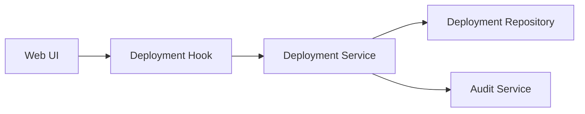

# Diagrams

Diagrams are required only when they lower ambiguity or token cost. Do not make every agent draw diagrams by default.

## When To Draw

Draw a diagram when the task includes:

- Multi-step product or business flow.
- State transitions.
- Cross-module dependencies.
- Data flow or ownership boundaries.
- Permission or authorization paths.
- Concurrent or asynchronous behavior.
- A todo dependency graph that affects execution order.

## Diagram Matrix

| Agent | Diagram | Trigger |
| --- | --- | --- |
| Product | user journey, business flow, swimlane | multi-role or multi-step flow |
| Architect | module boundary, dependency, data flow, sequence | cross-module design or service split |
| Module Owner | module call graph, state machine, todo dependency | more than 3 todos or ordered work |
| Executor | local sequence or error path | complex logic inside one todo |
| Reviewer | risk path or regression impact graph | shared contract, permission, or state changes |
| Verifier | coverage matrix or scenario flow | many verification paths or known blind spots |

## Artifact Rules

- Prefer Mermaid, PlantUML, or JSON graph.
- Store the source under `.agent-board/modules/<module>/diagrams/` or a docs path.
- Main Agent keeps only the diagram path and one-sentence summary in long-lived context.
- Do not use image-only diagrams as architecture evidence.
- Update diagrams only when they change a decision, boundary, or execution order.

## Mermaid Example

